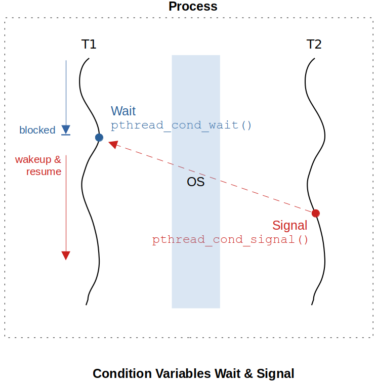
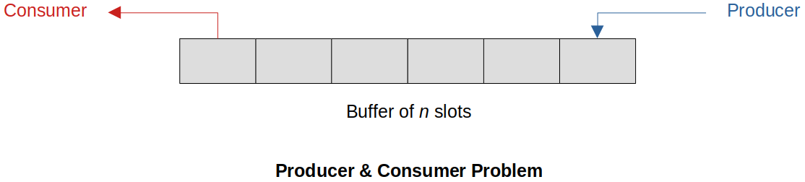

[Home](../../) | [Projects](../../projects) | [Notes](../) > <a href="./">Multi-Threading (POSIX Threads)</a> > Thread Synchronization - Condition Variables

# Thread Synchronization - Condition Variables


## Introduction to Condition Variables

* A condition variable is used to allow the threads waiting in a blocking state to wake up when a particular condition is met. 

* Condition variables must be used in conjunction with a mutex lock. (Condition variables cannot be used without mutex.)

* Condition variables allow us to have finer control over the decision making on when and which competing thread to block or resume.

* Mutex cannot implement the condition-based blocking and wake up of threads. For example, mutex cannot implement such a conditional logic as "If queue is empty, wait until the queue has some elements in it.". Without condition variables, a programmer has very little control over which competing thread should go next; the lock will be granted to the thread chosen by the kernel.

  For this reason, condition variables are required.

* **Control variables** combined with **mutex** is what all it takes to implement any advanced thread synchronization schemes such as monitors, solutions to producer-consumer problem, solutions to dining philosopher problem, thread scheduler, semaphores, wait queues, barriers, etc.


## Condition Variables vs. Mutex

* Mutex **grants** a thread **an access** to a resource if the resource has not been locked already.

* Condition variables allow a thread to **inspect a resource state** and **decide if it wants to wait** until the resource turns into a favorable state. 

* Condition variables vs. mutex comparison:

  | Mutex                                                        | Condition Variables                                          |
  | ------------------------------------------------------------ | ------------------------------------------------------------ |
  | Access the laptop if it is not in use                        | Access the laptop only if it is not in use,<br>and if it has Internet connection |
  | Mutual exclusion ONLY                                        | Mutual exclusion + Custom condition                          |
  | pthred_mutex_lock(&laptop->mutex);<br><br>/* use laptop */<br><br>pthread_mutex_unlock(&laptop->mutex); | pthred_mutex_lock(&laptop->mutex);<br/><br>if (!laptop->internet_connection) {<br/>wait(cv, &laptop->mutex);<br>}<br>/* use laptop */<br><br>pthread_mutex_unlock(&laptop->mutex); |

  > As you can see in the code snippet above, condition variables cannot be used without mutex.

* Condition variables are not used for mutual exclusion, but they are used for **coordination** (**signaling**).

* In summary, using condition variables

  * A thread can choose to block itself until a certain condition is met. (API: `pthread_cond_wait()`)
  * A thread can signal already blocked thread (blocked by the condition variables) to resume. (API: `pthread_cond_signal()`)





## Using Condition Variables - Wait & Signal

### Wait

* `pthread_cond_wait()` **blocks** the thread until the condition is signaled.

* Blocking a thread using a condition variable involves the following 2 steps:

  1. Lock a mutex
  2. Invoke `pthread_cond_wait()`

  ```c
  /* thread T1 - waiting thread */
  pthread_mutex_t mutex;
  pthread_cond_t cv;
  
  pthread_mutex_init(&mutex, NULL);
  pthread_cond_init(&cv, NULL);
  
  ...
  printf("T1 transitions to blocking state.");
  pthread_mutex_lock(&mutex);		/* step 1: lock the mutex */
  pthread_cond_wait(&cv, &mutex);	/* step 2: transition to blocking state, releasing the mutex */
  printf("T1 wakes up"); /* critical section */
  pthread_mutex_unlock(&mutex);	
  ...
  ```

  > When T1 invokes `pthread_cond_wait()`:
  >
  > 1. T1 transitions to blocking state (job of CV).
  > 2. Mutex is unlocked by the kernel behind the scenes and it is declared available.
  >
  > When T1's condition variable gets signaled:
  >
  > 1. T1 slips into **ready** state and waits for the mutex to be unlocked. 
  >
  >    Note that T1 does not immediately resume execution at this point. 
  >
  > 2. T1 automatically obtains the mutex (with the help of the kernel) as soon as T2 releases the mutex.
  >
  > 3. Only then, T1 transitions from **ready** state to **execute** state and resumes its execution.

### Signal

* `pthread_cond_signal()` **wakes up** the thread that is blocked in `pthread_cond_wait()`.

* Signaling a blocked thread using a condition variable involves the following 3 steps:

  1. Lock mutex
  2. Invoke `pthread_cond_signal()`
  3. Unlock mutex

  ```c
  /* thread T2 - signaling thread */
  pthread_mutex_lock(&mutex);		/* step 1: lock mutex */
  pthread_cond_signal(&cv);		/* step 2: signal */
  pthread_mutex_unlock(&mutex);	/* step 3: unlock mutex */
  ```

  > To be more accurate, `pthread_cond_signal()` is signaling the **condition variable**, not the thread itself.


## Producer & Consumer Problem

* Problem statement:

  There is a buffer of $n$ slots and each slot is capable of storing one unit of data.

  There are two threads running, namely, **producer** and **consumer**, which are operating on the buffer.

  **Producer:**

  * Tries to insert data into an empty slot of the buffer
  * Must NOT insert data when the buffer is full

  **Consumer:**

  * Tries to remove data from a filled slot in the buffer
  * Must NOT remove data when the buffer is empty

  The producer and consumer should not insert and remove data simultaneously.

  




* The *Producer & Consumer Problem* can be solved by applying **mutex** + **condition variables** + **predicate**. (Predicate is new here!)

  The **mutex** allows the competing threads to have a mutual exclusive access to the shared resource (i.e., buffer).

  The **condition variable** allows coordination between the threads competing for the resource.

  The **predicate** is a condition used by the thread to check (or test) the status of the shared resource. It tells the thread whether it has to wait or not.

  ```c
  /* T1 (consumer thread) */
  pthread_mutex_lock(b_mutex);
  
  if (b_empty(b))	/* predicate: checkes the status of the resource */
  { 
      pthread_cond_wait(&t_cv, &b_mutex); /* wait till the buffer becomes non-empty state */
  }
  remove_data(b);
  
  pthread_mutex_unlock(&b_mutex);
  ```

  > Critical section: line 4 ~ 8
  >
  > `L4`- While T1 is checking the status of the resource, no other threads should be allowed to change the status of the resource.

  ```c
  /* T2 (producer thread) */
  pthread_mutex_lock(&b_mutex);
  
  if (!b_full(b))
  {
      insert_data(b); /* write operation on the buffer */
      pthread_cond_signal(&t_cv);
  }
  
  pthread_mutex_lock(&b_mutex);
  ```

  >  Critical section: line 4 ~ 8

  Step-by-step explanation:

  1. To exclusively perform `T1:L4` (predicate), `T1:L2` (mutex locking) is required.

  2. If the condition for wait is true (`T1:L4`), thread blocks using condition variable (`T1:L6`) and the mutex is unlocked behind the scenes by the kernel.

  3. T2 checks the resource state (`T2:L4`) exclusively (`T2:L2`), and produces an element and inserts it into the buffer.

  4. T2 signals T1's condition variable (`T2:L7`), and unlocks the mutex (`T2:L10`). At this point, T1 slips into *ready* state and waits for the mutex to be unlocked.
  5. `T1:L8` is the part of the critical section which T1 executes when it wakes up (*ready* $\to$ *execute* state) after obtaining the mutex with the help of the kernel.
  6. T1 explicitly unlocks (`TL:L10`) the shared resource (i.e., buffer) when done.

* However, this solution has one loop-hole that must be fixed! The **spurious wakeup** issue.


## Spurious Wakeup

* A spurious wakeup happens when a thread **wakes up** from waiting on a condition variable that's been signaled, **only to discover that the condition it was waiting for isn't satisfied**. It's called spurious because the thread has seemingly been awakened for no reason.

* To demonstrate the *Spurious Wakeup* issue, let's introduce another consumer thread to our previous solution.

  ```c
  /* consumer thread; T1, T2 */
  pthread_mutex_lock(&b_mutex);
  
  if (b_empty(b))	/* predicate: checkes the status of the resource */
  { 
      pthread_cond_wait(&t_cv, &b_mutex); /* wait till the buffer becomes non-empty state */
  }
  remove_data(b);
  
  pthread_mutex_unlock(&b_mutex);
  ```

  ```c
  /* producer thread; T3 */
  pthread_mutex_lock(&b_mutex);
  
  if (!b_full(b))
  {
      insert_data(b); /* write operation on the buffer */
      pthread_cond_signal(&t_cv);
  }
  
  pthread_mutex_lock(&b_mutex);
  ```

  T1 waits on an empty buffer $\to$ T3 signals the condition variable $\to$ CPU schedules another consumer thread T2 intead of T1 $\to$ T2 wakes up obtaining the mutex, consumes the data in the buffer and unlocks the mutex $\to$ T1 wakes up obtaining the mutex, attempts to consume data from an empty buffer (PROBLEM!)

* **Solution:**

  To solve this issue, only a minor change of the code is needed. That is, to change the `if` statement of the consumer to `while` loop.

  ```c
  /* consumer thread */
  pthread_mutex_lock(&b_mutex);
  
  while (b_empty(b))	/* <--- if to while */
  { 
      pthread_cond_wait(&t_cv, &b_mutex); 
  }
  remove_data(b);
  
  pthread_mutex_unlock(&b_mutex);
  ```


## Generic Solution to the Producer & Consumer Problem

* **Consumer** thread (Generic pseudocode to block on condition variable):

  ```c
  /* consumer thread */
  pthread_mutex_lock(&mutex);
  
  while (predicate())	
  { 
      pthread_cond_wait(&cv, &mutex); 
  }
  execute_cs_on_wake_up(); /* application specific operations */
  
  pthread_mutex_unlock(&mutex);
  ```

* **Producer** thread (Generic pseudocode to signal condition variable):

  ```c
  /* producer thread */
  pthread_mutex_lock(&mutex);
  
  if (!predicate())
  {
      pthread_cond_signal(&cv);
  }
  
  pthread_mutex_lock(&mutex);
  ```

* The generic pseudocode follows the same pattern as the solutions to the thread synchronization problems.

* This is the optimal thread synchronization between the *Producer* and *Consumer* threads, which is consistent and concrete.

* Most of the thread synchronization problems can be decomposed into smaller **Producer & Consumer Problem**s.


## Thread Specific CV vs. Resource Specific CV

* Condition variable is associated with a **mutex** and a **predicate**.

  Mutex provides the mutual exclusion on the predicate check that is while a thread is checking the predicate no other threads in the process are allowed to change the end result of the predicate.

  * Mutex is always a property of the resource 
  * Condition variable can be a property of either resource or thread.

* Many condition variables can be associated with one mutex at the same time. But, a condition variable CANNOT be associated with more than one mutex at the same time.

### Thread Specific CV

* Here, a condition variable is a property of a thread.

* Using thread specific condition variables give a programmer more power or control to selectively block or resume the thread executions. For example, if the threads T1, T2, and T3 that want to access the resource R have their own condition variables CV1,  CV2, and CV3, they can selectively wait on the resource as follows:

  ```c
  pthread_cond_wait(&CV1, &R_mutex);	/* T1 */
  pthread_cond_wait(&CV2, &R_mutex);	/* T2 */
  pthread_cond_wait(&CV2, &R_mutex);	/* T3 */
  ```

  Also, the programmer can selectively signal the condition variable of choice:

  ```c
  pthread_cond_signal(&CV2); /* signalling thread wants T2 to wake up */
  ```

  Programmer has finer control over thread synchronization with thread specific condition variables.

### Resource Specific CV

* Here, a condition variable is a property of a resource.

* Using a resource specific condition variable

  Now, the condition variable is specific to the resource R the threads T1, T2 and T3 want to access.

  ```c
  pthread_cond_wait(&CV, &R_mutex);	/* T1 */
  pthread_cond_wait(&CV, &R_mutex);	/* T2 */
  pthread_cond_wait(&CV, &R_mutex);	/* T3 */
  ```

  In this case, after the following signaling statement, 

  ```c
  pthread_cond_signal(&CV); /* signalling thread */
  ```

  we do not know the order in which order T1, T2 and T3 are going to be executed. In other words, for example, a programmer cannot specifically choose T2 to unblock and resume its execution. It is now on the underlying operating systems hand!

  Programmer has less control over thread synchronization with resource specific condition variables.


## Signaling Multiple Condition Variables

* `pthread_cond_broadcast()` API is used to signal all the multiple threads that are blocked on the same condition variable and unblock each of them **one-by-one**.

* Let's say the threads T1, T2 and T3 are blocked on the same condition variable CV.

  ```c
  /* T1 */
  pthread_mutex_lock(&mutex);
  while (predicate())
  {
      pthread_cond_wait(&CV, &mutex);
  }
  Print "T1";
  pthread_mutex_unlock(&mutex);
  ```

  ```c
  /* T2 */
  pthread_mutex_lock(&mutex);
  while (predicate())
  {
      pthread_cond_wait(&CV, &mutex);
  }
  Print "T2";
  pthread_mutex_unlock(&mutex);
  ```

  ```c
  /* T3 */
  pthread_mutex_lock(&mutex);
  while (predicate())
  {
      pthread_cond_wait(&CV, &mutex);
  }
  Print "T3";
  pthread_mutex_unlock(&mutex);
  ```

  In this case, if you wanted to unblock all three threads, you would have to invoke the `pthread_cond_signal()` API three times without knowing in which order T1, T2 and T3 are going to be unblocked. (It is on the underlying operating system's hand.)

  ```c
  pthread_cond_signal(&CV);
  pthread_cond_signal(&CV);
  pthread_cond_signal(&CV);
  ```

  This can be replaced by the single call of `pthread_cond_broadcast()` API.

  ```c
  pthread_cond_broadcast(&CV);
  ```

  When this API is called, all threads blocking on the same condition variable transition from **blocking** state to **ready** state waiting to be scheduled. The first thread scheduled will unlock the mutex, print its message, and unlock the mutex. The next thread will unlock the mutex, and so on. Again, the order in which T1, T2 and T3 are going to be unblocked is on the underlying operating system's hand.

  


## References

Sagar, A. (2022). *Part A - Multithreading & Thread Synchronization - Pthreads* [Video file]. Retrieved from  https://www.udemy.com/course/multithreading_parta/

