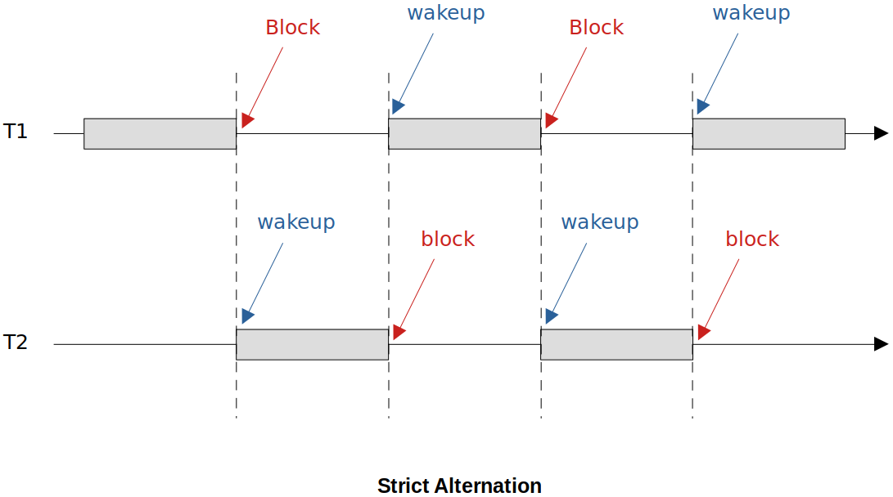
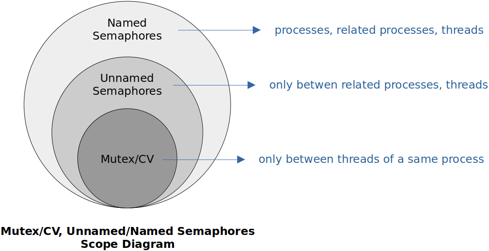

[Home](../../) | [Projects](../../projects) | [Notes](../) > <a href="./">Multi-Threading (POSIX Threads)</a> > Thread Synchronization - Semaphore

# Thread Synchronization - Semaphore


## Introduction to Semaphores

* Proposed by Edsger Dijkstra, technique to manage concurrent threads by using a simple integer value which is known as a semaphore.

* A sempahore allows at most $n$ ($n\ge0$) threads to enter a critical section and execute concurrently. From the functionality's perspective, a mutex is a special case of semaphore where $n$ is 1. This is why mutexes are also called as **binary semaphores**.

  Here, $n$ is referred to as the **permit number**. Permit number is defined by the user.

* We have an assumption that the critical section protected by a semaphore is of a special property that it can be executed by $n$ number of execution units (i.e., threads) concurrently without causing any problems.

* Semaphores can be used to synchronize multiple **processes** running on the same machine as well as to synchronize multiple **threads** within a process.


## Semaphore APIs

* Semaphore APIs

  ```c
  #include <semaphore.h>
  
  /* declare semaphore variable */
  sem_t sem;
  
  /* initialize the semaphore */
  sem_init(sem_t *sem,  /* pointer to the semaphore to be initialized */
           int pshared, /* pshared = 0 to synchronize threads, non-zero value to synchronize processes */
           int permit_counter); /* should be initialized to a non-negative integer */
  
  /* blocking the calling thread if semaphore is not available */
  sem_wait(sem_t *sem);
  
  /* signal the blocked thread on semaphore */
  sem_post(sem_t *sem);
  
  /* destroy the semaphore after use */
  sem_destroy(sem_t *sem);
  ```

  > `sem_wait()` and `sem_post()` forms the core functionality of a semaphore; Allow at most $n$ threads to execute concurrently in a critical section.
  >
  > 1. `sem_wait(sem_t *sem);`
  >
  >    Unconditionally decrease the `permit_counter` of the semaphore.
  >
  >    If `permit_counter` < 0 after decrement, block the calling thread.
  >
  > 2. `sem_post(sem_t *sem);`
  >
  >    Unconditionally increase the `permit_counter` of the semaphore.
  >
  >    Send signal to threads blocked on `sem_wait()`, if any. If there is no thread blocked on the semaphore, signal will not be sent. (See the implementation)This signal will be delivered to any thread which is blocked on the semaphore by the OS and the recipient thread of the signal will then execute `sem_wait()` and enter the critical section.

  When `permit_counter` = 1, it is called a **binary semaphore** which is basically the same as mutex. The only difference is that a binary semaphore can be unblocked(= `sem_post()`) by a different thread whereas a mutex can only be unlocked by the thread that has locked it. In other words, the order in which the threads invoke `sem_wait()` does not necessarily match the order in which the threads invoke `sem_post()`. It is indeterministic!

  My understanding on the difference between a **binary semaphore** and a **mutex** is not clear! Revisit these concepts and clarify them! (Mutex - lock/unlock, Semaphore - wait/signal)


## Semaphore Demonstration

* Write a program that creates 5 threads, allows at most 2 threads to execute in the critical section concurrently. You may face the critical section by just printing some messages by the executing threads.

  ```c
  /*
   * File Name    : semaphore_hello_world.c
   * Description  : C program to demonstrate the usage of a semaphore to limite the number of threads
   *				  running inside the critical section.
   * Author       : Modified by Kyungjae Lee 
   *               (Original: Abhishek Sagar - Juniper Networks)
   * Date Created : 01/13/2023
   */
  
  /*
   * compile using:
   * gcc -g -c semaphore_hello_world.c -o semaphore_hello_world.o
   * gcc -g semaphore_hello_world.o -o semaphore_hello_world -lpthread
   * 
   * run using: 
   * ./semaphore_hello_world
   */
  
  #include <stdio.h>
  #include <stdlib.h>
  #include <pthread.h> 	/* POSIX threads*/
  #include <unistd.h>  	/* pause(), sleep() */
  #include <errno.h>	 	/* global variable errno */
  #include <semaphore.h>	/* semaphore */
  
  sem_t sem;
  pthread_t threads[5];
  
  #define PERMIT_COUNT 2
  
  /* A thread callback fn must have following prototypes 
   * void* (*thread_fn)(void *)
   */
  static void* thread_fn_callback(void *arg)
  {
  	char *thread_name = (char *)arg;
  
  	int i;
  	
  	printf("%s attempts to enter C.S\n", thread_name);
  
  	sem_wait(&sem);
      
  	/* CS Begins here */
  	printf("%s sucessfully entered C.S\n",	thread_name);
  	
  	for (i = 0 ; i < 5; i++)
      {
  		printf("%s executing in C.S\n",	thread_name);
  		sleep(1);
  	}
  
  	printf("%s exiting from C.S\n", thread_name);
  	/* CS Ends here */
      
  	sem_post(&sem);	/* analogous to 'pthread_cond_singnal()' */
  
  	printf("%s completely exited from C.S\n", thread_name);
  }
  
  void thread_create(pthread_t *thread_handle, void *arg)
  {
  	int rc = pthread_create(thread_handle, NULL, thread_fn_callback, arg);
  	if(rc != 0)
      {
  		printf("Error occurred, thread could not be created, errno = %d\n", rc);
  		exit(0);
  	}
  }
  
  int main(int argc, char **argv)
  {
  	sem_init(&sem, 0, PERMIT_COUNT);
  	thread_create(&threads[0], "thread0");
  	thread_create(&threads[1], "thread1");
  	thread_create(&threads[2], "thread2");
  	thread_create(&threads[3], "thread3");
  	thread_create(&threads[4], "thread4");
  
  	int i ;
  	for (i = 0; i < 5; i++) 
      {
  		pthread_join(threads[i], NULL);
  	}
  	sem_destroy(&sem);
  	return 0;
  }
  ```
  
   ```plain
   thread0 attempts to enter C.S
   thread0 sucessfully entered C.S
   thread0 executing in C.S
   thread3 attempts to enter C.S
   thread3 sucessfully entered C.S
   thread2 attempts to enter C.S
   thread3 executing in C.S
   thread4 attempts to enter C.S
   thread1 attempts to enter C.S
   thread3 executing in C.S
   thread0 executing in C.S
   thread3 executing in C.S
   thread0 executing in C.S
   thread3 executing in C.S
   thread0 executing in C.S
   thread3 executing in C.S
   thread0 executing in C.S
   thread3 exiting from C.S
   thread3 completely exited from C.S
   thread0 exiting from C.S
   thread2 sucessfully entered C.S
   thread2 executing in C.S
   thread4 sucessfully entered C.S
   thread4 executing in C.S
   thread0 completely exited from C.S
   thread2 executing in C.S
   thread4 executing in C.S
   thread2 executing in C.S
   thread4 executing in C.S
   ...
   ```
  
  > Notice that at most 2 threads are executing in the critical section concurrently.


## Strict Alternation (Using Semaphore)

* Strict alternation is nothing but a pattern of execution of threads.
* It is of practical significance to make **a pair of threads** to execute in strict alternation manner. (It is about two threads!)





* Strict alternation can be implemented using **zero semaphores** whose `permit_counter` is 0.

  ```c
  sem_wait(&sem);		/* calling thread is immediately blocked */
  sem_post(&sem);		/* blocked thread, if any, wakes up */
  ```

  > Any thread (T2) in the system can invoke `sem_post()` API on the same semaphore T1 was blocked on.

* Write a program which create two threads T1 and T2. T1 thread prints odd numbers between 1 to 15. T2 prints even numbers between 2 to 15. Output should be sequential.

  ```c
  /* T1 */
  for (i = 1; i < 15; i += 2)
  {
      print i;
      sem_post(sem0_1);
      sem_wait(sem0_2);
  }
  ```

  ```c
  /* T2 */
  for (i = 2; i < 15; i += 2)
  {
      sem_post(sem0_1);
      print i;
      sem_wait(sem0_2);
  }
  ```


## Implementation of Semaphores

* **Mutex** and **condition variable** are building blocks of semaphores.

  In fact, mutex and condition variable are building blocks for all thread synchronization data structures such as *thread barriers*, *wait queues*, *thread pools*, *monitors*, *thread schedulers*, etc.

* Understanding the integer variable `permit_counter`:

  - When `permit_counter` $\ge$ 0,

    The number of threads which are allowed to enter the critical section without waiting.

  - When `permit_counter` $\lt$ 0,

    The number of threads which are blocked from entering the critical section because the maximum allowed limit has reached.

* **Interface for Semaphore**

  ```c
  /*
   * File Name    : semaphore.h
   * Description  : Interface for semaphore
   * Author       : Modified by Kyungjae Lee (Original: Abhishek Sagar - Juniper Networks)
   * Date Created : 01/13/2023
   */
  
  #ifndef SEMAPHORE_H
  #define SEMAPHORE_H
  
  #include <pthread.h>
  
  typedef struct sema_
  {
      int permit_counter;
      pthread_cond_t cv;
      pthread_mutex_t mutex;
  } sema_t;
  
  sema_t* sema_get_new_semaphore();
  void sema_init(sema_t *sema, int count);
  void sema_wait(sema_t *sema);
  void sema_post(sema_t *sema);
  void sema_destroy(sema_t *sema);
  int sema_getvalue(sema_t *sema);
  
  /* several texts using P & V notation to represent wait and signals */
  #define P(sema) sema_wait(sema)
  #define V(sema)	sema_post(sema)
  
  /* some texts also use up and down */
  #define UP(sema)	sema_wait(sema)
  #define DOWN(sema)	sema_post(sema)
  
  #endif /* SEMAPHORE_H */
  ```
  
  > The member variable `mutex` is used to lock and unlock the section of code where `permit_counter` is getting updated.
  >
  > The member variable `cv` is used when a thread needs to wait or block on the semaphore.
  
* **Implementation of Semaphore**

  ```c
  /*
   * File Name    : semaphore.c
   * Description  : Implementation of semaphore
   * Author       : Modified by Kyungjae Lee (Original: Abhishek Sagar - Juniper Networks)
   * Date Created : 01/13/2023
   */
  
  #include <stdlib.h>
  #include <pthread.h>
  #include <assert.h>
  #include <stdbool.h>
  #include "semaphore.h"
  
  sema_t* sema_get_new_semaphore()
  {
      sema_t *sema = calloc(1, sizeof(sema_t));
      return sema;
  }
  
  void sema_init(sema_t *sema, int permit_counter)
  {
      sema->permit_counter = permit_counter;
      pthread_cond_init(&sema->cv, NULL);
      pthread_mutex_init(&sema->mutex, NULL);
  }
  
  /* without using pending signals */
  void sema_wait(sema_t *sema)
  {
     pthread_mutex_lock(&sema->mutex);
     sema->permit_counter--;
     if (sema->permit_counter < 0)
     {
         pthread_cond_wait(&sema->cv, &sema->mutex); /* mutex will be unlocked behind the scenes */
     }
     pthread_mutex_unlock(&sema->mutex);
  }
  
  void sema_post(sema_t *sema)
  {
      bool any_thread_waiting;
      pthread_mutex_lock(&sema->mutex);
  
      any_thread_waiting = sema->permit_counter < 0 ? true : false;
      sema->permit_counter++;
  
      if (any_thread_waiting)
      {
          pthread_cond_signal(&sema->cv); /* one of the blocked threads chosen by thew OS
          								   will get the signal */
      }
      pthread_mutex_unlock(&sema->mutex);
  }
  
  void sema_destroy(sema_t *sema)
  {
      sema->permit_counter = 0;
      pthread_mutex_unlock(&sema->mutex);
      pthread_cond_destroy(&sema->cv);	
      pthread_mutex_destroy(&sema->mutex);
  }
  
  int sema_getvalue(sema_t *sema)
  {
  	return sema->permit_counter;
  }
  ```

* To check if your own implementation of a semaphore is robust, run it with the modified version of the previous demo program. 


## Types of Semaphores

* Types of Semaphores:

  * **Unnamed Semaphores**

    Used to synchronize threads or related processes (i.e., processes that are created by `fork()` system call)

    We've been discussing about unnamed semaphores till now.

  * **Named Semaphores**

    Mainly used for synchronizing unrelated processes, but can also be used for synchronizing threads or related processes.

    Have names using which the semaphore can be uniquely identified in the system.





## Strong & Weak Semaphores

* **Weak Semaphore**

  Whenever theoretically you can show in your solution that some thread blocked on a mutex or semaphore may never get a chance to resume its execution (**Starvation**), then we say that solution is lacking the property of **Bounded Waiting** and such a semaphore is called Weak Semaphore. 

  The root cause-of the weak semaphore is the randomness of scheduling which thread to allow to enter the critical section next.

* **Strong Semaphore**

  We can deploy a way such that blocked threads are unblocked in a **FIFO** way per signal (or in any other way that can prevent the starvation), then such a semaphore is called the Strong Semaphore. **Bounded Waiting** is guaranteed in strong semaphores. 

* Weak/strong is the topic discussed in the realm of theory because in reality, it is very rare for a starvation of threads to occur.

* Bounded waiting means that any particular thread blocked on a semaphore would have a finite amount of waiting time. It is guaranteed that at some point in time, a particular thread blocked on a semaphore will be scheduled and enter the critical section. It is a desirable property that any synchronization solution must have.

* Weak semaphores can be converted into strong semaphores by changing the policy of blocked thread selection from random to FIFO (sequel course).

* The semaphores we have dealt with so far (i.e.,  custom semaphore, built-in semaphore) are all "weak semaphores". Even the mutexes are "weak" in this sense since the blocked threads are randomly selected by the operating system.


## References

Sagar, A. (2022). *Part A - Multithreading & Thread Synchronization - Pthreads* [Video file]. Retrieved from  https://www.udemy.com/course/multithreading_parta/
