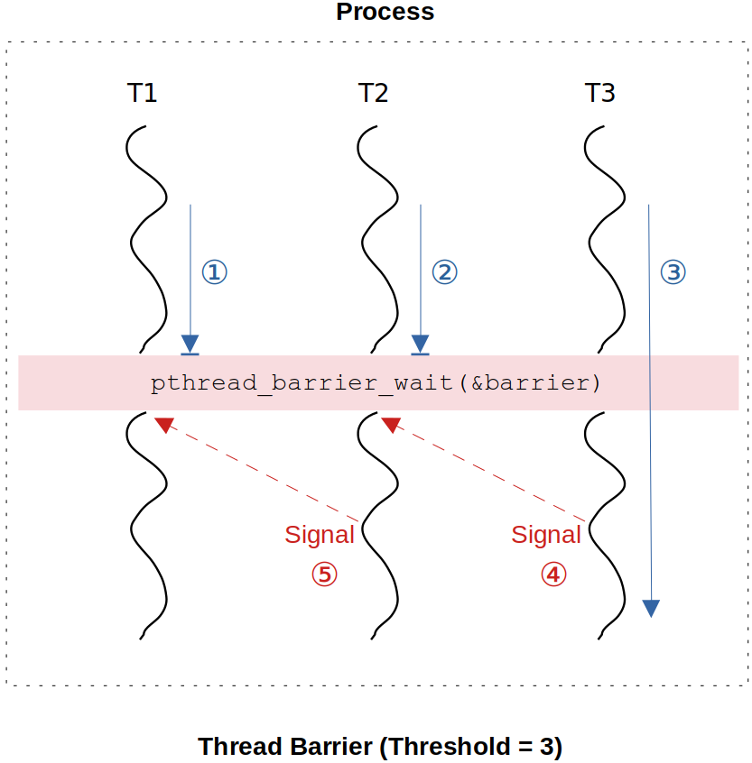

[Home](../../) | [Projects](../../projects) | [Notes](../) > <a href="./">Multi-Threading (POSIX Threads)</a> > Thread Synchronization - Thread Barrier

# Thread Synchronization - Thread Barrier


## Introduction to Thread Barrier

* Thread Barrier is a thread synchronization data structure which blocks all threads at a particular line of code until some specified number of threads arrives at the barrier point.

* In case where you must wait for a number of tasks to be completed before an overall task can proceed, barrier synchronization can be used.

* Practical use case:

  Internet Download Manager (IDM) is an application that downloads the big files through multiple downloader threads. Each downloader thread downloads a section of a file independently, and concurrently (or in parallel depending on the number of available CPUs). When all threads complete, the application reports "file download success".


## Functionality of Thread Barrier

* Every thread barrier has to be initialized with an integer value; i.e., **barrier threshold**. If the barrier threshold is set to $n$, then the barrier will block $n-1$ threads which arrive at the **barrier point** and as soon as the $n^{th}$ thread arrives then the barrier will be released. **Release** of a barrier means that all the blocked threads will resume their execution beyond the barrier point. It is also called "the thread barrier has been disposed (or disposition of the thread has begun)". The **disposition begin** state continues until ALL the threads blocked at the barrier have resumed their execution beyond the barrier point and only then the **disposition end**s. And during this time interval the disposition of the barrier is **in progress**.

* POSIX API provides a built-in support to work with thread barriers (`pthread_barrier_t`).


## Implementing Thread Barrier Data Structure

* Thread barrier works on the concept of **relay**:

  A thread which is just signaled (meaning that the thread has just resumed its execution from the blocked state) will signal other blocked threads to resume execution, and thereby creating a chain of signals. (It just just like when we get stuck at a barricade, we pass the barricade when allowed by the authority.)





* **Interface** for thread barrier data structure:

  ```c
  /*
   * File Name    : thread_barrier.h
   * Description  : Interface for thread barrier data structure
   * Author       : Modified by by Kyungjae Lee (Original: Abhishek Sagar)
   * Date Created : 01/11/2023
   */
  
  #ifndef THREAD_BARRIER
  #define THREAD_BARRIER
  
  #include <stdint.h>
  #include <stdbool.h>
  #include <pthread.h>
  
  typedef struct th_barrier_
  {
      uint32_t threshold_count;	/* threshold */
      uint32_t curr_wait_count;	/* current # of threads waiting at the barrier [0, threshold - 1]*/
      pthread_cond_t cv;			/* condition variable (necessary for threads to be blocked) */
      pthread_mutex_t mutex;		/* to gurantee mutual exclusion for operations on barrier DS */
      bool is_ready_again;		/* true (deault), false (disposition in progress), true (disp. end) */
      pthread_cond_t busy_cv;		/* condition variable to block any additional threads arrive at the 
      							   barrier while disposition is in progress */					
  } th_barrier_t;
      
  /* interface */
  void thread_barrier_init(th_barrier_t *barrier, uint32_t threshold_count);
  void thread_barrier_wait(th_barrier_t *barrier);
  void thread_barrier_destroy(th_barrier_t *barrier);
  void thread_barrier_print(th_barrier_t *th_barrier);
  
  #endif
  ```
  
* **Implementation** of thread barrier data structure:

  ```c
  /*
   * File Name    : thread_barrier.c
   * Description  : Implementation of thread barrier data structure
   * Author       : Modified by by Kyungjae Lee (Original: Abhishek Sagar)
   * Date Created : 01/11/2023
   */
  
  #include <stdio.h>
  #include <unistd.h>
  #include "thread_barrier.h"
  
  void thread_barrier_init (th_barrier_t *barrier, uint32_t threshold_count)
  {    
      barrier->threshold_count = threshold_count;
      barrier->curr_wait_count = 0;
      pthread_cond_init(&barrier->cv, NULL);
      pthread_mutex_init(&barrier->mutex, NULL);
      barrier->is_ready_again = true;
      pthread_cond_init(&barrier->busy_cv, NULL);
  }
  
  void thread_barrier_wait (th_barrier_t *barrier)
  {
  	pthread_mutex_lock (&barrier->mutex);
  
      /* do not allow threads to access the barrier when the barrier disposition is in progress */
  	while (barrier->is_ready_again == false) /* 'while' instead of 'if' to avoid spurious wakeup */
      {
  		pthread_cond_wait(&barrier->busy_cv, &barrier->mutex);
  	}
  
      /* if the current thread is the last thread to hit the barrier point */
  	if (barrier->curr_wait_count + 1 == barrier->threshold_count)
      {
          /* signal a blocked thread, pass through the barrier by unlocking the mutex */
          /* mark "disposition begin" */
  		barrier->is_ready_again = false;
  		pthread_cond_signal(&barrier->cv);
  		pthread_mutex_unlock (&barrier->mutex);
  		return;
  	}
  
      /* if the current thread is NOT the last thread to hit the barrier point */
  	barrier->curr_wait_count++;
      /* block the current thread on the barrier */
  	pthread_cond_wait(&barrier->cv, &barrier->mutex);
      /* when a blocked thread resumes its execution and signals the condition variable */
  	barrier->curr_wait_count--;
  
      /* if the current thread is the last thread to leave the barrier point */
  	if (barrier->curr_wait_count == 0)
      {
          /* do not need to signal the condition variable since there are no more threads left blocking */
          /* mark "disposition end" */
  		barrier->is_ready_again = true;
          /* allow blocked thread (arrived during 'disposition in progress' state) to use barrier if any */
  		pthread_cond_broadcast(&barrier->busy_cv);
      }
      /* if the current thread is NOT the last thread to leave the barrier point */
  	else 
      {
          /* signal the condition variable for a thread that is left blocking on the barrier point */
  		pthread_cond_signal(&barrier->cv);
  	}
      
  	pthread_mutex_unlock (&barrier->mutex);
  }
  
  void thread_barrier_print(th_barrier_t *th_barrier)
  {   
      printf("th_barrier->threshold_count = %u\n", th_barrier->threshold_count);
      printf("th_barrier->curr_wait_count = %u\n", th_barrier->curr_wait_count);
      printf("th_barrier->is_ready_again = %s\n", th_barrier->is_ready_again ? "true" : "false");
  }
  ```
  


* **Test driver** for thread barrier data structure:

  ```c
  /*
   * File Name    : thread_barrier_main.c
   * Description  : Test driver for thread barrier data structure
   * Author       : Modified by by Kyungjae Lee (Original: Abhishek Sagar)
   * Date Created : 01/11/2023
   */
  
  #include <stdio.h>
  #include "thread_barrier.h"
  
  static th_barrier_t th_barrier;
  static pthread_t pthreads[3];
  
  void* thread_fn_callback (void *arg)
  {
      thread_barrier_wait(&th_barrier);
      printf("1st barricade cleared by thread %s\n", (char *)arg);
  
      thread_barrier_wait(&th_barrier);
      printf("2nd barricade cleared by thread %s\n", (char *)arg);
  
      thread_barrier_wait(&th_barrier);
      printf("3rd barricade cleared by thread %s\n", (char *)arg);
      
      pthread_exit(0);
      return NULL;
  }
  
  int main(int argc, char *argv[])
  {
      thread_barrier_init(&th_barrier, 3); 
      
      /* create joinable threads since we don't want the application to terminate before threads do */
      static const char *th1 = "th1";
      pthread_create(&pthreads[0], NULL, thread_fn_callback, (void *)th1);
      
      static const char *th2 = "th2";
      pthread_create(&pthreads[1], NULL, thread_fn_callback, (void *)th2);
      
      static const char *th3 = "th3";
      pthread_create(&pthreads[2], NULL, thread_fn_callback, (void *)th3);
      
      pthread_join(pthreads[0], NULL);
      pthread_join(pthreads[1], NULL);
      pthread_join(pthreads[2], NULL);
  
      /* to test if the barrier is left in a correct state before the application terminates */
      thread_barrier_print(&th_barrier);
      return 0;
  }
  ```

  ```plain
  1st barricade cleared by thread th3
  1st barricade cleared by thread th2
  1st barricade cleared by thread th1
  2nd barricade cleared by thread th1
  2nd barricade cleared by thread th3
  2nd barricade cleared by thread th2
  3rd barricade cleared by thread th1
  3rd barricade cleared by thread th3
  3rd barricade cleared by thread th2
  th_barrier->threshold_count = 3
  th_barrier->curr_wait_count = 0
  th_barrier->is_ready_again = true
  ```

  > What matters is if all three threads appear at each of the three barricade clearances. The order in which they appear does not matter!
  >
  > My test results show, though, 1st barricade is always cleared by the thread `th3`. Think why!


## References

Sagar, A. (2022). *Part A - Multithreading & Thread Synchronization - Pthreads* [Video file]. Retrieved from  https://www.udemy.com/course/multithreading_parta/

