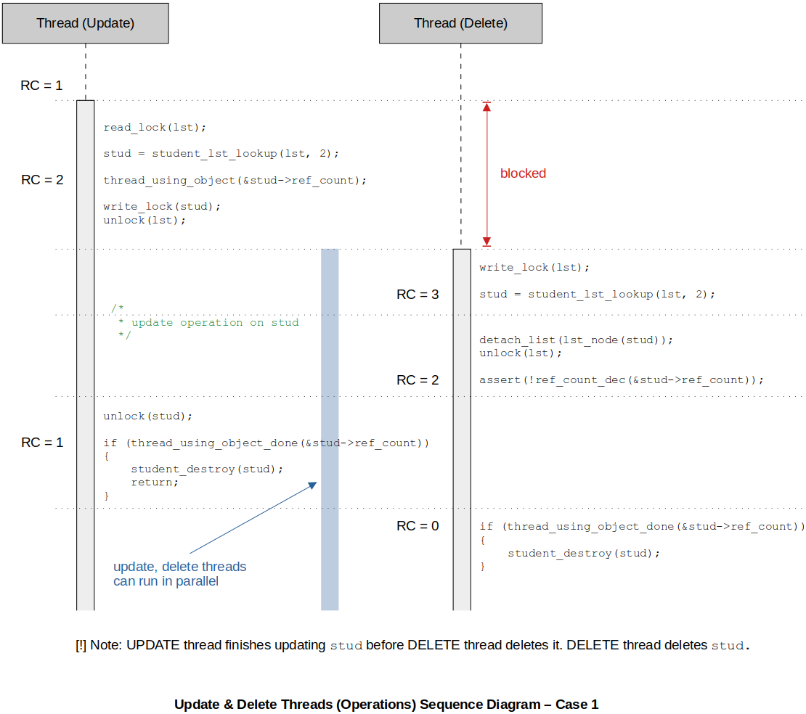
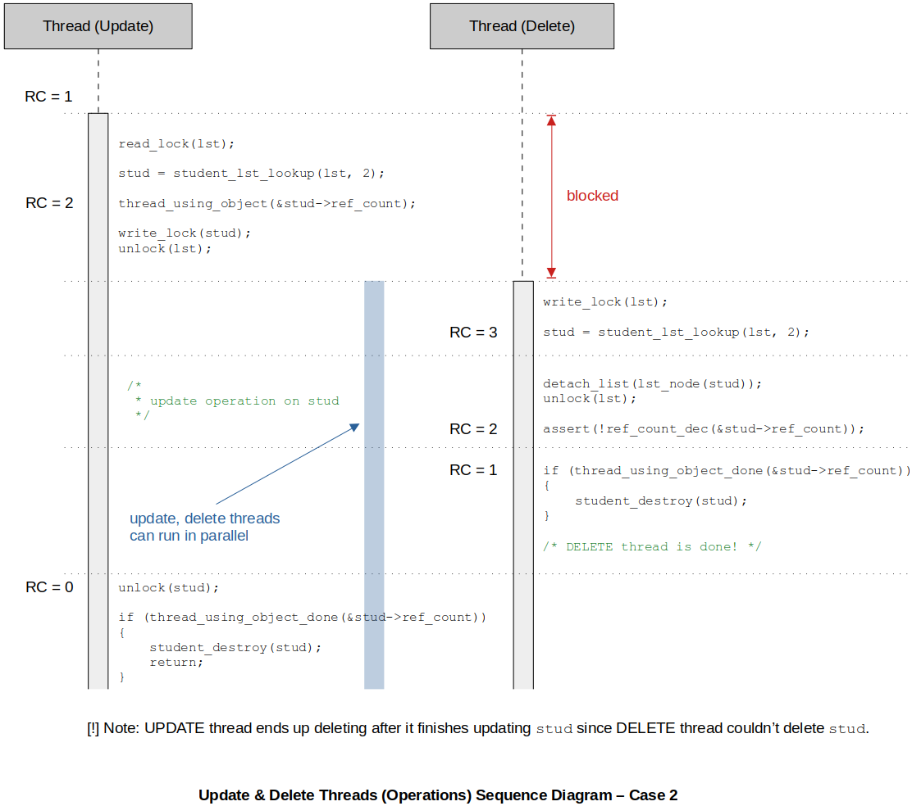
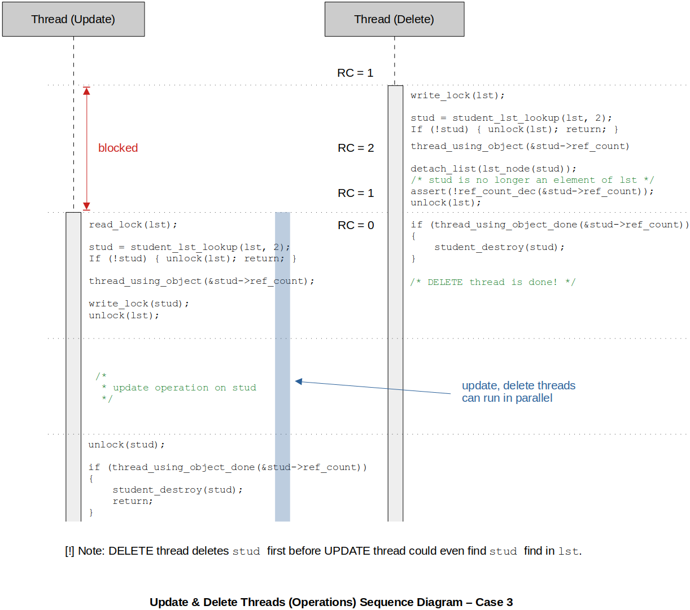

[Home](../../) | [Projects](../../projects) | [Notes](../) > <a href="./">Multi-Threading (POSIX Threads)</a> > Thread Synchronization - Thread-Safe Highly Concurrent CRUD Operations

# Thread Synchronization - Thread-Safe Highly Concurrent CRUD Operations


Consider this section as one of the most important section in the **thread synchronization**. In this section we will explore how to implement thread-safe bullet-proof CRUD operations.


## What are CRUD Operations?

* We often need to implement CRUD operations on data structures.

  **C** - **C**reate an object (e.g., inserting a new student in a list)

  **R** - Look-up an object and **R**ead (e.g., displaying students with 80%+ in science)

  **U** - **U**pdate an object (e.g., increase the student marks by 10%)

  **D** - **D**elete an object (e.g., remove a student object from the list whose roll number is $n$)


## Introduction to Thread-Safe Highly Concurrent CRUD Operations

* In a multi-threaded application, multiple threads may attempt to perform CRUD operations on the same instance of a data structure, say for example, a linked list. We will use a linked list of students as a shared object here, but the fundamentals apply to all other types data structures as well.

* Simply locking an entire data structure prior to performing any operations on it to achieve thread synchronization will make the multi-threaded program completely thread-safe.

  However, there are some problems to be considered:

  1. The entire data structure is locked
  2. Application performance degrades
  3. More contention between threads

  For example, why would a reader thread want to lock out other reader threads when they are completely safe to perform operations simultaneously. Why would a writer thread want to lock out other threads that want to perform a completely independent, non-conflicting operations on a different element of the data structure, and so on.

  The critical section must be as concise as possible for the sake of performance of the application.

* Locking an entire data structure is highly discouraged. (It is like locking down an entire city for a plumber to safely fix a bathroom.)


## Goals of Thread-Safe Highly Concurrent CRUD Operations

* The goal is to implement CRUD operations over a data structure which are not only **thread-safe**, but also guarantee the **maximum concurrency** as possible. (Maximum concurrency means that threads must not unnecessarily block each other in an attempt to get an access to the shared resource.)
  * Threads performing **read** operations only must NOT compete/block each other to get an access.
  * If one thread performs a **read** operation and another performs a **write** operation, they must NOT block each other unless they are performing those operations on the same element of the data structure.
  * If there are two threads performing **write** operations, they must NOT block each other unless they are performing the operations on the same element of the data structure.
  * If a thread is performing read/write operations on an object, other threads in the system must NOT free the object from the memory prematurely. (Segmentation fault expected!)
  * If a thread is blocked on a lock, other threads in the system must NOT free the lock from the memory.
* We will implement the thread-safe highly concurrent CRUD operations that meet all the requirements mentioned above.


## Tools Necessary for Thread-Safe Highly Concurrent CRUD Operations

In order to implement thread-safe highly concurrent CRUD operations on a data structure, we need to have:

1. **Read/write locks** (not regular mutexes) 
   - An RW lock at the container level 
   - An RW lock at the container element level
2. A **reference count object** per container (prevent premature deletion of an object)

```c
/* student list */
typedef struct stud_lst
{
    list_head *head;
    pthread_rwlock_t lst_lock;	/* RW lock at the conatainer level */
} stud_lst_t;

/* student */
typedef struct stud_
{
    ...
    pthread_rwlock_t stud_lock; /* RW lock at the container element level */
    ref_count_t ref_count;		/* referece count object (data structure) */
} stud_t;
```

### 1. Read/Write Locks

#### Locking Rules

* **Container (Data Structure) Level Lock** (e.g., `lst_lock`)

  Protects change in the physical structure of the data structure in multi-threaded environment against thread-unsafe operations.

  - Must be locked in **write** mode when node addition(**C**reation)/**D**eletion is being done by a thread (because physical change in the structure of the list is involved; from the list's perspective, it is a form of write). 

    e.g., Inserting/deleting a student object into/from the list

  - Must be locked in **read** mode when a thread is only interested in performing **R**ead/write(**U**pdate) operation on a particular node of a linked list (no change in the list structure; from the list's perspective, it is still a read operation).

    e.g., Updating data of a student object in the list

* **Container (Data Structure) Element Level Lock** (e.g., `stud_lock`)

  Protects change in elements in multi-threaded environment against thread-unsafe operations.

  - Must be locked in **write** mode when a thread attempts to **U**pdate an element.
  - Must be locked in **read** mode when a thread is only interested in performing **R**ead operation on an element.

* Locking Rules Summary

  |      | Container Level Lock | Container Element Level Lock |
  | ---- | -------------------- | ---------------------------- |
  | C    | Write                | No                           |
  | R    | Read                 | Read                         |
  | U    | Read                 | Write                        |
  | D    | Write                | No                           |

### 2. Reference Count Object

* The purpose of the `ref_count_t` data structure is to keep track of the number of entities (i.e., threads or data structures) in the program that are referencing (or using) the object which is being reference-counted. It is nothing but an integer variable on which you can perform only two types of operations; increment and decrement.

  For example:

  ```c
  typedef struct ref_count_
  {
      uint32_t ref_count;
      pthread_spinlock_t spinlock; /* to guarantee mutual exclusion for operations on ref_count */
  } ref_count_t;
  ```

  > Spinlock has been used instead of mutex since the critical section (simply in/decrementing `ref_count`) is very small. (Saves context-switching overhead)

#### Reference Counting Rules

* **Initialization**

  When a reference count object (e.g., `stud_t` in this example) is `malloc`'d, `ref_count` is initialized to zero.

* **Increment rules**

  1. A reference count object is inserted into the container (e.g., linked list, tree, hash tables, queues, etc.)

     $\to$ A reference count object is referenced by a **data structure**

  2. When a thread gets an access to the a reference count object

     $\to$ A reference count object is referenced by a **thread**

  3. Any other data structure in the system points to a reference count object

     $\to$ A reference count object is referenced by a **data structure**

* **Decrement rules**

  1. A reference count object is removed from a container
  2. When a thread decides not to use a reference count object anymore
  3. Any other data structure in the system stops pointing to a reference count object

* **Delete rules**

  1. A reference count object should be permanently destroyed, if ever, its `ref_count` becomes ZERO. This means that the reference count object is no longer accessible by any entities in the system and therefore it will become a leaked memory if not deleted.

  2. You should never invoke `free()` on a reference count object directly in your code, but rather strictly follow the following convention:

     ```c
     /* OK */
     if (after decrementing the value of ref_count it becomes 0)
     {
         object_release_resources(object);
         free(object); /* here 'object' is the pointer to the reference count object */
     }
     ```

     Do NOT ever do the following directly:

     ```c
     /* NOT OK */
     object_release_resources(object);
     free(object); /* here 'object' is the pointer to the reference count object */
     ```


## CRUD Algorithms

We are still using the student & student list example! See how **thread-safe** and **high-concurrency** are achieved!

* **Read Algorithm**

  ```c
  /* reader thread (simply reads the data of a container element) */
  read_lock(lst); /* acquire container level read lock */
  stud = student_lst_lookup(lst, 2); /* find the element whose roll number is 2 */
  if (!stud) /* if such element does not exist */
  {
      /* always release all locks when returning from a function */
      unlock(lst);
      return;
  }
  thread_using_object(&stud->ref_count); /* current thread starts using the found element 
  	(this API simply increments the ref_count) */
  
  /* now, since the algorithm needs to perform a read operation on the element */
  read_lock(stud); /* obtain the element-level read_lock */
  
  /* now, no reason to keep the entire container (container-level read_lock) locked
     since the thread has already finished accessing the container to look up an element
     and has already acquired an element it wants */
  unlock(lst); /* this is to achieve high concurrency (now, the container is available for
  	other threads trying to do other operations) */
  
  /* 
   * perform the read operation on the element 
   */
  
  unlock(stud);	/* when done reading, unlock the element-level read_lock */
  
  /* now, the current thread is completely done using the element (stud) */
  if (thread_using_object_done(&stud->ref_count))
  {
      /* above condition is true when the decremented ref_count equals to 0 */ 
      student_destroy(stud);
      return; /* implies that the current thread will not access stud from this point on */
  }
  ... /* code irrelevant to stud, if any */
  ```

  > In fact, any thread (irrespective of whether that thread is a delete thread or not) in the system who has witnessed the return value of `thread_using_object_done()` is 0 must destroy the corresponding element. Why? Coming soon!
  >
  > Whenever you use `thread_using_object_done()` it is recommended that you test the return value in an `if` statement.
  >
  > Whenever you invoke `thread_using_object()` API, make sure that you also invoke `thread_using_object_done()` as well at some point to keep the balance. Otherwise, management of reference count will be screwed up.

* **Update/Write Algorithm**

  Basically the same as the Read Algorithm except for one line (L14: `read_lock()` -> `write_lock()`):

  ```c
  /* writer thread (updates the data of a container element) */
  read_lock(lst); /* acquire container level read lock */
  stud = student_lst_lookup(lst, 2); /* find the element whose roll number is 2 */
  if (!stud) /* if such element does not exist */
  {
      /* always release all locks when returning from a function */
      unlock(lst);
      return;
  }
  thread_using_object(&stud->ref_count); /* current thread starts using the found element 
  	(this API simply increments the ref_count) */
  
  /* now, since the algorithm needs to perform a write operation on the element */
  write_lock(stud); /* obtain the element-level write_lock */
  
  /* now, no reason to keep the entire container (container-level write_lock) locked
     since the thread has already finished accessing the container to look up an element
     and has already acquired an element it wants */
  unlock(lst); /* this is to achieve high concurrency (now, the container is available for
  	other threads trying to do other operations) */
  
  /* 
   * perform the write operation on the element 
   */
  
  unlock(stud);	/* when done writing, unlock the element-level write_lock */
  
  /* now, the current thread is completely done using the element (stud) */
  if (thread_using_object_done(&stud->ref_count))
  {
      /* above condition is true when the decremented ref_count equals to 0 */ 
      student_destroy(stud);
      return; /* implies that the current thread will not access stud from this point on */
  }
  ... /* code irrelevant to stud, if any */
  ```

* **Create Algorithm**

  ```c
  write_lock(lst); /* need the write_lock since the container structure will be changed */
  
  stud = student_lst_lookup(lst, 2); 
  if (stud)
  {
      /* if already present, don't need to create */
      unlock(lst);
      return;
  }
  
  student_lst_insert_new(lst, new_stud); 	/* create an insert a new student */
  ref_count_inc(&new_stud->ref_count);		/* update ref_count accordingly */
  
  unlock(lst); /* unlock the container level write_lock */
  ```

  > Notice that the create algorithm does not require acquiring the container element level lock.

* **Delete Algorithm**

  ```c
  write_lock(lst); /* need the write_lock since the container structure will be changed */
  
  stud = student_lst_lookup(lst, 2);
  if (!stud)
  {
      unlock(lst);
      return;
  }
  
  thread_using_object(stud); /* since the thread is accessing the element */
  
  detach_list(lst_node(stud)); /* simply detaches the element to delete from the list */
  
  assert(!ref_count_dec(&stud->ref_count)); /* element has been detached from the container */
  	/* it is guaranteed that ref_count of stud will never be 0
  	   (if it could possibly be 0, then the if statement guideline should've been followed) */
  
  unlock(lst); /* since the operation that changes the container structure is done */
  
  if (thread_using_object_done(&stud->ref_count))
  {
      student_destroy(stud);
  }
  ```


## Checking Robustness of Our CRUD Algorithm

* If in the program, you could find any sequence of instructions that will lead to an inconsistent state (e.g., update thread still accessing the element which has already been destroyed by delete thread) of the system,  then your CRUD algorithm is INACCURATE! By coming up with different possible scenarios (sequence of execution) and keeping track of the **reference count**, you will be able to identify possible inconsistencies. 

  Sequence diagrams help analyzing the flow of the threads. Check out the following three scenarios from which no inconsistencies can be found. (100% thread-safe)

  See [Thread Synchronization - Thread-Safe Highly Concurrent CRUD Operations - Demonstration](./thread-synchronization-thread-safe-highly-concurrent-crud-operations-demonstration) for the whole source code and demonstration.











## References

Sagar, A. (2022). *Part A - Multithreading & Thread Synchronization - Pthreads* [Video file]. Retrieved from  https://www.udemy.com/course/multithreading_parta/

