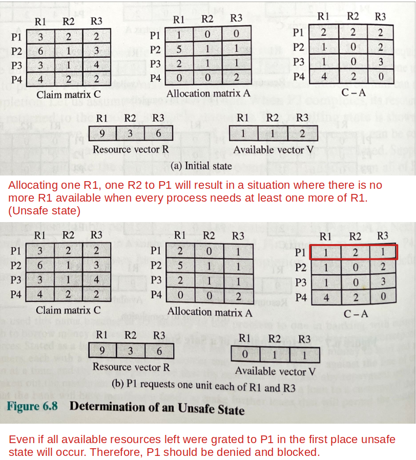
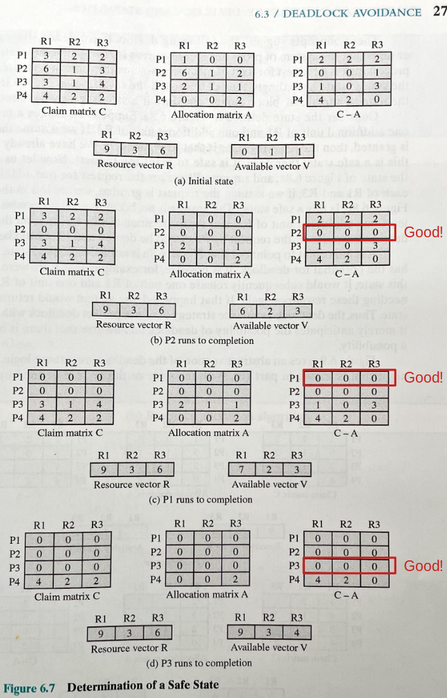

[Home](../../) | [Projects](../../projects) | [Notes](../) > <a href="./">Operating Systems</a> > Deadlock Avoidance

# Deadlock Avoidance

## Deadlock Avoidance

* Unlike deadlock prevention, **deadlock avoidance** allows the three necessary conditions but makes judicious choices to assure that the deadlock point is never reached. $\therefore$ Allows more concurrency than prevention.
* A decision is made dynamically whether the current resource allocation request will, if granted, potentially lead to a deadlock
* Requires knowledge of **future** process requests!
* Two approaches to deadlock avoidance:
  * **Process initiation denial** - Do not start a process if its demands might lead to deadlock.
  * **Process allocation Denial (Banker's algorithm)** - Do not grant an incremental resource request to a process if this allocation might lead to deadlock.

## Process Initiation Denial

* Do not start a process if its demands might lead to deadlock. (Too strict, no incremental work done)

* Consider a system of $n$ processes and $m$ different types of resources. Let us define the following vectors and matrices:

  * **Resource** - total amount of each resource in the system

    $R = (R_1, R_2, ... , R_m)$

  * **Available** - total amount of each resource not allocated to any process

    $V =(V_1, V_2, ... , V_m)$

  * **Claim** - $C_{ij}$ = maximum requirement of process $i$ for resource $j$
    $$
    C =
    \begin{pmatrix}
    C_{11} & C_{12} & ... & C_{1m} \\
    C_{21} & C_{22} & ... & C_{2m} \\
    ... & ... & ... & ... \\
    C_{n1} & C_{n2} & ... & C_{nm} \\
    \end{pmatrix}
    $$
    Claim matrix must be declared in advance by a process for deadlock avoidance to work.

  * **Allocation** - $A_{ij}$ = current allocation to process $i$ of resource $j$
    $$
    A =
    \begin{pmatrix}
    A_{11} & A_{12} & ... & A_{1m} \\
    A_{21} & A_{22} & ... & A_{2m} \\
    ... & ... & ... & ... \\
    A_{n1} & A_{n2} & ... & A_{nm} \\
    \end{pmatrix}
    $$

  The following relationships hold:

  1. $R_j = V_j + \sum_{i=1}^{n}A_{ij}$, for all $j$

     All resources are either available for allocated.

  2. $C_{ij} \le R_j$, for all $i$, $j$

     No process can claim more than the total amount of resources in the system.

  3. $A_{ij} \le C_j$, for all $i$, $j$

     No process is allocated more resources of any type than the process originally claimed to need.

  

  With these quantities defined, we can define a deadlock avoidance policy that refuses to start a new process if its resource requirements might lead to deadlock. Start a new process $P_{n+1}$ only if
  $$
  R_j \le C_{(n+1)j}+\sum_{i=1}^{n}C_{ij}, \text{for all } j
  $$
  That is, a process is only started if the maximum claim of all current processes plus those of the new process can be met. This strategy is hardly optimal, because it assumes the worst: that all processes will make their maximum claims together.

## Resource Allocation Denial (Banker's Algorithm)

* Do not grant an incremental resource request to a process if this allocation might lead to deadlock.

* Consider a system with a fixed number of processes and a fixed number of resources. At any time a process may have zero or more resources allocated to it.

  * Here, two vectors and two matrices that were used in "Process Initiation Denial" approach are used as well.

    * Vectors - Resource ($R$), Available ($V$)

    * Matrices - Claim ($C$), Allocation ($A$) 

      $C-A = $Need matrix

  * State of the system - reflects the current allocation of resources to processes.

    * **Safe state** - there is at least one sequence of resource allocations to processes that does not result in a deadlock (i.e., all of the processes can be run to completion).
    * **Unsafe state** - state that is not safe.

  * Can any of the process be run to completion with the resources available? Does the process $i$ meet the following condition?
    $$
    \underbrace{C_{ij}-A_{ij}}_{\text{resource $j$ necessary for process $i$ to complete}} \le V_{j}, \text{for all } j
    $$

  * When a process makes a request for a set of resources, assume the request is granted, update the system state accordingly, then determine if the result is a safe state. If so, grant the request and, if not, block the process until it is safe to grant the request. 
  
    * Determination of an unsafe state
  
      
  
    * Determination of a safe state
  
      

## Advantages and Restrictions of Deadlock Avoidance

### Advantages

* It is not necessary to preempt and rollback processes as in deadlock detection.
* Less restrictive than deadlock prevention.

### Restrictions

* The maximum resource requirement for each process must be stated in advance.
* The processes under consideration must be independent; that is, the order in which they execute must be unconstrained by any synchronization requirements.
* There must be a fixed number of resources to allocate.
* No process may exit while holding resources.

## References

Stallings, W. (2018). *Operating Systems: Internals and Design Principles* (9th ed.). Pearson Education, Inc.
