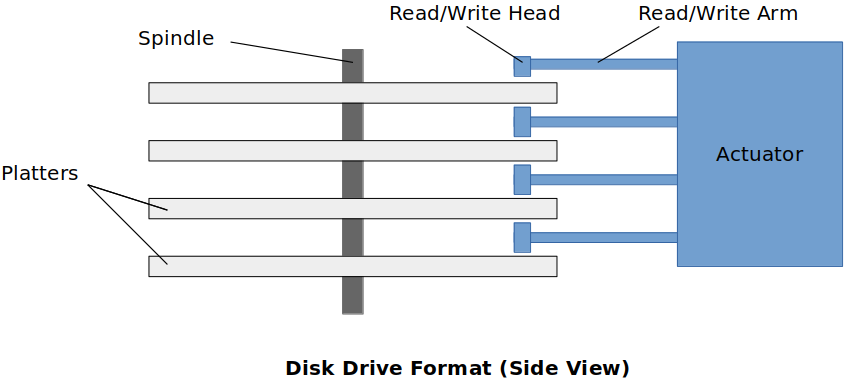
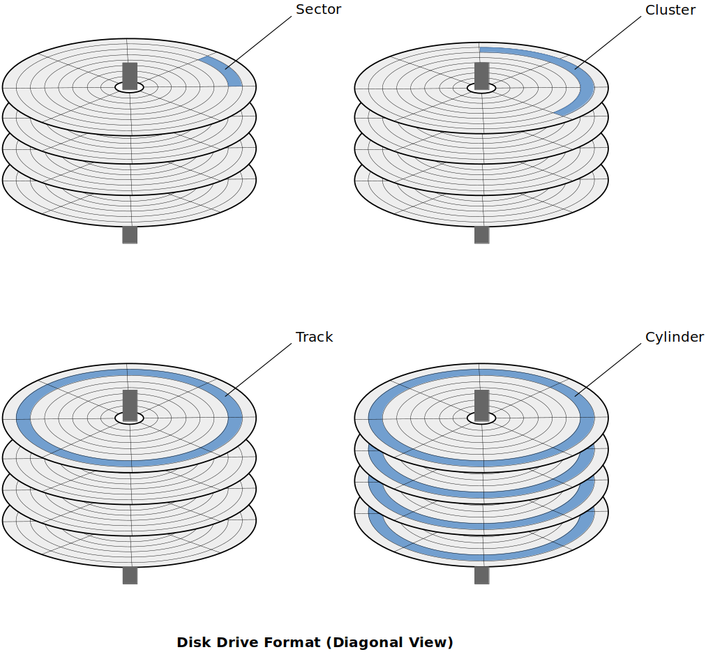
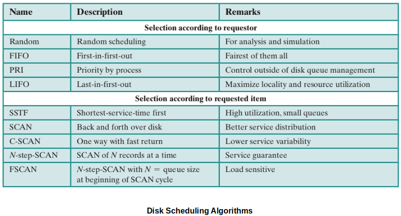
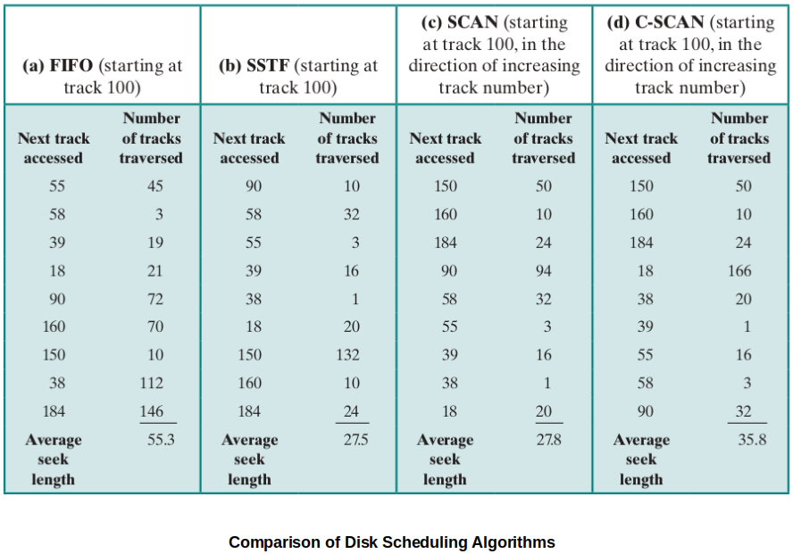
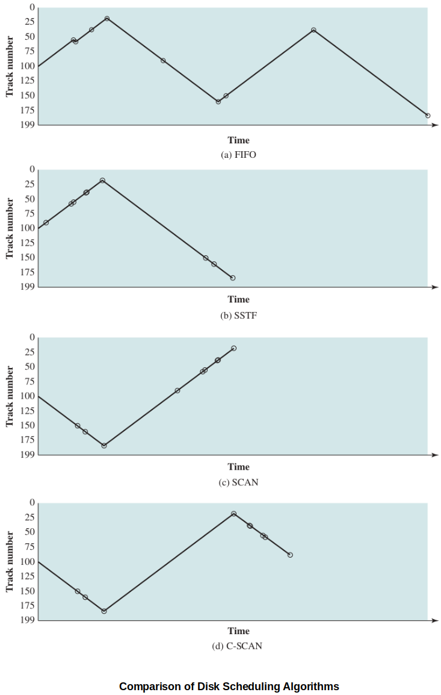

[Home](../../) | [Projects](../../projects) | [Notes](../) > <a href="./">Operating Systems</a> > Disk Scheduling Policies

# Disk Scheduling Policies

## Disk Drive

### Disk Drive Format (Side View)

* Read/Write Head is electro-magnetic. This is how the read/write head reads/writes from/to the platter.

### Disk Drive Format (Diagonal View)

* **Sector**
  * The smallest unit of data that can be read from or written to the (magnetic or optical) disk
* **Cluster**
  * A group of sectors within a disk and is the grouping by which disk files are organized
  * Most files fill many cluster of disk space

* **Track**
  * The path followed by the read/write head
  * Tracks are concentric circles
* **Cylinder**
  * All tracks that are currently accessed

* Note:
  * All the platters (disks) are running at the same rate (angular velocity).
  * Edge of the platter runs faster than anywhere towards the center.
  * Compared to the running speed of platters, read/write arm movement is significantly slow. So it will be more efficient when the read/write head can do its job with minimum number of movements to the different cylinder.
  * Due to all the physical components, disk drives are vulnerable to shock and dirts.

## Disk Scheduling

* Processor speeds have far out-stripped the speed of disk access.
* In general, disk speeds are about 4 orders of magnitude slower than accessing main memory.
* Disk performance is vital.
  * The OS uses the disk to swap pages in/out of memory frames when implementing virtual memory systems.
* Emphasize developing approaches to improve disk I/O performance.

## Measuring the Speed of Disk I/O

* **Seek time**

  The time required to move the disk arm to the desired track.

* **Rotational delay**

  The time required for addressed sector in a track to rotate into posision. Not much room to improve. (Rotational speed is already as fast as it can be and pushing it to the extreme will cause other issues such as heat, etc.)

* **Transfer time**

  The time to transfer the desired bytes (function of the size of a sector and the rotational speed of the disk). Again, not much room to improve.

### What Can We Improve?

* [Total transfer time] = [Seek time] + [Rotational delay] + [Byte transfer time]
* The objective of disk management techniques is to reduce the average I/O transaction time.
  * Imagine that all requrests are on the same track. Then it only incurs the seek time once!
  * Imagine that all requests are scattered across the tracks. Then it incurs much more seek time in between these accesses.
* $\therefore$ **Seek Time** is one factor that we can reduce with good policies!

## Disk Scheduling Policies

### Goal

* Reduce average time spent on **seeks**
* Remember, the typical OS is going to maintain a queue of I/O requests on behalf of all of the processes requesting I/O in your system and the target I/O devices will be given chances to service them. So for a single disk, there will be a number of incoming I/O requests.

### General Policies

* **FIFO (First In First Out)**
  * Requests of the I/O get serviced in order that they come in.
  * Simplest (because you are not making any decisions)
  * Fair
  * Suffers from random seek times (has no control over seek times)
* **Priority**
  * Control of scheduling is now outside of the disk manager (OS has control over deciding which I/O needs to be carried out first)
  * Does not (not intended to) optimize disk utilization
  * Poor for general purpose (maybe more applicable to real-time systems)
* **LIFO (Last In First Out)**
  * Simple
  * Based on the idea that new requests happen near recent ones (*Principle of Locality*)
  * However, early processes tend to move out of range and starve.
* **SSTF (Shortest Seek Time First)**
  * Select the disk I/O request that requires the least arm movement distance.
  * Drawback - Seeks will tend to cluster around an area, starving the outliers that are farther away.
* **SCAN**
  * Alleviates the problems with random seek times (FIFO) and starvation (LIFO, SSTF).
  * Requires the arm to move in one direction at a time.
  * Satisfy all requests along the path of the arm. When it reaches the edge, reverse course and process all requests along the way back.
  * The "**LOOK**" algorithm is just a modification of SCAN algorithm, which stops moving in a direction when there are no more to process there. (Improves the seek time a little bit.)
* **C-SCAN (Circular SCAN)**
  * Improves the fairness of SCAN.
  * Disk arm always works on requests in one direction only.
  * When it reaches the end/edge, the arm picks up, moves back to the beginning and starts over there for another pass in. (Due to this requirement, it can be slightly slower than the regular SCAN algorithm.)
  * Linux uses a variation of SCAN called "**Elevator**".
    * If a new request comes in that requires the access to the same track the I/O operation is currently taking place, the new request is added to the queue and jumped up to the front of the queue so that it can be taken care of while the read/write head is still in that track.
    * Linux will put a limit to how many new requests it can add and move to the front of the queue to make sure this feature does not cause starvation of other requests.

### Comparison of Disk Scheduling Algorithms

## References

Stallings, W. (2018). *Operating Systems: Internals and Design Principles* (9th ed.). Pearson Education, Inc.

