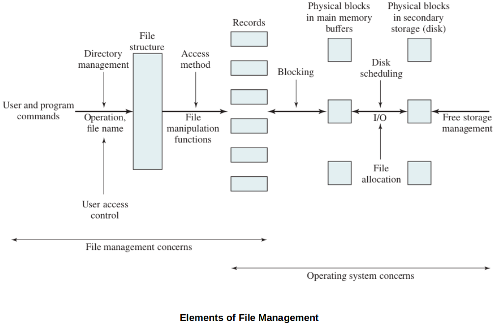
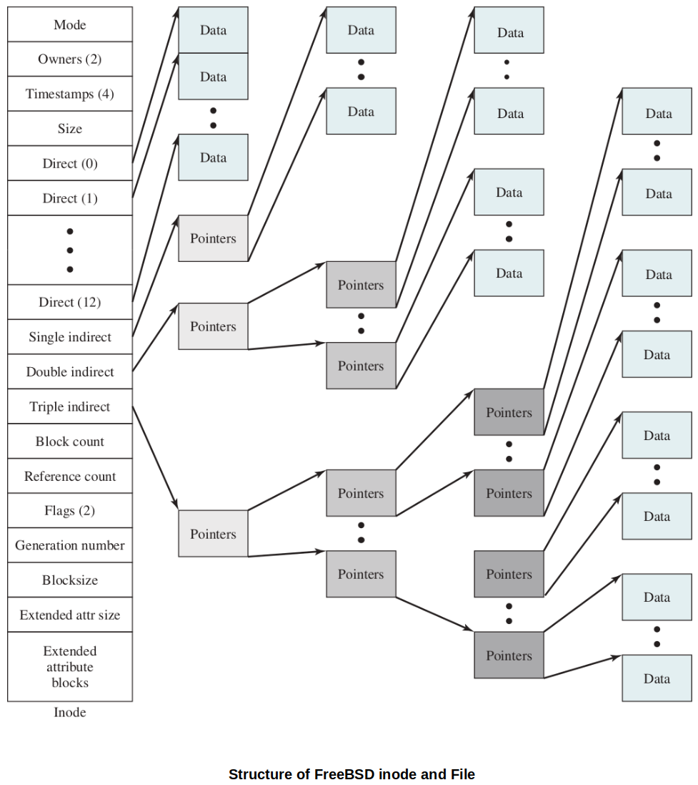

[Home](../../) | [Projects](../../projects) | [Notes](../) > <a href="./">Operating Systems</a> > File Management

# File Management

## Overview

* From a user's point of view, the file system is a very visible and important part of an operating system.
* A file is a logical unit of blocks of data stored in the disk.
* OS's responsibility with file systems:
  * Background work to organize the disk blocks into files
  * Uniform interface the OS exposes to programming languages to allow the programmers devlop the software that deals with files

* Files have desirable properties:
  * Permanence (Can put data in it and store it)
  * Shareable between processors or systems
  * Sharing permissions can be configurable to increase the security of the data.
  * Structure and convenience for certain applications

## Common File Structures

In general, an OS supports multiple file systems. The followings are common file structures that OSs support in general.

* **Stream**
  
  * This is the simple text file we are used to programming with. (No formal organization to it)
  
  * You start reading, byte-by-byte from the beginning to the end.
  
  * Sequential access - You can move forward or backward a certain number of bytes (file seeks).
  
    e.g., Read forward 100 bytes, read backward 100 bytes, etc.
  
  * No formal structure other than bytes.
  
* **Records**
  
  * A file is composed of multiple records. Records have fields, like objects and are of variable length.
  * You can read/write one record at a time.
  * Sequential access, one record at a time in sequence.
  * Some record based systems support indexing where you can move directly to an indexed record. (Some type of hash table may be used to support indexing.)
  
* **Database**
  
  * Collection of files storing record structures.
  * Often enterprise level databases manage their own file systems independently of the operating system.

## File System Support

* An operating system will provide system operations (library calls) to access the features of each file structure it supports.
* The file management system of the operating system is the gateway between your processes and the files the OS manages.
* Goals:
  * Meet user storage requirements
  * Guarantee that files are not corrupted
  * Optimize performance of file access
  * Provide standard I/O interfaces to the user processes for working with files
  * Provide security for multi-user systems

## Elements of File Management

## File System Architecture (Lowest to Highest Level)

* At the lowest level are physical devices such as disks and tape drives that are capable of storing a filesystem. Not all devices in a computer system must use the same file system. We can setup different file systems and provide interfaces from the OS to the devices.

* Device Drivers

  * Reside at the lowest level (on top of the physical devices)
  * Communicate directly with peripheral devices and controllers
  * Responsible for starting I/O on a particular device
  * Tightly coupled to the OS. Sometimes independent code working closely with the OS or sometimes part of the OS. (Device drivers for general devices are the examples of the latter, a driver comes with the new device fall under the former.)
  * For file systems, typical devices are tape drives, disks, etc.
  * Device drivers are either part of the operating system or very tightly coupled to it.

* Basic File System (Physical I/O level)

  * This is how the OS deals with the device directly.

  * Deals with blocks of data that are exchanged between a disk or tape drive and the system.

    e.g., Compute the address of the block, get the block, put it in a buffer, etc.

  * Concerned with placement of blocks onto the storage media.

  * Considered part of the OS.

* Basic I/O Supervisor

  * Control layer - Part of the OS that supervises the I/O
  * Initiates/terminates I/O on behalf of processes.
  * Maintains control structures to deal with the devices, file statuses, and queues for scheduling.
  * Selects device on which file I/O will be performed.
  * Manages I/O buffers
  * Considered part of the OS

* Logical I/O Layer

  * Enables applications to access the concept of logical files instead of programs having to deal with the block structure of the actual hardware device.

    i.e., You read and write lines from a file, not blocks (usually)

  * Maintains basic information about files (size, access data, location, name, directories)

  * This layer generally involves "System calls"

  * Considered part of the OS 

* Access Methods: APIs

  * Layer closest to user programs

  * Provides a programming interface to the file system (operating system function libraries provided by your OS but also used by high level languages to interact with files)
    * OPEN, CLOSE, CREATE, PRINTF, etc.
    
    This helps write OS independent code.
    
  * May or may not be part of the OS (Some file system APIs are not part of an OS)

  High level programming languages usually wrap these OS specific API calls so that your program can be OS independent. For example: C implements `printf()` for you to use to format your output. The internal code for `printf()` will call the `write()` operation for whatever OS your compiler is supporting to send those characters to a file.

## File Management

* User applications are concerned with records and streams and the logical concept of a *single* file.
  * In other words, as a user, you don't care how many blocks you are dealing with behind the scenes. You just deal with "files".

* But, I/O is done at a lower level, on a block bases.
* i.e., A physical file is composed of a sequence of physical blocks on a device.
* File management requires the ability to 
  * Allocate files to free blocks in secondary storage
  * Manage the free storage
  * Manage the growth of a file's size
* File systems also have to manage information about each file stored on the device. That information is stored in some of the blocks on the physical device and is also permanent. If the OS is shut down, you don't lose track of the files on your disk!

## Secondary Storage Management

There are 2 Basic Strategies for File Storage Allocation.

### 1. Variable sized, contiguous portions (Older way)

* Storing a file in a single or very few large contiguous portions allows for dynamic partitioning of the storage system, and better retrieval performance (since all in same area)
* Can use best fit, worst fit, etc. just like memory partitions. Suffers from fragmentation! 
* Compaction is necessary every once in a while to improve disk performance. (Lots of block movement happens with this stragety.)

### 2. Block oriented

* Small, fixed-size partitions
* Flexible, eliminates external fragmentation
  * The blocks of a file does not have to be placed contiguously on disk.
  * Compaction is no longer necessary.
  * Can easily accommodate files growing/shrinking.
* Allocated only the blocks as needed
* Now the free blocks on disk have to be easily traceable so the OS does not have to go through all the existing blocks to collect free blocks for a file.
* Can store **pages** of a process in **blocks** on disk, and those blocks can be loaded onto **frames** in main memory.

* Fixed Block Size Allocation

  1. **Contiguous Allocation**
     * A single, contiguous set of blocks is allocated at creation.
     * Requires file size up-front. How can it handle files growing in size?
     * Simple for file system to keep up with because a file table entry only needs a start block address and a size or how many blocks.
     * Best for sequential access processing (e.g., tape drive)
     * External fragmentation - as files are deleted, leaves contiguous gaps of varying sizes.
     * Compaction - Process of reallocating contiguous files to one end of storage and move free storage to other side.
  2. **Chained Allocation**
     * Not contiguous
     * The file table keeps track of the first block assigned to a file.
     * Each block contains a pointer to the next allocated block.
     * No external fragmentation
     * Files can grow and shrink in size, easily.
     * Advantage - A corrupted file system can be reconstructed by following the chain links to rebuild the list of blocks used by files and find the free blocks in the system.
     * Disadvantage - Jumping around the blocks is a bit time consuming because it has to traverse the chain.

  3. **Hierarchical Allocation**

## UNIX/LINUX Inode Strategy

* Linux uses a **block oriented** strategy.

* A file system is created with a table containing records (i.e., structure) called **inodes**.

* Each inode in the file system records information about a single file.

* The number of inodes get created when the file system is first setup is dependent on the volume of the disk and it dictates the maximum number of files you can create, no matter how much storage is free.

  * If you have used up all the available inodes, and you still have free space, you won't be able to create another file.

* A directory in Linux is just a file with a list of file names and inode numbers associated with the files. Different file names can be associated with one inode.

  * **File name is not part of the file** but is a data of a directory entry that references an inode.

* An inode is a data structure of a fixed size, generally 128 to 256 bytes depending on the word-size of your system.

* The contents of an inode include:

  * File size
  * Device id
  * User id
  * Group id
  * File mode (c or b)
  * ... Other system flags and info ...
  * Ctime
  * Mtime
  * Atime
  * Hard link count
  * Direct **block pointer** 1
  * ... (there will be N block pointers, standard is 12) ...
  * Direct **block pointer** N
  * Single indirect **block pointer**
  * Double indirect **block pointer**
  * Triple indirect **block pointer**

  For direct block pointers, once the value N is determined, every inode has to have N number of direct block pointers. N direct block pointers will each point to a block. No chain necessary to link them together. However, once the file size grows over N blocks, indirect block pointers come into play and the idea of hierarchical chain will be used.

### Direct Block Pointers

* The block pointers in an inode store a block address from the file system device.
* Many files consume more than one block of storage space.
  * The number of blocks a file requires is dependent on the block size of the storage device.
  * For example a 2 KB file will need 2 blocks on a device whose block size is 1024 bytes.
* Direct block pointer 1 points to the 1^st^ block of the file, direct block pointer 2 points to th 2^nd^ block of the file, and so on.

### Indirect Block Pointers

* The indirect block pointers are used if a file takes up more than N blocks on disk.
* Single indirect pointer
  * Points to a block. That block has pointers to the actual blocks the file is using.
  * So, if a block is 1024 in size (with 4 byte words) then a single indirect block will store 256 block addresses.
  * 1 level of indirection.
* Double indirect pointer
  * This points to a block that has pointer to blocks containing block addresses.
  * 2 levels of indirection.
* Triple indirect pointer
  * 3 levels of indirection

[!] Note: There is a limit to how big of a size a file can be! The size of a file annot be infinite!

## Exercise

### Problem

* Suppose your system has a block size of 1024 bytes (assume 4 byte words - a single word can hold the address of a single block on disk)
* Suppose your inode has 10 direct block pointers and the 3 indirect pointers
* How large of a file could your file system support using this configuration?

### Solution

* Referring to the table below, for each level of indirection stored in the inode table, there are a certain number of blocks that can be referenced at each level. So for example, the direct level of referencing can identify 10 blocks for a file (or 10 K bytes of storage space). For each level of indirection the number of blocks (and corresponding space) are given.

  | inode block pointer level | Number of blocks on disk that can be addressed | Number of bytes these blocks represent in storage |
  | ------------------------- | ---------------------------------------------- | ------------------------------------------------- |
  | Direct                    | 10                                             | 10 x 1K = 10K                                     |
  | Single indirect           | 256 (1K / 4 bytes per address)                 | 256 x 1K = 256K                                   |
  | Double indirect           | 256 x 256 = 64K                                | 64K x 1K = 64M                                    |
  | Triple indirect           | 256 x 256 x 256 = 16M                          | 16M x 1K = 16G                                    |

* Therefore, the largest file in this sytem can be 16G + 64M + 256K + 10K in size.

## How is Free Space Managed?

Keep in mind that keeping track of the available blocks is a big part of file management.

* A large disk $\to$ large number of blocks $\to$ larger size of a free block table
* It makes more sense to store free block list partially in memory, and page it in and out as needed.
* What happens if the file system crashes or powers down while the free block list is being changed? You could scan all of the information in the inode pointers to recreate the list of blocks that are unused.

## References

Stallings, W. (2018). *Operating Systems: Internals and Design Principles* (9th ed.). Pearson Education, Inc.

