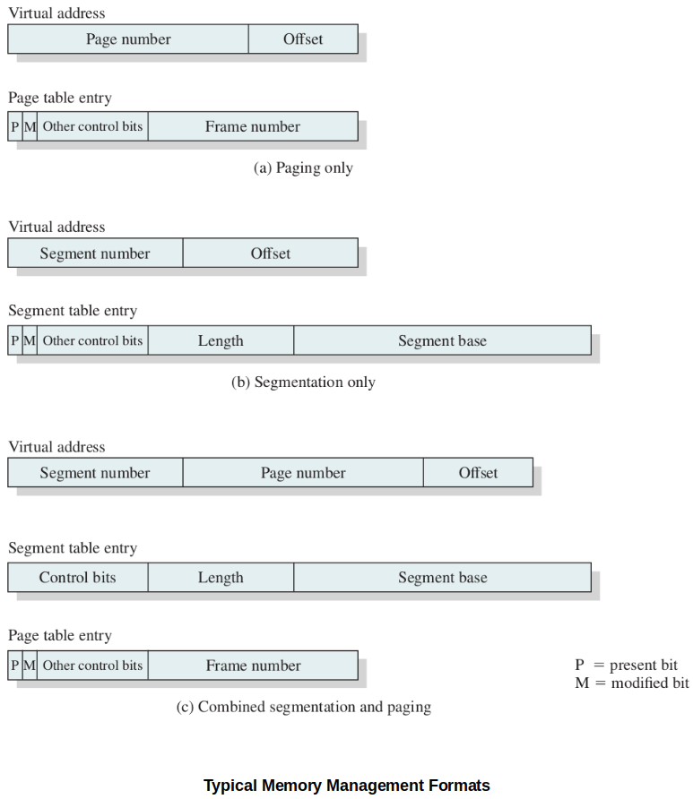
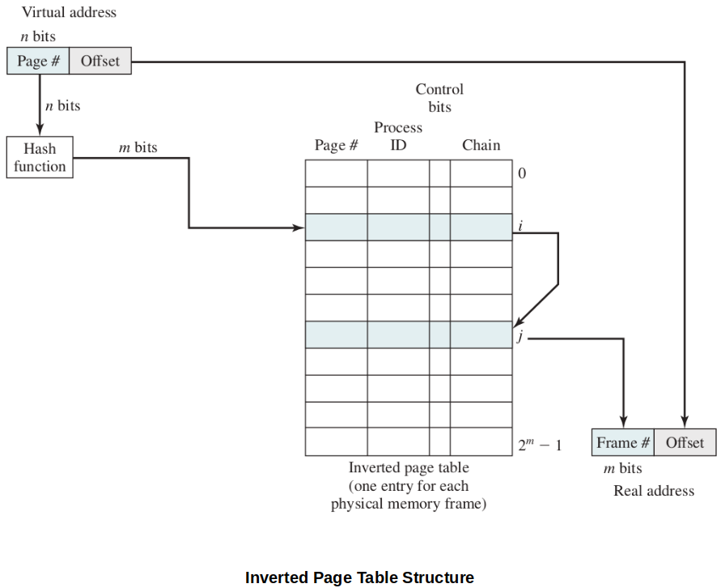
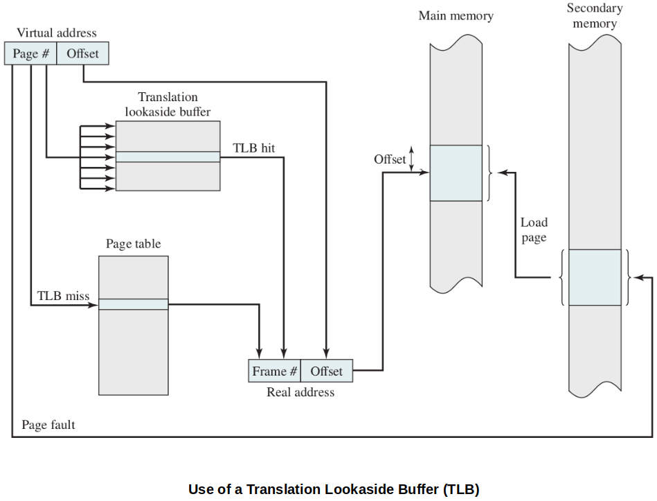
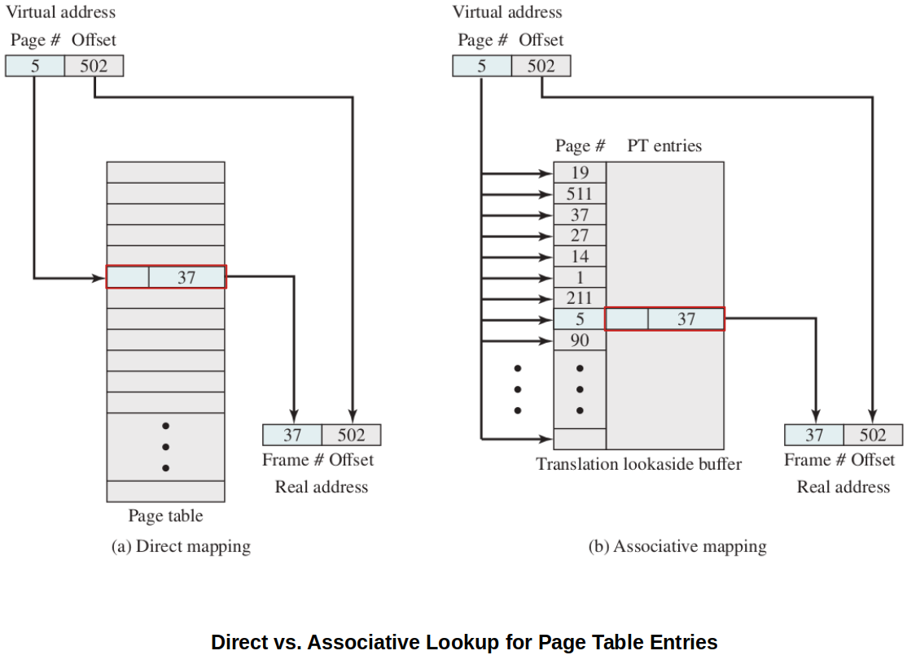
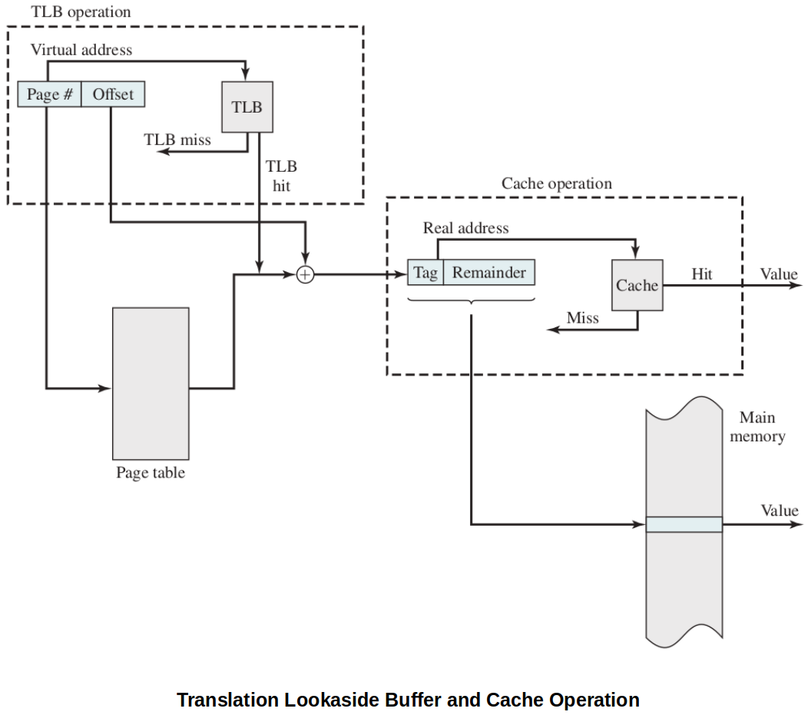
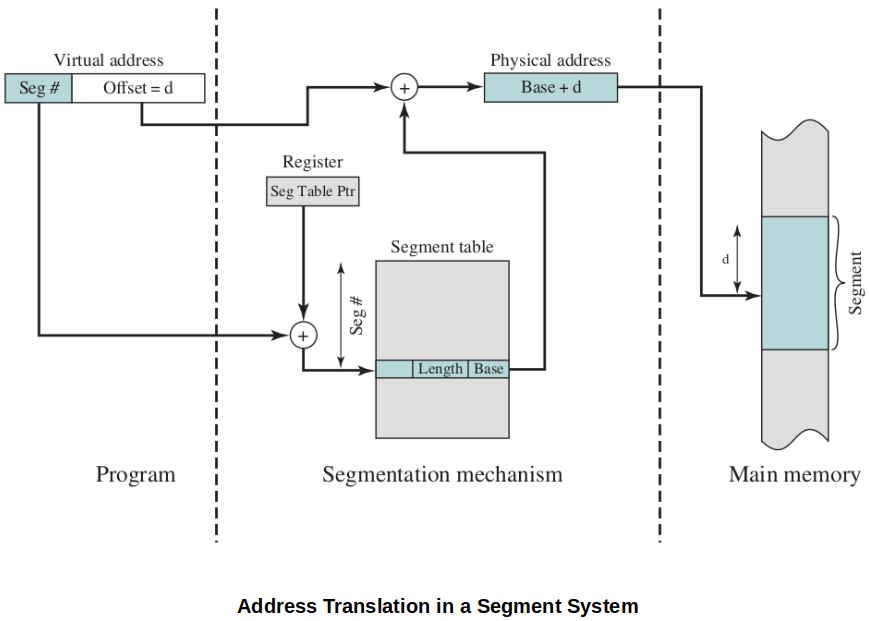
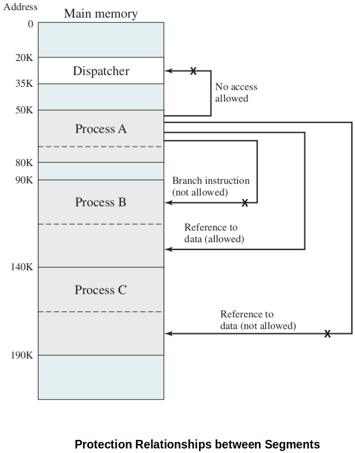

[Home](../../) | [Projects](../../projects) | [Notes](../) > <a href="./">Operating Systems</a> > Hardware & Control Structures

# Hardware & Control Structures

## Characteristics of Paging and Segmentation

Two important characteristics of simple paging and simple segmentation:

1. All memory references within a process are logical address that are dynamically translated into physical addresses at run-time. (A process may be swapped in and out of main memory such that it occupies different regions of main memory at different times during the course of execution. The part of the secondary memory where swapped out pages go is called the "Swap memory/space").
2. A process may be broken up into a number of pieces (pages or segments) and these pieces need not be contiguously located in main memory during execution. The combination of dynamic run-time address translation and the use of a page or segment table permits this.

These lead to the breakthrough in memory management; **it is not necessary that all of the pages or all of the segments of a process be in main memory during execution**.

## Introduction to Virtual Memory

* With virtual memory:

  * Not entire process must be loaded into memory for it to run. (Taking the advantage of paging/segmentation.)
  * Each process are allowed to use much larger address space than the size of the physical RAM.

* Mechanism of the new strategy (i.e., Virtual Memory)

  Here, "piece" refers to a "page" or "segment" depending on which scheme is used.

  1. The OS begins by bringing in only one or a few pieces to include the initial program (code + data) piece. Initial page faults are mandatory.

     The portion of a process that is in main memory at a certain point in time is called the **resident set** of the process at that moment.

  2. Process executes smoothly as long as all memory references are to locations in the resident set.

     Page table or segment table is used during this process.

  3. If the processor encounters a logical address that is not in main memory, it generates an interrupt indicating a memory access fault (i.e., **page fault** or **segment fault**).

  4. The OS puts the interrupted process in a Blocking state.

  5. The OS issues a disk I/O read request to bring into main memory (i.e., **swap in**) the piece of the process that contains the missed logical address.

  6. The OS dispatches another process to run while the disk I/O is performed.

  7. Once the desired piece has been brought into main memory, an I/O interrupt is issued, giving control back to the OS, which places the affected process back into a Ready state.

* Implications of this new strategy that lead to improved system utilization:

  * More processes may be maintained in main memory.
  * A process may be larger than all main memory which frees the programmer from having to manage the size of a program.
  * Time is saved because unused pages are not brought into memory.
  * OS have a variety of paging policies to help make decisions on efficient paging/segmentation.

* Because a process executes only in main memory, that memory is referred to as **real memory**. But a programmer or user perceives a potentially much larger memory (i.e., **virtual memory**) that is allocated on disk. 

### Locality and Virtual Memory

* In virtual memory management, **thrashing** (i.e., the system spending most of its time swapping process pages or segments rather than executing instructions) may occur.
* In this regard, the principle of locality suggests that a virtual memory scheme may be effective with the followings:
  * The hardware support for the paging and/or segmentation scheme to be employed
  * The OS must include software for managing the movement of pages and/or segments between secondary memory and main memory.
* This section examines the hardware aspect and looks at the **necessary control structures** which are created and maintained by the OS but are used by the memory management hardware.

## Virtual Memory Paging

* The major difference between the virtual memory paging and the simple paging we discussed earlier is that **not all pages need to be loaded** into main memory frames for execution.

* Due to this characteristics, page table entries now need to contain the following extra information:

  * P-bit (Present)

    Indicating whether the corresponding page is present (P) in main memory or not.

  * M-bit (Modified)

    Indicating whether the contents of the corresponding page have been modified since the page was last loaded into main memory. (It is unnecessary to write an unmodified page out when it needs to be replaced.)

  Other control bits may also be present. For example:

  * S-bit (Shared)
  * R-bit (Read only)
  * A-bit (Accessed recently)
  * ...

### Page Table Structure

* Hardware implementation of a page table.

  [!] Note: Typically, $n \gt m$, because the number of pages in a process may exceed the number of frames in main memory.

* Due to the potentially **large size of a page table**, virtual memory schemes store page tables in virtual memory rather than real memory so that **only a subset is maintained in main memory** at any time.
  * Page tables are subject to paging just as other pages are.
  * When a process is running, at least a part of its page table must be in main memory, including the page table entry of the currently executing page.
* Some processors make use of a two-level scheme page table to organize large page tables. (Typically, the maximum length of a page table is restricted to be equal to one page.)

### Inverted Page Table

* Above diagram shows a typical implementation of the inverted page table approach. For a physical memory size of $2^m$ frames, the inverted page table contains $2^m$ entries, so that the $i$th entry referes to frame $i$.
* Each entry includes the following:
  * Page number - page number portion of the virtual address
  * Process ID - the owner of this page (The combination of page number and process ID identifies a page within the virtual address space of a particular process.)
  * Control bits - includes flags (e.g., valid, referenced, and modified) and protection and locking information
  * Chain pointer - null if there are no chained entries for this entry, index value (i.e., [$0$, $2^m - 1$]) of the next entry in the chain otherwise.
* In this example, the hash function maps the $n$-bit page number into an $m$-bit quantity, which is used to index into the inverted page table.

### Translation Lookaside Buffer (TLB)

* Because page tables can be really large, a lot of architecture systems provide some hardware to make frame-lookup go faster.

* TLB is a special high-speed cache (on-board hardware) for page table entries. (Contains part of the page table entries that have been most recently used.)

* The following flowchart shows the use of TLB. To keep the flowchart simple, the fact that the OS may dispatch another process while disk I/O is underway is not shown.

  Given a virtual address, the processor will first examine the TLB.

  Also, notice that the TLB will always contain the information of the most recently referenced page.

* Direct vs. Associative Mapping

  

  

  

  Since the TLB contains only a subset of entries in a full page table, we cannot simply index into the TLB based on page number. Therefore, each entry in the TLB must include the page number as well.

  * **Direct mapping (indexing)** - Used for lookup in the page table.
  * **Associative mapping (simultaneous matching)** - Used for lookup in the page table. Extremely fast!

* Finally, the virtual memory mechanism must interact with the cache system.

  

  

  

  First, the memory system consults the TLB to see if the matching page table entry is present.

  * If it is, the real (physical) address is generated by combining the frame number with the offset. 

  * If not, the entry is accessed from a page table. 

  Once the real address is generated, which is in the form of a tag (i.e., typically the leftmost bits of the real address) and a remainder, the cache is consulted to see if the block containing that word is present. 

  * If so, it is returned to the CPU.
  * If not, the word is retrieved from main memory.

* Translating a virtual address into a physical address involves reference to a page table entry, which may be in the TLB, in main memory, or on secondary memory. The referenced word may be in cache, main memory, or on secondary memory.

  If the referenced word is only on secondary memory, the page containing the word must be loaded into main memory and its block loaded into the cache, the page table entry for that page must be updated, and finally the TLB must be updated accordingly.

### Characteristics of Paging

* Transparent to the programmer.
* Eliminates external fragmentation and thus provides efficient use of main memory.
* Because the pieces that are moved in and out of main memory are of fixed, equal size, it is possible to develop sophisticated memory management algorithms that exploit the behavior of programs.

## Segmentation

### Virtual Memory Implication

* Segmentation allows the programmer to view memory as consisting of multiple address spaces or segments.
* Segments may be of unequal size.
* Memory references consist of a (segment number, offset) form of address.
* Advantages of segmented address space over non-segmented address space:
  1. It simplifies the handling of growing data structures. If the programmer does not know ahead of time how large a particular data structure will become, it is necessary to guess unless dynamic segment sizes are allowed. With segmented virtual memory, the data structure can be assigned its own segment, and the OS will expand or shrink the segment as needed. If a segment that needs to be expanded is in main memory and there is insufficient room, the OS may move the segment to a larger area of main memory, if available, or swap it out. In the latter case, the enlarged segment would be swapped back in at the next opportunity.
  2. It allows programs to be altered and recompiled independently, without requiring the entire set of programs to be relinked and reloaded. Again, this is accomplished using multiple segments.
  3. It lends itself to sharing among processes. A programmer can place a utility program or a useful table of data in a segment that can be referenced by other processes.
  4. It lends itself to protection. Because a segment can be constructed to contain a well-defined set of programs or data, the programmer or system administrator can assign access privileges in a convenient fashion.

### Organization

### Characteristics of Segmentation

* Visible to the programmer.
* Strengths include the ability to handle growing data structures, modularity, and support for sharing and protection.

## Paging & Segmentation Combined

* To combine the advantages of both the **paging** and the **segmentation**, some systems are equipped with processor hardware and OS software to provide both.

* In this model, a user's address space is broken up into a number of segments, at the discretion of the programmer.

* Each segment is, in turn, broken up into a number of fixed-size pages, which are equal in length to a main memory frame.

* If a segment is shorter than a page, the segment occupies just one page.

* From the programmer's point of view, a logical address still consists of a segment number and a segment offset.

* From the system's point of view, the segment offset is viewed as a page number and page offset for a page within the specified segment.

* Each process is associated with:

  * A segment table
  * A number of page tables

  The processor uses the **segment number** portion of the virtual address to index into the process segment table to find the page table for that segment. Then, the **page number** portion of the virtual address is used to index the page table and look up the corresponding **frame number**. This is combined with the offset portion of the virtual address to produce the desired real address.

* In this model, 
  * Segment table entry:
    * **Segment base** field of the segment table entry refers to a page table.
    * **Present** and **modified** bits of the control bits are not needed because these matters are handled at the page level.
  * Page table entry:
    * The same as is used in a pure paging system.

## Protection & Sharing

## Virtual Memory Terminology

* **Virtual memory**

  A storage allocation scheme in which secondary memory can be addressed as though it were part of main memory. The addresses a program may use to reference memory are distinguished from the addresses the memory system uses to identify physical storage sites, and program-generated addresses are translated automatically to the corresponding machine addresses. The size of virtual storage is limited by the addressing scheme of the computer system, and by the amount of secondary memory available and not by the actual number of main storage locations.

* **Virtual address**

  The address assigned to a location in virtual memory to allow that location to be accessed as though it were part of main memory.

* **Virtual address space**

  The virtual storage assigned to a process.

* **Address space**

  The range of memory addresses available to a process.

* **Real address**

  The address of a storage location in main memory.

* **Resident set**

  A set of pages or segments of a process that is currently in main memory.

* **Page fault**

  When a referenced page is not resident in memory, an interrupt is generated to issue a request to read the page from secondary storage and loade it into an vailable frame in memory.

* **Thrashing**

  The state in which the system spends more of its processing time swapping process pages or segements into memory than executing useful process instructions.

* **Principle of locality**

  References to instructions and/or data addresses in a process tend to cluster togehter.

## References

Stallings, W. (2018). *Operating Systems: Internals and Design Principles* (9th ed.). Pearson Education, Inc.

