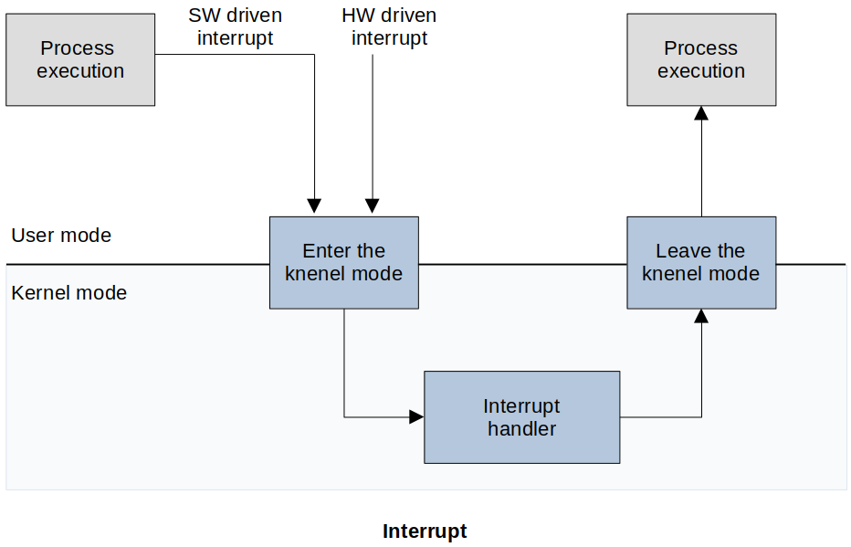
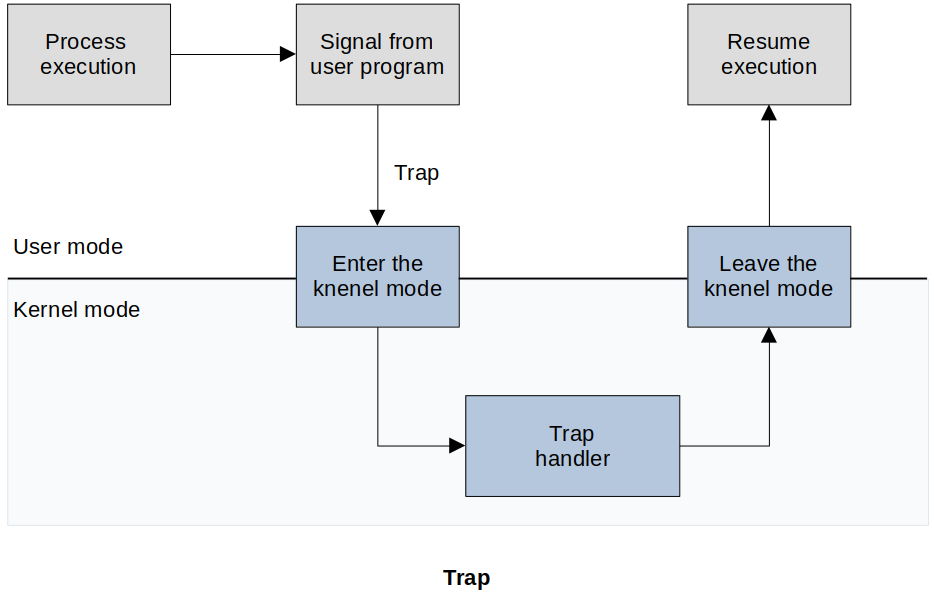

[Home](../../) | [Projects](../../projects) | [Notes](../) > <a href="./">Operating Systems</a> > Interrupt vs. Trap

# Interrupt vs. Trap in OS

## Interrupt

* **An interrupt is a hardware or software signal that demands instant attention by an OS.** It notifies the processor that a critical process needs urgent  execution. In such a case, the present working process is interrupted.

## Trap

* **A trap is a synchronous interrupt triggered by an exception in a user process to execute functionality.** Exception conditions like invalid memory access, division by zero, or a breakpoint can trigger a trap in an OS.

## References

Stallings, W. (2018). *Operating Systems: Internals and Design Principles* (9th ed.). Pearson Education, Inc.

