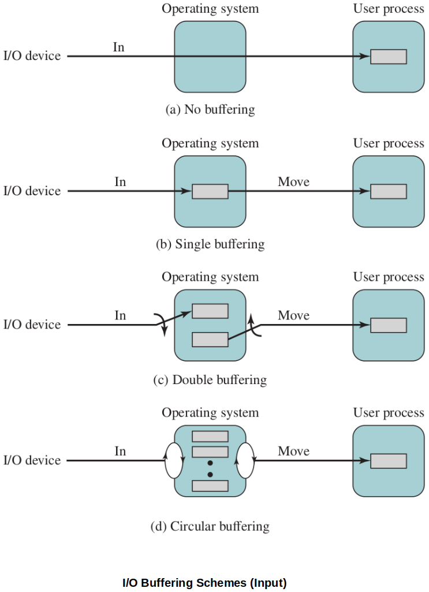

[Home](../../) | [Projects](../../projects) | [Notes](../) > <a href="./">Operating Systems</a> > I/O Management

# I/O Management

## Techniques for Performing I/O

* **Programmed I/O**
  * In early systems, the processor issued commands, on behalf of a process, to an I/O module; that process then **busy waits** for the operation to be completed before proceeding.
  * Very inefficient use of the processor to control I/O as well as general computation in processes, because I/O devices are comparatively slower than main memory and processor.
* **Interrupt-Driven I/O**
  * The processor issues the I/O command on behalf of the process. There are two possibilities:
    * If the I/O instruction from the process is non-blocking, then the processor continues to execute instructions from the process that issued the I/O command.
    * If the I/O instruction is blocking, then the next instruction that the processor executes is from the OS, which will put the current process in a blocked state and schedule another process.
  * No busy waiting, but still slow because interrupt is triggered for every **little piece of data** being transferred.
* **DMA (Direct Memory Access)**
  * A DMA module controls the exchange of data between main memory and an I/O module. The processor sends a request for the transfer of a block of data to the DMA module, and is interrupted only after the entire block has been transferred.
  * No busy waiting. Much faster than other previous techniques.
  * e.g., In virtual memory paging, DMA can be involved in bring in the pages (block transfer) from disk that are not in memory.

[!] Note: In general, block size is either equal to the frame size or multiple of frame size. 

### Direct Memory Access (DMA)

* Above diagram indicates, in terms, the DMA logic. The DMA unit is capable of mimicking the processor and, indeed, of taking over control of the system bus just like a processor. It needs to do this to transfer data to and from memory over the system bus.
* The DMA technique works as follows. When the processor wishes to read or write a block of data, it issues a command to the DMA module by sending to the DMA module the following information:
  * Whether a read or write is requested, using the read or write control line between the processor and the DMA module
  * The address of the I/O device involved, communicated on the data lines
  * The starting location in memory to read from or write to, communicated on the data lines and stored by the DMA module in its address register
  * The number of words to be read or written, again communicated via the data lines stored in the data count register.
* The processor then continues with other work. It has delegated this I/O operation to the DMA module.
* When the transfer is complete, the DMA module sends an interrupt signal to the processor. Thus, the processor is involved only at the beginning and end of the transfer.

## Evolution of the I/O Function

1. Processor directly controls a peripheral device or directly commands an I/O module attached to that device. i.e., Programmed I/O.
2. Processor sends instructions to devices as in (1), but interrupts are now used to eliminate busy waiting for those instructions to complete.
3. The I/O module/device is given direct access to the memory via DMA. It can now move an entire block of data without involving the processor, once started.
4. The I/O module is enhanced by giving it a processor with a specialized instruction set for the device it manages. Now, a single command can initiate a sequence of instructions.
5. The I/O module is enhanced with its own local memory and ability to implement customizable driver software to control a device. This is a specialized processor we mentioned in the context of multiprocessing architectures.

전반적으로, OS의 I/O에의 개입이 점점 줄어드는 방향으로 진화해왔다고 보면 된다. 최종적으로는, OS가 다른 process들을 처리하는 중에 I/O를 전담하는 장치가 I/O 작업을 수행하는 방식으로 개선되었다.

## Operating System Design Goals

* Two objectives in designing the I/O facility: **Efficiency** and **generality**.
* In other words, the OS can use techniques to speed up I/O (read/write) and it should have general purpose behavior for classes of devices.
  * e.g., using available memory frames to buffer I/O speeds up a process' ability to use some of the data while waiting for the rest. (i.e., I/O buffering)
  * e.g.,, Linux categorizes devices as block or stream oriented. Block devices read/write entire blocks at a time, while stream oriented handles one byte at a time, regardless of the actual device type. (Everything in Linux is treated as a file. Reading/writing to/from an I/O device is no different than doing so to/from a file. Uniform operations!)
  

## I/O Buffering

* It is sometimes convenient to perform input transfers in advance (anticipation) of requests being needed and to perform output transfers some time after the data is ready.
* Buffering data into memory frames is a technique that allows this.
* Buffering helps smooth out delays associated with bursts of I/O in a process.

### I/O Buffering Techniques

* **Single Buffering**
  * When a process issues an I/O request, the OS transfers data into the OS. I/O is transferred in/out of that buffer, then the buffer is exchanged into the process' frame(s) of memory.
  * Meanwhile, the OS can signal another buffer to begin transfer (looking ahead, prefetching, etc.).
  * The user process can be working with one block of data while the next block is being read for (or older block is being written out).
  * At any point in time, the user process is working with a single buffer and the OS has a single buffer on hand to dedicate to that process' next transaction.
* **Double Buffering**
  * The OS reserves two system buffers for transacting I/O on behalf of a user process. When one buffer fills and is being transferred to the user process' memory space, the 2^nd^ buffer can be used to continue working with the I/O devices.
  * This allows the OS to continue filling a buffer while the user buffer is being transferred over.
* **Circular Buffering**
  * This is basically an extension from 2 to N buffers.
  * The OS reserves N system buffers for transacting I/O on behalf of a user process. When one buffer fills and is being transferred to the user process' memory space, the next buffer in line can be used to continue working with the I/O devices.
  * This works well for systems with I/O devices of varying speeds. If the OS has a large reserve of memory to work with, it can allocate more buffers to each process.
  * This allows the OS to pre-page the anticipated pages (based on the *Principle of Locality*) as much as possible.

## References

Stallings, W. (2018). *Operating Systems: Internals and Design Principles* (9th ed.). Pearson Education, Inc.

