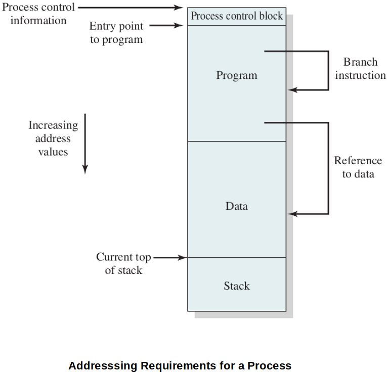

[Home](../../) | [Projects](../../projects) | [Notes](../) > <a href="./">Operating Systems</a> > Memory Management Requirements

# Memory Management Requirements

## Introduction

* In a **uniprogramming** system, main memory is simply divided into 2 parts:

  * The OS (resident monitor, kernel)
  * The user (the program in execution)

* In a **multiprogramming** system, main memory is still divided into 2 parts:

  * The OS
  * The user 

  But, now, the user part of memory must be further subdivided to accommodate multiple processes. This subdivision carried out dynamically by the OS is called **memory management**.

* Effective memory management is vital in a multiprogramming system. Memory needs to be allocated to ensure a reasonable supply of ready processes to consume available processor time.

## Important Terms

* **Frame**

  A fixed-length block of main memory.

  Fame size = Page size

* **Page**

  A fixed-length block of data that resides in secondary memory (i.e., disk). A page of data may temporarily be copied into a frame of main memory.

  Page size = Frame size

  c.f., A process image containing "Data" and "Code" ("PCB" is not part of the image) is composed of pages.

* **Segment**

  A variable-length block of data that resides in secondary memory. An entire segment may temporarily be copied into an available region of main memory (segmentation) or the segment may be divided into pages, which can be individually copied into main memory (combined segmentation and paging.)

## Memory Management Requirements

* The requirements memory management is intended to satisfy.
  * Relocation
  * Protection
  * Sharing
  * Logical organization
  * Physical organization

### Relocation

* Processes must be relocatable to maximize the main memory utilization.
* Programmers typically do not know in advance which other programs will be resident in main memory at the time of execution of their program. Active processes need to be able to be swapped in and out of main memory in order to maximize processor utilization. Also, at times processes may need to be relocated to a different area of memory. Thus, specifying that a process must be placed in the same memory region when it is swapped back in would be limiting. 

### Protection

* Each process should be protected against unwanted interferences by other processes.
* Processes need to acquire permission to reference memory locations for reading or writing purposes.
* Memory references generated by a process must be checked at run-time because the location of a the process in main memory is unpredictable. 
* Since the OS cannot anticipate all of the memory references that a program will make, the memory protection requirement must be satisfied by the processor (hardware).
* Fortunately, mechanisms that support relocation also support protection.

### Sharing

* Any protection mechanism must have th flexibility to allow several processes to access the same portion of main memory. For example, if a number of processes are executing the same program, it is advantageous to allow each process access to the same copy of the program rather than have their own separate copy.
* Memory management must allow controlled access to share areas of memory without compromising essential protection.
* Mechanisms used to support relocation also support sharing capabilities.

### Logical Organization

* In general, main memory in a computer system is organized as a linear or 1D address space consisting of a sequence of bytes or words, whereas most programs are organized into modules.
* If the operating system and computer hardware can effectively deal with user programs and data in the form of modules of some sort, then the following advantages can be realized:
  * Modules can be written and compiled independently, with all references from one module to another resolved by the system at run-time.
  * With modest additional overhead, different degrees of protection (read only, execute only) can be given to different modules.
  * It is possible to introduce mechanisms by which modules can be shared among processes. The advantage of providing sharing on a module level is that this corresponds to the user's way of viewing the problem, hence it is easy for the user to specify the sharing that is desired.
* Segmentation, one of the memory management techniques, satisfies these requirements.

### Physical Organization

* Computer memory is organized into at least two levels; main memory and secondary memory. Due to their differences in nature, the organization of the flow of information between them is a major system concern.
* It would be very impractical to assign this responsibility to the individual programmer for two reasons:
  * The programmer must engage in **overlaying**, which allows various modules to be assigned the same region of memory. But, it is very time consuming to program.
  * In a multiprogramming environment, the programmer does not know at the time of coding how much space will be available or where that space will be.
* Task of moving information between the two levels of memory should be a system responsibility and it is the essence of memory management.

## References

Stallings, W. (2018). *Operating Systems: Internals and Design Principles* (9th ed.). Pearson Education, Inc.
