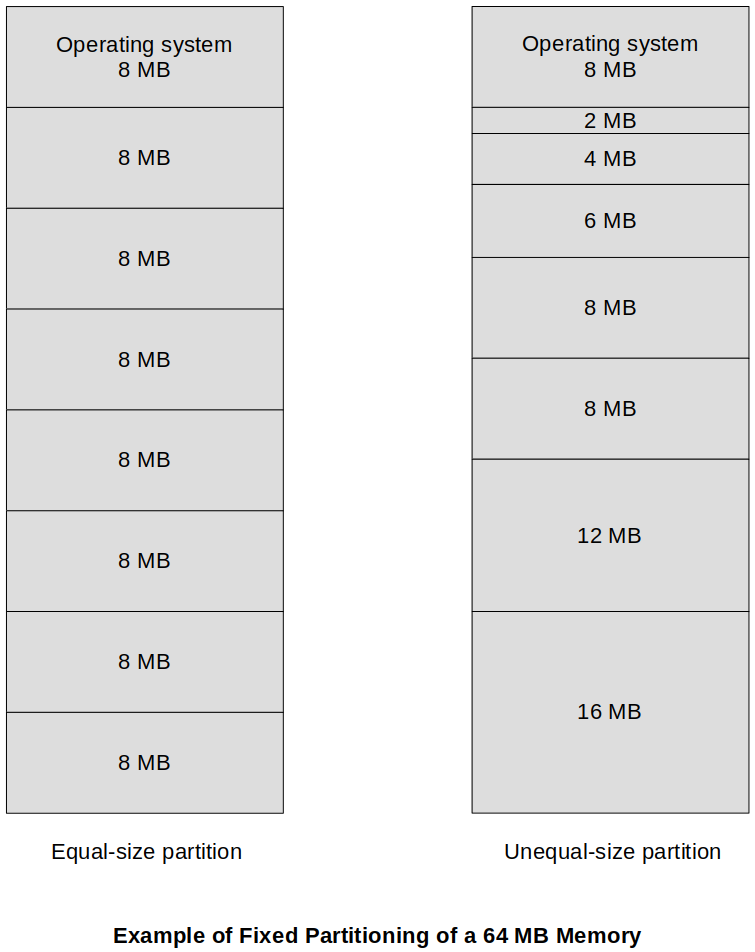
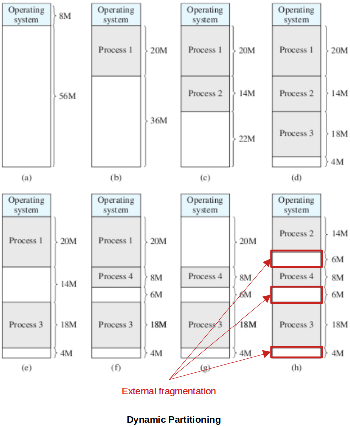
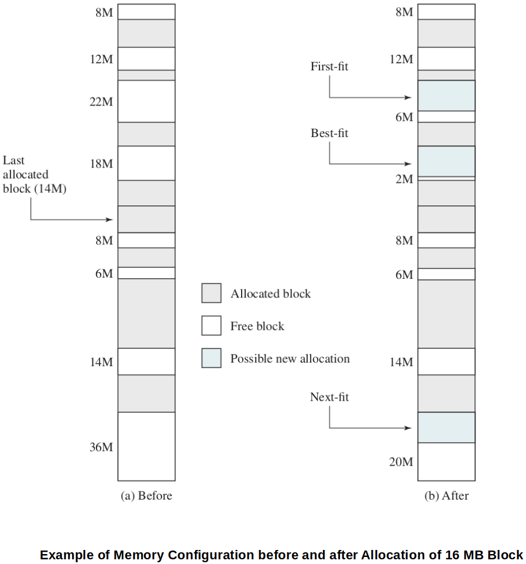
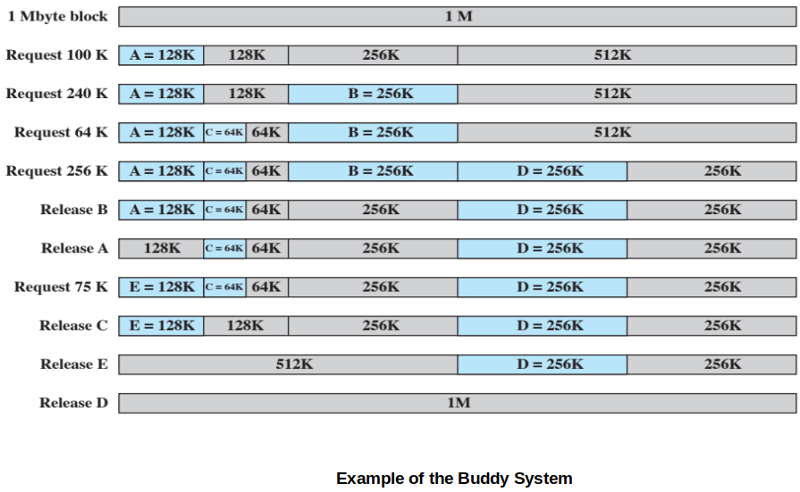
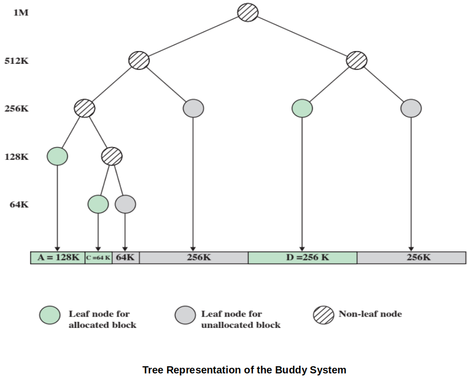
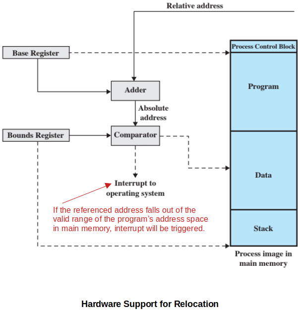

[Home](../../) | [Projects](../../projects) | [Notes](../) > <a href="./">Operating Systems</a> > Memory Partitioning

# Memory Partitioning

## Introduction

* The principal operation of memory management is to bring processes into main memory for execution by the processor.

* In modern multiprogramming systems, this involves **virtual memory** which is based on the use of one or both of two basic techniques:
  * Segmentation
  * Paging

* Before discussing the virtual memory (a sophisticated scheme), let's first look at the early version of memory management techniques; **partitioning**. 
  * Partitioning is an early OS memory management technique and it does not involve virtual memory. (Modern OS use virtual memory based on segmentation and paging.)

* A partition is a section of memory a process is loaded into. A process must be fully loaded into memory to run.

## Fixed Partitioning

* In a fixed partitioning, main memory is divided into:
  * The OS occupying some **fixed space**
  * The rest partitioned into regions with **fixed boundaries**
    * Equal-size partitions
    * Unequal-size partitions

* The use of unequal-size partitions provides a degree of flexibility to fixed partitioning.
* Advantage of using fixed partitioning:
  * Relatively simple and require minimal OS software and processing overhead.
* Disadvantages of using fixed partitioning:
  * The number of partitions specified at system generation time limits the number of active (not suspended) processes.
  * Because partition sizes are preset a t system generation time, small jobs will not utilize partition space efficiently.
* Fixed partitioning is no longer used in today's systems.

### Equal-Size Partitions

* Any process whose size is less than or equal to the partition size can be loaded into any available partition.
* If all partitions are full, and no process is in the Ready or Running state, the OS can swap a process out of any of the partitions and load in another process. (Some work for the processor!)
* Disadvantages of using equal-size fixed partitions:
  * A program may be too big to fit in a partition
    * In this case, the programmer must design the program with the use of overlays.
  * Memory utilization is extremely inefficient.
    * Any program, regardless of size, occupies an entire partition
    * **Internal fragmentation** - Wasted space due to the block of data loaded being smaller than the partition. (Not allocatable to another process)
* Very primitive idea and has lots of limitations.

### Unequal-Size Partitions

* Each process is loaded into the smallest partition available within which it will fit.
* Two possible ways to assign processes to partitions are:
  * One process queue per partition
  * Single queue for all partitions
* Advantages of using unequal-size fixed partitions:
  * Minimum wasted memory within a partition (internal fragmentation).

* Disadvantages of using unequal-size fixed partitions:
  * May be optimum from each partition's perspective (i.e., minimum internal fragmentation), but not as optimum from the system's perspective.
    * e.g., If there are only small sized processes to be run, they will line up in the queue of the corresponding size partition while wasting the larger partitions.
  * Memory utilization is still inefficient.
    * **Internal fragmentation** - Wasted space due to the block of data loaded being smaller than the partition. (Not allocatable to another process)
  

## Dynamic Partitioning

* Dynamic partitioning was developed to overcome the limitations of the fixed partitioning techniques.
* Partitions are of variable length and number.
* Process, when loaded into memory, is allocated exactly as much memory as it requires.
* This techniques was used by IBM's mainframe operating system, OS/MVT.
* It starts out well, but eventually it leads to high degree of **external fragmentation** (i.e., many small holes in memory) which degrades memory utilization.

* To overcome external fragmentation, **compaction** technique is used:
  * Every once in a while, the OS shifts the processes so they are contiguous and all of the free memory is together in one block. 
  * Time-consuming and wastes CPU time.

### Placement Algorithms

Since memory compaction is time-consuming, efficient process placement into memory is crucial.

* **Best-fit**

  * Chooses the block that is closest in size to the request.

  * In general, the WORST performer because, although each memory request always wastes the smallest amount of memory, the result is that main memory is quickly littered by blocks too small to satisfy memory allocation requests. 

    $\to$ Compaction must be done more frequently than with the other algorithms.

* **First-fit**

  * Begins to scan memory from the beginning and chooses the first available block that is large enough.
  * In general, the simplest, the best and the fastest.
  * May litter the front end with small free partitions that need to be searched over on each subsequent first-fit pass.

* **Next-fit**

  * Begins to scan memory from the location of the last placement and chooses the next available block that is large enough.

  * The largest block of free memory, which usually appears at the end of the memory space, is quickly broken up into small fragments. 

    $\to$ Compaction may be required more frequently.

## Buddy System

* Both fixed and dynamic partitioning schemes have drawbacks.

  * A fixed partitioning scheme limits the number of active processes and may use space inefficiently if there is a poor match between available partition sizes and process sizes.
  * A dynamic partition scheme is more complex to maintain and includes the overhead of compaction.

* The **buddy system** compromises these two schemes.

  * Easy to decompose and easy to recompose back together!

* In a buddy system, memory blocks are available of size $2^K$ words, $L \le K \le U$, where

  $2^L$ = smallest size block that is allocated

  $2^U$ = largest size block that is allocated; generally $2^U$ is the size of the entire memory available for allocation

* The following examples visualizes how buddy system works. For step-by-step explanation, see p.323 of the text.

## Relocation

* In the case of equal-size partitions and in the case of a single process queue for unequal-size partitions, a process may occupy different partitions during the course of its life. (In the case of using a process queue for each partition, a process will always be assigned to the same partition.)

  * When a process image is first created, it is loaded into some partition in main memory; later, the process may be swapped out.
  * When it is subsequently swapped back in, it may be assigned to a different partition than the last time.

  Also, when memory compaction is used, processes are shifted while they are in main memory.

  * Thus, the locations referenced by a process are not fixed.
  * They will change each time a process is swapped in or shifted.

* To handle this relocation problem, a distinction is made among several types of addresses.

  * **Logical address**
    * A reference to a memory location independent of the current assignment of data to memory.
    * A translation must be made to a physical address before the memory access can be achieved.
  * **Relative address**
    * A particular example of a logical address, in which the address is expressed as a location relative (offset) to some known point, usually a value in a processor register.
  * **Physical (or absolute) address**
    * An actual location in main memory.

* Typically, all of the memory references in the loaded process are relative to the origin of the program. Thus, a hardware mechanism that translates relative address to physical main memory address is needed at the time of execution of the instruction that contains the reference.
  * Base register - contains the starting address of a program in main memory.
  * Bounds register - contains the ending address of the program in main memory.

* This scheme allows programs to be swapped in/out of memory at run-time. 
* It also provides a measure of protection - each process image is isolated by the contents of the base and bounds registers, and is safe from unwanted accesses by other processes.

## References

Stallings, W. (2018). *Operating Systems: Internals and Design Principles* (9th ed.). Pearson Education, Inc.
