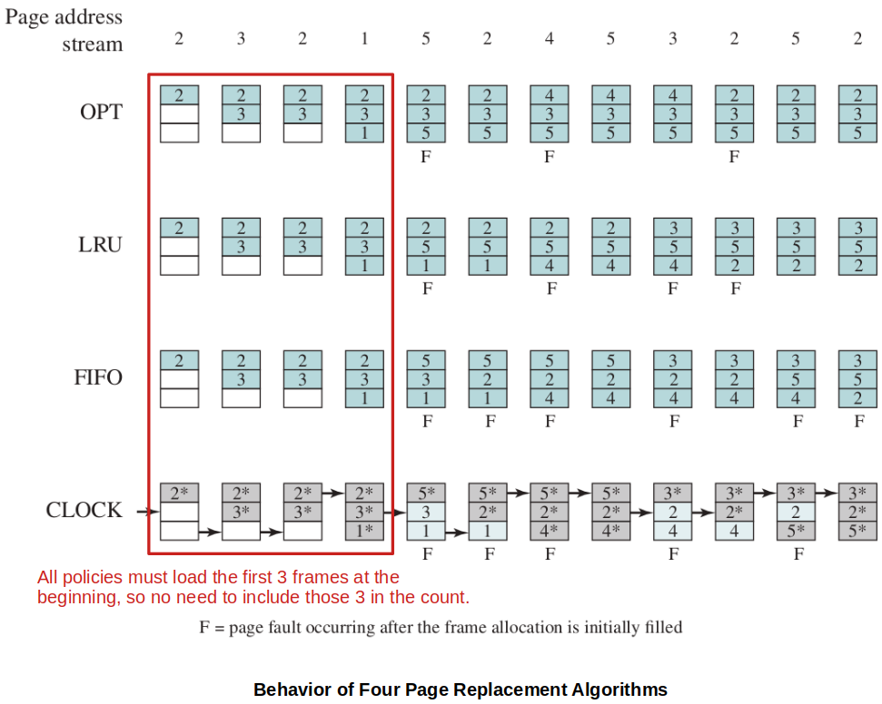
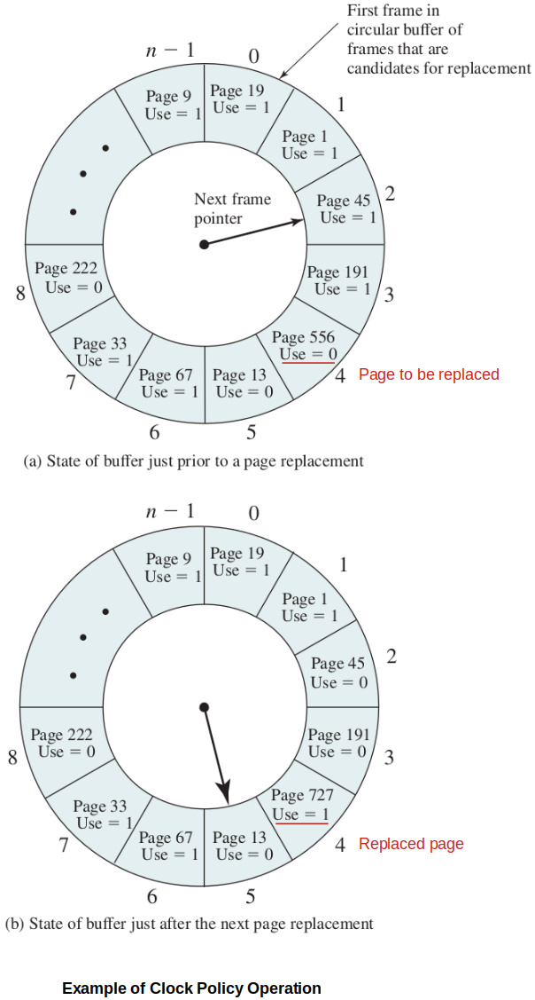

[Home](../../) | [Projects](../../projects) | [Notes](../) > <a href="./">Operating Systems</a> > Operating System Policies for Virtual Memory

# Operating System Policies for Virtual Memory

## Operating System Policies for Virtual Memory Overview

* **Fetch policy**
  * Demand paging
  * Prepaging
* **Placement Policy**
* **Replacement Policy**
  * Basic algorithms:
    * Optimal, Least recently use (LRU), First-in-first-out (FIFO), Clock
  * Page buffering
* **Resident Set Management**
  * Resident set size
    * Fixed
    * Variable
  * Replacement scope
    * Global
    * Local
* **Cleaning Policy**
  * Demand
  * Precleaning
* **Load Control**
  * Degree of multiprogramming

## Fetch Policy

* Determines **when** a page should be brought into main memory.

### Demand Paging

* A page is brought in only when a reference is made to a location in that page.
* When a process first starts, there will be a flurry of page faults.
* Over time the page faults should dissipate.

### Prepaging

* Pages other than the one demanded are also brought in. 
* Tries to minimize disk seeks by bringing in nearby pages, often very useful when a process starts up. (The OS makes an educated guess as to what other pages may need to be brought in with the one on demand.)
* Uses **principle of locality** to bring in nearby pages, but may be wasteful if those pages are never needed.

## Placement Policy

* Determines **where** in real memory a process piece is to reside.

* In a **pure segmentation system**, the placement policy is an important design inssue; policies such as best-fit, first-fit, and so on are possible alternatives. 
* However, for a system that uses either **pure paging** or **paging combined with segmentation**, placement is usually irrelevant because the address translation hardware and the main memory access hardware can perform their functions for any page-frame combination with equal efficiency.

## Replacement Policies

* When all of the frames in main memory are occupied and it is necessary to bring in a new page to satisfy a page fault, the replacement policy **determines which page currently in memory is to be replaced**. (When a process has reached its allocated frame size, the operating system must decide which frame must be chosen to use for the new incoming page.  These policies attempt to make the best choice that will hopefully minimize page faults; minimize thrashing.)
* Most of the replacement policies try to predict future behavior based on past behavior. Because of the **principle of locality**, there is often a high correlation between recent refrencing history and near-future referencing patterns.
* Trade-off that must be considered - The more elaborate and sophisticated the replacement policy, the greater will be the hardware and software overhead to implement it.
* Frame locking - Some of the important frames in main memory may be locked.
  * Kernel of the OS, key control structures are held in locked frames.
  * I/O buffers and other time-critical areas may be locked into main memory frames.

### Basic Replacement Algorithms

* The following examples assume a fixed frame allocation (fixed resident set size) for this process of three frames. The execution of the process requires reference to five distinct pages.

  

  

  

  [!] Note: For the CLOCK algorithm, `*` indicates that the corresponding `use bit` is set, and the arrow indicates the current position of the `next frame pointer`.

#### Optimal

* Selects for replacement the page for which the next time to reference it is the longest (farthest out).
* This approach will result in the **fewest possible page faults**. (Optimal!)
* Impossible to implement in practice, because it would require the OS to have perfect knowledge of future events.
* However, it does serve as a standard against which to judge-real-world algorithm. (Baseline for benchmarking other policies)

#### Least Recently Used (LRU)

* Replaces the page in memory that has not been referenced for the longest time. (By the principle of locality, this should be the page least likely to be referenced in the near future.)
* Performs fairly well in practice ($\approx$ Optimal policy)
* Difficult to implement, and overhead is tremendous.
  * e.g., Tag each page with the time of its last reference (i.e., **timestamp**); this would have to be done at each memory reference, both instruction and data. Also, how do you sort the timestamps for a large frame set?

#### First-In-First-Out (FIFO)

* Replaces the page that has been in memory the longest; a page fetched into memory a long time ago may have now fallen out of use.
* Treats the page frames allocated to a process as a circular buffer, and pages are removed in round-robin style.
* One of the simplest page replacement policies to implement and very little overhead. (All that is required is a pointer that circles through the page frames of the process.)
* **Performs poorly in practice** because the assumption is not always true. There will often be regions of program or data, which are located at the beginning of the resident set, that are heavily used throughout the life of a program. Those pages will be repeatedly paged in an out by the FIFO algorithm.

#### Clock

* Many of the algorithms to **approximates the performance of LRU with much less overhead** are variants of a scheme referred to as the **clock policy**.
  * No sorting, and uses bit instead of timestamp.

* The simplest form of clock policy:
  * Associates an additional bit (i.e., **use bit**) with each frame.
  * Use bit is set when a page is loaded into a frame or when that page is accessed.
  * The set of pages of a process is seen as a circular buffer.
  * When it is time to replace a page, scan the buffer to find a frame with the use bit set to 0. As it passes frames with use bit set to 1, flip them to 0 along the way so that eventually the algorithm finds a frame to free.
  * Scanning begins at where the "Next frame pointer" left off.
* Shown to perform fairly well.

* **Modified Clock**

  The clock algorithm can be made more powerful by increasing the number of bits that it employs. In all processors that support paging, a **modify bit** is associated with every page in main memory, and hence with every frame of main memory. This bit is needed so that when a page has been modified, it is not replace until it has been written back into second memory.

  Each frame falls into one of the following 4 categories:

  * Not accessed recently, not modified (u = 0, m = 0) $\to$ Best candidate to replace!
  * Accessed recently, not modified (u = 1, m = 0)
  * Not accessed recently, modified (u = 0, m = 1)
  * Accessed recently, modified (u = 1, m = 1)

  With this classification, the modified clock algorithm performs as follows:

  1. Beginning at the current position of the pointer, scan the frame buffer. During this scan, make no changes to the use bit. The first frame encountered with (u = 0, m = 0) is selected for replacement.
  2. If (1) fails, scan again, looking for the frame with (u = 0, m = 1). The first such frame encountered is selected for replacement. During this scan, set the use bit to 0 on each frame that is bypassed.
  3. If (2) fails, the pointer should have returned to its original position and all of the frames in the set will have a use bit of 0. Repeat (1) and, if necessary, (2). This time, a frame will be found for the replacement.

  Modified clock algorithm performs well, but more overhead than simple clock because it may have to make multiple passes through the resident set. But it can avoid writing out modified pages unnecessarily.

### Page Buffering (Frame Buffering)

* FIFO associated with I/O buffers (lists) to improve overall performance. (Pure FIFO suffers much less from overhead but has poorer performance than LRU and the Clock policies.)

* The OS maintains two lists:

  * Free page list - Where the replaced page which has not been modified is assigned.

  * Modified page list - Where the replaced page which has been modified is assigned. 

    Modified pages are written out in clusters rather than one at a time. This significantly reduces the number of I/O operations and therefore the amount of disk access time.

* The page is not physically moved about in main memory; instead, the entry in the page table for this page is removed and placed in either of these lists.

* The important aspect of these maneuvers is that the page to be replaced remains in memory. Thus if the process references that page, it is simply returned to the resident set of that process at little cost.

* In effect, the free and modified page lists act as a cache of pages.

## Resident Set Management

* The **resident set** is the portion (i.e., set of pages) of a process that is currently in main memory.
* The question is how large should the resident set be?
  * Too small = Thrashing $\uparrow$
  * Too large = Inefficient allocation of memory

### Resident Set Size

* The OS must decide how many pages to bring in, that is, how much main memory to allocate to a particular process. The following factors come into play:

  * Smaller amount of memory allocated to a process 

    $\to$ More processes can reside in main memory 

    $\to$ Increases the probability that the OS will find at least one ready process at any given time 

    $\to$ Reduces the time lost due to swapping

  * Relatively small number of pages of a process in main memory

    $\to$ (Despite the principle of locality), the rate of page faults will be rather high

  * Beyond a certain size, additional allocation of main memory to a particular process will have no noticeable effect on the page fault rate for that process because of the principle of locality.

* With these factors in mind, two sorts of policies are to be found in contemporary operating systems.

  * **Fixed allocation**
    * The OS dedicates a fixed number of frames to a process.
    * That number is decided at initial load time (process creation time).
    * Whenever a page fault occurs in the execution of a process, one of the pages of that process must be replaced by the needed page.
  * **Variable allocation**
    * The OS can change the number of frames allocated to a process to match the current needs of the process over its lifetime.
    * A process suffering from high levels of page faults will be given additional page frames to reduce the page fault rate.
    * A process suffering less from page faults will be given a reduced allocation.

  | Local Replacement                                            | Global Replacement                                           |
  | ------------------------------------------------------------ | ------------------------------------------------------------ |
  | $\cdot$ Number of frames allocated to a process is fixed. $\cdot$ Page to be replaced is chosen from among the frames allocated to that process. | $\cdot$ Not possible.                                        |
  | $\cdot$ The number of frames allocated to a process may be changed from time to time to maintain the working set of the process. $\cdot$ Page to be replaced is chosen from among the frames allocated to that process. | $\cdot$ Page to be replaced is chosen from all available frames in main memory; this causes the size of the resident set of processes to vary. |

### Working Set Strategy

* One strategy to determine resident set size and the timing of changes.
* **Working set** is a concept that represents the subset of pages that are actually needed in memory for the process to be efficient.
* There is much research in how to monitor the page request to determine the best working set, and adjust the resident set size accordingly as it changes over time. (Resident set size and working set size can grow and shrink as necessary.)

## Cleaning Policy

* Opposite of the fetch policies.
* Anytime we can do the hybrid of the following two policies.

### Demand Cleaning

* A page is written out to secondary memory (swap space) ONLY when it has been selected for replacement AND its `modified bit` is set.

### Precleaning

* Periodically write out modified frames as the system operates. (Writes modified pages before their page frames are needed so pages can be written out in batches.)
* Keeps clearing `modified bit`.

[!] Note: **Page buffering** applies here. A technique where the page to be swapped out is temporarily moved to a pending list that the OS maintains in main memory (subsequently, a free-frame will brought into memory to fill that spot). Then that frame can be quickly relinked into the resident set if it is referenced again, without writing out/reading back in from the swap space (secondary memory). Pages that are no longer to be referenced will eventually be rolled out of the list, but still this technique helps reduce disk I/O to a degree.

## Load Control

* The idea is that our OS should maximize multiprogramming while minimizing page faults. These are competing criteria.

* Critical in effective memory management (i.e., maximizing multiprogramming while minimizing page faults).

  * If too few processes are resident in main memory, then there will be many occasions when all processes are blocked, and much time will be spent in swapping.
  * If too many processes are resident, then, on average, the size of the resident set of each process will be inadequate and frequent faulting will occur. $\to$ **Thrashing**!

* To reduce thrashing, the degree of multiprogramming is to be reduced, which means one or more of the currently resident processes must be suspended (swapped out).

  How does the Os choose?

  * Lowest-priority process
  * Highest faulting process
  * Last process activated (newest activated)
  * Process with the smallest resident set
  * Process with the largest remaining execution window

  Which policy to choose is a matter of judgment and depends on many other design factors in the OS, as well as the characteristics of the programs being executed.

## Do Programmers Need to Understand Memory Management to Write Good Code?

Yes! 

If our code has a high rate of data accesses, it could benefit from understanding page sizes and memory organization of our programs/languages.

e.g., Row-major vs. Column-major storage (Programming language level)

## References

Stallings, W. (2018). *Operating Systems: Internals and Design Principles* (9th ed.). Pearson Education, Inc.

