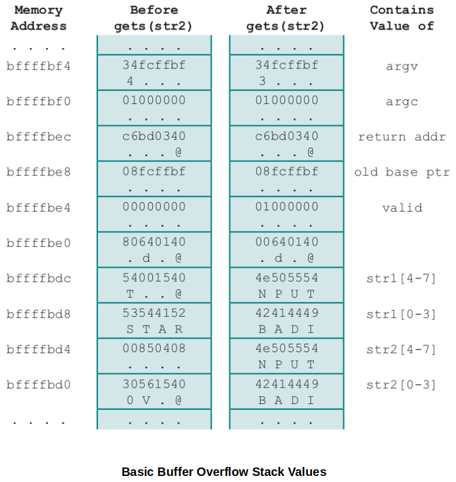

[Home](../../) | [Projects](../../projects) | [Notes](../) >  <a href="./">Operating Systems</a> > Operating System Security

# Operating System Security


## System Access Threats

### Intruders

An intruder is a human being (or a legitimate user) somehow gained access to the system through the operating system with privileged access level that they shouldn't have.

* **Masquerader**

  An individual who is not authorized to use the computer and who penetrates a system's access controls to exploit a legitimate user's account. (Someone who's spoofing a legitimate user.)

  Authentication, which may or may not be part of an OS, can be used as a countermeasure. (e.g., Two-factor authentication, security questions, biometrics data, etc.)

* **Misfeasor**

  A legitimate user who accesses data, programs, or resources for which such access is not authorized, or who is authorized for such access but misuses his or her privileges. (A legitimate user who has authority to access some data but using it for the wrong purposes.)

  The OS cannot detect this type of intruders but it can use various level of permissions and access controls to prevent them doing the wrong thing.

* **Clandestine user**

  An individual who has managed to get into your system not as a legitimate user (without logging in). They may have piggybacked on a process that's logged in any running a software on behalf of another user and found a way to inject some code into the process that lets them do what they want to do.
  
  Seizes supervisory control of the system and uses this control to evade auditing and access controls or to suppress audit collection.

### Malicious Software

* Programs that exploit vulnerabilities in computing systems
* Also referred to as **malware**
* Can be divided into two categories:
  * Parasitic
    * Fragments of programs that cannot exist independently of some actual application program, utility, or system program.
    * e.g., Viruses, logic bombs, and backdoors
  * Independent
    * Self-contained programs that can be scheduled and run by the operating system
    * e.g., Worms and bot programs


## Countermeasures

### Intrusion Detection System (IDS)

* Not much an OS can do.

* FRC 4949 (Internet Security Glossary) defines intrusion detection as a security service that monitors and analyzes system events for the purpose of finding, and providing real-time or near real-time warning of, attempts to access system resources in an unauthorized manner. 

* Intrusion detection systems (IDSs) can be classified as:

  * **Host-based IDS**

    Monitors the characteristics of a single host and the events occurring within that host for suspicious activity. 

    This is basically a way of trying to detect malware that shouldn't be there, and it typically involves *anti-virus software* (monitor for unknown/unauthorized software).

  * **Network-based IDS**

    Monitors network traffic for particular network segments or devices and analyzes network, transport, and application protocols to identify suspicious activity.
    
    e.g., Program to detect and prevent the DDos attack at the entry point of the system to the network.

* IDS Components

  * Sensors
    * Responsible for collecting data
    * The input for a sensor may be any part of a system that could contain evidence of an intrusion.
    * Types of input to a sensor include network packets, log files, and system call traces.
  * Analyzers
    * Receive input from one or more sensors or form other analyzer.
    * Responsible for determining if an intrusion has occurred.
    * May provide guidance about what actions to take as a result of the intrusion.
  * User interface
    * Enables a user to view output from the system or control the behavior of the system
    * May equate to a manager, director, or console component.

### Authentication

* OS can do! (First pass)

* In most computer security contexts, user authentication is the fundamental building block and the primary line of defense. (First line of defense an OS can use.)

* RFC 4949 defines user authentication as the process of verifying an identity claimed by or for a system entity.

* An authentication process consists of two steps (Two-factor authentication):

  * Identification step - Presenting an identifier to the security system
  * Verification step - Presenting or generating authentication information that corroborates the binding between the entity and the identifier

  e.g., Google account 2-factor authentication, Common Access Card (CAC) requiring password after inserting the card in to a machine.

* Means of authentication

  * Something the individual **knows**

    e.g., A password, a personal identification number (PIN), or answers to a prearranged set of questions

  * Something the individual **possesses** (Referred to as "token")

    e.g., Electronic keycards, smart cards, and physical keys

  * Something the individual **is** (static biometrics)

    e.g., Recognition by fingerprint, retina, and face

  * Something the individual **does** (dynamic biometrics)

    e.g., Recognition by voice pattern, handwriting characteristics, and typing rhythm

### Access Control

* OS can do! (Second pass)

* Implements a security policy that specifies who or what may have access to each specific system resource and the type of access that is permitted in each instance.
* Mediates between a user and system resources, such as applications, operating systems, firewalls, routers, files, and databases.
* A security administrator maintains an authorization database that specifies what type of access to which resources is allowed for this user.
  * The access control function consults this database to determine whether to grant access.
* An auditing function monitors and keeps a record of user accesses to system resources.
* Can be done based on user-by-user, group-by-group, or entity(individual files)-by-entity.

### Firewalls

* Design goals:
  1. All traffic from inside to outside, and vice versa, must pass through the firewall. This is achieved by physically blocking all access to the local network except via the firewall.
  2. **Only authorized traffic**, as defined by the local security policy, will be allowed to pass. Various types of firewalls are used, which implement various types of security policies.
  3. The firewall itself is immune to penetration. This implies the use of hardened system with a secured operating system. Trusted computer systems are suitable for hosting a firewall and often required in government applications.


## How Do We Get an Access to Running Software to Change it?

### Cross-Site Scripting (Intentional Attack)

* Cross-Site Scripting (XSS) attacks are a type of injection, in which malicious scripts are injected into otherwise benign and trusted websites. 
* XSS attacks occur when an attacker uses a web application to send malicious code, generally in the form of a browser side script, to a different end user.
* Basically, I'm or was logged in as a legitimate user, but some link I clicked redirected me to part of the system where I didn't mean to intentionally enter into.
* Someone's looking over your shoulder!

### Buffer Overflow Attacks (Intentional Attack)

* Also known as a **buffer overrun**

* Defined in the NIST (National Institute of Standards and Technology) *Glossary of Key Information Security Terms* as:

  > "A condition at an interface under which more input can be placed into a buffer or data-holding area than the capacity allocated, overwriting other information. Attackers exploit such a condition to crash a system or to insert specially crafted code that allows them to gain control of the system."

* One of the most prevalent and dangerous types of security attacks.

* Example

  Basic buffer overflow C code:

  ```c
  int main(int argc, char *argv[])
  {
      int valid = FALSE;
      char str1[8];
      char str2[8];
      next_tag(str1);
      gets(str2);
      if (strncmp(str1, str2, 8) == 0)
          valid = TRUE;
      printf("buffer1: str1(%s), str2(%s), valid(%d) \n", str1, str2, valid);
  }
  ```

  Basic buffer overflow example runs:

  ```plain
  $ cc -g -o buffer1 buffer1.c
  $ ./buffer1
  START
  buffer1: str1(START), str2(START), valid(1)
  $ ./buffer1
  EVILINPUTVALUE
  buffer1: str1(TVALUE), str2(EVILINPUTVALUE), valid(0)
  $ ./buffer1
  BADINPUTBADINPUT
  buffer1: str1(BADINPUT), str2(BADINPUTBADINPUT), valid(1)
  ```





* To exploit any type of buffer overflow the attacker needs:
  * To identify a buffer overflow vulnerability in some program that can be triggered using externally sourced data under the attackers control.
  * To understand how that buffer will be stored in the processes' memory, and hence the potential for corrupting adjacent memory locations and potentially altering the flow of execution of the program.


## What Can Programming Languages Do to Prevent These Attacks?

### Compile-Time Defense

Aims to harden programs to resist attacks.

* Choice of programming language
  * One possibility is to write the program using a modern high-level programming language that has a **strong notion of variable type** and what constitutes **permissible operations** on them.
  * The flexibility and safety provided by these languages does come at a cost in resource use, both at compile-time and also in additional code that must execute at run-time.
* Safe coding techniques
  * Programmers need to inspect the code and rewrite any unsafe coding constructs.
  * An example is OpenBSD project which produces a free, multiplatform 4.4 BSD_based UNIX-like operating system.
  * Among other technology changes, programmers have undertaken an extensive audit of the existing code base, including the operating system, standard libraries, and common utilities.
* Language extensions and use of safe libraries
  * There have been a number of proposals to augment compilers to automatically insert range checks on pointer references.
  * Libsafe is an example that implements the standard semantics but includes additional checks to ensure that the copy operations do not extend beyond the local variable space in the stack frame.
* Stack protection mechanisms
  * An effective method for protecting programs against classic stack overflow attacks is to instrument the function entry and exit code to set up and then check its stack frame for any evidence of corruption.
  * Stackguard, one of the best-known protection mechanisms, is a GNU Compiler Collection (GCC) compiler extension that inserts additional function entry and exit code.
* Otherwise, be a good programmer yourself! Be mindful of how memory is used.

### Run-Time Defense

Aims to detect and abort attacks in executing programs.

* Executable address space protection (Address space enforcement)
  * A possible defense is to block the execution of code on the stack, on the assumption that executable code should only be found elsewhere in the processes address space.
  * Extensions have been made available to Linux, BSD, and other UNIX-style systems to support the addition of the no-execute bit.
* Guard pages
  * Gaps (pages that will never be used) are placed between the ranges of addresses used for each of the components of the address space.
  * These gaps, or guard pages, are flagged in the MMU as illegal addresses and any attempt to access them results in the process being aborted.
  * A further extension places guard pages between stack frames or between different allocations on the heap.
  * This will increase the size of the process image, but less costly than other two.
* Address space randomization
  * At every run-time, the address of the process image is changed. (OS need to be able to support this!)
  * A run-time technique that can be used to thwart attacks involves manipulation of the location of key data structures in the address space of a process.
  * Moving the stack memory region around by a megabyte or so has minimal impact on most programs but makes predicting the targeted buffer's address almost impossible.
  * Another technique is to use security extension that randomizes the order of loading standard libraries by a program and their virtual memory address locations.


## Access Control

### File System Access Control

* Identifies a user to the system
* Associated with each user there can be a profile that specifies permissible operations and file accesses.
* The operating system can then enforce rules based on the user profile.
* The database management system, however, must control access to specific records or even portions of records.
* The database management system decision for access depends not only on the user's identity but also on the specific parts of the data being accessed and even on the information already divulged to the user.


## Operating Systems Hardening

These are administrator's responsibility, not the OS's!

* Basic steps to use to secure an operating system:
  * Install and patch the operating system
  * Harden and configure the operating system to adequately address the identified security needs of the system by:
    * Removing unnecessary services, applications, and protocols
    * Configuring users, groups and permissions
    * Configuring resource controls
  * Install and configure additional security controls, such as antivirus, host-based firewalls, and intrusion detection systems (IDS), if needed.
  * Test the security of the basic operating system to ensure that the steps taken adequately address its security needs.

### Operating System Installation: Initial Setup & Patching

* System security begins with the installation of the operating system.
* Ideally new systems should be constructed on a protected network.
* The initial installation should comprise the minimum necessary for the desired system, with additional software packages included only if they are required for the function of the system.
* The overall boot process must also be secured.
* Care is also required with the selection and installation of any additional device driver code, since this executes with full kernel level privileges, but is often supplied by a third party.

### Remove Unnecessary Services, Applications, and Protocols

* The system planning process should identify what is actually required for a given system so that a suitable level of functionality is provided, while eliminating software that is not required to improve security.
* When performing the initial installation the supplied defaults should not be used, but rather the installation should be customized so that only the required packages are installed.
* Many of the security-hardening guides provide lists of services, applications, and protocols that should not be installed if not required.
* Strong preference is stated for not installing unwanted software, rather than installing and then later removing or disabling it as many uninstall scripts fail to completely remove all components of a package.
  * Should an attacker succeed in gaining some access to a system, disabled software could be re-enabled and used to further compromise a system.
  * It is better for security if unwanted software is not installed, and thus not available for use at all.

### Install Additional Security Controls

* Further security improvement may be possible by installing and configuring additional security tools such as antivirus software, host-based firewall, IDS or IPS software, or application white-listing.
* Some of these may be supplied as part of the operating systems installation, but not configured and enabled by default.
* Given the wide-spread prevalence of malware, appropriate antivirus is a critical security component.
* IDS and IPS software may include additional mechanisms such as traffic monitoring or file integrity checking to identify and even respond to some types of attack.
* White-listing applications limits the programs that can execute in the system to just those in an explicit list.

### Backup / Continuous Off-site Operating Protocol (COOP)? Strategy

* Backup your system in such a way that in one day you can setup and continue working on from where you left off from another system.
* This is where the cloud computing helps a lot.


## References

Stallings, W. (2018). *Operating Systems: Internals and Design Principles* (9th ed.). Pearson Education, Inc.

