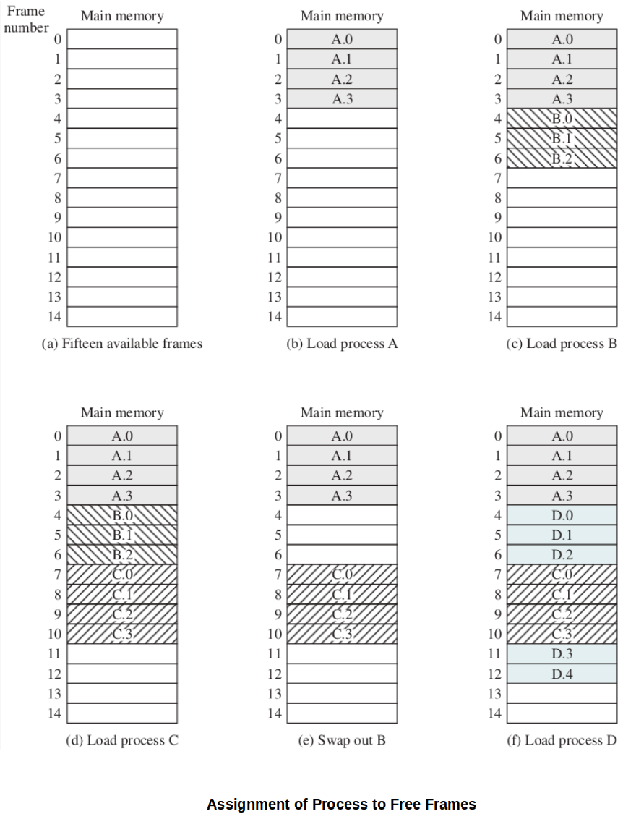

[Home](../../) | [Projects](../../projects) | [Notes](../) > <a href="./">Operating Systems</a> > Paging

# Paging

## Introduction

* Problems of the previously introduced memory management schemes:
  * **Fixed partitioning** - Inefficient memory utilization, internal fragmentation
  * **Dynamic partitioning** - Inefficient memory utilization, external fragmentation
  
  Both require a an <u>entire</u> process to be loaded into main memory and to take up <u>consecutive memory space</u> in main memory.
* To overcome these limitations, **paging** technique was developed. It still requires the entire process to be loaded into memory but each page need not be placed consecutively in memory.

## Paging

* In paging, 

  * Main memory is partitioned into **equal fixed-size** chunks (i.e., **frames**) that are relatively small.
    * This prevents external fragmentation. (Internal fragmentation may still exist.)

  * Process is also divided into small fixed-size chunks (i.e., **pages**) of the <u>same size</u>.

  Simple paging is similar to fixed partitioning but is different in that its partitions are rather small (a program may occupy more than one partition) and these partitions need NOT be contiguous.

  [!] Note: **Frame size = Page size**

* Even if there are not sufficient unused contiguous frames to hold a process, a process can still be loaded as shown in the example below. The concept of logical address and the **page table** maintained by the OS together implement this feature.

* Along with the page tables, the OS also maintains a list of all the unoccupied frames in main memory that are available for pages.
* Unlike segmentation, paging is **invisible** to the programmer.

### Address Translation & Page Tables

* When all of a process' pages are loaded into main memory, the **page table** for the process is created and loaded into main memory.

* Page tables are maintained by the OS **for each process** to keep track of which frame of main memory is used for which page of which process.

* A page table contains the frame location for each page in the process. (Each entry: Page#-to-Frame# mapping)

* Maximum size of a process dictates the maximum number of entries in a page table.

* With paging, logical-to-physical address translation is still done by processor hardware. So, the processor must know how to access the page table of the current process.

  * Logical address (page number, offset) $\to$ **Page table** $\to$ Physical address (frame number, offset)
  * The page table number indexes the (first-level) page table. 
  
  

## Paging vs. Virtual Memory Paging

* The simple paging scheme contributes to the realization of the virtual memory scheme later in the CS history.
* In the simple paging scheme, a process maximum size CANNOT be bigger than the size of RAM.
* In the virtual memory paging scheme, it extends the logical address space even beyond the size of physical RAM. So, a process size can be bigger than the size of RAM. 
  * A process can have more pages than the number of frames in physical memory.
  * The number of pages is limited by the address space size, not by the physical RAM size.

## References

Stallings, W. (2018). *Operating Systems: Internals and Design Principles* (9th ed.). Pearson Education, Inc.

