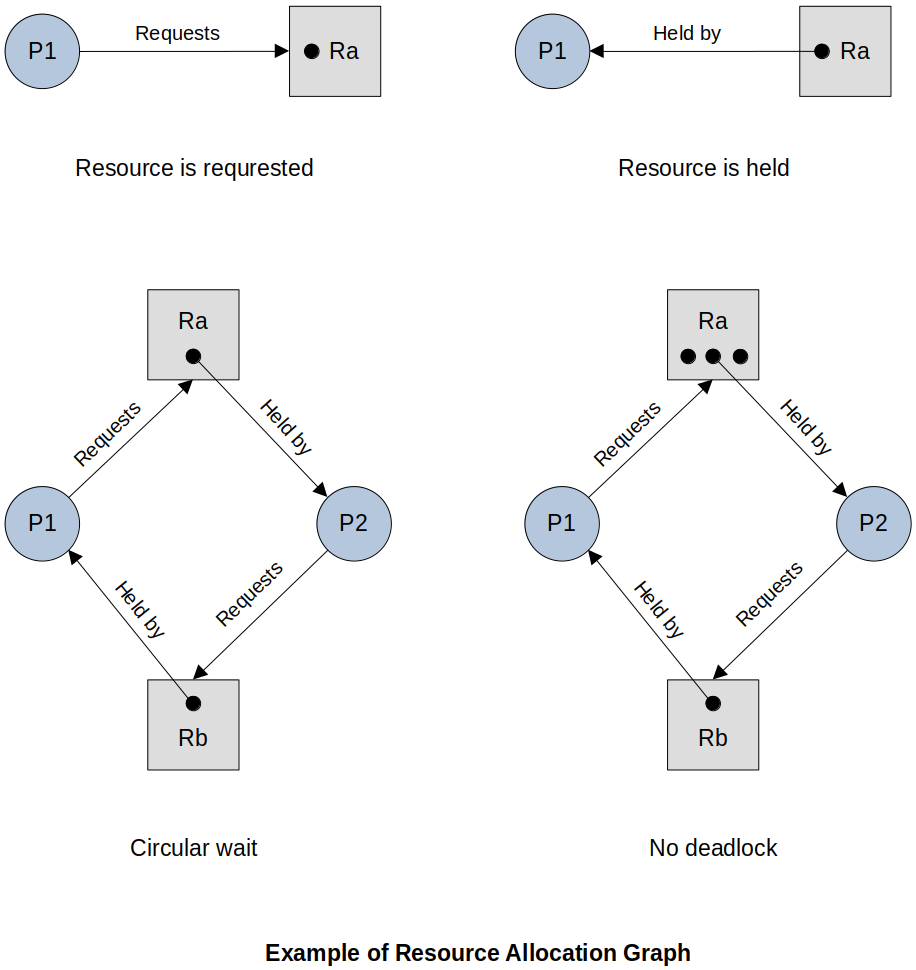

[Home](../../) | [Projects](../../projects) | [Notes](../) > <a href="./">Operating Systems</a> > Principles of Deadlock

# Principles of Deadlock


## Introduction

* **Deadlock** is the permanent blocking of a set of processes that compete for system resources or communicate with each other.
* A set of processes is deadlocked when each process in the set is blocked awaiting an event that can only be triggered by another blocked process in the set.
* In general, design error is the cause of the deadlock. Such errors may be quite subtle and difficult to detect.
* Permanent because none of the events is ever triggered
* No efficient solution in the general case (but we will look at three possible approaches)


## Resource Categories and Deadlock

### Reusable Resource

* Can be safely used by only one process at a time and is not depleted by that use

* Processes obtain resource units that they later release for reuse by other processes.

* e.g., Processors, I/O channels, main and secondary memory, devices, and data structures such as files, databases, and semaphores

* Examples of deadlock with a reusable resource

  * Deadlock with two process competing for reusable resources:

    ```plain
      Process P		Process Q
      ==========	==========
    1 request(A)	request(B)
    2 lock(A)		lock(B)
    3 request(B)	request(A)
    4 lock(B)		lock(A)
    5 ... 			...
    6 unlock(B)		unlock(A)
    7 unlock(A)		unlock(B)
    ```

    > Deadlock occurs if the multiprogramming system interleaves the execution of the two processes as follows: P0 P1 Q0 Q1 P2 Q2

  * Deadlock with main memory request:

    Suppose the space available for allocation is 200 Kbytes, and the following sequence of requests occurs:

    ```plain
    Process P1			Process P2
    =================	=================					
    ...					...
    request 80 Kbytes	request 70 Kbytes
    ...					...
    request 60 Kbytes	request 80 Kbytes
    ```

    > Deadlock occurs if both processes progress to their second request.
    >
    > If the amount of memory to be requested is not known ahead of time, it is difficult to deal with this type of deadlock by means of system design constraints.

### Consumable Resource

* One that can be created (produced) and destroyed (consumed)

* Typically, no limit on the number of consumable resources of a particular type.

* An unblocked producing process may create any number of consumable resources.

* When a resource is acquired by a consuming process, the resource ceases to exist.

* e.g., Interrupts, signals, messages, and information in I/O buffers

* Examples of deadlock with a consumable resource

  * Deadlock with message passing:

    Consider a pair of processes, in which each process attempts to receive a message from the other process then send a message to the other process:

    ```plain
    Process P1			Process P2
    =================	=================					
    ...					...
    receive(P2)			receive(P1)
    ...					...
    send(P2, M1)		send(P1, M2)
    ```

    > Deadlock occurs if the `receive()` is blocking (i.e., the receiving process is blocked until the )


## Necessary Conditions for Deadlock

* Three conditions of policy must be present for a deadlock to be **possible**:

  1. **Mutual exclusion**

     Only one process may use a resource at a time. No process may access a resource unit that has been allocated to another process.

  2. **Hold and wait**

     A process may hold allocated resources while awaiting assignment of other resources.

  3. **No preemption**

     No resource can be forcibly removed from a process holding it.

* The first three conditions are necessary, but not sufficient, for a deadlock to exist. For deadlock to actually take place, a fourth condition is required:

  4. **Circular wait**

     A closed chain of processes exists, such that each process holds at least one resource needed by the next process in the chain.

* Summary

  * Possibility of deadlock - mutual exclusion, hold and wait, no preemption
  * Existence of deadlock - mutual exclusion, hold and wait, no preemption, **circular wait**


## Three Approaches to Deal with Deadlock

* **Deadlock prevention**

  Disallow one of the three necessary conditions for deadlock occurrence, or prevent circular wait condition from happening.

* **Deadlock avoidance**

  Do not grant a resource request if this allocation might lead to deadlock.

* **Deadlock detection**

  Grant resource requests when possible, but periodically check for the presence of deadlock and take action to recover. (Do nothing to prevent or avoid deadlock, just hope for the best!)


## Resource Allocation Graph

* **Resource allocation graph** is a useful tool in characterizing the allocation of resources to processes.
* It is often used to visually analyze the possibility of deadlock in the system.





## References

Stallings, W. (2018). *Operating Systems: Internals and Design Principles* (9th ed.). Pearson Education, Inc.
