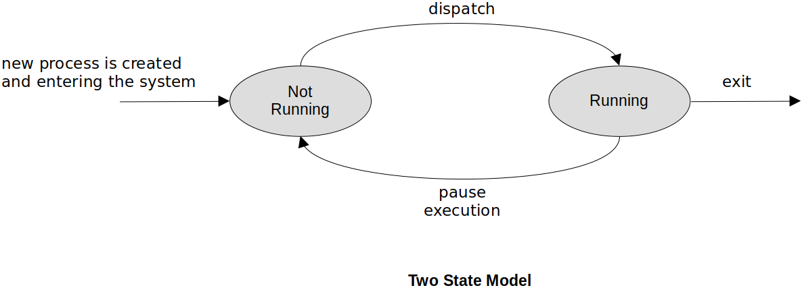
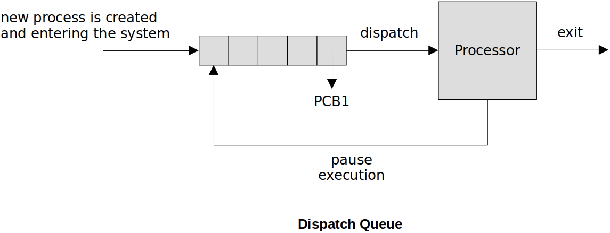
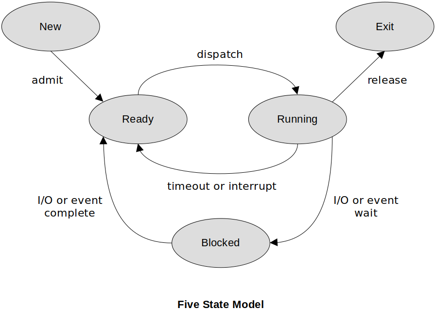
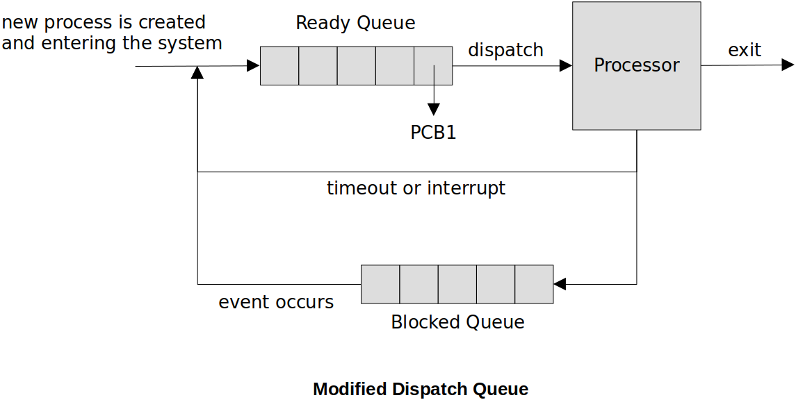
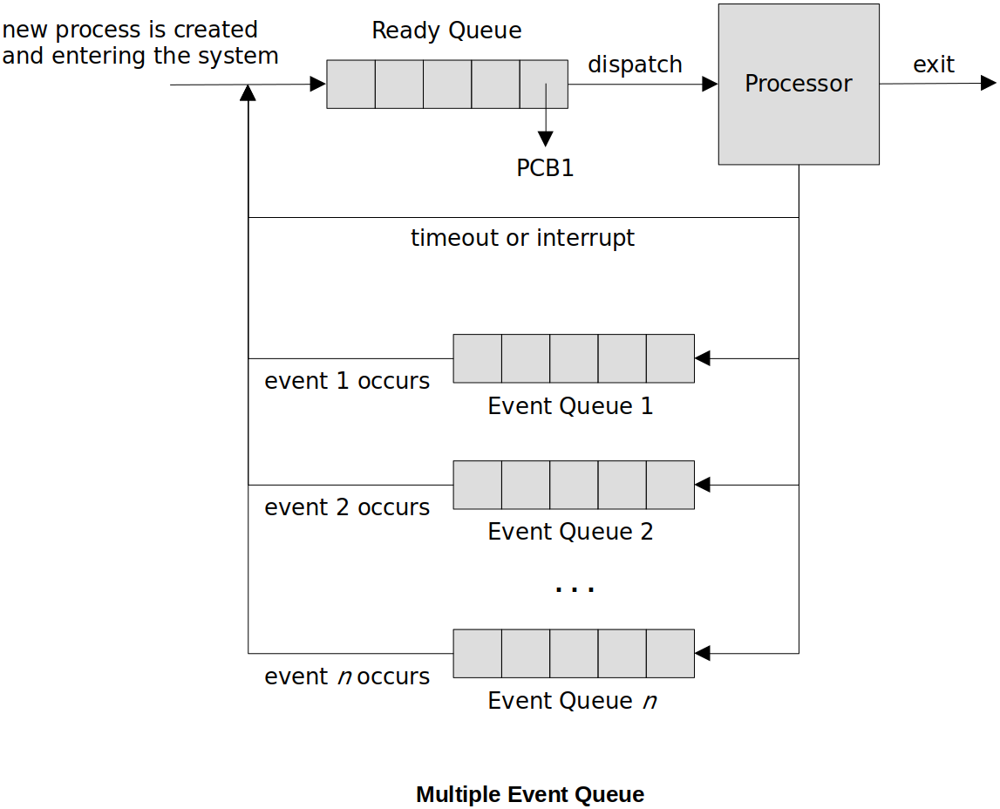
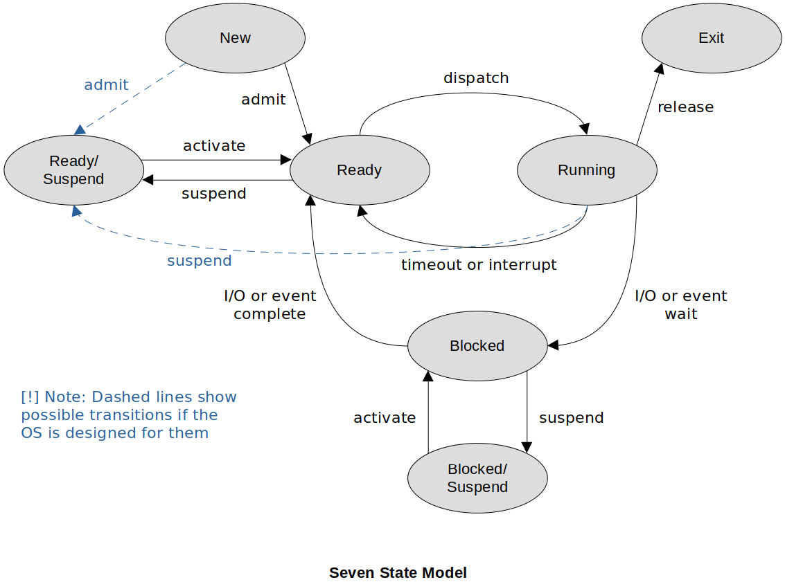
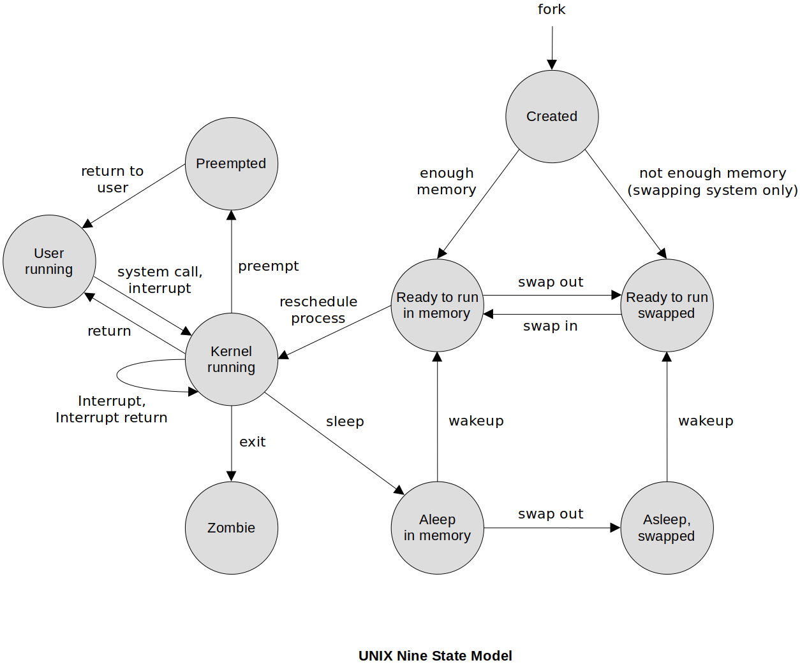

[Home](../../) | [Projects](../../projects) | [Notes](../) > <a href="./">Operating Systems</a> > Process State Models & Control

# Process State Models & Control

## Process States & Context Switch

* When the operating system removes one process from running on the CPU and allows a different process to gain control of the CPU, this is called **context switch**.
* The system status of the current process (a.k.a. the context) is saved into its PCB and the system status of the new process is retrieved from its PCB in order to restore the system where it left off.
* The portion of the OS that performs the context switch is called the **dispatcher**. This procedure is referred to as **dispatching**.

## Two State Model

* A process is either **running** or **not running**.

* The two-state model is too simplistic for a realistic operating system.
  * Processes are in the dispatch queue (non-running) that may not actually be ready to run. Why?
  * No way to differentiate between the non-running processes.
* On a uniprocessor system, there can be only ONE process in the running state. On a multiprocessor system, there can be MULTIPLE processes in the running state at the same time

### Dispatch Queue

* In order to maintain the list of processes that are not running, but waiting for their turn on the processor, we use what is called the dispatch queue.
* The queue maintains pointers to the PCBs of the waiting processes

### Process Creation

* Common events that cause process creation in the system:
  * New batch job - OS reads batch job control to load a new program
  * Interactive login - a process is created for the user
  * Start a service - the OS creates a process to provide services to other processes (ex: print)
  * Spawned by existing process

### Process Termination

* The program that a process is running is ready to end:
  * Normal exit/return
  * User logs off an interactive session or quits a running program
  * A parent process terminates, causing its child processes to end
  * Fatal error
  * Kill process request (when a process must be forced to end)

## Five State Model

* **New** - a process is just created, but not yet loaded into memory 

  The New state allows the OS to setup the resources the process needs (e.g., memory space, PCB, etc.). If there is not enough resources to allocate, then the process will stay in the New state.

* **Ready** - a process is ready to execute (not waiting on pending events)

  There are data structures (e.g., ready queue) associated with the Ready state that helps the OS manage the processes in the Ready state. Most popular algorithm for scheduling (Ready $\to$ Running) is the **Round Robin** algorithm.

* **Running** - the process that is currently being executed on the processor

  The scheduler selectins a process to be executed next.

  The dispatcher gives a process control over the CPU after it has been selected by the shceduler. 

* **Blocked** (a.k.a. **Waiting**) - the process cannot resume execution until some event occurs

  A process in the Blocked state has been context switched and therefore does not consume CPU clock cycles.

  There are data structures (e.g., blocked queue, event queue) associated with the Blocked state that help the OS manage the processes in the Blocked state. If there are multiple events, multiple data structures can be introduced to manage the processes waiting on them.

* **Exit** - a process has completed and its PCB storage can be reclaimed (resources allocated for the process are now ready to be cleaned up)

  There can be some extreme situations where a process gets terminated without going through the graceful termination process but it is considered undesirable since the OS will not able to clean up the resources the process held. This won't happen most of the time.

### How Does this Modify the Dispatch Queue?

* Blocked queue is added for the Blocked state.

### Multiple Event Queues

* To manage processes waiting for different events, multiple event queues can be introduced.

### Limitation of Five State Model

* The Five State Model requires the processes to be loaded into memory even when idle.
* Sometimes, it is inefficient to leave a process that will idle for a long time in memory. That means you cannot put that memory to use with a different process.

## Seven State Model

* Two new states - **Suspend** - are added to the Five State Model to overcome its limitations.

  "Suspend" means that a process is swapped out of main memory. It's data and status can be saved in secondary memory until it is swapped back in.

  - **Ready/Suspend** - The process is in secondary memory (swapped out of main memory) but is available for execution as soon as it is loaded into main memory.
  - **Blocked/Suspend** - The process is in secondary memory (swapped out of main memory) and awaiting an event.

## Nine State Model (UNIX/Linux)

* UNIX/Linus is a **light-weight process oriented operating system**. (Everything you want to do should be on a light-weight process!)
* UNIX/Linux specific process state model

  * **User running** - executing in user mode.
  * **Kernel running** - executing in kernel mode.
  * **Ready to run, in memory** - ready to run as soon as the kernel schedules it.
  * **Asleep in memory** - unable to execute until an event occurs; process is in main memory (a blocked state)
  * **Ready to run, swapped** - process is ready to run, but the swapper must swap the process into main memory before the knernel can schedule it to execute
  * **Asleep, swapped** - the process is awaiting an event and has been swapped to secondary storage (a blocked state)
  * **Preempted** - process is returning from kernel to user mode, but the kernel preempts it and does a process switch to schedule another process
  * **Created** - process is newly created and not yet ready to run
  * **Zombie** - process no longer exists, but it leaves a record for its parent process to collect

  

## Process Switch (Context Switch)

* **Steps of Process Switch:**

  1. Save the context of the processor.
  2. Update the process control block (PCB) of the process currently in the RUNNING state.
  3. Move the PCB of this process to the appropriate queue.
  4. Select another process for execution.
  5. Update the PCB of the process selected.
  6. Update memory management data structures.
  7. Restore the context of the processor to that which existed at the time the selected process was last switched out.

  If the currently running process is to be moved to another state (READY, BLOCKED, etc.), then the OS must make substantial changes in its environment. In other words, context switching is an expensive (high overhead) process.

* **What Causes Process Switching?**

  * Clock interrupt

    The OS dispatcher can choose some time slice/quantum/interval for which the selected process runs on the CPU. At the end of the time, a clock interrupt signals the system. The running process is moved to the ready state to await its next turn.

  * I/O interrupt

    When a pending I/O event is completed, the interrupt informs the OS the event is complete.

  * Memory fault (of Page fault)

    The process needs to pull more of its contents from the secondary storage into main memory (i.e., swap in).
    
  * Trap

## References

Stallings, W. (2018). *Operating Systems: Internals and Design Principles* (9th ed.). Pearson Education, Inc.
