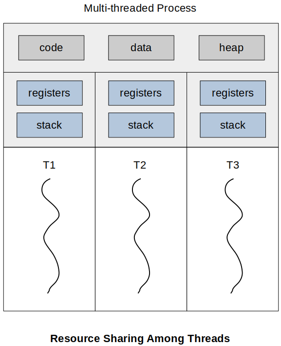

[Home](../../) | [Projects](../../projects) | [Notes](../) > <a href="./">Operating Systems</a> > Processes & Threads

# Processes & Threads

## Multi-threading

* **Multi-threading** refers to the ability of an OS to support multiple, concurrent paths of execution within a single process.

* In a multi-threaded environment, a **process** is defined as the unit of resource allocation and a unit of protection.

  The following are associated with processes:

  * A virtual address space that holds the process image
  * Protected access to processors, other processes (for interprocess communication), files, and I/O resources (devices and channels)

* Within a process, there may be one or more **threads** (i.e., an execution flow; the unit of dispatching), each with the following:

  * A thread execution state (Running, Ready, etc.)
  * A saved thread context when not running; one way to view a thread is as an independent program counter operating within a process
  * An execution stack
  * Some per-thread static storage for local variables
  * Access to the memory and resources of its process, shared with all other threads in that process

* Single-threaded vs. Multi-threadedprocess model
  * **Single-threaded process model**
    * No distinct concept of thread
    * Kernel stack is to manage the call/return behavior of the execution of the process. While the process is running, it controls the processor registers. The contents of these registers are saved when the process is not running.
  * **Multi-threaded process model**
    * Still a single process control block and user address space associated with the process
    * Separate stacks for each thread, separate control block for each thread containing register values, priority, and other thread-related state information.
    * All of the threads of a process share the state and resources of that process. They reside in  the same address space and have access to the same data.

* Another diagram describing the resource sharing among threads. Basically, threads maintain their own stacks (different stack pointers) and everything else is shared. 

## Benefits of Threads

* It takes far less time to create a new thread in an existing process, than to create a brand-new process. (Some studies have shown that it is x10 faster.)
* It takes less time to terminate a thread than a process.
* It takes less time to switch between two threads within the same process than to switch between processes. (Does not require full PCB)
* Threads enhance ability to program concurrently with shared memory systems. Threads can idle in the background while another thread's logic executes, thus allowing the process to continue using the CPU.
* Because threads within the same process share memory and files, they can communicate with each other without invoking the kernel.

## References

Stallings, W. (2018). *Operating Systems: Internals and Design Principles* (9th ed.). Pearson Education, Inc.
