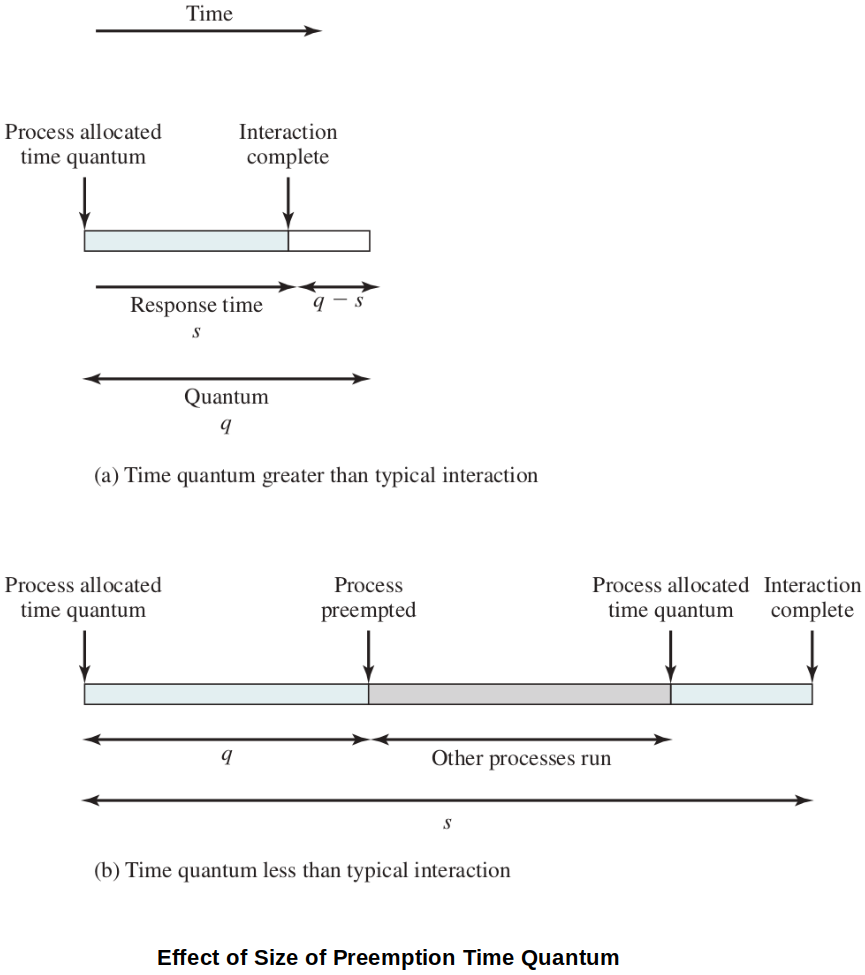

[Home](../../) | [Projects](../../projects) | [Notes](../) > <a href="./">Operating Systems</a> > Scheduling Algorithms

# Scheduling Algorithms

## Short-Term Scheduling Criteria

* The main objective of short-term scheduling is to allocate processor time to optimize certain aspects of system behavior. 
* When examining or proposing scheduling policies, we need metrics that can be computed for evaluation.

* A commonly used criteria can be categorized along two dimensions.
  * **User-oriented criteria**
    * Relate to the behavior of the system as perceived by the individual process (e.g., **response time** in an interactive system)
    * Can be difficult to measure
  * **System-oriented criteria**
    * Focus is on effective and efficient utilization of the processor (rate at which processes are completed).

### Quantitative Measurements Related to System Criteria

* **Throughput**

  * The scheduling policy should attempt to maximize the number of processes completed per unit time:
    $$
    \text{Throughput} = \frac{\text{\# processes completing}}{\Delta t}
    $$

  * A measure of how much work is being performed.

  * Clearly depends on the average length of a process, but is also influenced by the scheduling policy, which may affect utilization.

* **Turnaround time (TAT)** 

  * Time interval between the "admit" of a process and its "exit". 

  * The amount of time a process spends in the system: 
    $$
    \text{TAT $=$ Finish time $-$ Arrival time $=$ Execution time $+$ Waiting time}
    $$

  * Appropriate measure for a batch job.

* **Normalized Turnaround time (nTAT)** 

  * The turnaround time normalized to process size (Turnaround time relative to the process size):
    $$
    \text{nTAT} = \frac{\text{TAT}}{\text{Service time}}
    $$
    Where "service time" is the computation time of the process. (i.e., The amount of execution time the process needs on the CPU.)
    
  * We want the average $nTAT$ value to go down!

* **Wait time**

  * Cumulative time that a process is in the system (i.e., admited) but not using the CPU.

### Other Factors

* In addition to the quantitative measures, we can also consider other factors that affect the behavior of processes under various policies:
  * Overhead - Does a particular policy incur more overhead to implement?
  * Effect on processes - Are certain types of processes favored / penalized unfairly by policy choices?
  * Fairness, starvation, etc.

## Process Scheduling Policies

* Scheduling policies may be **preemptive** or **non-preemptive**:
  * Preemptive
    * Currently running process may be interrupted and moved to Ready state by the OS.
    * Decision to preempt may be performed when a new process arrives, when an interrupt occurs that places a blocked process in the Ready state, or periodically, based on a clock interrupt.
    * Incurs greater overhead than non-preemptive ones, but may provide better service to the total population of processes, because they prevent any one process from monopolizing the processor for very long.
    * To keep the preemption cost low, efficient process-switching mechanisms or large main memory (to keep a high percentage of programs in main memory) can be used.
  * Non-preemptive
    * Once a process is in the running state, it will continue until it terminates or blocks itself to wait for I/O or to request some OS services.
* Scheduling policies:
  * Priority-based (Pure)
  * First Come First Served (FCFS)
  * Round Robin (RR)
  * Virtual Round Robin (VRR)
  * Shortest Process Next (SPN)
  * Shortest Remaining Time Next (SRT)
  * Highest Response Ratio Next (HRRN)
  * Multi-Level Feedback

### Priority-Based (Pure)

* Very simple
* Preemptive - Removes lower priority process from the CPU.
* Naturally favors higher-priority processes over lower priority, so low priority process starves.
* Only considers the priority of processes when determining the next to run.
* May use adaptation techniques to temporarily increase or decrease some processes priority to prevent starvation (no longer *pure priority*).

### First Come First Served (FCFS)

* The simplest scheduling policy to implement
* a.k.a. **First In First Out (FIFO)** or **Strict Queuing Scheme**
* Non-preemptive - When a process gains control of CPU, it does not time-out and continues running until it completes its job.
* As each process becomes ready, it joins the ready queue in the order of arrival.
* When the currently running process ceases to execute, the process that has been in the ready queue the longest is selected for running.
* Performs much better for long processes than short ones.
* Tends to favor processor-bound (mostly uses the processor) processes over I/O-bound (mostly does I/O operations) processes.
* Not preferred on a uniprocessor system, but can be improved by combining a priority scheme to provide an effective scheduler. (e.g., Maintaining a number of queues, one for eeach priority level, and dispatch within each queue on a FCFS basis.)

### Round Robin (RR)

* Preemptive - Uses preemption driven by a clock (A straight forward way to reduce the penalty that short jobs suffer with FCFS.)
* a.k.a. **time slicing** because each process is given a slice of time (i.e., time quantum) before being preempted.
* Principal design issue is the length of the time quantum, or slice, to be used.
* Particularly effective in a general-purpose time-sharing system or transaction processing system.
* One drawback is its relative treatment of processor-bound and I/O-bound processes.
* Different tie-breaking rules can be applied. (e.g., Newly arriving process first)

### Virtual Round Robin (VRR)

* In Round Robin (RR), I/O-bound processes voluntarily give up the CPU to block for I/O. Therefore, processor-bound processes are favored in RR. Virtual Round Robin (VRR) is a refined version of RR that avoids this unfairness.
* VRR adds an **auxiliary queue** to hold processes as they return from their wait event. Those processes with unexpired quantum time due to I/O operation will be allowed to go ahead of the processes in the regular RR queue.
* Mechanism of VRR scheduling
  * New processes arrive and join the ready queue, which is managed on an FCFS basis.
  * When a running process times out, it is returned to the ready queue.
  * The new feature is an FCFS auxiliary queue to which processes are moved after being released from an I/O block.
  * When a dispatching decision is to be made, processes in the auxiliary queue get preference over those in the main ready queue. (Let these processes finish up their remaining task before allowing new processes to run.)
  * When a process is dispatched from the auxiliary queue, it runs no longer than a time equal to the basic time quantum minus the total time spent running since it was last selected from the main ready queue.
* Performance is superior to Round Robin in terms of fairness.

### Shortest Process Next (SPN) or Shortest Job Next (SJN)

* Non-preemptive - The process with the **shortest expected processing time (or service time)** is selected next.
* Like FCFS, but a short process will jump to the head of the queue. (Whenever a new process arrives in the queue, the queue is reordered by length of the service time.)
* Possibility of starvation for longer processes.
* One difficulty is the need to know, or at least estimate, the required processing time of each process.
* If the programmer's estimate is substantially under the actual running time, the system may abort the job.

### Shortest Remaining Time (SRT)

* Preemptive version of SPN
* The scheduler always chooses the process that has the shortest expected remaining processing time. (The scheduler may preempt the current process when a new process has a shorter remaining time than the currently running process.)
* Risk of starvation of longer processes
* Should give superior turnaround time performance to SPN, because a short job is given immediate preference to a running longer job.

### Highest Response Ratio Next (HRRN)

* A problem with SPN( or SJN) and SRT is that they tend to prefer shorter processes, potentially causing longer processes to starve. HRRN attempts to avoid this by factoring in the "waiting time".

* HRRN chooses next process with the greatest ratio. (A process that has been waiting a long time relative to its service time goes first!)

* Attractive because it accounts for the age of the process

* While shorter jobs are favored, aging without service increases the ratio so that a longer process will eventually get past competing

* Non-preemptive - It will behave like FCFS in the beginning.

* Consider the following ratio:
  $$
  R = \frac{w+s}{s}
  $$
  where

  ​	$R =$ response ratio

  ​	$w =$ time spent waiting for the processor (waiting time)

  ​	$s =$ expected service time

* Aging strategies
  * HRRN is an example of a policy that uses aging strategies.
  * As a process ages in the system, without executing, it can be given priority over younger processes.
  * Multi-Level Feedback is another aging strategy

### Feedback

* Two types of feedback:
  * Multi-Level Feedback
  * Multi-Level Feedback with aging - If a process languishes too long promote it to eliminate starvation!
* Mechanism of Feedback scheduling
  * When a process first enters, it is placed in the normal Round-Robin Queue; RQ0.
  * After its first preemption, when it returns to the Ready state, it is placed in RQ1. Each subsequent time that it is preempted, it is demoted to the next lower-priority queue. (Multi-Level Feedback)
* Variation 1 - As processes drift down to lower priority queues, give them a longer time quantum when they do get the CPU.
* Variation 2 - Because processes may still suffer starvation, we can choose to promote a process to a higher-priority queue after it spends a certain amount of time waiting for service in its current queue.
* With the Feedback scheduling, magical knowledge of the future is not necessary.

## Comparison of the Scheduling Policies

### Performance Tracing Examples

### Characteristics of Various Scheduling Policies

## References

Stallings, W. (2018). *Operating Systems: Internals and Design Principles* (9th ed.). Pearson Education, Inc.

