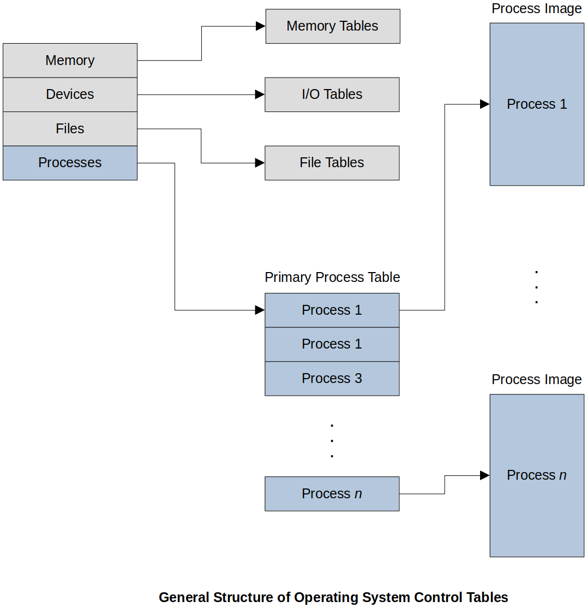

[Home](../../) | [Projects](../../projects) | [Notes](../) > <a href="./">Operating Systems</a> > The Process

# The Process

## Introduction to the Process

* All modern multi-programming operating systems, including single-user desktops and multi-user mainframes, are built around the concept of **the process**.

* Process supports some goals especially in the area of utilization, fairness, and throughput.

  1. Operating system must **interleave execution** of multiple processes.
  
  2. Operating system must **allocate resources** (consumable, reusable) to processes in a way that is **fair** and **avoids deadlocks**.
  
     The term "fairness" could be interpreted differently depending what you want to achieve, but in general, in CPU scheduling, Round-Robin (every process gets a **time-slice** (or a **time quantum**) to execute on the CPU taking turns) algorithm is known to be a fair algorithm.
     
  3. Operating system must **support user creation & start of processes**.
  
  4. Operating system must **support inter-process communication (IPC)**.
  
     e.g., Sockets, pipes, message passing, etc.
  
* A process supports the goal of an OS as a resource manager.

  Recap the OS goals from earlier sections:
  
  1. Maximize processor utilization
  2. Provide reasonable response times
  3. Fairness
  4. Avoid failure
  5. Support development
  6. Be able to enhance with new devices and features

## What is a Process?

* All modern operating systems rely on a concept in which the execution of an application corresponds to the existence of one or more processes.

* A process is comprised of:

  - A program in execution (i.e., the program's **code**)
  - Associated **data** in memory
  - The process control block (**PCB**) - Uniform-sized data structure that contains the state of process

  **Process image** - "Code + Data" (The collection of program instructions, data, stack, and attributes required to store the state of a process. $\to$ Sits on your secondary storage when not running)

## Process Control Block (PCB)

* The PCB is a **data structure** (that **contains the state of process**) created by an managed by the operating system software.

* Contains sufficient information about a process so it is possible to interrupt a running process and resume its execution as if the interruption did not happen. 

* This supports multi-programming:

  - When a process is interrupted, current values related to the process' current status are saved. 

    Context data - State of the hardware the must be saved/restored when a process exits/enters the CPU.

  - The process is moved to a non-running state

  - The OS is free to choose another PCB to load and resume the execution of a different process

  Above mentioned activity is called the **context switching** and is an expensive overhead.

* Typical Contents of a PCB

  | Contents        | Description                                                  |
  | --------------- | ------------------------------------------------------------ |
  | Identifier      | Unique ID to distinguish from other processes                |
  | Ownership       | Access control to the process                                |
  | State           | The current state (e.g., ready, running, blocked, new, exit) |
  | Priority        | Level of priority with respect to other processes            |
  | Program Counter | Address of next instruction to load and execute in the program code |
  | Memory Pointers | Pointers to code, data and shared data                       |
  | Context Data    | Current values of system registers and other hardware flags  |
  | I/O Status      | Pending I/O requests, devices dedicated to process, list of files in use |
  | Accounting Data | Processor time used, time limits, user info, etc.            |

* Process Details Stored in or Linked to PCB

  * **Process location**

    How much physical memory does it need, what portion of the process image is actually loaded into real memory.

  * **Process attributes**

    - ID + user, owner
    - State information - Registers, stack pointers, hardware flags
    - Control information - State, priority, event identities, data pointers, communication buffers, privileges, resource holds in use (files, etc), memory locations

## Control Structure

* What information does the OS need in order to control the execution of process?
* Much information is dynamic and sizes differ. For example, a process may need 1 file or a 100 files, and this can be unpredictable in nature.
* There are 4 main categories of detailed control structure information that the OS needs to maintain in addition to the PCB for each process.
  1. Memory Tables
     - Allocation of main memory to processes
     - Allocation of secondary memory to processes
     - Protection attributes of the memory blocks
     - Additional information for managing virtual memory
  2. I/O Tables
     - Devices available or assigned to processes
     - Status of I/O operations in progress
     - Memory locations used for data transfers
  3. File Tables
     - File status
     - Location on secondary memory
  4. Process Tables
     - OS storage for information about each process, including PCB

## Process Modes

* Sometimes a user process needs to execute privileged instructions, such as accessing a device or a password system.

* Processors and OS support different modes of execution for this purpose.

  * **User Mode**

    A process is executing normally. A program running in user mode does not have the direct access to the memory, hardware, and such other resources. Therefore, even if a program running in user mode crashes, the entire system does not crash. It is a safe mode, and most of the programs execute in user mode.

  * **Kernel Mode (Privileged Mode)**

    A process is executing some instructions via the OS that are privileged. Often, when a process calls an OS utility, it enters kernel mode to execute the instructions, and returns to user mode when the operation exists. 
    
    A program running in kernel mode has the direct access to the memory, hardware, and such other resources. Therefore, if a program running in kernel mode crashes, it is likely that the entire system will crash and come to a halt. (Big problem!)

* The current mode is stored in the PCB.

## Process Creation

1. Assigns a unique process identifier to the new process
2. Allocates space for the process
3. Initializes the process control block (PCB)
4. Sets the appropriate linkages
5. Creates or expands other data structures

## References

Stallings, W. (2018). *Operating Systems: Internals and Design Principles* (9th ed.). Pearson Education, Inc.
