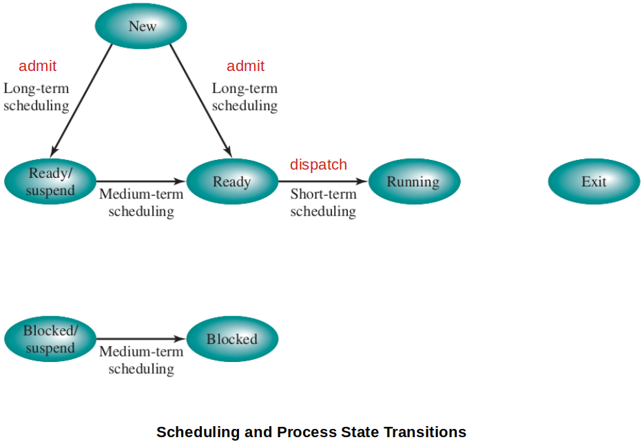
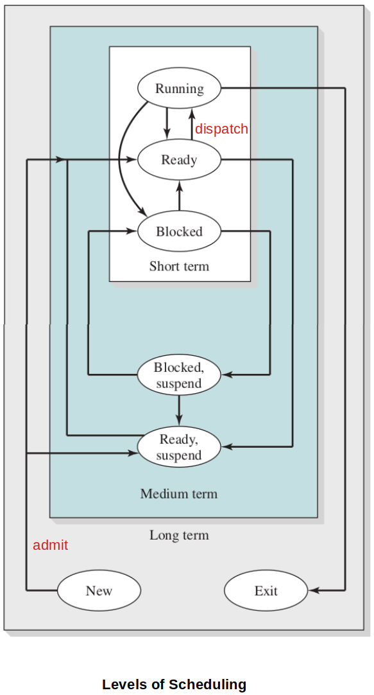
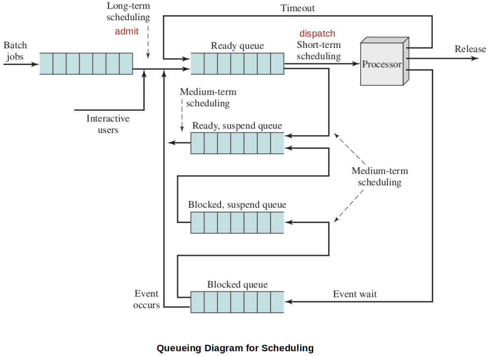

[Home](../../) | [Projects](../../projects) | [Notes](../) > <a href="./">Operating Systems</a> > Types of Processor Scheduling

# Types of Processor Scheduling

## Processor Scheduling

* The aim of **processor scheduling** is to assign processes to be executed by the processor (or processors) over time, in a way that meets system objectives, such as response time, throughput, and processor efficiency.

* Processor scheduling activity is broken down into three separate functions. The names suggest the relative time scales with which these functions are performed.

  * **Long-term scheduling**

    The decision to add to the pool of processes to be executed.

  * **Medium-term scheduling**

    The decision to add to the number of processes that are partially or fully in main memory.

  * **Short-term scheduling**

    The decision as to which available process will be executed by the processor.

  [!] Note: **I/O scheduling** - The decision as to which process's pending I/O request shall be handled by an available I/O devices.

## Long-Term Scheduling

* Determines **when** and **which** programs are **admit**ted to the system for processing.
  * When to create a new process is generally driven by the desired degree of multiprogramming.
  * Which job to admit next can be on a simple FCFS basis, or it can be a tool to manage system performance.

* Controls the degree of multiprogramming.
  * The more processes that are created, the smaller the percentage of time that each process can be executed.
  * May limit the degree of multiprogramming to provide satisfactory service to the current set of processes.
* Executes least frequently and makes the coarse-grained decision of whether or not to take on a new process.

## Medium-Term Scheduling

* Part of the **swap**ping (in/out of memory) function. (Suspend / Activate)

* Typically, the swapping-in decision is based on the need to manage the degree of multiprogramming.

  On a system that does not use virtual memory, memory management is also an issue. Thus, the swapping-in decision will consider the memory requirements of the swapped-out processes.

* Executes somewhat more frequently than the long-term scheduling to make a swapping decision.

## Short-Term Scheduling

* Known as the **dispatch** carried out by the **dispatcher**.
* Invoked whenever an event occurs that may lead to the blocking of the current process, or that may provide an opportunity to preempt a currently running process in favor of another. Examples of such events include:
  * Clock interrupts
  * I/O interrupts
  * Operating system calls
  * Signals (e.g., semaphores)
* Executes most frequently and makes the fine-grained decision of which process to execute next. (It chooses from the ready queue.)

## References

Stallings, W. (2018). *Operating Systems: Internals and Design Principles* (9th ed.). Pearson Education, Inc.

