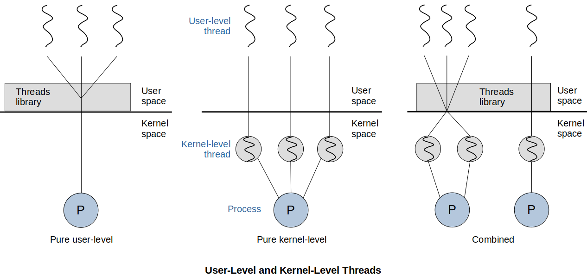

[Home](../../) | [Projects](../../projects) | [Notes](../) > <a href="./">Operating Systems</a> > Types of Threads

# Types of Threads

Two broad categories of thread implementation:

* **User-level threads (ULTs)**
* **Kernel-level threads (KLTs)** - a.k.a. **Kernel-supported threads** or **Lightweight processes**

## User-Level Threads

* In a pure ULT system, all of the work of thread management is done by the application (within the user space within a single process) and the **kernel is NOT aware of the existence of threads**.

* Any application can be programmed to be multi-threaded by using a threads library (e.g., POSIX threads libraries), which is a package of routines for ULT management. (The threads library contains code for creating and destroying threads, for passing messages and data between threads, for scheduling thread execution, and for saving and restoring thread contexts.)

* Example: Java VM

  You write a threaded process in Java. The Java VM (JVM) is a single process that runs. Your program threads run inside that process. Therefore, if a thread blocks for an event, the entire process blocks

### Advantages of ULTs

* Thread switching does not require kernel-mode privileges because all of the thread management data structures are within the user address space of a single process. Therefore, the process does not switch to the kernel mode to do thread management. This saves the overhead of two mode switches (user to kernel; kernel back to user).
* Scheduling can be application specific. One application may benefit most from a simple round-robin scheduling algorithm, while another might benefit from a priority-based scheduling algorithm. The scheduling algorithm can be tailored to the application without distributing the underlying OS scheduler.
* ULTs can run on any OS. No changes are required to the underlying kernel to support ULTs. The threads library is a set of application-level functions shared by all applications.

### Disadvantages of ULTs

* In a typical OS, many system calls are blocking. As a result, when a ULT executes a system call, not only is that thread blocked, but all of the threads within the process are blocked as well.
* In pure ULT strategy, a multi-threaded application cannot take advantage of multiprocessing. A kernel assigns one process to only one processor at a time. Therefore, only a single thread within a process can execute at a time. In effect, we have application-level multiprogramming within a single process. While this multiprogramming can result in a significant speed up of the application, there are applications that would benefit from the ability to execute portions of code simultaneously.

## Kernel-Level Threads

* It a pure KLT system, all of the work of thread management is done by the kernel so, **kernel is aware of all threads**. There is no thread management code in the application level, but simply an application programming interface (API) to the kernel thread facility. (e.g., Windows)
* The kernel maintains context information for the process as a whole and for individual threads within the process.
* Scheduling by the kernel is done on a thread basis which overcomes the principal drawbacks of the ULT approach.

### Advantages of KLTs

* The kernel can simultaneously schedule multiple threads from the same process on multiple processors. 
* If one thread in a process is blocked, the kernel can schedule another thread of the same process.
* Kernel routines themselves can be multi-threaded.

### Disadvantages of KLTs

* The transfer of control from one thread to another within the same process requires a mode switch to the kernel. This incurs a huge overhead.

  e.g., The overhead of forking a process/thread, synchronizing, etc.

## ULT-KLT Combined Approach

* Some OS to support combined approaches where the OS can map many user-level threads into some subset of kernel-level threads.

* In a combined system, followings are done in user space within an application:

  * Thread creation is done completely in user space
  * The bulk of the scheduling and synchronization

* The multiple ULTs from a single application are mapped onto some (smaller or equal) number of KLTs. (Programmers may adjust these numbers according to their needs.)

* Blocking system call need not block the entire process as multiple threads within the same application can run in parallel on multiple processors.

* Relationship between Threads and Processes

  | Threads : Processes | Description                                                  | Example Systems                                |
  | ------------------- | ------------------------------------------------------------ | ---------------------------------------------- |
  | 1:1                 | Each thread of execution is a unique process with its own address space and resources. | Traditional UNIX implementations               |
  | M:1                 | A process defines an address space and dynamic resource ownership. Multiple threads may be created and executed within that process. | Windows NT, Solaris, Linux, OS/2, OS/390, MACH |
  | 1:M                 | A thread may migrate from one process environment to another. This allows a thread to be easily moved among distinct systems. | Ra (Clouds), Emerald                           |
  | M:N                 | It combines attributes of M:1 and 1:M cases.                 | TRIX                                           |

  > * **Traditional UNIX**
  >
  >   The programmer writes code that creates new processes  (spawns). The OS manages them. You would be calling the OS utilities to do the process creation, end, etc.
  >
  > * **Linux and Windows NT based Systems**
  >
  >   These OS would be aware of the threads you create within your process for scheduling
  >
  > * **Other**
  >
  >   When you write a traditional Java program an run it, the system (Linux, Windows, etc) creates a single process.
  >
  >   The Java language library provides the logic to switch between threads. The OS is not aware of them.

## Granularity of Threads

* **Coarse Grained Threads**

  * The process is developed as individual modules that could be assigned to processors. Each is performing its own specialized tasks.

  * Communicating processes

    e.g., Client/server applications

* **Fine Grained Threads**

  * Many similar or identical tasks are spread across processors to compute part of a solution

    e.g., Image processing where each thread works on a portion of the image file

## References

Stallings, W. (2018). *Operating Systems: Internals and Design Principles* (9th ed.). Pearson Education, Inc.
