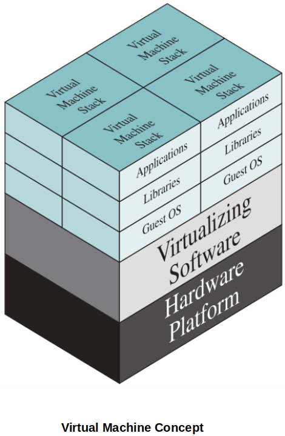
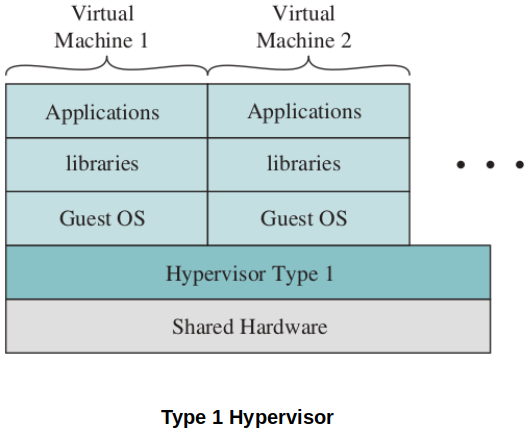
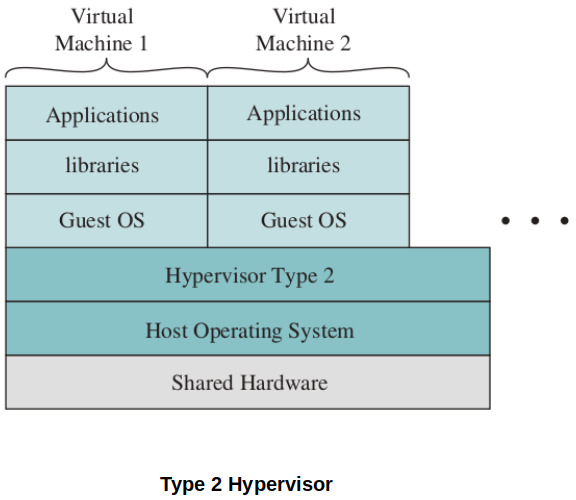
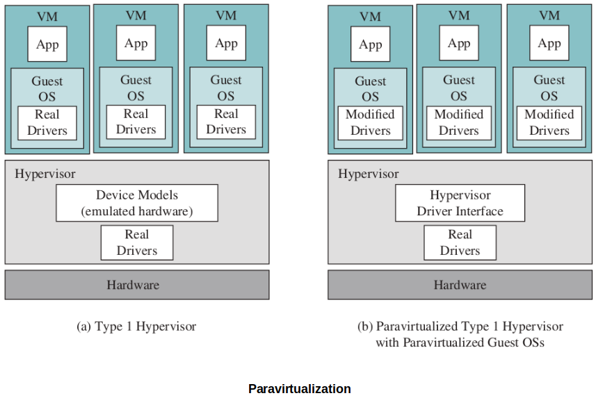

[Home](../../) | [Projects](../../projects) | [Notes](../) > <a href="./">Operating Systems</a> > Virtual Machines

# Virtual Machines

## Introduction

* Virtualization involves managing computer resources so that each process representing a *virtual machine* sees its resources as if only it were using the hardware. A virtual machine is unaware that other VMs run in the same environment.

  A virtual machine itself is essentially a software process that uses the hardware resources of the system it is running on.

* Virtualization provides a layer between a virtual machine's software and the physical hardware of the machine that supports VMs.

* There are 2 main approaches to virtualization:
  * **Virtual machines** - Can run different types of OSs regardless of the OS of the host machine.
  
  * **Containers** - Usually designed to run within the same host operating system. (In other words, containers on a system share the underlying OS and therefore, if the OS fails all containers will fail.)
  
    e.g., If you are to develop multiple Linux applications, you can put them in Linux containers that are all running on a single machine whose OS is Linux.

## History of Virtualization

* Traditionally, applications have run directly on an OS on a computer that was running only that single operating system.
* What if your application needs to be able to run on a different or multiple operating systems?
  * Think about testing software for different platforms. Think about patching legacy software.
  * You can either buy the individual platforms as machines running the desired OSs.
  * You can configure one machine to dual/multi-boot into different OSs.
  * Or, you can configure VMs to run on the machine you have
* Virtual technology enables a single computer to simultaneously run multiple emulated environments containing different OSs.
* OS is not the only thing virtualization is used for. There are also virtual appliances, things like software emulation of real-world hardware such as routers or network cards.

## Important Terms

* **Hypervisor**

  The virtual machine monitor that sits between your VMs and the actual hardware, acting as a resource broker.

* **Host**

  This is the computer the hypervisor runs on. The host may have a traditional operating system installed such as Windows or it may only have a specialized hypervisor OS.

* **Guest**

  These are the "guest" machines on your host. A host can support some number of VMs running at the same time. A true VM host needs lots of memory and processor capability.

  * In a true VM environment, each guest machine can run its own OS.
  * So, I can create a Linux machine, a Windows machine and an Android machine on my PC at home if I have enough memory.

* **Guest Applications**

  These are your normal programs that run on the guest. For example, if I have a Windows VM, I could run Microsoft Word on it. Or any software designed to run on Windows OS.

## Cloud Computing

* Cloud computing environment use VM technology as its core foundation.
* Today there are more virtual servers deployed in the world than physical servers, via cloud platforms.
* A machine that can support multiple virtual servers requires less physical space, fewer cables, less power consumption than if we used multiple physical server computers.

## Hypervisors

* What operating system is to a regular computing system, hypervisor is to a cloud computing system (or virtual computing environment.)
* The hypervisor is the software that acts as a broker or traffic controller between the VM guests as they request use of resources from the physical host machine.
  * e.g., When a VM requests a file I/O, the hypervisor traps that call and figures out where and which device it should actually be mapped to.

* A hypervisor lets you create a VM and configure it with processors, some amount of RAM, some size of "disk", among other features.
* The hypervisor manages the execution of all of the VMs. It allows you to "power" your VM on/off. It translates I/O requests from the VMs to the host and back.
* The hypervisor "traps" OS system calls in the VMs and translates them into the appropriate calls.

### Type 1 Hypervisor

* Sometimes this is called a **bare-metal** hypervisor.
* Has complete control over the host machine. (Acts as an overall OS of the host machine.)
* A "Type 1 Hypervisor" is loaded as a software layer directly on the host. There is no other OS on the host.
* The hypervisor directly controls the physical resources of the host.
* Examples include VMWare and Xen.

### Type 2 Hypervisor

* Runs as a software module on top of an existing, traditional OS.
* A "Type 2 Hypervisor" relies on calls to the underlying host OS rather than directly managing the hardware.
* "Type 2 Hypervisor" makes it easy to create and experiment with VMs. You don't have to install a new OS on your PC to use them.
* Examples include VirtualBox and VMWare workstation.

## Paravirtualization

* Some systems use paravirtualization to enhance the performance of VMs.
* With paravirtualization, the guest OS are a special version modified to make calls to the hypervisor where appropriate. So they are "aware" of the hypervisor's existence.
  * In this case, the hypervisor does NOT have to trap the system calls and do the necessary work. Guest OSs are directly making calls to the hypervisor.

* For example, you might have a special version of Linux designed to run on Amazon VMs. (Which is what they do. You have to use their special versions of OSs.)
* Or, in a non-paravirtualization system, the guest OS are just the original off the shelf version and the hypervisor has to work to trap the OS calls and interpret them. The guest OS are not aware of the hypervisor's existence.

## Also Check Out

* Hardware-Assisted Virtualization

## References

Stallings, W. (2018). *Operating Systems: Internals and Design Principles* (9th ed.). Pearson Education, Inc.

