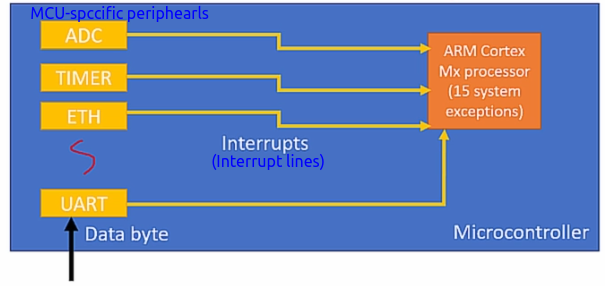
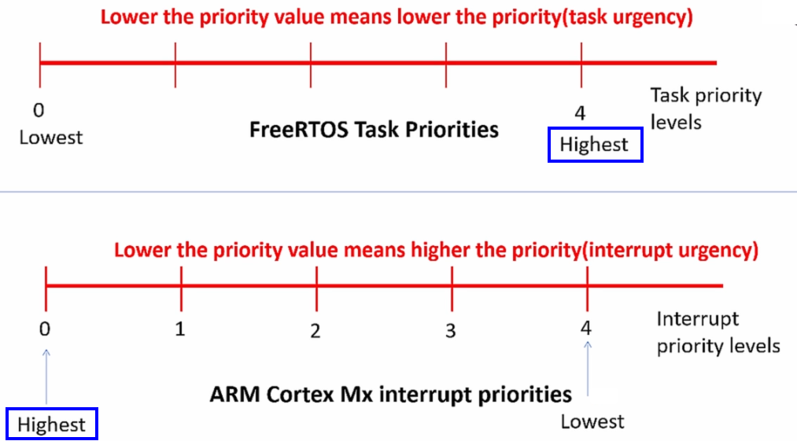
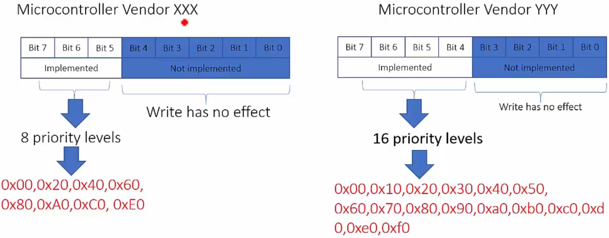
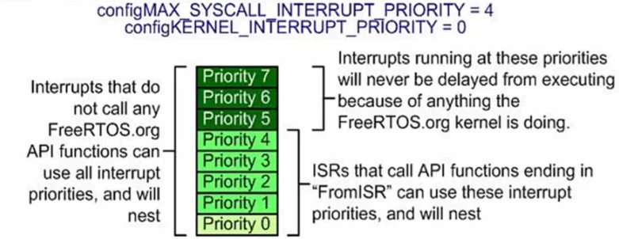
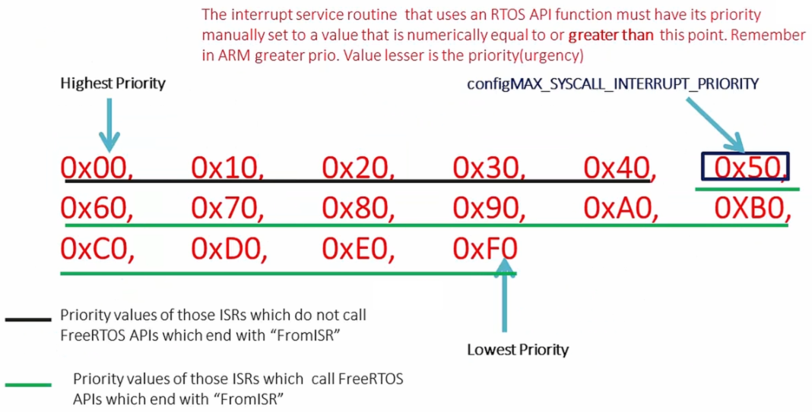

[Home](../../) | [Projects](../../projects) | [Notes](../) > <a href="./">Real-Time Operating Systems (RTOS)</a> > ARM Cortex-M Interrupt Priority & FreeRTOS Task Priority

# ARM Cortex-M Interrupt Priority & FreeRTOS Task Priority


## Hardware Interrupt Priority (ARM Cortex-M)

* Hardware priority is the priority values assigned to various interrupts (i.e., MCU-specific, external to the processor) and system exceptions (i.e., processor-specific, internal to the processor) of the processor.

  Which of the lower or higher priority value means higher priority depends on the hardware design so you must check the documentation!!!





* When an interrupt occurs, corresponding Interrupt Service Routine (ISR) or Interrupt Handler gets invoked and runs in the "Handler mode" of the processor.

  ISR examples:

  ```c
  static void adc_interrupt_handler(void)
  {
      /* Interrupt handling for ADC peripheral */
  }
  ```

  ```c
  static void timer_interrupt_handler(void)
  {
      /* Interrupt handling for TIMER peripheral */
  }
  ```

  ```c
  static void uart_interrupt_handler(void)
  {
      /* Interrupt handling for UART peripheral */
  }
  ```


## FreeRTOS Task Priority vs. ARM Cortex-M Interrupt Priority

Don't be confused! This is by DESIGN!





## FreeRTOS Hardware Interrupt Configuration Items

* In `FreeRTOSConfig.h` are 2 hardware interrupt configuration items:

  * `configKERNEL_INTERRUPT_PRIORITY`

  * `configMAX_SYSCALL_INTERRUPT_PRIORITY`

### `configKERNEL_INTERRUPT_PRIORITY`

* This configuration item **decides the priorities of the kernel interrupts**. These interrupts (SysTick, PendSV, SVC) are set to the lowest possible priorities.

* The kernel interrupts include:

  * **SysTick** exception (or interrupt)

    e.g., Maintains the system tick

    ```c
    #define configTICK_RATE_HZ ((portTickType)1000)
    ```

  * **PendSV** exception (or interrupt)

    e.g., Performs context switching

  * **SVC** exception (or interrupt)

    e.g., Launches the very first user task

* Definition

  ```c
  /* FreeRTOSConfig.h */
  
  /* Interrupt priorities used by the kernel port layer itself.  These are generic
  to all Cortex-M ports, and do not rely on any particular library functions. */
  #define configKERNEL_INTERRUPT_PRIORITY ( configLIBRARY_LOWEST_INTERRUPT_PRIORITY << (8 - configPRIO_BITS) )
  ```

  > * Kernel interrupts are assigned lowest possible priorities.
  >
  > * L5: `configLIBRARY_LOWEST_INTERRUPT_PRIORITY` is defined as `0xf` in the same file.

* What is the lowest and highest possible values in an ARM Cortex-M processor based microcontroller?

  * To answer this question, you need to know what the value of `__NVIC_PRIO_BITS` CMCIS macro is.

    ```c
    /* Project/Drivers/CMSIS/Device/ST/STM32F4xx/Include/stm32f407xx.h */
    
    #define __NVIC_PRIO_BITS 4U /*!< STM32F4XX uses 4 Bits for the Priority Levels */
    ```

    > * 4 bits $\to$ 16 possible priority values.
    >
    > * Priority register (0x00 is the highest priority) - Microcontroller-specific!
    >
    >   
    >
    > 

  * Therefore, `configKERNEL_INTERRUPT_PRIORITY` will be calculated to be `0xf0`, the lowest of the 16 priority levels possible. (Less urgency)

### `configMAX_SYSCALL_INTERRUPT_PRIORITY`

* In the newer version of FreeRTOS Port file, its name has been changed to `configMAX_API_CALL_INTERRUPT_PRIORITY`.

* Decides the maximum priority level of those interrupts which use FreeRTOS APIs that end with `FromISR`.

  The priority value of an interrupt that ends with `FromISR` or an interrupt that calls an interrupt that ends with `FromISR` must be greater (i.e., lower priority) than this macro value.

  > Example (Do not assume ARM Cortex-M processor):
  >
  > Here, in this example, the lower the priority value the lower the priority.
  >
  > 
  >
  > 
  >
  > Interrupts that do not call FreeRTOS kernel API functions can execute at the priorities above `configMAX_SYSCALL_INTERRUPT_PRIORITY` and therefore never be delayed by the RTOS kernel execution.

* Definition

  ```c
  /* FreeRTOSConfig.h */
  
  /* !!!! configMAX_SYSCALL_INTERRUPT_PRIORITY must not be set to zero !!!!
  See http://www.FreeRTOS.org/RTOS-Cortex-M3-M4.html. */
  #define configMAX_SYSCALL_INTERRUPT_PRIORITY 	( configLIBRARY_MAX_SYSCALL_INTERRUPT_PRIORITY << (8 - configPRIO_BITS) )
  ```

  > L5: `configLIBRARY_MAX_SYSCALL_INTERRUPT_PRIORITY` is defined as 5 in the same file, so `5 << (8 - 4)` equals 0x50.
  >
  > 
  >
  > 

### Conclusion

* FreeRTOS APIs that end with `FromISR` are interrupt-safe. But, even these APIs should NOT be called from the ISRs that are of lower priority value (i.e., higher priority) than the value defined by `configLIBRARY_MAX_SYSCALL_INTERRUPT_PRIORITY`.
* Therefore, any ISR that uses an RTOS API function must have its priority value manually set to a value that is greater than or equal to the value defined by `configLIBRARY_MAX_SYSCALL_INTERRUPT_PRIORITY`.
* ARM Cortex-M interrupts default to having a priority value of 0. This is the highest possible priority value. Therefore, ==NEVER leave the priority of an interrupt that uses the interrupt-safe RTOS API at its default value==.


## FreeRTOS `FromISR` APIs

* FreeRTOS provides separate APIs for use from interrupt handlers. These APIs end with `FromISR`.

* If a FreeRTOS API doesn't end with `FromISR`, then it should not be used in an interrupt context (i.e., inside an ISR).

  For example:

  ```c
  /* Task handler */
  void led_red_handler(void *parameters)
  {
      while (1)
      	xQueueSend();	// cannot use 'xQueueSendFromISR()'
  }
  ```

  ```c
  /* Interrupt handler */
  void uart_interrupt_handler(void)
  {
      xQueueSendFromISR();	// cannot use 'xQueueSend()'
  }
  ```

* See [FreeRTOS `FromISR` APIs](./freertos-fromisr-apis) for more details.


## References

Nayak, K. (2022). *Mastering RTOS: Hands on FreeRTOS and STM32Fx with Debugging* [Video file]. Retrieved from https://www.udemy.com/course/mastering-rtos-hands-on-with-freertos-arduino-and-stm32fx/
