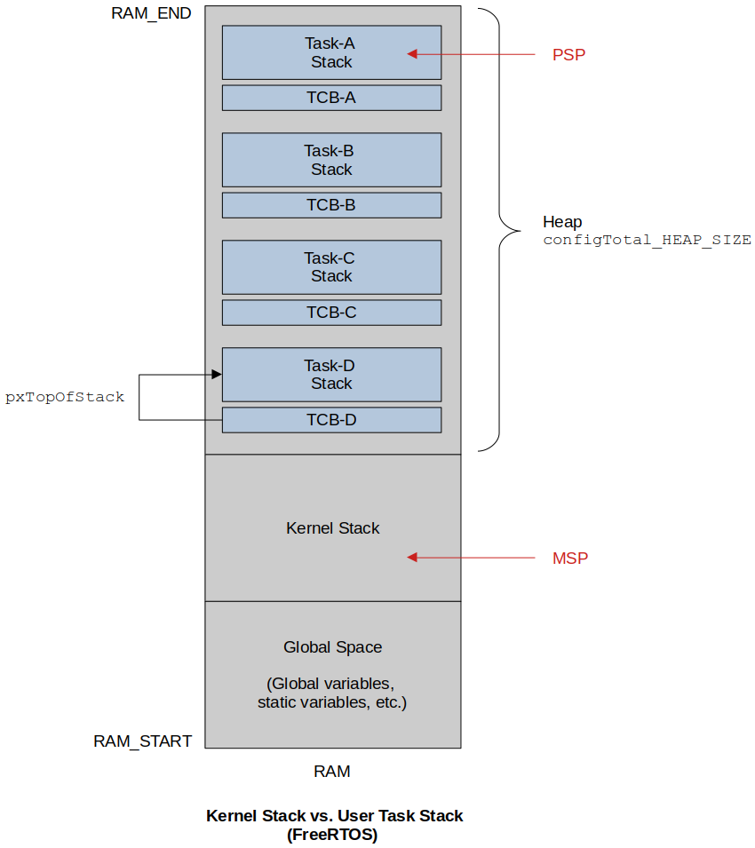
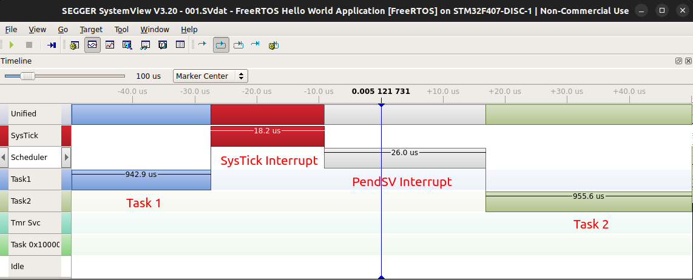

[Home](../../) | [Projects](../../projects) | [Notes](../) > <a href="./">Real-Time Operating Systems (RTOS)</a> > Context Switching

# Context Switching


## State of a Task

See [Scheduling & Context Switching](../arm-cortex-m3-m4-processor/scheduling-and-context-switching) for processor level details.

* When a task executes on the processor it utilizes

  * Processor core registers (among them PSP is for user tasks, MSP is for kernel)

  * Task's own stack memory (if a task wants to do any push/pop operations during function call)

  **State of a task** = [Processor core registers] + [Task's stack memory]


## Stacks

* Two categories of stack memory utilized during the run-time of a FreeRTOS based application:

  * **Task's private stack (Process stack)** - Used when a task does push/pop

    Push/pop to/from this stack space is tracked by the **PSP** register of the ARM Cortex-M processor.

  * **Kernel stack (Main stack)** - Used when an ISR (e.g., SysTick handler, PendSV handler) does push/pop

    Push/pop to/from this stack space is tracked by the **MSP** register of the ARM Cortex-M processor.





## Context Switching

* Context switching is a process of switching out of one task and switching in another taask on the CPU to execute.

* In RTOS context switching is taken care of by the scheduler.

* In FreeRTOS context switching is taken care of by the PendSV handler defined in `port.c`.

* Whether context switch should happen or note depends upon the scheduling policy of the scheduler. 

* Priority-based preemptive scheduler - For every RTOS tick interrupt, the scheduler will compare the priority of the running task with the priorities of the tasks in the Ready list. If there is any Ready task whose priority is higher than the running task then the context switch will occur.

* On FreeRTOS you can also trigger context switch manually using the macro `taskYIELD()`.

  ```c
  /* task.h */
  #define taskYIELD()	portYIELD()
  ```

  ```c
  /* portmacro.h */
  /* Scheduler utilities. */
  #define portYIELD()                                 \
  {                                                   \
  	/* Set a PendSV to request a context switch. */ \
  	portNVIC_INT_CTRL_REG = portNVIC_PENDSVSET_BIT; \
      ...        
  }
  ```

  > L6: What it does is identical to what the SysTick does. It pends the PendSV interrupt which means triggering the context switch manually.

* Context switch also happens immediately whenever new task unblocks and if its priority is higher than the currently running task.

### Task Switching-Out Procedure

* Before a running task is switched out, the following things have to be taken care of.

  1. Processor core registers R0, R1, R2, R3, R12, LR, PC, xPSR (i.e., stack frame) are saved onto the task's private stack automatically by the processor SysTick interrupt entry sequence.

  2. If context switching is required, the SysTick timer will pend the PendSV exception and PendSV handler will run.

  3. Processor core registers R4-R11 that are not saved by (1) have to be saved manually on the task's private stack memory. (Saving the context) ==Also, push R14 one more time since it will be necessary to recover the R14 value that will have been corrupted by `bl vTaskSwitchContext` subroutine call inside the `xPortPendSVHandler()` when the current task is switched back in later.==

     Q: Doens't R14(LR) get pushed automatically by the processor as an exception exit sequence when the `xPortPendSVHandler()`? $\to$ It does! But as you can see at the end of `xPortPendSVHandler()` there's a branch instruction `bx r14` which means that we need to make sure that R14 register retains the correct value. Note that the branch instruction `bx r14` gets called before the exception exit sequence of PendSV handler.

  4. Save the new top of stack value (PSP) into the first member (`pxTopOfStack`) of TCB. This is so when this task is switched back in later, it can restore its context from its stack.

  5. Select the next potential task to execute on the CPU. This is done by `vTaskSwitchContext()` implmented in `tasks.c`.
  
     ```c
     /* task.c */
     void vTaskSwitchContext( void )
     {
         ...
     	/* Select a new task to run using either the generic C or port optimised asm code. */
     	taskSELECT_HIGHEST_PRIORITY_TASK(); 
         ...
     }
     ```
  
     > The macro `taskSELECT_HIGHEST_PRIORITY_TASK()` fetches the pointer to the TCB of the next task to run.


### Task Switching-In Procedure

* At this time, `pxCurrentTCB` will contain the TCB of the next task to run.
  1. First, get the address of the TOS of the task to be switched in. Copy the value of `pxTopOfStack` into the PSP register. (PSP initialization for the new task.)
  
  2. Pop the registers R4-R11, R14(LR) (from the stack to the processor core registers). (Restoring the context)
  
     Note that the R14(LR) gets popped here again! Check out the corresponding part in the *Task Switching-Out Procedure* section above!
  
  3. Exception exit - Now PSP is pointing to the start address of the stack frame (R0-R3, R12, LR, PC, xPSR) which will be popped (from the stack to the processor core registers) automatically by the processor during the exception exit sequence.


### Context Switching on SEGGER SystemView





## Context Switching in Code

* Context switching code analysis

  ```c
  /* port.c */
  
  void xPortPendSVHandler( void )
  {
      /* This is a naked function. */
  
      __asm volatile
      (
          "	mrs r0, psp							\n"
          "	isb									\n"
          "										\n"
          "	ldr	r3, pxCurrentTCBConst			\n"/* Get the location of the current TCB. */
          "	ldr	r2, [r3]						\n"
          "										\n"
          "	tst r14, #0x10						\n"/* Is the task using the FPU context?  If so, push high vfp registers. */
          "	it eq								\n"
          "	vstmdbeq r0!, {s16-s31}				\n"
          "										\n"
          "	stmdb r0!, {r4-r11, r14}			\n"/* Save the core registers. */
          "	str r0, [r2]						\n"/* Save the new top of stack into the first member of the TCB. */
          "										\n"
          "	stmdb sp!, {r0, r3}					\n"
          "	mov r0, %0 							\n"
          "	msr basepri, r0						\n"
          "	dsb									\n"
          "	isb									\n"
          "	bl vTaskSwitchContext				\n"
          "	mov r0, #0							\n"
          "	msr basepri, r0						\n"
          "	ldmia sp!, {r0, r3}					\n"
          "										\n"
          "	ldr r1, [r3]						\n"/* The first item in pxCurrentTCB is the task top of stack. */
          "	ldr r0, [r1]						\n"
          "										\n"
          "	ldmia r0!, {r4-r11, r14}			\n"/* Pop the core registers. */
          "										\n"
          "	tst r14, #0x10						\n"/* Is the task using the FPU context?  If so, pop the high vfp registers too. */
          "	it eq								\n"
          "	vldmiaeq r0!, {s16-s31}				\n"
          "										\n"
          "	msr psp, r0							\n"
          "	isb									\n"
          "										\n"
          #ifdef WORKAROUND_PMU_CM001 /* XMC4000 specific errata workaround. */
              #if WORKAROUND_PMU_CM001 == 1
                  "			push { r14 }				\n"
                  "			pop { pc }					\n"
              #endif
          #endif
          "										\n"
          "	bx r14								\n"
          "										\n"
          "	.align 4							\n"
          "pxCurrentTCBConst: .word pxCurrentTCB	\n"
          ::"i" ( configMAX_SYSCALL_INTERRUPT_PRIORITY )
      );
  }
  ```

  > * L9: Copy the PSP value intoa general purpose register r0. (Used in L19) 
  >
  > * L19: `stmdb` stands for "Store Multiple Decrement Before (Full Descending)".  TOS gets decremented first, and then a value is stored onto stack (this is done for multiple values). Saves the core registers that were not automatically taken care of by the processor during the SysTick exception entry sequence.
  >
  > * L20: Stores the PSP in the first element in the TCB. (r2 contains the address of the current TCB.)
  >
  > * L27: Context switch takes place by `vTaskSwitchContext`.
  >
  >   ```c
  >   /* task.c */
  >   void vTaskSwitchContext( void )
  >   {
  >       ...
  >   	/* Select a new task to run using either the generic C or port optimised asm code. */
  >   	taskSELECT_HIGHEST_PRIORITY_TASK(); 
  >       ...
  >   }
  >   ```
  >
  >   ```c
  >   /* task.c */
  >   #define taskSELECT_HIGHEST_PRIORITY_TASK()                                \
  >   {                                                                         \
  >   	UBaseType_t uxTopPriority = uxTopReadyPriority;                       \
  >                                                                                 \
  >   	/* Find the highest priority queue that contains ready tasks. */      \
  >   	while( listLIST_IS_EMPTY( &( pxReadyTasksLists[ uxTopPriority ] ) ) ) \
  >   	{                                                                     \
  >   		configASSERT( uxTopPriority );                                    \
  >   		--uxTopPriority;                                                  \
  >       }                                                                     \
  >                                                                                 \
  >   	/* listGET_OWNER_OF_NEXT_ENTRY indexes through the list, so the tasks of \
  >   	 * the  same priority get an equal share of the processor time. */                    \
  >   	listGET_OWNER_OF_NEXT_ENTRY( pxCurrentTCB, &( pxReadyTasksLists[ uxTopPriority ] ) ); \
  >   	uxTopReadyPriority = uxTopPriority;                                                   \
  >   }
  >   ```
  >
  >   > L7: Previous task is moved to the Ready list.
  >   >
  >   > L15: `pxCurrentTCB` gets updated.
  >
  > * L32: Start of the new task switching in
  >
  > * L54: `pxCurrentTCB` is a global variable that points to the currently running task's TCB. To check which task is curretnly running, copy this variable's name and add it to the "Expressions" window in the CubeIDE.


## Review Questions

* What does the "time slice" mean in FreeRTOS?

  $\to$ Time between 2 kernel tick interrupts (`configTICK_RATE_HZ`)

* Should every FreeRTOS project have its own `FreeRTOsconfig.h` file?

  $\to$ Yes, because it contains the project specific configuration information.

* Is `FreeRTOsconfig.h` file dependent on MCU?

  $\to$ Partially dependent (e.g., interrupt priority specific macros)

* If `configTICK_RATE_HZ = 125Hz` , what’s the time slice?

  $\to$ 8 ms

* If i don't want to use SysTick timer as the kernel tick timer, can i use some other timer peripheral of the MCU?

  $\to$ Yes

* In FreeRTOS, who triggers the context switching?

  $\to$ SysTick exception handler

* When running FreeRTOS on ARM Cortex M based MCUs, Which handler will carry out the context switching operations?

  $\to$ PendSV

* Is SysTick timer a peripheral outside the ARM Cortex-M processor?

  $\to$ No. Inside the processor!

* If `configTICK_RATE_HZ = 1000` Hz, what's the value fed in to the SysTick counter ?

  Assume : MCU System Clock is 16Mhz.

  $\to$ 16000 - 1


## References

Nayak, K. (2022). *Mastering RTOS: Hands on FreeRTOS and STM32Fx with Debugging* [Video file]. Retrieved from https://www.udemy.com/course/mastering-rtos-hands-on-with-freertos-arduino-and-stm32fx/

