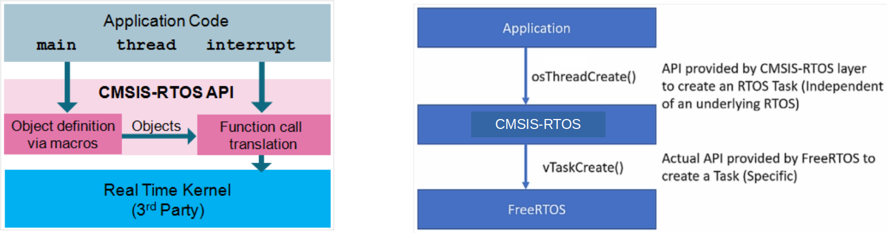
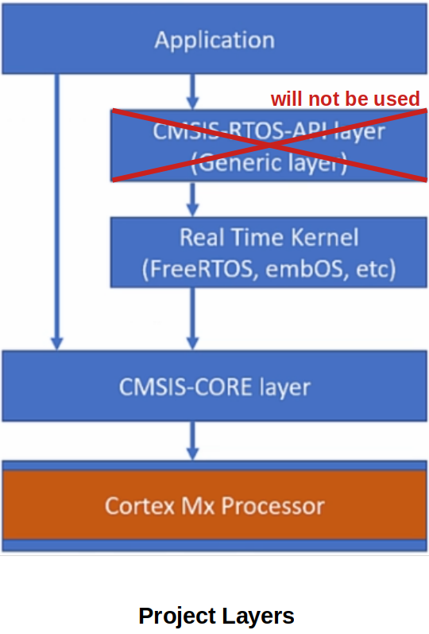
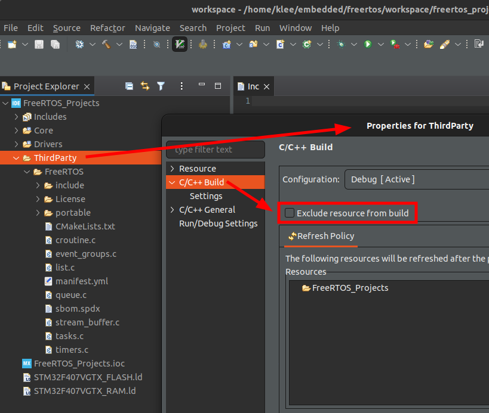
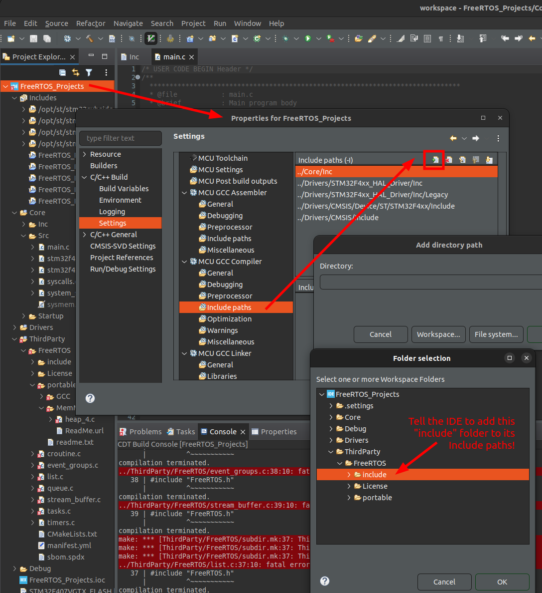
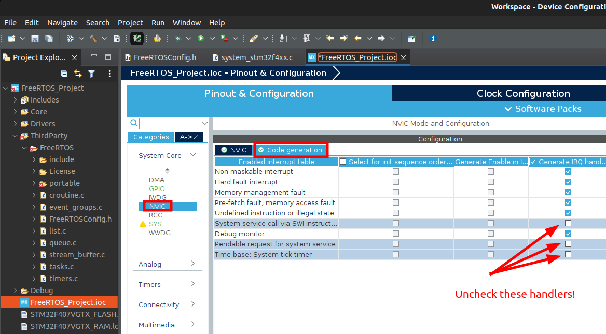
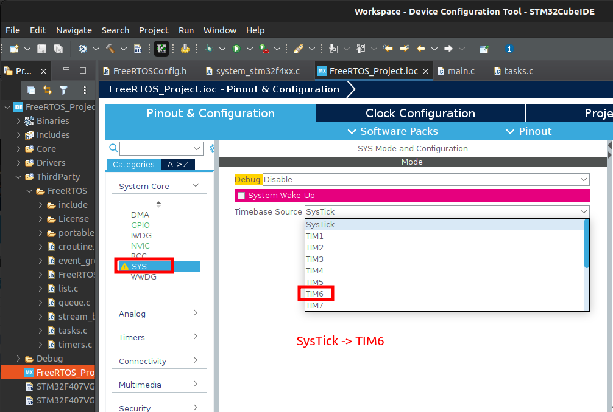
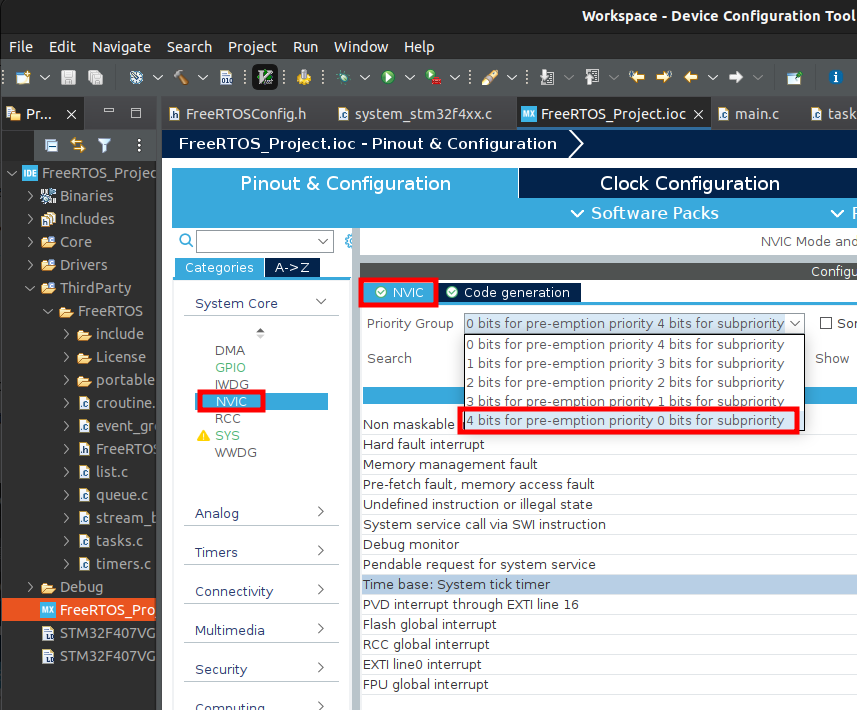

[Home](../../) | [Projects](../../projects) | [Notes](../) > <a href="./">Real-Time Operating Systems (RTOS)</a> > Creating FreeRTOS Project

# Creating FreeRTOS Project


* Before moving on, create a root folder (e.g., `RTOS/`) that contains two folders for the following two contents:
  * `Workspace` - contains project files
  * `Downloads` - contains software and toolchains
* The FreeRTOS kernel version we will be using here is **FreeRTOSv202012.00**.


## Creating FreeRTOS Project using CubeIDE

* Create a project (e.g., `Project`) under `Workspace/` inside the root folder.

  * The project name can be renamed as necessary later on. To rename the project:

    * Rename your project from the STM32CubeIDE (In this step, the IDE will do some syncing)

    * Go to `Workspace/` and rename the directory itself as well

    * Come back to the IDE and refresh the project (In this step, the IDE will notify you that the project has been deleted.)

    * Import the project to the IDE (Import $\to$ Existing Projects into Workspace $\to$ Select root directory $\to$ Click Browse $\to$ Select the project $\to$ Finish)

    > Note that this might not work as expected if this project is being version controlled using Git. Git will insert conflict markers to the renamed project files and you'll have to deal with it!  

* Create a project with the Targeted Project Type `STM32Cube`. Do not select `Empty` since we are not writing bare-metal program. We want to explore FreeRTOS upon working MCU. 

* If the CubeIDE asks you if you wanted to initialize peripherals $\to$ No!

  Why? 

  There could be peripherals (LCD, accelerometer, etc.) connected  internally to some pins on your development board. For example, a sensor on your board that operates over I2C is connected to pins PB6 and PB7.  If you choose to *enable all peripheral in default mode*, the  IDE will configure the pins PB6 and PB7 for I2C to operate the sensor  connected to these pins. The same is valid for other onboard peripherals as well.

  Check your board's manual for clarification.


## Integrating FreeRTOS

* Two ways you can integrate FreeRTOS kernal into your project.

  * **Manual (Without CMSIS RTOS API)**

    $\to$ Know how to do it manually so your knowledge is more portable to other MCUs and different tools.

  * Automatic (With CMSIS RTOS API) - Using STM32Cube device configuration tool

    $\to$ Easier, but only available with the support of tools

  The CMSIS-RTOS API is a generic RTOS interface for Arm® Cortex®-M  processor-based devices. CMSIS-RTOS provides a standardized API for software components that require RTOS functionality and gives therefore  serious benefits to the users and the software industry. [https://www.keil.com/pack/doc/CMSIS/RTOS/html/genRTOSIF.html](https://www.keil.com/pack/doc/CMSIS/RTOS/html/genRTOSIF.html)

  $\to$ We want to skip using CMSIS APIs for the time being since we want to use the FreeRTOS APIs directly from the application.





* Project layout

  * Application layer (`Project/Core/Src`)

  * CMSIS-RTOS API layer will not be used in our project.
  * FreeRTOS layer will be added.
  * CMSIS-CORE layer provides stadard APIs to access Cortex-M processor's basic peripherals. (`Project/Drivers/CMSIS/Include/core_cm4.h`)





* Create `ThirdParty/` (`Project/ThirdParty`)

* Create `FreeRTOS/` (`Project/ThirdParty/FreeRTOS`)

  This folder will contain the compiler information we will be using (i.e., GCC), FreeRTOS kernel source (architecture independent + architecture dependent)

* Copy `License/` from the downloaded kernel source folder into `Project/ThirdParty/FreeRTOS`.

* Copy the FreeRTOS kernel source (the contents of the `Source/` not the folder itself) into `Project/ThirdParty/FreeRTOS`. 

  `portable/` contains architecture-dependent part of the FreeRTOS kernel.

  Everything else is architecture-independent.

* Go to `Project/ThirdParty/FreeRTOS/portable`, delete everything but `GCC/`, `MemMang/`, `readme.txt`.

  Under `GCC/ARM_CM4F/` (i.e., ARM Cortex-M4 with FPU support) are two files `portmacro.h` and `port.c`. These are port codes or architecture-level codes that are necessary to run the FreeRTOS on a specific target hardware architecture.

* Go to `Project/ThirdParty/FreeRTOS/portable/GCC`, delete all the that are not your hardware architecture. (In our case, leave `ARM_CM4F/` only! Trailing 'F' means "with FPU"). 

  This is architecture-dependent part of the FreeRTOS kernel.

* `ThirdParty/` folder properties setting - Uncheck "Exclude resource from build"





* Do the followings going through the `Project/Core/Src` contents.

  * `main.c `- contains the application code

  * `stm32f4xx_it.c `- contains exception handlers

  * `stm32f4xx_hal_msp.c` - contains device initialization code for different peripherals

  * `sysmem.c` - contains heap managment code but will NOT be used in our project since FreeRTOS provides its own heap management code (i.e., `FreeRTOS/portable/MemMang/heap_x.c`)

    Feel free to exclude `sysmem.c` from build. Also, exclude or delete `heap_1.c`, `heap_2.c`, `heap_3.c`, `heap_5.c`, and just keep `heap_4.c`. (Recommend deleting the rest of the `heap_x.c` files to avoid hassle later.)

  * `syscalls.c` - contains standard library system calls such as `__write()`, `__read()`, etc.

* Include paths setting - Now that you've added new folders that include header files needed for the project, you need to tell the IDE where to look for those header files when building the project.

  Add to the "Include paths" the following two paths:

  - `Project/ThirdParty/FreeRTOS/include/`
  - `Project/ThirdParty/FreeRTOS/portable/GCC/ARM_CM4F/` (Architecture specific header files)





* Create the `FreeRTOSConfig.h` file which contains the FreeRTOS kernel configuration information. It is a configuration header file used to customize the FreeRTOS kernel. This file is application-specific so does not come with the FreeRTOS kernel download. You need to create it and added it to the project on your own. (Reference: [https://freertos.org/a00110.html](https://freertos.org/a00110.html)) `FreeRTOSConfig.h` also contains architecture-specific configuration items so one for a project will not work for a different architecture.

  For the time being, we will import a configuration file from a demo proejct provided by the freertos.org for different microcontrollers. Search for your microcontroller (e.g., stm32f407) in `Downloads/FreeRTOSv202012.00/FreeRTOS/Demo/` and copy the corresponding `FreeRTOSConfig.h` file into `Project/ThirdParty/FreeRTOS/`. The one provided for the same microcontroller (stm32f407 in our case) should work.

  **Don't forget to add its path `Project/ThirdParty/FreeRTOS/` to the "Include paths"!**

  `FreeRTOSConfig.h` example: It is basically a C header file (.h) with bunch of configurable definitions.

  Note that some configurations are processor-dependent (Interrupt nesting behaviour configuration) and this is why a `FreeRTOSConfig.h` file for one processor architecture may not be used for a different architecture.

  ```c
  /* FreeRTOSConfig.h example */
  
  #ifndef FREERTOS_CONFIG_H
  #define FREERTOS_CONFIG_H
  
  /* Here is a good place to include header files that are required across
  your application. */
  #include "something.h"
  
  #define configUSE_PREEMPTION                    1
  #define configUSE_PORT_OPTIMISED_TASK_SELECTION 0
  #define configUSE_TICKLESS_IDLE                 0
  #define configCPU_CLOCK_HZ                      60000000
  #define configSYSTICK_CLOCK_HZ                  1000000
  #define configTICK_RATE_HZ                      250
  #define configMAX_PRIORITIES                    5
  #define configMINIMAL_STACK_SIZE                128
  #define configMAX_TASK_NAME_LEN                 16
  #define configUSE_16_BIT_TICKS                  0
  #define configIDLE_SHOULD_YIELD                 1
  #define configUSE_TASK_NOTIFICATIONS            1
  #define configTASK_NOTIFICATION_ARRAY_ENTRIES   3
  #define configUSE_MUTEXES                       0
  #define configUSE_RECURSIVE_MUTEXES             0
  #define configUSE_COUNTING_SEMAPHORES           0
  #define configUSE_ALTERNATIVE_API               0 /* Deprecated! */
  #define configQUEUE_REGISTRY_SIZE               10
  #define configUSE_QUEUE_SETS                    0
  #define configUSE_TIME_SLICING                  0
  #define configUSE_NEWLIB_REENTRANT              0
  #define configENABLE_BACKWARD_COMPATIBILITY     0
  #define configNUM_THREAD_LOCAL_STORAGE_POINTERS 5
  #define configUSE_MINI_LIST_ITEM                1
  #define configSTACK_DEPTH_TYPE                  uint16_t
  #define configMESSAGE_BUFFER_LENGTH_TYPE        size_t
  #define configHEAP_CLEAR_MEMORY_ON_FREE         1
  
  /* Memory allocation related definitions. */
  #define configSUPPORT_STATIC_ALLOCATION             1
  #define configSUPPORT_DYNAMIC_ALLOCATION            1
  #define configTOTAL_HEAP_SIZE                       10240
  #define configAPPLICATION_ALLOCATED_HEAP            1
  #define configSTACK_ALLOCATION_FROM_SEPARATE_HEAP   1
  
  /* Hook function related definitions. */
  #define configUSE_IDLE_HOOK                     0
  #define configUSE_TICK_HOOK                     0
  #define configCHECK_FOR_STACK_OVERFLOW          0
  #define configUSE_MALLOC_FAILED_HOOK            0
  #define configUSE_DAEMON_TASK_STARTUP_HOOK      0
  #define configUSE_SB_COMPLETED_CALLBACK         0
  
  /* Run time and task stats gathering related definitions. */
  #define configGENERATE_RUN_TIME_STATS           0
  #define configUSE_TRACE_FACILITY                0
  #define configUSE_STATS_FORMATTING_FUNCTIONS    0
  
  /* Co-routine related definitions. */
  #define configUSE_CO_ROUTINES                   0
  #define configMAX_CO_ROUTINE_PRIORITIES         1
  
  /* Software timer related definitions. */
  #define configUSE_TIMERS                        1
  #define configTIMER_TASK_PRIORITY               3
  #define configTIMER_QUEUE_LENGTH                10
  #define configTIMER_TASK_STACK_DEPTH            configMINIMAL_STACK_SIZE
  
  /* Interrupt nesting behaviour configuration. */
  #define configKERNEL_INTERRUPT_PRIORITY         [dependent of processor]
  #define configMAX_SYSCALL_INTERRUPT_PRIORITY    [dependent on processor and application]
  #define configMAX_API_CALL_INTERRUPT_PRIORITY   [dependent on processor and application]
  
  /* Define to trap errors during development. */
  #define configASSERT( ( x ) ) if( ( x ) == 0 ) vAssertCalled( __FILE__, __LINE__ )
  
  /* FreeRTOS MPU specific definitions. */
  #define configINCLUDE_APPLICATION_DEFINED_PRIVILEGED_FUNCTIONS 0
  #define configTOTAL_MPU_REGIONS                                8 /* Default value. */
  #define configTEX_S_C_B_FLASH                                  0x07UL /* Default value. */
  #define configTEX_S_C_B_SRAM                                   0x07UL /* Default value. */
  #define configENFORCE_SYSTEM_CALLS_FROM_KERNEL_ONLY            1
  #define configALLOW_UNPRIVILEGED_CRITICAL_SECTIONS             1
  #define configENABLE_ERRATA_837070_WORKAROUND   1
  
  /* ARMv8-M secure side port related definitions. */
  #define secureconfigMAX_SECURE_CONTEXTS         5
  
  /* Optional functions - most linkers will remove unused functions anyway. */
  #define INCLUDE_vTaskPrioritySet                1
  #define INCLUDE_uxTaskPriorityGet               1
  #define INCLUDE_vTaskDelete                     1
  #define INCLUDE_vTaskSuspend                    1
  #define INCLUDE_xResumeFromISR                  1
  #define INCLUDE_vTaskDelayUntil                 1
  #define INCLUDE_vTaskDelay                      1
  #define INCLUDE_xTaskGetSchedulerState          1
  #define INCLUDE_xTaskGetCurrentTaskHandle       1
  #define INCLUDE_uxTaskGetStackHighWaterMark     0
  #define INCLUDE_uxTaskGetStackHighWaterMark2    0
  #define INCLUDE_xTaskGetIdleTaskHandle          0
  #define INCLUDE_eTaskGetState                   0
  #define INCLUDE_xEventGroupSetBitFromISR        1
  #define INCLUDE_xTimerPendFunctionCall          0
  #define INCLUDE_xTaskAbortDelay                 0
  #define INCLUDE_xTaskGetHandle                  0
  #define INCLUDE_xTaskResumeFromISR              1
  
  /* A header file that defines trace macro can be included here. */
  
  #endif /* FREERTOS_CONFIG_H */
  ```

  > If a configuration item is set to 0, the corresponding code block will not be included when generating the FreeRTOS kernel.

* At this point, you will be left with a couple of build errors. At the time wring this notes, I had to do the following modification to resolve `'SystemCoreClock' undeclared` error.

  ```c
  /* FreeRTOSConfig.h - BEFORE modification */
  
  /* Ensure stdint is only used by the compiler, and not the assembler. */
  #ifdef __ICCARM__
  	#include <stdint.h>
  	extern uint32_t SystemCoreClock;
  #endif
  ```

  > Section only defined for IAR compiler. However, we'll be using GCC compiler. So let's allow multiple compilers.

  ```c
  /* FreeRTOSConfig.h - AFTER modification */
  
  /* Ensure stdint is only used by the compiler, and not the assembler. */
  #if defined(__ICCARM__) || defined(__GNUC__) || defined(__CC_ARM)
  	#include <stdint.h>
  	extern uint32_t SystemCoreClock;
  #endif
  ```

  > `__ICCARM__` - IAR compiler
  >
  > `__GNUC__` - GCC compiler
  >
  > `__CC_ARM` - ARM's native compiler

* Next errors left were caused by redefinition of `SVC_Handler`, `PendSV_Handler`, `SysTick_Handler`. These are defined in both `Project/ThirdParty/FreeRTOS/portable/GCC/ARM_CM4F/port.c` and `Project/Core/Src/stm32f4xx_it.c` (Actual `#define` for these handlers were found in `Project/ThirdParty/FreeRTOS/FreeRTOSConfig.h`).

  Solution is to remove those definitions of redefined handlers from `stm32f4xx_it.c` because this file is what CubeIDE generated for us for our convenience and is not project specific. We need to use the handlers defined in `port.c`.

  Use "Device Configuration Tool" to remove them. (Of course you can remove it manually from the code, but when you've selected to use Device Configuration Tool, it is not suggested for probable conflicts.)

  Then, save and regenerate the code!





* The last errors left were fixed by turning off `configUSE_TICK_HOOK`, `configUSE_MALLOC_FAILED_HOOK`, and `configCHECK_FOR_STACK_OVERFLOW`. (Set their `#define` values to 0.)
* Build success! $\to$ But, this does not mean that our project is ready to run on the target!


## Timebase Source Selection

* FreeRTOS uses ARM Cortex-M processor's internal SysTick timer as its timebase (RTOS ticking). 

* STM32 Cube HAL layer also by deafult uses SysTick timer as its timebase source.

* If you are using both FreeRTOS and STM32 Cube HAL layer in your project, there will be a conflict in using a timebase source.

* To resolve this, it is strongly recommended that you 

  * USe SysTick timer for FreeRTOS only
  * Use any other timer peripheral of the microcontroller than SysTick Timer for STM32 Cube HAL layer

  Open "Device Configuration Tool",

  * SYS $\to$ Switch timebase source to TIM6

  * NVIC $\to$ Priority Group $\to$ 4 bits for pre-emption priority 0 bits for subpriority

    In ARM Cortex-M processors, the hardware priority is implemented using 4 bits. (These 4 bits can be divided into sub priority but let's not use subpriority at this point.)

  






* Then, Project $\to$ Generate Code. 

  Successful if `stm32f4xx_hal_timebase_tim.c` has been generated under `Src/`. This file initializes the TIM6 (Timer 6) to generate time base every 1 ms.

* Build success? $\to$ Integration of FreeRTOS to STM32 project is almost done!


## Other Things to Note

* When you update settings by using "Device Configuration Tool", CubeIDE will regenerate your code. So, it is important that you insert your code only within the section where it says:

  ```c
  /* USER CODE BEGIN XXX */
  
  /* USER CODE END XXX */
  ```

  Any code written outside these sections may get wiped out by the code generation engine of the IDE!


## References

Nayak, K. (2022). *Mastering RTOS: Hands on FreeRTOS and STM32Fx with Debugging* [Video file]. Retrieved from https://www.udemy.com/course/mastering-rtos-hands-on-with-freertos-arduino-and-stm32fx/

