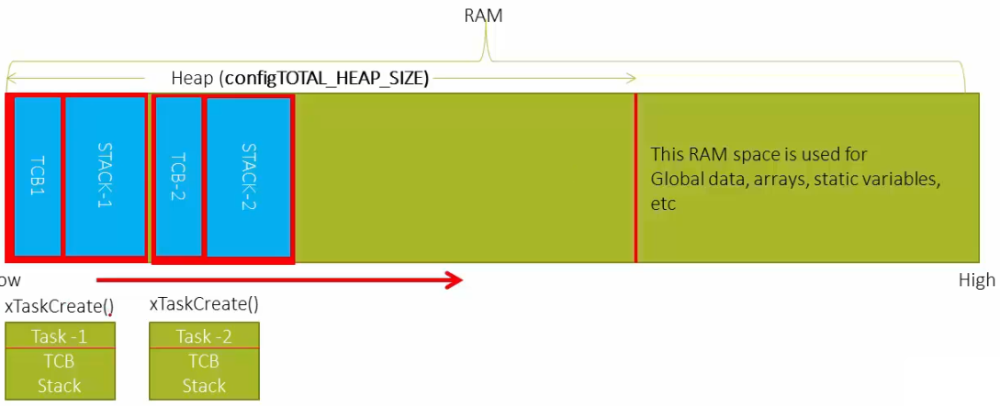
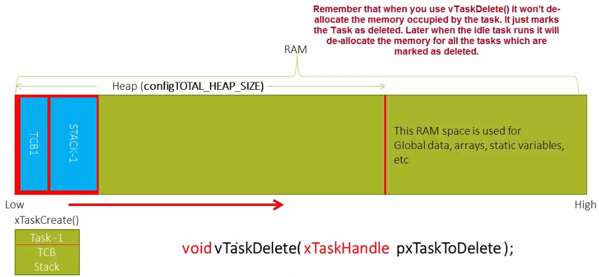

[Home](../../) | [Projects](../../projects) | [Notes](../) > <a href="./">Real-Time Operating Systems (RTOS)</a> > Deleting a Task

# Deleting a Task

## Creating a Task

* `xTaskCreate()` is used to create a task.

## Deleting a Task

* `vTaskDelete()` is used to delete a task.

  This API just mark the task as "deleted" and does NOT free the memory the task is occupying. It is the responsibility of the **Idle task** to free the deleted task's memory.

* Due to the nature of RTOS, tasks do not get deleted most of the time. Instead, tasks that are not necessary are moved to the Blocked or Suspended state so it can wait without consuming CPU cycles. However, if, by any chance, you need to delete a task, this is the way to go.

## References

Nayak, K. (2022). *Mastering RTOS: Hands on FreeRTOS and STM32Fx with Debugging* [Video file]. Retrieved from https://www.udemy.com/course/mastering-rtos-hands-on-with-freertos-arduino-and-stm32fx/

