[Home](../../) | [Projects](../../projects) | [Notes](../) > <a href="./">Real-Time Operating Systems (RTOS)</a> > Exercise: FreeRTOS `FromISR` & Task Priority (`06_LED_Button_ISR`, `07_Task_Priority`)

# Exercise: FreeRTOS `FromISR` & Task Priority (`06_LED_Button_ISR`, `07_Task_Priority`)


## Exercise: FreeRTOS `FromISR` (`06_LED_Button_ISR`)

### Problem Statement

* Implement ISR-to-task notification using direct notification APIs of FreeRTOS.

  Create 3 tasks that toggle 3 different LEDs of the STM32F407 Discovery board.

  Upon the button press, the button interrupt handler must run, and it should send the notification to the current LED toggling task.

  When LED toggling task receives the notification, it should delete itself.
  
* Since we are using the interrupt handler which runs in the Handler Mode (interrupt context) unlike in the previous exercise where the button task ran in the Thread Mode (process context), we need to use the different version of task notification API. That is, the `xTaskNotifyFromISR()`.


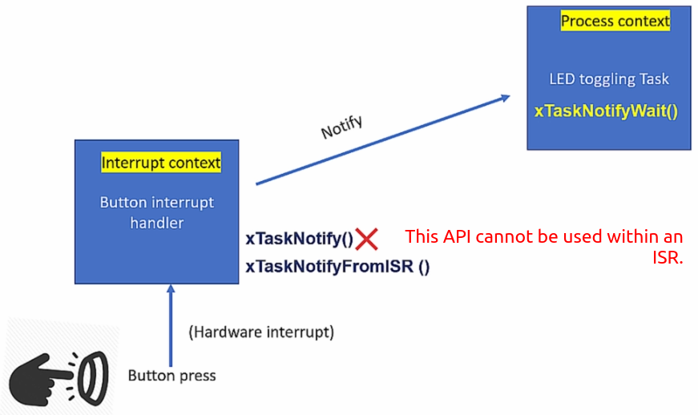


### Project Setup

* Go through all the process you went through to setup the **Exercise: 005_LED_Task_Notify**.
* Do the following GPIO configuration.


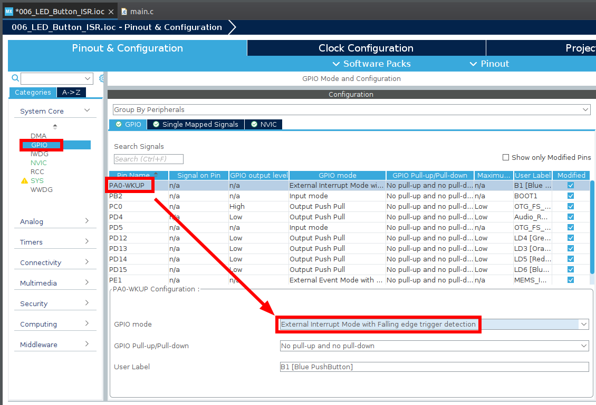


* GPIO `PA0` is connected to `EXTI line0 interrupt`. So do the following setup.


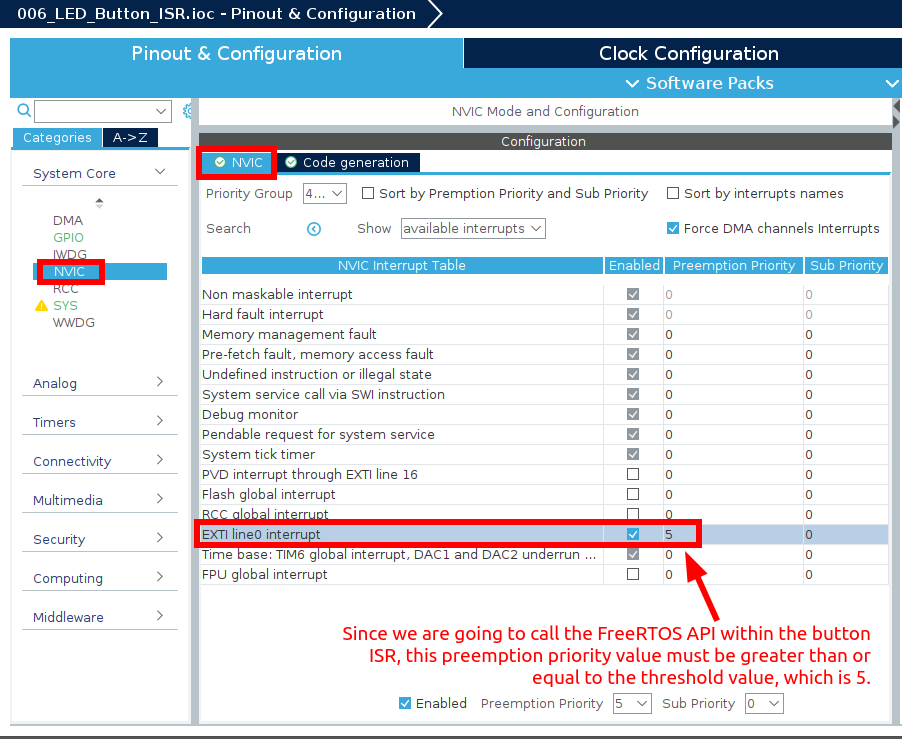


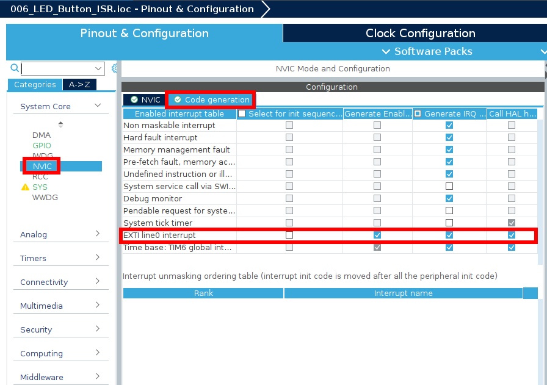


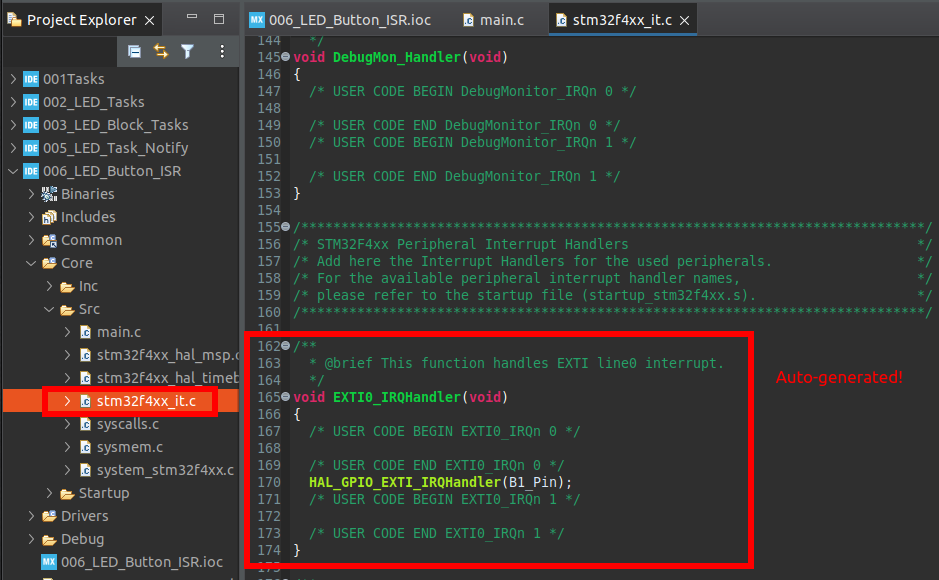


* Call `button_interrupt_handler()` from `EXTI0_IRQHandler()` shown in the file above and implement it in `main.c`. (Make sure to declare this function as `extern` in the file.)

  Also, clear the pending bit for `GPIO_PIN_0`.

  ```c
  /* stm32f4xx_it.c */
  ...
  void EXTI0_IRQHandler(void)
  {
    /* USER CODE BEGIN EXTI0_IRQn 0 */
    button_interrupt_handler();
      
    // clear EXTI 0 pending bit in the exti pending register
    HAL_GPIO_EXTI_IRQHandler(GPIO_PIN_0);
    /* USER CODE END EXTI0_IRQn 0 */
    ...
  }
  ```

  > In my case, `HAL_GPIO_EXTI_IRQHandler(B1_Pin)` was already there generated in the code as shown in the snapshot above. (`B1_Pin` is defined as `GPIO_PIN_0`)

* Implement `button_interrupt_handler()`.

  ```c
  /* main.c */
  ...
      
  /* USER CODE BEGIN 4 */
  
  void button_interrupt_handler(void)
  {
  	traceISR_ENTER(); // to monitor the entry of the ISR from the SEGGER SystemView
  	xTaskNotifyFromISR(next_task_handle, 0, eNoAction, NULL);
  	traceISR_EXIT();
  }
  
  ...
  ```

* Update `led_green_handler()`. Here, the shared variable `next_task_handle` is also shared with the ISR which is not a user task, so synchronizing the access to this variable using `vTaskSuspendAll()`/`vTaskResumeAll()` will not work!

  Use `portENTER_CRITICAL()`/`portEXIT_CRITICAL()` which is implemented as `vPortEnterCritical()` in `port.c` instead. This will disable interrupts. However, in general, disabling interrupts is not recommended. If this is the case, use **mutex** or **semaphore** instead.

  ```c
  /* main.c */
  ...
  static void led_green_task_handler(void *parameters)
  {
  	BaseType_t status;
  
  	while (1)
  	{
  		SEGGER_SYSVIEW_PrintfTarget("Toggling green LED");
  		HAL_GPIO_TogglePin(GPIOD, LED_GREEN_PIN);
  
  		// If there's no notifications pending, go to the BLOCKED state for 1 sec
  		// until it receives a notification.
  		status = xTaskNotifyWait(0, 0, NULL, pdMS_TO_TICKS(1000));
  
  		if (status == pdTRUE)
  		{
  			// If there was a notification (i.e., User has pressed the button),
  			// update the 'next_task_handle', turn the LED on, and delete itself.
  			portENTER_CRITICAL();		// Synchronization begins
  			next_task_handle = led_orange_task_handle;
  			HAL_GPIO_WritePin(GPIOD, LED_GREEN_PIN, GPIO_PIN_SET);
  			SEGGER_SYSVIEW_PrintfTarget("Delete Green LED Task");
  			portEXIT_CRITICAL();		// Synchronization ends
  			vTaskDelete(NULL);
  		}
  	}
  }
  ```

  > `vPortEnterCritical()` calls `portDISABLE_INTERRUPTS()` which disables all the interrupts with priority values [`configMAX_SYSCALL_INTERRUPT_PRIORITY`, 0xF], [0x5, 0xF] in our case. Interrupts with the priority values within range [0x0, 0x4] are not affected. Note that any interrupt handler that is of higher priority (i.e., lower priority value) than `configMAX_SYSCALL_INTERRUPT_PRIORITY` cannot use the FreeRTOS API within it.
  >
  > ```c
  > /* Project/Common/ThirdParty/FreeRTOS/portable/GCC/ARM_CM4F/portmacro.h */
  > ...
  > #define portDISABLE_INTERRUPTS()                  vPortRaiseBASEPRI()
  > ...
  > 
  > portFORCE_INLINE static void vPortRaiseBASEPRI( void )
  > {
  >     uint32_t ulNewBASEPRI;
  > 
  >     __asm volatile
  >         (
  >         "	mov %0, %1												\n"\
  >         "	msr basepri, %0											\n"\
  >         "	isb														\n"\
  >         "	dsb														\n"\
  >         : "=r" ( ulNewBASEPRI ) : "i" ( configMAX_SYSCALL_INTERRUPT_PRIORITY ) : "memory"
  >     );
  > }
  > ```
  >
  > Since the interrupt handlers used for the context switching (e.g., `PendSVHandler()`) has the lowest priority (i.e., highest priority value), it will also be disabled by the call `portDISABLE_INTERRUPTS`.

* If you are copying the `main.c` from the previous exercise, make sure to remove everything related to `button_handler` since we are no longer using that task to send notification upon button press. We are using ISR in this exercise.

* Analyze using SEGGER SystemView.

  I faced a problem with this exercise. Left the question on the Q&A board.
  
  > Strange! This issue did not appear on the 2nd implementation.


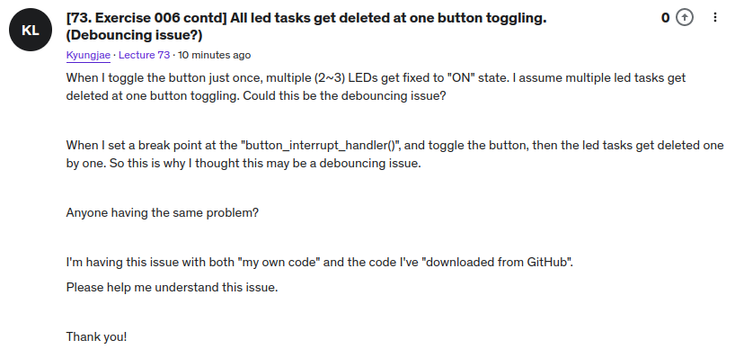


### SEGGER SystemView Analysis


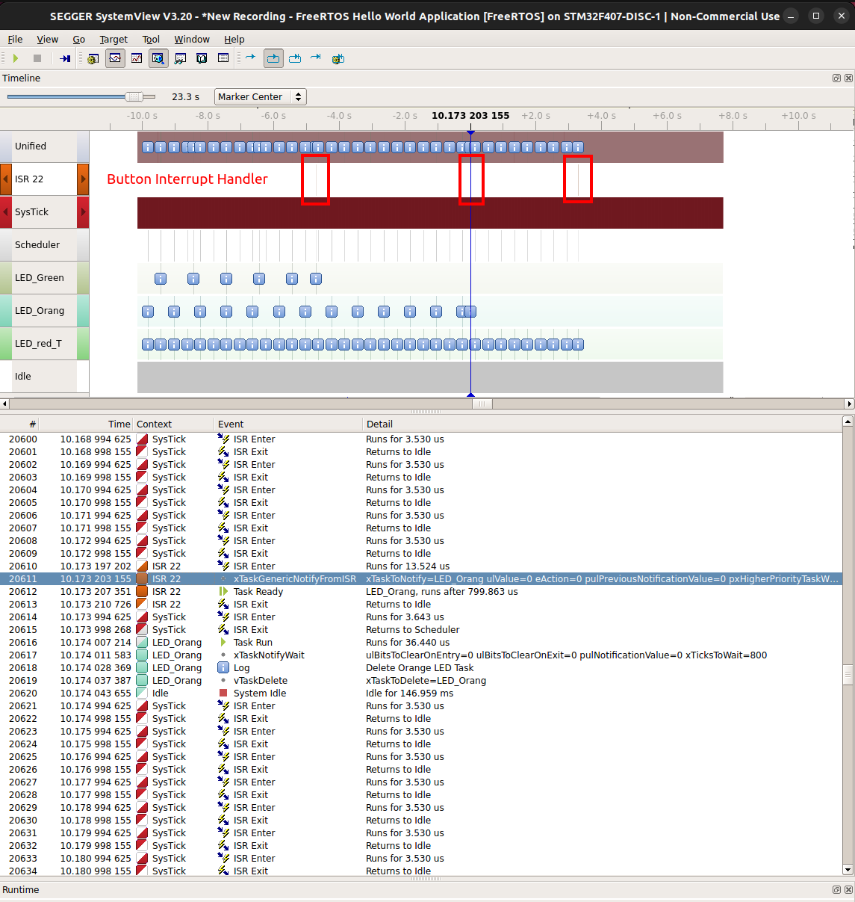

> In `ISR 22` 22 means the ISR number.


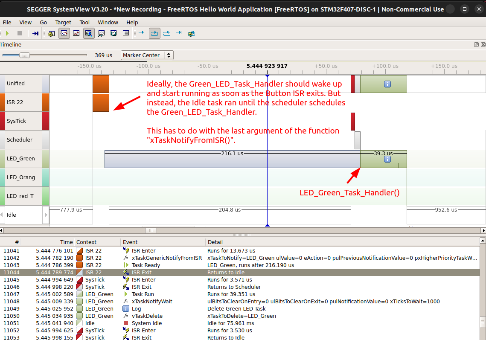

> Solution:
>
> ```c
> /* main.c */
> ...
> void button_interrupt_handler(void)
> {
> 	BaseType_t pxHigherPriorityTaskWoken = pdFALSE; // Must be initialized to 0
> 	
> 	traceISR_ENTER(); // To monitor the entry of the ISR from the SEGGER SystemView
> 	xTaskNotifyFromISR(next_task_handle, 0, eNoAction, &pxHigherPriorityTaskWoken);
> 		// xTaskNotifyFromISR() will set *pxHigherPriorityTaskWoken to pdTRUE 
> 		// if sending the notification caused a task to unblock, and the unblocked
> 		// task has a priority higher than the currently running task.
> 		//
> 		// If xTaskNotifyFromISR() sets this value to pdTRUE then a context switch 
> 		// should be requested before the interrupt is exited.
> 		// 
> 		// pxHigherPriorityTaskWoken is an optional parameter and can be set to NULL. 
>     
> 	// Once the ISR exits, the macro below makes the higher priority task unblocked
> 	// to resume on the CPU.
> 	portYIELD_FROM_ISR(pxHigherPriorityTaskWoken);
> 	traceISR_EXIT();
> }
> ```
>
> 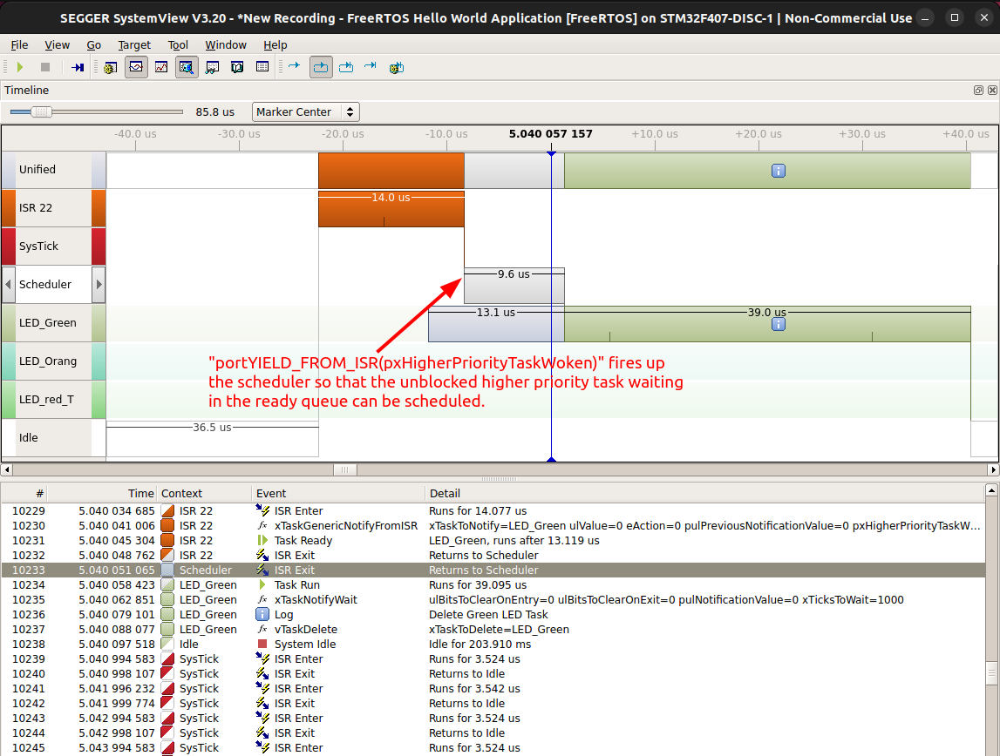


## Exercise: Task Priority (`07_Task_Priority`)

* Write an application that creates 2 tasks:

  * Task-1 
    * Priority value: 2
    * Continuous task
    * Toggles the red LED with 100 ms ON/OFF duration 
  * Task-2 
    * Priority value: 3
    * Continuous task
    * Toggles the green LED with 1 s ON/OFF duration 

  When the user button is pressed, the priority of the tasks should be exchanged. (i.e., Task-1's priority must be reconfigured for Task-2's priority and vice versa.)

* Check the following 2 APIs that helps reconfiguring the FreeRTOS value of a task.
  * `uxTaskPriorityGet()`
  * `vTaskPrioritySet()`

* Error fixes!


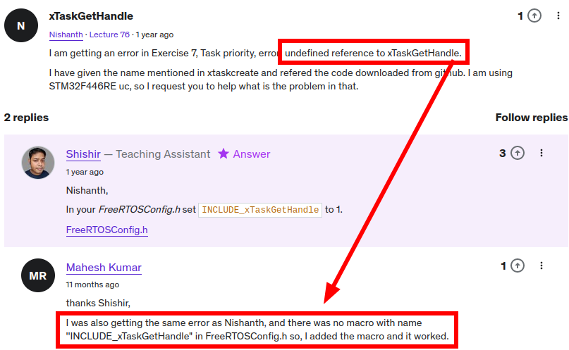


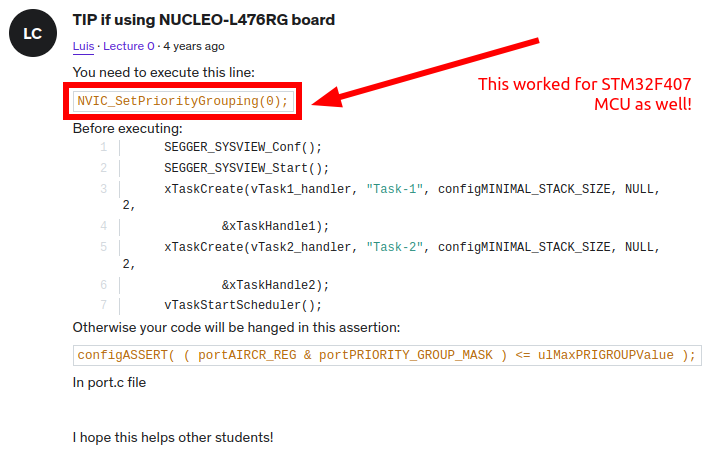


### SEGGER SystemView Analysis


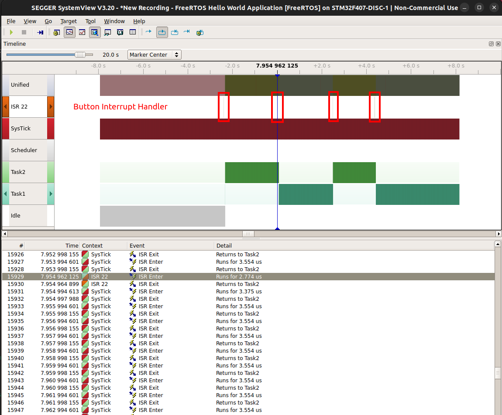


## Review Questions

1. Lets say the Task-1 is executing on the CPU whose Priority is 3 . Now processor hits with an interrupt of the USART Tx whose priority is 2 , will Task1 be preempted? (Assume lower priority value = lower priority)

   $\to$ Yes ! Thread mode executions can always be preempted irrespective of their priorities by the hardware interrupts which execute in the handler mode.

2. Lets say USART TX interrupt is being serviced by the processor whose priority is 2 , now another interrupt is pended whose priority is 5, Do you think processor will preempt the USART TX ISR to attend the ISR of  newly pended interrupt ? in other words do you think interrupt nesting  will happen? (Assume lower priority value = lower priority)

   $\to$ Yes ! Interrupt nesting should happen, because priority of the second interrupt is higher than the 1st interrupt.

3. Lets say in freeRTOS , Task1( priority )= 5 is currently executing on the CPU, if Task2(priority)= 6 unblocks due to some reason, will context switch take place to task 2 immediately or task 2 should wait until the next tick interrupt?

   $\to$ Yes, in FreeRTOS whoever unblocks the blocked task should also check whether the unblocked task has got the higher priority than the currently running task. If true, then task yield function has to be called to make sure that, the newly unblocked higher priority task immediately takes  over the CPU. 

4. In which processor mode FreeRTOS tasks will be executing in the ARM Cortex-Mx processor?

   $\to$ Thread mode of the Processor

5. If 6 bits are implemented in the priority register of the MCU, then how many interrupts levels are available? What is the highest priority level and lowest priority level?

   $\to$ 64, 0x00, 0xFC

6. Does having more priority levels affect RAM usage of the MCU?

   $\to$ Yes ! Let’s say in a MCU there are 8 priority levels from 0 to 7, that  means at the worst case 8 interrupts can nest isn’t it ? That means at  the worst case 7 stack frames are moved to the stack memory . So, 7 *  sizeof(each stack frame) number of bytes will be consumed. So, more nesting means more stack consumption.


## References

Nayak, K. (2022). *Mastering RTOS: Hands on FreeRTOS and STM32Fx with Debugging* [Video file]. Retrieved from https://www.udemy.com/course/mastering-rtos-hands-on-with-freertos-arduino-and-stm32fx/
