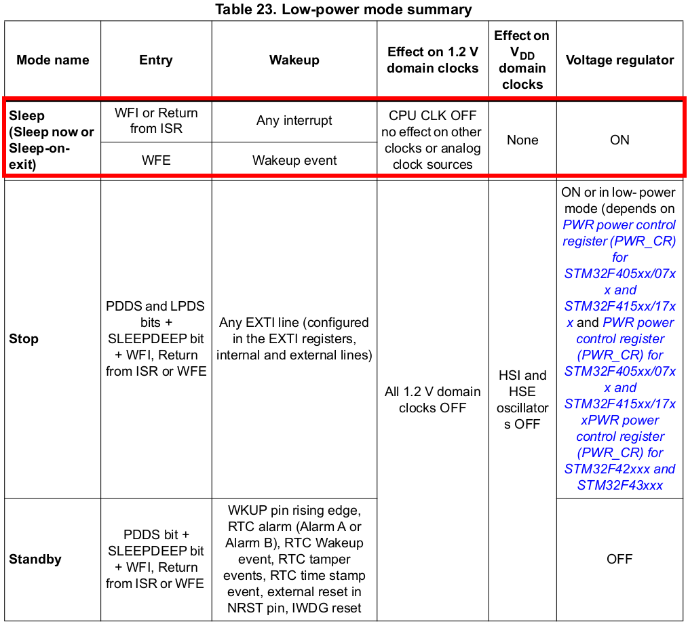
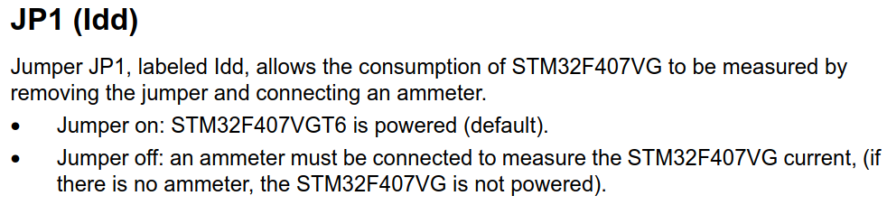

[Home](../../) | [Projects](../../projects) | [Notes](../) >  <a href="./">Real-Time Operating Systems (RTOS)</a> > Exercise: FreeRTOS Hook Functions

# Exercise: FreeRTOS Hook Functions


## Problem Statement

* Write a program to send MCU to go to sleep mode when the idle task is scheduled to run on the CPU, and measure the current.
* Hint: Begin with the project `03_LED_Task_Delay`, enable the configuration item `configUSE_IDLE_HOOK` defined in the `FreeRTOSConfig.h` and implement the `vApplicationIdleHook()` in the application.
* Low power mode:




> WFI (Wait For Interrupt) makes the processor suspended execution (Clock is stopped) until one of the following events take place:
>
> * An IRQ interrupt
> * An FIQ interrupt
> * A Debug Entry request made to the processor
>
> ```c
> /* Project/Drivers/STM32F4xx_HAL_Driver/Src/stm32f4xx_hal_pwr.c */
> 
> /**
>   * @brief Enters Sleep mode.
>   *   
>   * @note In Sleep mode, all I/O pins keep the same state as in Run mode.
>   * 
>   * @note In Sleep mode, the systick is stopped to avoid exit from this mode with
>   *       systick interrupt when used as time base for Timeout 
>   *                
>   * @param Regulator Specifies the regulator state in SLEEP mode.
>   *            This parameter can be one of the following values:
>   *            @arg PWR_MAINREGULATOR_ON: SLEEP mode with regulator ON
>   *            @arg PWR_LOWPOWERREGULATOR_ON: SLEEP mode with low power regulator ON
>   * @note This parameter is not used for the STM32F4 family and is kept as parameter
>   *       just to maintain compatibility with the lower power families.
>   * @param SLEEPEntry Specifies if SLEEP mode in entered with WFI or WFE instruction.
>   *          This parameter can be one of the following values:
>   *            @arg PWR_SLEEPENTRY_WFI: enter SLEEP mode with WFI instruction
>   *            @arg PWR_SLEEPENTRY_WFE: enter SLEEP mode with WFE instruction
>   * @retval None
>   */
> void HAL_PWR_EnterSLEEPMode(uint32_t Regulator, uint8_t SLEEPEntry)
> {
>   /* Check the parameters */
>   assert_param(IS_PWR_REGULATOR(Regulator));
>   assert_param(IS_PWR_SLEEP_ENTRY(SLEEPEntry));
> 
>   /* Clear SLEEPDEEP bit of Cortex System Control Register */
>   CLEAR_BIT(SCB->SCR, ((uint32_t)SCB_SCR_SLEEPDEEP_Msk));
> 
>   /* Select SLEEP mode entry -------------------------------------------------*/
>   if(SLEEPEntry == PWR_SLEEPENTRY_WFI)
>   {   
>     /* Request Wait For Interrupt */
>     __WFI();
>   }
>   else
>   {
>     /* Request Wait For Event */
>     __SEV();
>     __WFE();
>     __WFE();
>   }
> }
> ```


## Analysis

* In the case of `03_LED_Task_Delay` project where the processor was never sent to the low-power mode while running the idle task, the current was measured at around **60 mA**.

  But in this project (`08_Idle_Hook`) where the processor was sent to the low-power mode by using the Idle Hook function, the current was measured at around **20 mA**. (**Less power consumption!**)

* How to measure the current of STM32F407G-Discovery board? See the section 6.8 of "Discovery kit with STM32F407G MCU" manual.

  

  


## References

Nayak, K. (2022). *Mastering RTOS: Hands on FreeRTOS and STM32Fx with Debugging* [Video file]. Retrieved from https://www.udemy.com/course/mastering-rtos-hands-on-with-freertos-arduino-and-stm32fx/

