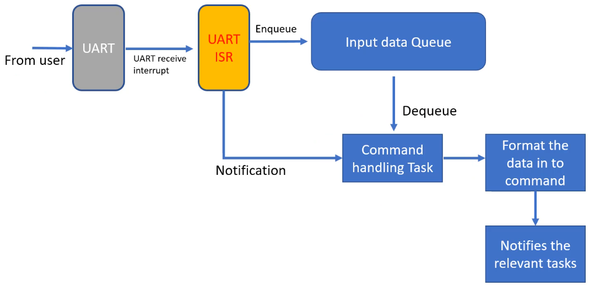

[Home](../../) | [Projects](../../projects) | [Notes](../) >  <a href="./">Real-Time Operating Systems (RTOS)</a> > Exercise: Queues and Timers (`09_Queues_and_Timers`)

# Exercise: Queues and Timers (`09_Queues_and_Timers`)


## Problem Statement

* Write a FreeRTOS application that takes input (commands) from the user over USART and handles LED and real-time clock (RTC) peripheral of the microcontroller.
* This application implements:
  1. Processing user sent commands over USART
  2. Handling of FreeRTOS queues
     * Print queue
     * Input data queue
  3. FreeRTOS software timers

### 5 FreeRTOS tasks to implement and the Application Flow

* **Menu task**
  * Sends the pointer to the message to be printed on the console to the "print queue".
  * It does not directly control the USART peripheral.
* **LED task**
* **RTC task**


* **Print task**
  * Receives from the "print queue" the pointer to the message to be printed.
  * The only task to control the USART peripheral to handle writing data to the console


* **Command handling task**
  * Whenever the USART ISR detects a new line character `\n`, it will send a notification to the "command handling task." Subsequently, the "command handling task" will dequeue the entire command from the "input data queue" and format the data into a command. And then, this command will notify the relevant tasks. 





### Receiving Data from User

* Enable USART data reception (byte-by-byte) in IT mode (`HAL_UART_Receive_IT()`)
  * Byte-by-byte reception since the length of the data to be received is not known.
* Implement USART receive complete callback (`HAL_UART_RxCpltCallback()` which is defined as a `__weak` function in `stm32f4xx_hal_uart.c`) in `main.c`.  (Since this callback is called from the USART interrupt handler, it will run in the handler mode of the processor.)
  * Store the data byte into input data queue
  * When `\n` is detected, notify the command handling task (`cmd_task`)

### Guideline

1. Create a new project

2. Create `main.c`, `task_hanlder.c`, `led_effect.c`, and `rtc.c`

3. In the main function, create:

   * 5 tasks (use the same priority for all tasks $\to$ 2)

     ```c
     /* Example */
     
     status = xTaskCreate(menu_task, "menu_task", 250, NULL, 2, &handle_menu_task);
     ```

   * 2 queues


## Project Setup

* Go to the "Device Configuration Tool" and check the followings:

  * In the "GPIO" section, check if `PD12`, `PD13`, `PD14`, and `PD15`, are configured as:

    * "Output Push Pull" mode
    * "No pull-up and pull-down"

  * In the "USART2" section,

    * Change mode to "Asynchronous"
    * "NVIC Settings" tab $\to$ Enable USART2 global interrupt  (Whenever the data is received from the user, this interrupt will get triggered.)

  * In the "SYS" section, change the timebase to anything other than the SysTick timer. (e.g., TIM6)

  * In the "NVIC" section,

    * Enable the USART2 global interrupt and give it a preemption priority of 5. (Any value >= 5)

      

    * Make sure that the "SysTick interrupt", "PendSV interrupt" and "SVC interrupt" generations are disabled, and the "USART2 global interrupt" generation is enabled.

      

  * In the "RTC" section,

    * Activate the clock source and change the "Hour Format" to "Hourformat 12"

      

  * Now, save the configuration and generate the code.

* In this project, we are using USART2 for communication. Therefore, we are not going to be using the SEGGER SystemView for this project. Go ahead and exclude the `Project/Common/ThirdParty/SEGGER/` folder from build.

  > Make sure to remove or comment out `#include "SEGGER_SYSVIEW_FreeRTOS.h` from the `FreeRTOSConfig.h` file to remove the compilation errors.

* Create (or import `FreeRTOSConfig.h`) file into the project. And, make sure the following items are enabled:

  ```c
  /* Project/Core/Inc/FreeRTOSConfig.h */
  
  ...
  #define configUSE_PREEMPTION			1
  ...
  #define configUSE_TIMERS				1	// Since we are using the software timer
  
  ```

* Import the include paths settings.


## Implementation

See the source code: [https://github.com/kyungjae-lee/freertos-projects/tree/main/Workspace/09_Queues_and_Timers](https://github.com/kyungjae-lee/freertos-projects/tree/main/Workspace/09_Queues_and_Timers).


## Review Questions

1. What can be used for inter task communication?

   $\to$ Semaphore, Queues, Pipes, Message Queues, etc.

2. Let's say a queue is full, and a task1 of priority 5 was blocked on a queue while its attempt to write on that queue, now lets say task2 of  priority 3 removes a data item from that queue. Do you think the moment task 2 removes a data item, it will be preempted by task 1?

   $\to$ Yes, Task2 will be preempted by Task1 the moment it removes the data item from the queue. (It does not wait till the next kernel tick.)

3. Can the Queue APIs be called from ISR in FreeRTOS?

   $\to$ Yes, but its ISR versions must be used

4. Are the Queue APIs ending with "FromISR" allowed to do task yielding?

   $\to$ No

5. Can a task block on a queue indefinitely?

   $\to$ Yes, use "portMAX_DELAY" for the delay parameter of the queue read/write APIs

6. Can a task choose not to block on a queue?

   $\to$ Yes, use "0" for the delay parameter of the queue read/write APIs

7. Describe what will happen when the following code gets executed (Assume : 32bit Processor):

   `xQueueCreate( 5, sizeof(uint32_t) )`

   $\to$ 20 bytes + sizeof(QCB) will be consumed in the heap space of the RAM.

8. Can we use Queue for synchronization between tasks or between task and an interrupt?

   $\to$ Yes


## References

Nayak, K. (2022). *Mastering RTOS: Hands on FreeRTOS and STM32Fx with Debugging* [Video file]. Retrieved from https://www.udemy.com/course/mastering-rtos-hands-on-with-freertos-arduino-and-stm32fx/

