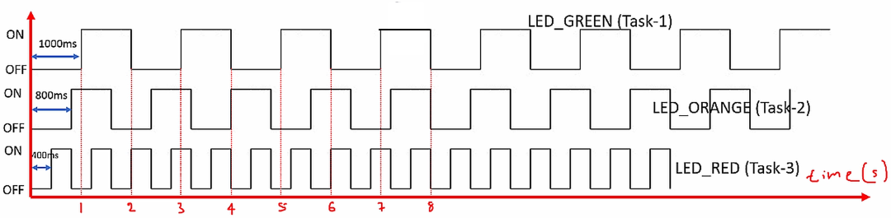
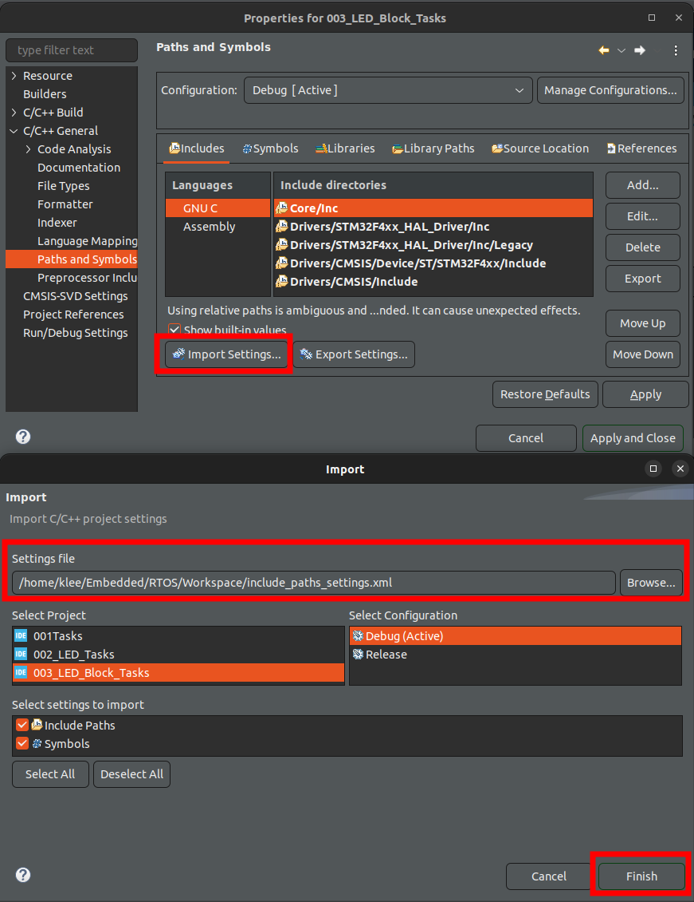
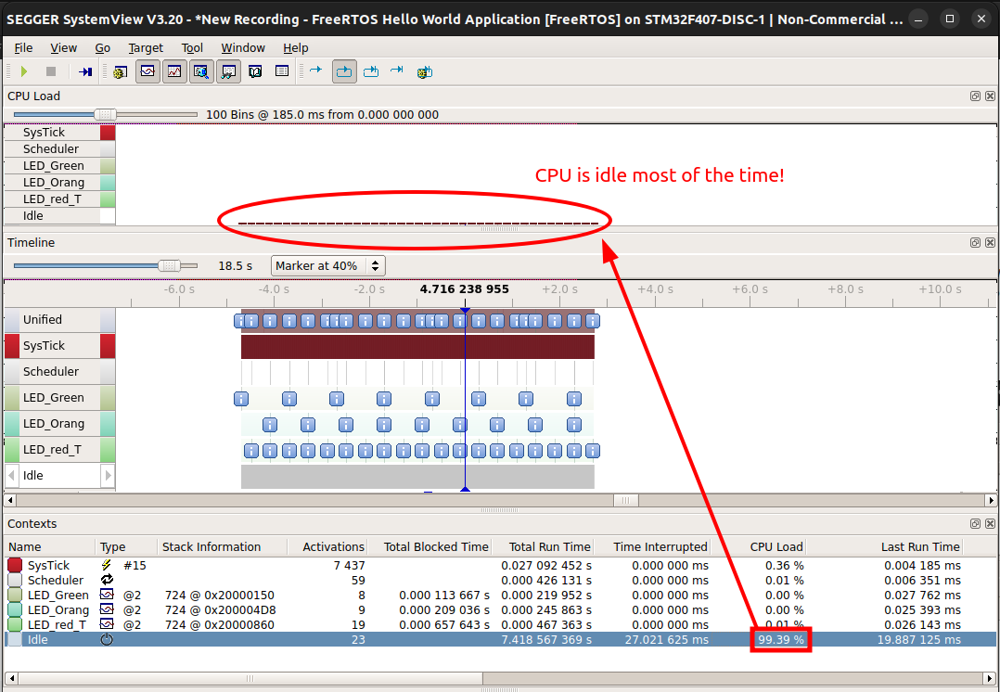
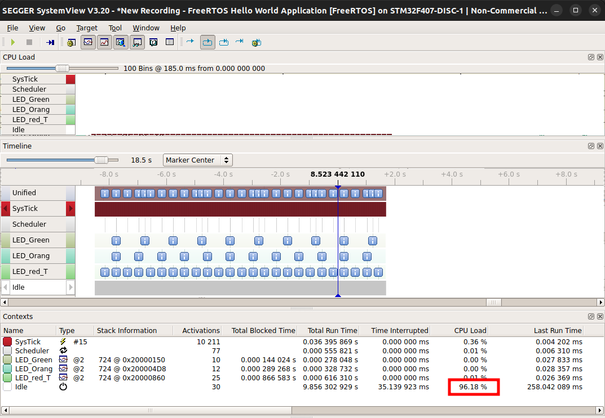

[Home](../../) | [Projects](../../projects) | [Notes](../) > <a href="./">Real-Time Operating Systems (RTOS)</a> > Exercise: Task Delay (`03_LED_Tasks_Delay`, `04_LED_Tasks_Periodic`)

# Exercise: Task Delay (`03_LED_Tasks_Delay`, `04_LED_Tasks_Periodic`)


## Exercise 1: LED_Tasks_Delay (`03_LED_Tasks_Delay`)

* Toggle 3 LEDs of the STM32F407 Discovery board with the duration as shown in the graph below.

  

  

  

* Create 3 FreeRTOS tasks of the same priority to handle three different LDEs.

* Use `vTaskDelay()` for delay implementation.

### Project Setup

* Create a project.
* Link `Common` folder into the project. (Make sure to uncheck `Exclude resource from build` option. Otherwise, you'll end up with a bunch of "undefined reference" errors.)
* Import "Include paths" by using previously saved configuration files.





* Copy `FreeRTOSConfig.h` from an earlier project into `Project/Core/Inc/`, and update it according to your project's requirement.

  Make sure:

  ```c
  /* FreeRTOSConfig.h */
  #define INCLUDE_vTaskDelay 1	// necessary to use vTaskDelay() API
  ```

* Copy `main.c` from an earlier project (i.e., Toggle LEDs) and update it to your needs.

  ```c
  /* main */
  // HAL_Delay(1000);					// previously (blocking delay)
  vTaskDelay(pdMS_TO_TICKS(1000));	// non-blocking delay
  ```

* Copy from an earlier project's (i.e., Toggle LEDs) `main.h` the user defined macros:

  ```c
  /* USER CODE BEGIN Private defines */
  #define LED_GREEN_PIN	LD4_Pin
  #define LED_ORANGE_PIN	LD3_Pin
  #define LED_RED_PIN		LD5_Pin
  /* USER CODE END Private defines */
  ```

* In `Project/Core/Src/stm32f4xx_hal_msp.c`, add ``vInitPrioGroupValue();` as shown in L15. And, include `FreeRTOSConfig.h`.

  ```c
  /* stm32f4xx_hal_msp.c */
  
  /* USER CODE BEGIN Includes */
  #include "FreeRTOSConfig.h"
  /* USER CODE END Includes */
  
  void HAL_MspInit(void)
  {
    /* USER CODE BEGIN MspInit 0 */
  
    /* USER CODE END MspInit 0 */
  
    __HAL_RCC_SYSCFG_CLK_ENABLE();
    __HAL_RCC_PWR_CLK_ENABLE();
  
    HAL_NVIC_SetPriorityGrouping(NVIC_PRIORITYGROUP_0);
  
    /* System interrupt init*/
  
    /* USER CODE BEGIN MspInit 1 */
    vInitPrioGroupValue();
    /* USER CODE END MspInit 1 */
  }
  ```

* Do the "Clock Setting", "Timebase Source Selection", the "Priority Group Setting", and disable the code generation of SysTick, SVC, and PendSV handlers. (See the previous exercises for more detailed information.)

  If the clock setting (HCLK = 168) is not properly done, the system cannot handle the baudrate of 500000 and you won't be able to see anything (or even get it to work) on SystemView application.

* Flash the program onto the board, analyze the trace on SystemView.

### Conclusion

* Unlike in the exercise "Toggle LEDs" where we used `for`/`while` loop-based delay, CPU load is much less now with the blocking delay. (CPU is running the idle task most of the time in this project, but we can make the CPU to sleep instead of running the idle task to save power.)





## Exercise 2: LED_Tasks_Periodic (`04_LED_Tasks_Periodic`)

* Toggle 3 LEDs of the STM32F407 Discovery board with the duration as shown in the graph below.

  

  

  

* Create 3 FreeRTOS **periodic** tasks of the same priority to handle three different LDEs.
* Use `vTaskDelayUntil()` for delay implementation.

### Project Setup

* Use the project "LED_Block_Task", and replace the `vTaskDelay()` APIs with `vTaskDelayUntil()` and do the necessary variable declarations and initializations. Consult the FreeRTOS documentation, it has an example that shows how this API should be used.

  ```c
  /* main.c */
  
  ...
  /* USER CODE BEGIN 4 */
  
  static void led_green_task_handler(void *parameters)
  {
  	// Create an initialize a variable to record the last wakeup time
  	TickType_t last_wakeup_time = xTaskGetTickCount();
  	
  	while (1)
  	{
  		SEGGER_SYSVIEW_PrintfTarget("Toggling green LED");
  		HAL_GPIO_TogglePin(GPIOD, LED_GREEN_PIN);
  		vTaskDelayUntil(&last_wakeup_time, pdMS_TO_TICKS(1000));
  	}
  }
  ...
  ```

  > L8, L9, L15 are updated from the previous project.

* Flash the program onto the board, analyze the trace on SystemView.





## References

Nayak, K. (2022). *Mastering RTOS: Hands on FreeRTOS and STM32Fx with Debugging* [Video file]. Retrieved from https://www.udemy.com/course/mastering-rtos-hands-on-with-freertos-arduino-and-stm32fx/

