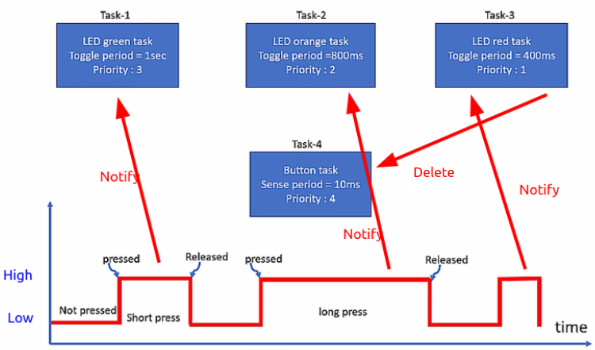
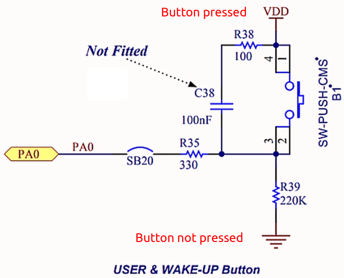
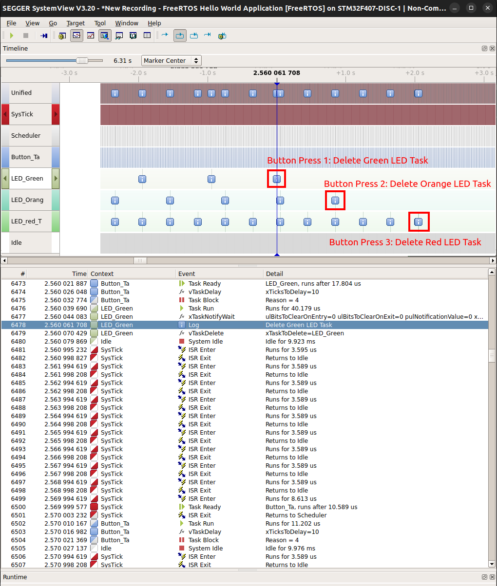
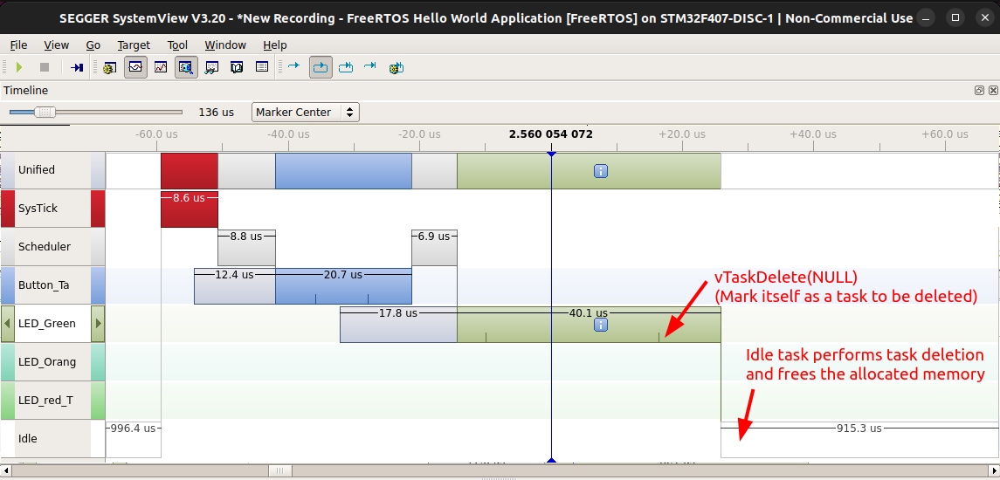

[Home](../../) | [Projects](../../projects) | [Notes](../) > <a href="./">Real-Time Operating Systems (RTOS)</a> > Exercise: Task Notification and Deletion (`05_LED_Tasks_Notification_Deletion`)

# Exercise: Task Notification and Deletion (`05_LED_Tasks_Notification_Deletion`)

## Problem Statement

* Implement the task notification using direct notification APIs of FreeRTOS.

  * Create 3 tasks that toggle 3 different LEDs of the STM32F407 Discovery board. (Task-1, Task-2, Task-3)

  * Create a button task that polls for the button press for every 10 ms. (Task-4)

    If the button press did not last longer than this time period (i.e., 10 ms), it will not be recognized.

    Task-4 is of the highest priority.

  * If the button task detects button press, it should send a notification to LED toggling task.

  * When Task-3 deletes itself, it also deletes Task-4 since it is no longer needed.

  

* Use `USER & WAKE-UP Button`. See the schematics of the board. The action differs from board to board.

  In the case of STM32F407G-Discovery board:

  * User button NOT pressed: LOW
  * User button pressed: HIGH 

* In this program, threads access to the shared variable `next_task_handle`. To synchronize this access, we'll use the following APIs around the critical section.
  * `vTaskSuspendAll()` to suspend the scheduler (i.e., preventing context switch temporarily)
  
    This does not disable interrupts. If an interrupt requests a context switch while the scheduler is suspended, then the request is held pending and is performed only when the scheduler is resumed.
  
  * `xTaskResumeAll()` to resume the scheduler
  
    > Difference between the `vTaskResumeAll()` and `xTaskResumeAll()`?

## Realtime Recording

## References

Nayak, K. (2022). *Mastering RTOS: Hands on FreeRTOS and STM32Fx with Debugging* [Video file]. Retrieved from https://www.udemy.com/course/mastering-rtos-hands-on-with-freertos-arduino-and-stm32fx/

