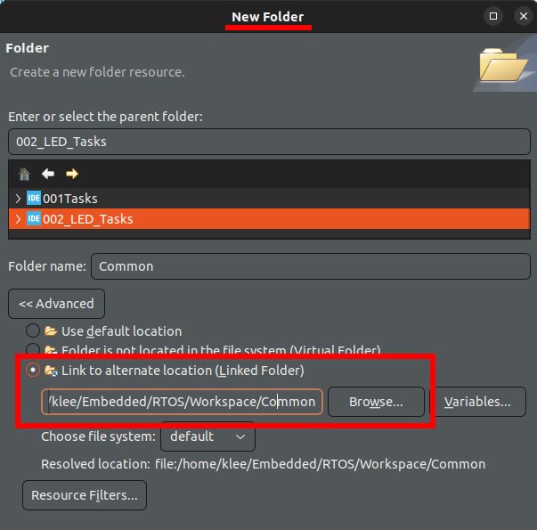
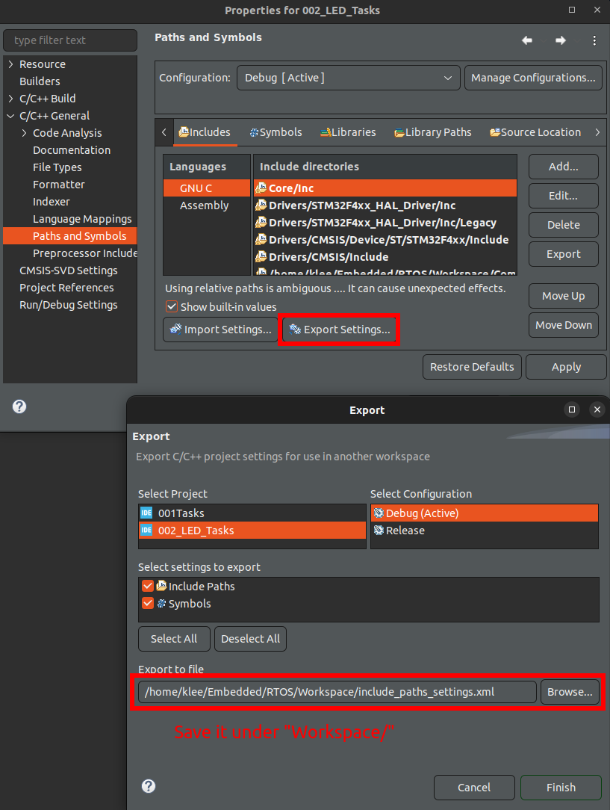
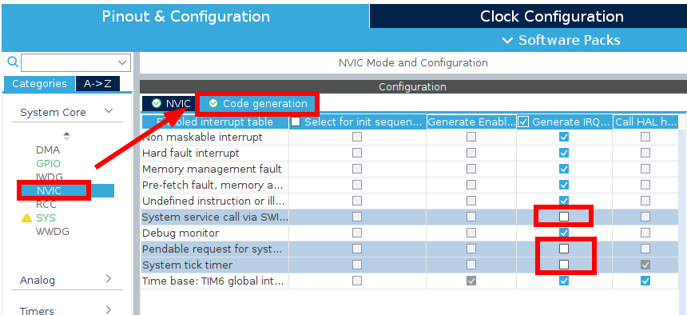

[Home](../../) | [Projects](../../projects) | [Notes](../) > <a href="./">Real-Time Operating Systems (RTOS)</a> > Exercise: Toggle LEDs (`02_LED_Tasks`)

# Exercise: Toggle LEDs (`02_LED_Tasks`)


## Problem Statement

* Toggle the three LEDs of the STM32F407 Discovery board with the frequency as defined below:

  * LED_GREEN (Task1) - 1000 ms

  * LED_ORANGE (Task2) - 800 ms

  * LED_RED (Task3) - 400 ms

* Create 3 FreeRTOS tasks of the same priority to handle three different LEDs.

* Each task will NOT interfere with one another. (No shared resources)

* Since this is a single-core system, "parallel" processing will be impossible to achieve. Just implement it in a time-sharing fashion!


## Design Model

* All user level code (i.e., tasks) runs in Thread Mode of the processor.
* CPU time-sharing is achieved by the scheduler.
* Task management is required and provided by RTOS kernel.
* Using priority among tasks can achieve prioritized task management.
* Can achieve low power (CPU is not always engaged; run a task and stay idle for some time...)


## Project Setup

* Create an STM32 project.

* Instead of integrating the third party tools every time you create a project, you can create a common folder to all projects.

  * Create a `Workspace/Common/` folder, and copy the `Project/ThirdParty/` folder (which we created in the previous section when creating the first project) into the `Workspace/Common/` folder.
  * Link it to the project. (Not copy, but link!)
  * Common $\to$ Properties $\to$ C/C++ Build $\to$ Uncheck "Exclude resource from build". (Must be included.)





* Include paths (Project $\to$ Properties $\to$ C/C++ General $\to$ Paths and Symbols $\to$ Includes)

  * GNU C (Compiler include paths settings)
    * `Workspace/Common/ThirdPary/FreeRTOS/include`
    * `Workspace/Common/ThirdPary/FreeRTOS/portable/GCC/ARM_CM4F`
    * `Workspace/Common/ThirdPary/SEGGER/Config`
    * `Workspace/Common/ThirdPary/SEGGER/OS`
    * `Workspace/Common/ThirdPary/SEGGER/SEGGER`
  * Assembly
    * `Workspace/Common/ThirdPary/SEGGER/Config`
    * `Workspace/Common/ThirdPary/SEGGER/SEGGER`

  [!] Note: Don't forget to click "Apply" after adding new include paths.

* If this include paths setting is to be used over and over again with other projects, you can **export** and **import** this setting, which will save some time.

  To export the include paths settings, do the following and export the settings for BOTH "GNU C" and "Assembly" using the same `.xml` file. (You can open the `.xml` file and check if all the necessary include paths are there.)





## Implementation

* Create three tasks and implement each task function.

  ```c
  /* main.h */
  ...
  /* USER CODE BEGIN Private defines */
  #define LED_GREEN_PIN	LD4_Pin
  #define LED_ORANGE_PIN	LD3_Pin
  #define LED_RED_PIN		LD5_Pin
  /* USER CODE END Private defines */
  ```

  ```c
  /* main.c */
  ...
  /* Private includes ----------------------------------------------------------*/
  /* USER CODE BEGIN Includes */
  #include "FreeRTOS.h"
  #include "task.h"
  /* USER CODE END Includes */
  ...
  /* USER CODE BEGIN PV */
  #define DWT_CTRL	(*(uint32_t volatile *)0xE0001000)
  /* USER CODE END PV */
  ...
  /* USER CODE BEGIN PFP */
  static void led_green_task_handler(void *parameters);
  static void led_orange_task_handler(void *parameters);
  static void led_red_task_handler(void *parameters);
  /* USER CODE END PFP */
  ...
      
  int main(void)
  {
    /* USER CODE BEGIN 1 */
    TaskHandle_t led_green_task_handle;
    TaskHandle_t led_orange_task_handle;
    TaskHandle_t led_red_task_handle;
  
    BaseType_t status;	// Stores return value of xTaskCreate()
    /* USER CODE END 1 */
      
    ...
        
    /* USER CODE BEGIN 2 */
  
    // Enable the cycle counter
    DWT_CTRL |= (0x1 << 0);	// Set SYCCNTENA bit of DWT_CYCCNT register
  
    // Initialize UART with desired baudrate for SEGGER SystemView with UART-based recording
    SEGGER_UART_init(500000);	// Comment this line out if you are not using SEGGER SystemView
  
    // Start the SEGGER SystemView recording of events
    SEGGER_SYSVIEW_Conf();	// Comment this line out if you are not using SEGGER SystemView
    //SEGGER_SYSVIEW_Start(); // This function will be called from ThirdParty/Rec/segger_uart.c
  
    // Create LED_Green_Task and make sure that the task creation was successful
    status = xTaskCreate(led_green_task_handler, "LED_Green_Task", 200, NULL, 2, &led_green_task_handle);
    configASSERT(status == pdPASS);
  
    // Create LED_Orange_Task and make sure that the task creation was successful
    status = xTaskCreate(led_orange_task_handler, "LED_Orange_Task", 200, NULL, 2, &led_orange_task_handle);
    configASSERT(status == pdPASS);
  
    // Create LED_Red_Task and make sure that the task creation was successful
    status = xTaskCreate(led_red_task_handler, "LED_red_Task", 200, NULL, 2, &led_red_task_handle);
    configASSERT(status == pdPASS);
  
    // Start FreeRTOS scheduler
    // vTaskStartScheduler() never returns unless there's a problem launching scheduler
    vTaskStartScheduler();
  
    // This line will only be reached if the kernel could not be started because there was
    // not enough FreeRTOS heap to create the idle task or the timer task.
  
    /* USER CODE END 2 */
    ...
  }
  
  ...
      
  /* USER CODE BEGIN 4 */
  
  static void led_green_task_handler(void *parameters)
  {
  	while (1)
  	{
  		SEGGER_SYSVIEW_PrintfTarget("Toggling green LED");
  		HAL_GPIO_TogglePin(GPIOD, LED_GREEN_PIN);
  		HAL_DELAY(1000);	// Blocking delay (Keeps the processor engaged in a while loop)
  							// Later will be replaced by the non-blocking delay.
  	}
  }
  
  static void led_orange_task_handler(void *parameters)
  {
  	while (1)
  	{
  		SEGGER_SYSVIEW_PrintfTarget("Toggling orange LED");
  		HAL_GPIO_TogglePin(GPIOD, LED_ORANGE_PIN);
  		HAL_DELAY(800);		// Blocking delay (Keeps the processor engaged in a while loop)
  							// Later will be replaced by the non-blocking delay.
  	}
  }
  
  static void led_red_task_handler(void *parameters)
  {
  	while (1)
  	{
  		SEGGER_SYSVIEW_PrintfTarget("Toggling red LED");
  		HAL_GPIO_TogglePin(GPIOD, LED_RED_PIN);
  		HAL_DELAY(400);		// Blocking delay (Keeps the processor engaged in a while loop)
  							// Later will be replaced by the non-blocking delay.
  	}
  }
  
  /* USER CODE END 4 */
  ```

* GPIO settings are automatically done by the CubeIDE. These settings can be found in the `MX_GPIO_Init()` function. (Also, you can check the "Device Configuartion Tool $\to$ Categories $\to$ GPIO")

  To see their implementations, see `Project/Drivers/STM32F4xx_HAL_Driver/Src/stm32f4xx_hal_gpio.c`. (Ctrl + O will show you the list of public APIs defined in the file.)

* ==Before building the project, make sure to do the following settings:==

  * ==Select the time base for STM32 HAL something other than the SysTick. (SysTick timer will be used for the FreeRTOS tick)==
  * ==Do the priority group setting.==
  
  See, *Timebase Source Selection* section in the [Creating FreeRTOS Project](./creating-freertos-project) notes for the detailed steps for above 2 settings.
  
  * Also, disable the code generation of SysTick, SVC, and PendSV handlers.





* Save $\to$ Re-generate the code

* Call `vInitPrioGroupValue()` from `HAL_MspInit()` in the file `stm32f4xx_hal_msp.c`. For this to work, `FreeRTOS.h` must be included.

  ```c
  /* stm32f4xx_hal_msp.c */
  ...
  /* Includes ------------------------------------------------------------------*/
  /* USER CODE BEGIN Includes */
  #include "FreeRTOS.h"
  /* USER CODE END Includes */
  
  void HAL_MspInit(void)
  {
    ...
    /* USER CODE BEGIN MspInit 1 */
    vInitPrioGroupValue();
    /* USER CODE END MspInit 1 */
    ...
  }
  ```

* Copy `Workspace/Common/ThirdParty/FreeRTOS/FreeRTOSConfig.h` to `Project/Inc/` since `FreeRTOSConfig.h` is a project-specific configuration file that cannot be shared among multiple projects. And, delete the original one.

* Build and test it on the target.

  Make sure in the `Project/Inc/FreeRTOSConfig.h`, preemption is turned on `#define configUSE_PREEMPTION 1`.


## Testing

* Turn on SEGGER SystemView UART-based recording.

  * In the file `Project/Common/ThirdParty/SEGGER/Config/SEGGER_SYSVIEW_Conf.h`, make sure `#define SEGGER_UART_REC 1`.

  * In the `Project/Src/main.c` add the following lines in the main function:

    `SEGGER_UART_init(500000);` , `SEGGER_SYSVIEW_Conf();` (Also, declare these function as `extern`.)

    ```c
    /* main.c */
    ...
    int main(void)
    {
      ...
      SEGGER_UART_init(500000);
      
      // Enable the CYCCNT counter
      DWT_CTRL |= (1 << 0);
    
      SEGGER_SYSVIEW_Conf();
      ...
    }
    ```

* Since the UART recording calculates the Baudrate based on the `HCLK` of 168 MHz, so change the `HCLK` frequency to 168 MHz in the "Device Configuration Tool".

  $\to$ Save and re-generate the code.

* In the `Project/Src/main.c`, now uncomment `SEGGER_SYSVIEW_PrintfTarget("Toggling green LED");` lines in the task handlers.

* Connect the board to the host PC using the USB-to-Serial cable. (Now, the board should be connected to your PC via 2 cables.)

* Open SEGGER SystemView and do the UART-based recording.

### Notes

* These three tasks are **continuous tasks**, meaning that even if the task has nothing to do, it still consumes the CPU clocks (in a loop) until it gets preempted. (You can see also from the CPU load window that the CPU has never been idle.) Very inefficient!
* We'll improve it in the following sections by making CPU sleep when it's not needed thus minimizing the power consumption.


## References

Nayak, K. (2022). *Mastering RTOS: Hands on FreeRTOS and STM32Fx with Debugging* [Video file]. Retrieved from https://www.udemy.com/course/mastering-rtos-hands-on-with-freertos-arduino-and-stm32fx/

