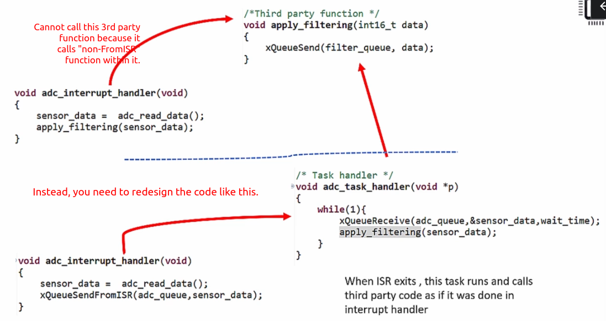

[Home](../../) | [Projects](../../projects) | [Notes](../) > <a href="./">Real-Time Operating Systems (RTOS)</a> > FreeRTOS `FromISR` APIs

# FreeRTOS `FromISR` APIs

## Introduction

* FreeRTOS `FromISR` APIs are also called as "**interrupt safe APIs**".
* These are meant to be used from an interrupt handler.
* Example:
  * `xQueueSend()` is to be called from the task context.
  * `xQueueSendFromISR()` is to be called from the interrupt context.

## Why Do Dedicated `FromISR` APIs Exist?

* It makes APIs implementation simpler:

  When called from a task context, many RTOS APIs can put the calling task to a blocked state, but the same cannot happen when called from interrupt handlers because you cannot put the interrupt handler or interrupt context code to Blocked state. The Blocked state is for tasks, not for interrupt handlers.

  So, if there's no dedicated APIs for interrupt handlers, APIs must be able to tell which context it was being called, interrupt or task context, and operate accordingly. This approach increases code overhead, and some architectures do not support determining the context in which the APIs are getting called. 

  To overcome this problem, FreeRTOS gives separate APIs to be called from interrupt handlers and prohibits using APIs which doesn't end with "FromISR" inside an interrupt handler.

## Disadvantages of Using Dedicated `FromISR` APIs?

* Application developer must redesign the logic when there is a need to call a third-party function from an interrupt handler that uses FreeRTOS API that doesn't end with `FromISR`.

## References

Nayak, K. (2022). *Mastering RTOS: Hands on FreeRTOS and STM32Fx with Debugging* [Video file]. Retrieved from https://www.udemy.com/course/mastering-rtos-hands-on-with-freertos-arduino-and-stm32fx/

