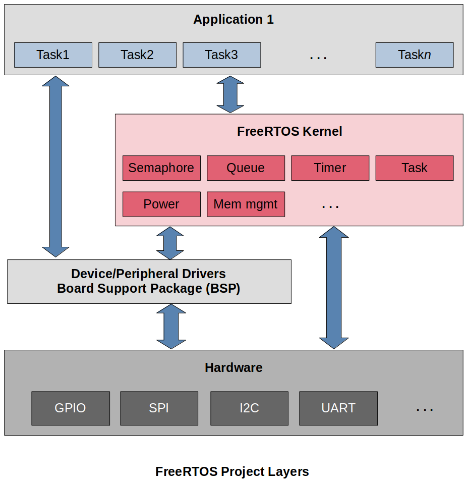

[Home](../../) | [Projects](../../projects) | [Notes](../) > <a href="./">Real-Time Operating Systems (RTOS)</a> > FreeRTOS Project Layers

# FreeRTOS Project Layers

## FreeRTOS Project Layers

* The FreeRTOs kernel does NOT contain any code related to the hardware. You have to integrate the Device Driver (BSP) Layer to access the peripherals of the hardware. Device driver can be developed either by yourself or a third party. ([FreeRTOS Third Party Board Support Package (BSP)](https://www.freertos.org/FreeRTOS-Plus/BSP_Solutions/FreeRTOS_BSP.html))
* Application (user) tasks are usually implemented by using the APIs provided by the FreeRTOS kernel.

## References

Nayak, K. (2022). *Mastering RTOS: Hands on FreeRTOS and STM32Fx with Debugging* [Video file]. Retrieved from https://www.udemy.com/course/mastering-rtos-hands-on-with-freertos-arduino-and-stm32fx/

