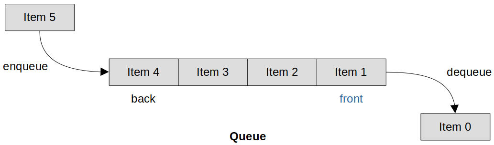

[Home](../../) | [Projects](../../projects) | [Notes](../) >  <a href="./">Real-Time Operating Systems (RTOS)</a> > FreeRTOS Queue Management

# FreeRTOS Queue Management


## FreeRTOS Queue

* Items are **enqueue**d to the front (or head) of the queue, and **dequeue**d from the back (or tail) of the queue.





## Creating a Queue

* FreeRTOS API to create a queue:

  ```c
  /* queue.h */
  
  // Param	: @uxQueueLength - Max number of items the queue can hold at any one time
  //			  @uxItemSize - // Size of a single item in bytes
  // Retval	: A handle (a pointer) to the created queue if successful, NULL otherwise.
  QueueHandle_t xQueueCreate( UBaseType_t uxQueueLength, 
                              UBaseType_t uxItemSize );
  ```

* Creates a new [queue](https://freertos.org/Embedded-RTOS-Queues.html) and returns a handle by which the queue can be referenced. [configSUPPORT_DYNAMIC_ALLOCATION](https://freertos.org/a00110.html#configSUPPORT_DYNAMIC_ALLOCATION) must be set to 1 in `FreeRTOSConfig.h`, or left undefined (in which case it will default to 1), for this RTOS API function to be available. 

* Each queue requires RAM that is used to hold the queue state, and to hold the items that are contained in the queue (the queue storage area).

* If a queue is created using `xQueueCreate()` then the required RAM is automatically allocated from the [FreeRTOS heap](https://freertos.org/a00111.html). 

* If a queue is created using [xQueueCreateStatic()](https://freertos.org/xQueueCreateStatic.html) then the RAM is provided by the application writer, which results in a greater number of parameters, but allows the RAM to be statically allocated at compile time.  See the [Static Vs Dynamic allocation](https://freertos.org/Static_Vs_Dynamic_Memory_Allocation.html) page for more information.

* Example usage:

  ```c
  struct AMessage
  {
      char ucMessageID;
      char ucData[ 20 ];
  };
  
  void vATask( void *pvParameters )
  {
  QueueHandle_t xQueue1, xQueue2;
  
      /* Create a queue capable of containing 10 unsigned long values. */
      xQueue1 = xQueueCreate( 10, sizeof( unsigned long ) );
  
      if( xQueue1 == NULL )
      {
          /* Queue was not created and must not be used. */
      }
  
      /* Create a queue capable of containing 10 pointers to AMessage
      structures.  These are to be queued by pointers as they are
      relatively large structures. */
      xQueue2 = xQueueCreate( 10, sizeof( struct AMessage * ) );
  
      if( xQueue2 == NULL )
      {
          /* Queue was not created and must not be used. */
      }
  
      /* ... Rest of task code. */
   }
  ```

  > L22: Making the type of items 'pointer' to an object of large size can be a great strategy to save space consumed by queues.


## Sending Data to the Queue

* Two ways to send data to the queue:
  * `xQueueSendToFront()`
  * `xQueueSendToBack()`

### 1. `xQueueSendToFront()`

* This is a macro that calls `xQueueGenericSend()`.

  ```c
  /* queue.h */
  
  // Brief	: Posts an item to the front of the queue
  // Param	: @xQueue - The handle to the queue on which the item is to be posted
  // 			  @pvItemToQueue - A pointer to the item that is to be placed on the queue
  //			  @xTicksToWait - The maximum amount of time the task should block waiting 
  //							  for space to become available on the queue, should it already
  //							  be full. The call will return immediately if this is set to 0.
  //							  The time is defined in tick periods so the constant
  //							  portTICK_PERIOD_MS should be used to convert to real time if
  //							  this is required. 
  // Retval	: pdTRUE if the item was successfully posted, errQUEUE_FULL otherwise
  BaseType_t xQueueSendToFront( QueueHandle_t xQueue,
                                const void * pvItemToQueue,
                                TickType_t xTicksToWait );
  ```

* Example usage:

  ```c
  struct AMessage
  {
      char ucMessageID;
      char ucData[ 20 ];
  } xMessage;
  
  unsigned long ulVar = 10UL;
  
  void vATask( void *pvParameters )
  {
  QueueHandle_t xQueue1, xQueue2;
  struct AMessage *pxMessage;
  
      /* Create a queue capable of containing 10 unsigned long values. */
      xQueue1 = xQueueCreate( 10, sizeof( unsigned long ) );
  
      /* Create a queue capable of containing 10 pointers to AMessage
      structures.  These should be passed by pointer as they contain a lot of
      data. */
      xQueue2 = xQueueCreate( 10, sizeof( struct AMessage * ) );
  
      /* ... */
  
      if( xQueue1 != 0 )
      {
          /* Send an unsigned long.  Wait for 10 ticks for space to become
          available if necessary. */
          if( xQueueSendToFront( xQueue1,
                                ( void * ) &ulVar,
                                ( TickType_t ) 10 ) != pdPASS )
          {
              /* Failed to post the message, even after 10 ticks. */
          }
      }
  
      if( xQueue2 != 0 )
      {
          /* Send a pointer to a struct AMessage object.  Don't block if the
          queue is already full. */
          pxMessage = & xMessage;
          xQueueSendToFront( xQueue2, ( void * ) &pxMessage, ( TickType_t ) 0 );
      }
  
  	/* ... Rest of task code. */
  }
  ```

### 2. `xQueueSendToBack()`

* This is a macro that calls `xQueueGenericSend()`.

  ```c
  /* queue.h */
  
  // Brief	: Posts an item to the back of the queue
  BaseType_t xQueueSendToBack( QueueHandle_t xQueue,
                               const void * pvItemToQueue,
                               TickType_t xTicksToWait );
  ```

* Similar to the `xQueueSendToFront()`. See the FreeRTOS kernel API documentation for more details.


## Receiving Data from the Queue

* Two ways to receive data to the queue:
  * `xQueueReceive()`
  * `xQueuePeek()`

### 1. `xQueueReceive()`

* This is a macro that calls the `xQueueGenericReceive()` function.

  It removes an item from the queue.

  ```c
  /* queue.h */
  
  // Brief	: Receive an item from a queue. The item is received by copy so a buffer of
  //			  adequate size must be provided. The number of bytes copied into the buffer
  //			  was defined when the queue was created.
  // Param	: @xQueue - The handle to the queue from which the item is to be received.
  //			  @pvBuffer - Pointer to the buffer into which the received item will be copied.
  //			  @xTicksToWait - The maximum amount of time the task should block waiting for
  //							  an item to receive should the queue be empty at the time of
  //							  the call. Setting xTicksToWait to 0 will cause the function
  //							  to return immediately if the queue is empty. The time is
  //							  defined in tick periods so the constant portTICK_PERIOD_MS
  //							  should be used to convert to real time if this is required.
  // Retval	: pdTRUE if an item was successfully received from the queue, pdFALSE otherwise.
  BaseType_t xQueueReceive( QueueHandle_t xQueue,
                            void *pvBuffer,
                            TickType_t xTicksToWait );
  ```

### 2. `xQueuePeek()`

* This is a macro that calls the `xQueueGenericReceive()` function.

  It does NOT remove an item from the queue.

  ```c
  /* queue.h */
  
  // Brief	: Receive an item from a queue without removing the item from the queue.
  //			  The item is received by copy so a buffer of adequate size must be provided.
  //			  The number of bytes copied into the buffer was defined when the queue was
  //			  created.
  // Param	: @xQueue - The handle to the queue from which the item is to be received.
  //			  @pvBuffer - Pointer to the buffer into which the received item will be copied.
  //			  @xTicksToWait - The maximum amount of time the task should block waiting for
  //							  an item to receive should the queue be empty at the time of
  //							  the call. Setting xTicksToWait to 0 will cause the function
  //							  to return immediately if the queue is empty. The time is
  //							  defined in tick periods so the constant portTICK_PERIOD_MS
  //							  should be used to convert to real time if this is required.
  // Retval	: pdTRUE if an item was successfully received (peeked) from the queue, otherwise pdFALSE.
  BaseType_t xQueuePeek( QueueHandle_t xQueue,
                         void *pvBuffer,
                         TickType_t xTicksToWait );
  ```


## References

Nayak, K. (2022). *Mastering RTOS: Hands on FreeRTOS and STM32Fx with Debugging* [Video file]. Retrieved from https://www.udemy.com/course/mastering-rtos-hands-on-with-freertos-arduino-and-stm32fx/

