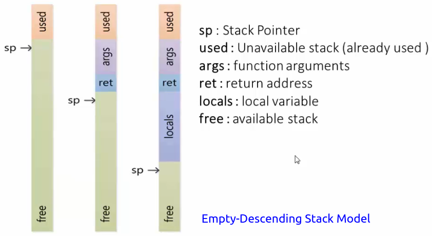
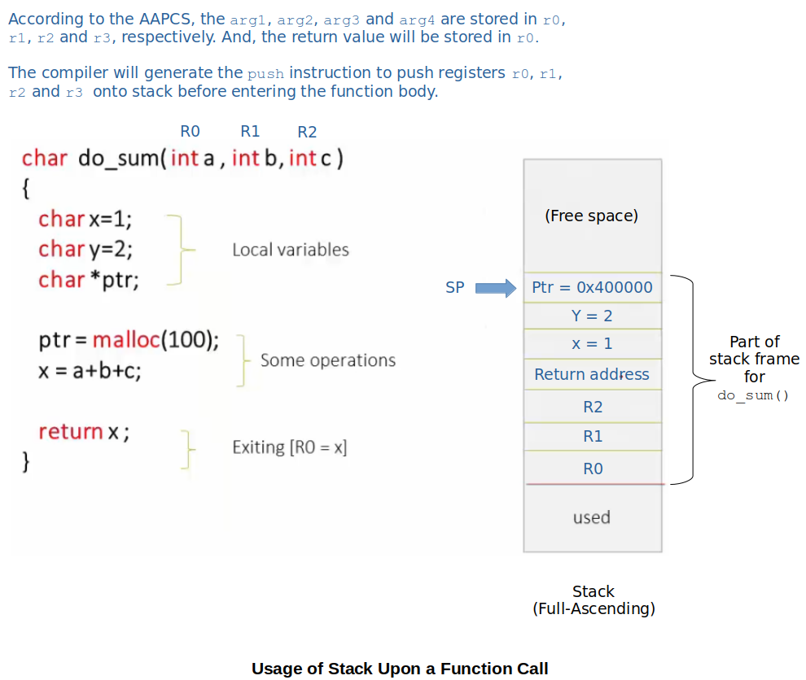
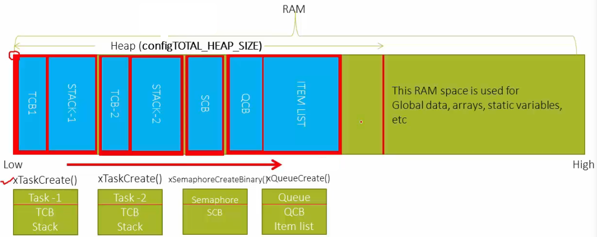
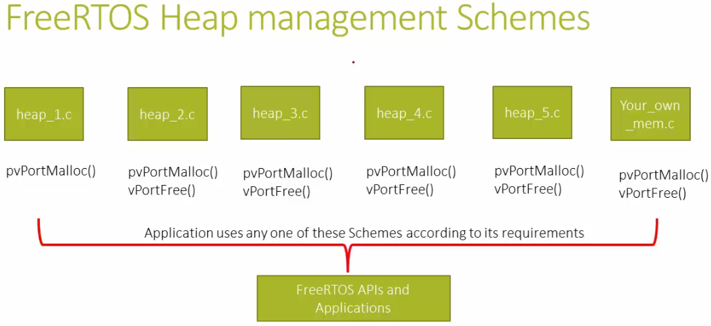

[Home](../../) | [Projects](../../projects) | [Notes](../) > <a href="./">Real-Time Operating Systems (RTOS)</a> > Overview of FreeRTOS Memory Management

# Overview of FreeRTOS Memory Management


## RAM & Flash

* In general, MCUs contain RAM and Flash. And, Flash is usually bigger in size than RAM.

* See [Different Section of a Program](../arm-cortex-m3-m4-processor/different-sections-of-a-program) to see which section of a program goes to which memory.

### RAM

* Used to store the application **DATA**. (e.g., Global arrays, global variables, etc.)
* The **CODE** (i.e., instructions) can be downloaded and run on RAM. (e.g., Patches)
* A part of RAM is used as **STACK** to store local variables, function arguments, return address, etc.
* A part of RAM is used as **HEAP** for dynamic memory allocations.

### Flash

* Mainly used to store the application **CODE** (i.e., the instructions generated after compilation of the program).

* Also holds constants:

  ```c
  char *message = "Hello World\n";
  const int var = 10;
  ```

* Holds the **VECTOR TABLE** for interrupts and exceptions of the MCU. (e.g., For any ARM Cortex-M based MCUs, the initial address of the code memory, which is typically Flash, is occupied by the vector table.)


## Stack & Heap in Embedded Systems

### Stack

* Last-In-First-Out (LIFO) order access of memory

* Stack pointer (SP) of an MCU is usually initialized to the highest memory address of RAM (i.e., beginning of stack). However, this depends multiple factors such as which stack model (e.g., full-ascending, full-descending, empty-ascending, empty-descending) is used.

  Stack pointer initialization is done in the "Startup code" of a project, so if you are writing the **startup code** yourself you need to take care of it.

* The following diagram shows, how information gets pushed onto stack upon a function call.





* An example of the usage of stack upon a function call.





### Heap

* Out-of-order access of memory

* Heap is used for dynamic allocation of memory to the application during the run-time.

* A "heap" is a general term used for any memory that is allocated dynamically and randomly.

* So, stack is managed by SP, but how is the heap managed?

  $\to$ It depends on the implementation of the application which utilizes heap.

  C provides `malloc`/`free` and C++ provides `new`/`free` standard library functions and how the heap is managed is completely dependent on the application programmers who utilizes these library functions.

* For, embedded system, `malloc`/`free` APIs are not recommended/suitable because they eat up large amount of code space, lack deterministic nature and incur fragmentation over time as blocks of memory are allocated/deallocated.

  Therefore, embedded systems programmers need to be careful when using the heap management algorithms.
  
* By default, the FreeRTOS heap (size and starting address) is declared by the FreeRTOS kernel. If you don't want the kernel to determine, setting the `configAPPLICATION_ALLOCATED_HEAP` to 1 allows the heap to be declared (i.e., starting address and size) by the application instead.

### Heap vs. Stack Memory Allocation Speed

* In general, the stack memory allocation is faster than that of the heap. This is because of the way that memory is allocated on the stack.  Allocating memory on the stack is as simple as moving the stack pointer  up. But in Heap, to allocate the memory a recommended algorithm will be  used.


## FreeRTOS Stack & Heap

* Depending on the implementation, user task's TCB and its associated stack can be created in:
  * Heap memory of RAM (If created dynamically)
  * Somewhere in RAM other than the heap and the stack (If created statically)

* In FreeRTOS, each task's **TCB** and the private **STACK** is dynamically allocated on heap.





* Task-1, Task-2, Semaphore, Queue, etc. all these are called the "**dynamically allocated kernel objects**".

  As you might have noticed, `xTaskCreate()`, `xSemaphoreCreateBinary()`, `QueueCreate()`, etc. must be calling `malloc` within them to dynamically allocate memory space.


## FreeRTOS Heap Management Schemes

* `heap_1.c` ~ `heap_5.c` files provided by the FreeRTOS support different heap management schemes with different advantages/disadvantages.
* You can choose which scheme to use as per your application's needs, or you can even implement your own heap management scheme.





## References

Nayak, K. (2022). *Mastering RTOS: Hands on FreeRTOS and STM32Fx with Debugging* [Video file]. Retrieved from https://www.udemy.com/course/mastering-rtos-hands-on-with-freertos-arduino-and-stm32fx/

