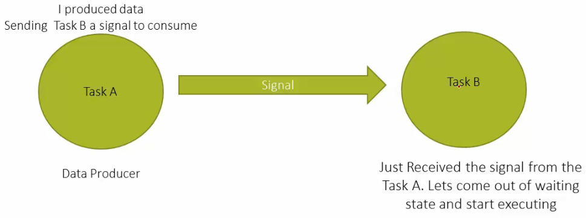
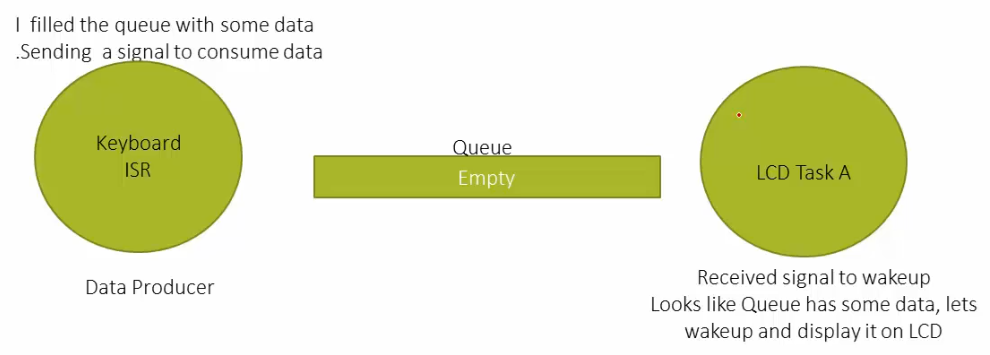

[Home](../../) | [Projects](../../projects) | [Notes](../) > <a href="./">Real-Time Operating Systems (RTOS)</a> > Overview of FreeRTOS Synchronization and Mutual Exclusion Services

# Overview of FreeRTOS Synchronization and Mutual Exclusion Services


## Introduction to Synchronization

* Synchronization refers to the coordination and management of multiple processes or threads to ensure that they execute in a way that maintains data consistency and avoids conflicts. In a multi-threaded or multi-process environment, where multiple threads or processes run concurrently, synchronization mechanisms are necessary to prevent issues like race conditions, data corruption, and incorrect  results.
* The primary goals of synchronization are:
  1. **Data Consistency:** When multiple threads or processes are accessing shared resources (such as variables, data structures, or files), it's important to ensure that data remains consistent throughout their operations. Without proper synchronization, one thread might read or modify data while another thread is in the middle of doing the same, leading to unpredictable and erroneous results.
  2. **Ordering:** Synchronization mechanisms help establish a specific order in which operations are executed. This is crucial to prevent scenarios where the order of execution impacts the outcome.

* Common synchronization mechanisms include:
  1. **Mutex (Mutual Exclusion):** A mutex is a locking mechanism that allows only one thread or process to access a shared resource at a time. While a thread holds the mutex, other threads wanting access must wait until the mutex is released. This prevents multiple threads from accessing the resource simultaneously and ensures data consistency.
  2. **Semaphore:** A semaphore is a more generalized version of a mutex. It can allow a specific number of threads to access a resource concurrently. Semaphores can be used for scenarios where you want to control the level of parallelism, such as limiting the number of threads that can access a resource simultaneously.
  3. **Condition Variables:** Condition variables are used to manage thread synchronization based on certain conditions. Threads can wait on a condition variable until a specific condition is met. This is often used in producer-consumer scenarios, where one thread produces data and another consumes it.
  4. **Read-Write Locks:** These locks allow multiple threads to read a shared resource simultaneously while allowing only one thread to write to it. This is useful when a resource is read more frequently than it is written.
  5. **Barrier:** A barrier is a synchronization point where multiple threads wait until all threads have reached that point before continuing. It's often used in parallel algorithms to ensure that all threads reach a certain stage before progressing.
  6. **Atomic Operations:** Certain operations, like incrementing a variable, can be made atomic, meaning they are executed as a single, indivisible unit. This prevents interference from other threads trying to perform the same operation concurrently.

* Effective synchronization is crucial for writing correct and efficient  multi-threaded or multi-process programs. However, improper  synchronization can lead to subtle and hard-to-debug issues, such as  deadlocks (where threads wait indefinitely for each other) or livelocks  (where threads keep retrying an operation without making progress).


## Synchronization Between Tasks

* Both the Task A and Task B operate based on the signaling rule they have agreed upon.

  Task A knows when to signal Task B and Task B knows what to do when it receives the signal. 





## Synchronization Between Task and Interrupt

* Both the Keyboard ISR and LCD Task A operate based on the signaling rule they have agreed upon.

  Keyboard ISR knows when to signal LCD Task B and LCD Task B knows what to do when it receives the signal.

* When the Queue has some data in it, the producer will signal the consumer to consume the data.





## How to Achieve This Signaling?

* Following software subsystems support signaling hence an be used in synchronization:

  * Events (or Event Flags)
  * **Semaphores (Counting and binary)**
  * **Queues** and Message Queues
  * Pipes
  * Mailboxes
  * Signals (UNIX like signals)
  * **Mutex**

  FreeRTOS supports Semaphores, Queues, and Mutexes to achieve synchronization.


## Mutual Exclusion Services of FreeRTOS

* Mutual exclusion

  * Means allowing only one thread access the shared resource at any point in time. 

  * This avoids the **race condition** between threads acquiring the resource.

  * In general, achieved by locking the resource before using it and unlocking after finished using it.

  * Example

    ```c
    #include <pthread.h>
    
    int counter = 0;	// global variable (shared resource)
    pthread_mutex_t mutex = PTHREAD_MUTEX_INITIALIZER;
    
    void func(void *arg)
    {
        int val;
        pthread_mutex_lock(&mutex);		// entering critical section
        val = counter;
        counter = val + 1;
        pthread_mutex-unlock(&mutex); 	// leaving critical section
        
        return NULL;
    }
    ```

    > L6 - Suppose this is a shared function between multiple tasks in an application. This function must be thread safe.

* Synchronization
  * Means synchronizing the order in which multiple threads access a shared resource.


## References

Nayak, K. (2022). *Mastering RTOS: Hands on FreeRTOS and STM32Fx with Debugging* [Video file]. Retrieved from https://www.udemy.com/course/mastering-rtos-hands-on-with-freertos-arduino-and-stm32fx/

