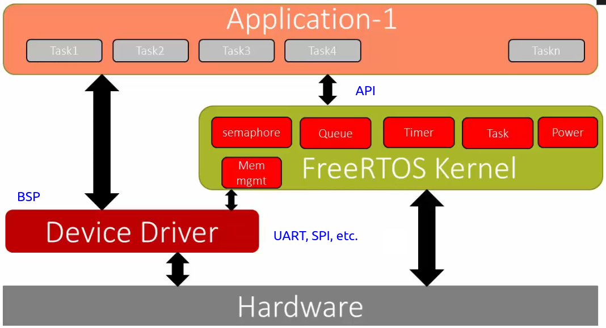

[Home](../../) | [Projects](../../projects) | [Notes](../) > <a href="./">Real-Time Operating Systems (RTOS)</a> > Position of FreeRTOS Kernel

# Position of FreeRTOS Kernel

## Position of FreeRTOS Kernel

* FreeRTOS kernel does NOT contain any hardware-specific code. You have to fit in the BSP layer to access the peripherals of the hardware.

## References

Nayak, K. (2022). *Mastering RTOS: Hands on FreeRTOS and STM32Fx with Debugging* [Video file]. Retrieved from https://www.udemy.com/course/mastering-rtos-hands-on-with-freertos-arduino-and-stm32fx/

