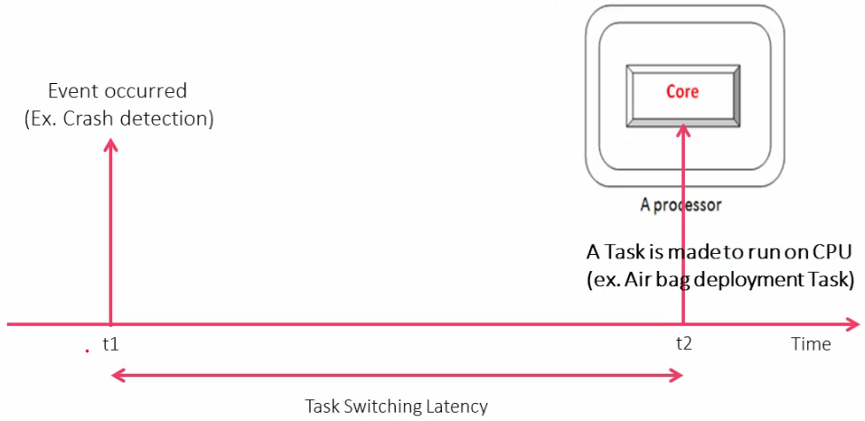
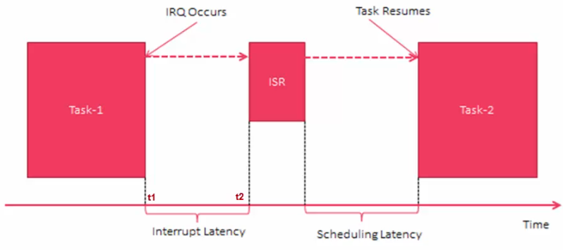

[Home](../../) | [Projects](../../projects) | [Notes](../) > <a href="./">Real-Time Operating Systems (RTOS)</a> > RTOS vs. GPOS

# RTOS vs. GPOS

## Introduction

* **General-Purpose Operating System (GPOS)**

  e.g., Windows, Linux, iOS, Android, etc.

* **Real-Time Operating System (RTOS)**

  e.g., VxWorks (Windriver), QNX (Blackberry), FreeRTOS, Integrity, etc.

## Task Scheduling

* **GPOS (High Throughput)**

  * GPOS is programmed to handle scheduling in such a way that it manages to achieve high throughput.

    Throughput - the total number of processes that complete their execution per unit time

  * Sometimes execution of a high priority process will get delayed in order to serve 5 or 6 low priority tasks. High throughput is achieved by serving 5 low priority tasks than by serving a single high priority one. (If 5 or 6 low priority applications are waiting to run, then the GPOS may delay 1 or 2 high priority task in order to increase the throughput.)

  * In GPOS, the scheduler typically uses a fairness policy to dispatch threads and processes onto the CPU. Such a policy enables the high overall throughput required by desktop and server applications, but offers no guarantees that high-priority, time-critical threads or processes will execute in preference to lower-priority threads.

* **RTOS (High Time-predictability)**

  * In RTOS, thread execute in the order of their priority. If a high-priority thread becomes ready to run, it will take over the CPU from any lower-priority thread that may be executing.

  * Here a high-priority thread gets executed over the low priority ones. All "low priority thread execution" will get paused. A high-priority thread execution will get overridden only if a request comes from an even higher-priority threads.

  * RTOS may yield less throughput than the GPOS because it always favors the high priority tasks, but that does not necessarily mean that it has poor throughput. A quality RTOS will still deliver a decent overall throughput but, can sacrifice throughput for being deterministic or to achieve time predictability.

  * For an RTOS, achieving predictability or time-deterministic nature is more important than achieving high throughput.

## Task Switching Latency

* In computing, **latency** means the time that elapses between a stimulus and the response to it.
* Task switching latency defines how long it takes for an event to occur (i.e., the task that takes care of that event begins to run on the CPU) from the time it was triggered.

* **GPOS**
  * Task switching latency may vary significantly.
  * Task switching time (latency) tends to increase as the number of tasks being scheduled (i.e., system load) increases.
* **RTOS**
  * Task switching latency is almost always time-bounded and does not vary significantly.
  * Task switching time (latency) remains almost constant regardless of the number of tasks being scheduled (i.e., system load).

## Interrupt Latency

* Interrupt latency refers to the time duration between the interrupt request and the interrupt response.
* Scheduling latency refers to the time taken for the context switching operation.

* **GPOS**
  * Interrupt latency and scheduling latency may fluctuate depending on the system load.
* **RTOS**
  * Interrupt latency and scheduling latency are kept as minimal as possible and time-deterministic regardless of the system load.

## Priority Inversion

* **Priority inversion** occurs when circumstances within the system force a higher-priority task to wait for a lower-priority task to finish, effectively inverting the assigned priorities of the tasks.

  e.g., A low priority process acquiring a resource that a high priority process needs, and then being preempted by a medium priority process, so the high priority process is blocked on the resource while the medium priority one finishes (effectively being executed with a lower priority).

* **GPOS**

  * Priority inversion is not a big issue in general.

* **RTOS**

  * Priority inversion is a big issue and must be resolved! Most of the real-time kernel implements some techniques to resolve it.

    e.g., Rescheduling, temporarily elevating the priority of the lower-priority task to the highest among so that it can run first and release the resource as soon as possible.

## Summary

* The features that RTOS has that GPOS doesn't:

  * Priority based preemptive scheduling mechanism (i.e., always favors the highest priority task)

  * No or very minimal critical section which disables the preemption

  * Priority inversion avoidance

  * Time-bound interrupt latency

  * Time-bound scheduling latency

    ...

## References

Nayak, K. (2022). *Mastering RTOS: Hands on FreeRTOS and STM32Fx with Debugging* [Video file]. Retrieved from https://www.udemy.com/course/mastering-rtos-hands-on-with-freertos-arduino-and-stm32fx/

