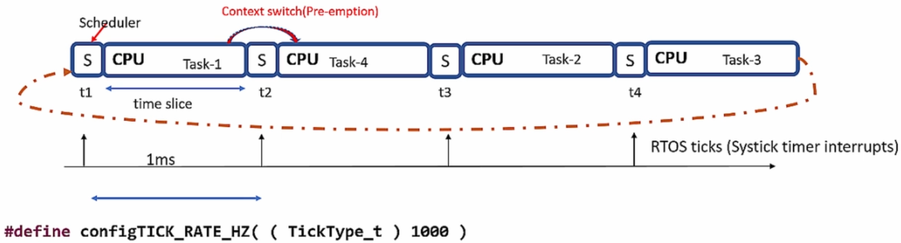
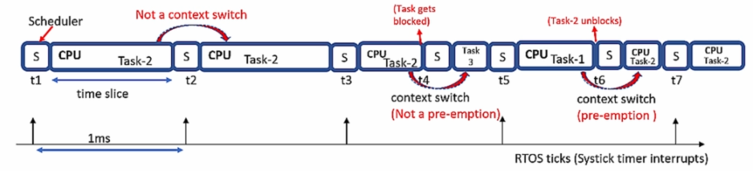
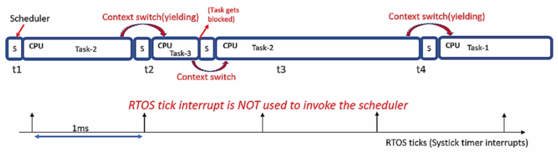
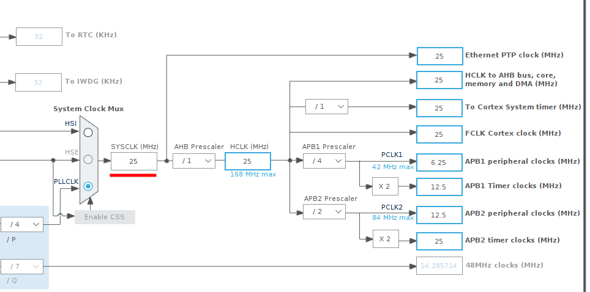

[Home](../../) | [Projects](../../projects) | [Notes](../) > <a href="./">Real-Time Operating Systems (RTOS)</a> > Scheduling

# Scheduling


## Invocation of the Scheduler

* Now, you have created 2 tasks, which are in the ready task list of the FreeRTOS (READY state).
* Tasks will be dispatched to run on the CPU by the scheduler. In FreeRTOS, tasks won't run until you start the scheduler.
* Scheduler is nothing but a piece of code that is part of the FreeRTOS kernel, which runs in the privileged mode of the processor.
* You should invoke the task scheduler first by calling the API provided by FreeRTOS: `vTaskStartScheduler()`.


## Scheduling Policies

* Scheduler schedules tasks to run on the CPU according to the scheduling policy configured. FreeRTOS supports the following two types of scheduling policy:

  * **Preemptive scheduling** - `configUSE_PREEMPTION = 1`
  * **Cooperative scheduling** - `configUSE_PREEMPTION = 0`

  [!] Note: `configUSE_PREEMPTION` is located in `FreeRTOSConfig.h`.

* Scheduling frequency can be configured by using the RTOS ticks. RTOS tick is nothing but a timer interrupt. Any timer peripheral of the microcontroller (e.g., SysTick timer) can be used to implement RTOS tick. You can simply configure the timer to issue an interrupt every fixed time. 

  In FreeRTOS, the following macro is used to configure timebased RTOS ticking:

  ```c
  #define configTick_RATE_HZ((TickType_t)1000) /* interrupts every 1 ms */
  ```

### Preemptive Scheduling

* Preemption - scheduler interrupting and suspending a currently running task in order to resume a previously suspended task

* During preemption, the running task is made to give up the processor even if it hasn't completed its work. The scheduler does this to run some other tasks of the application.

* The preempted task simply returns to READY state.

* Two types of preemptive scheduling:

  * **Round-Robin (or Cyclic) preemptive scheduling**

    Scheduling tasks without priority (a.k.a. cyclic executive). <u>Time slices</u> (or <u>time quantum</u>) are assigned to each task in equal portions and in circular order.

    

    

    

  * **Priority based preemptive scheduling**

    Scheduling tasks based on their priority. A task with higher priority will be scheduled to run on the CPU forever unless the task gets deleted, blocked, suspended or leaves voluntarily to give the chance to others.

    If, at any given point in execution, scheduler finds a task that is of higher priority than the one currently running on the CPU, scheduler will preempt the running task and switch it with the task with the higher priority even if the time slice was not expired.

    Scheduler switching tasks at every defined tick is also regarded as "preemption".

    However, the scheduler scheduling another task in place of a blocked task is NOT regarded as "preemption".

    
    
    
    
    

### Cooperative Scheduling

* A task cooperates with other tasks by explicitly giving up the processor (Processor yielding).
* There is no "preemption" of tasks by the scheduler. That is, the running task will never be interrupted by the scheduler.
* In this policy, RTOS tick interrupt is NOT used for invoking the scheduler but to keep track of the kernel's real-time tick value. (Don't be confused! SysTick timer still runs but is not used to invoke the scheduler every defined ms to preempt a task.)
* Tasks give up the CPU when they are done or periodically or blocked, suspended waiting for a resource.





## Exercise: Scheduling

* Before you do this exercise, make sure to go through all the necessary steps to use `print()` function over SWO pin.

  See [Using `printf()` with Serial Wire Viewer (SWV)](../arm-cortex-m3-m4-processor/using-printf-with-serial-wire-viewer).
  
* While building your project, you may run into an error saying "undefined reference to `vApplicationIdleHook`". Then, just set the configuration item `configUSE_IDLE_HOOK` to 0 in the `FreeRTOSConfig.h` file.

* Start the FreeRTOS scheduler:

  ```c
  /* main.c */
  
  ...
  
  int main(void)
  {
  	...
          
      /* USER CODE BEGIN 2 */
  
  	// create tasks
      ...
          
  	// start the freeRTOS scheduler
  	vTaskStartScheduler();	// never returns unless there is any problem in launching sched
  
  	// This line will only be reached if the kernel could not be started because there was
  	// not enough FreeRTOS heap to create the idle task or the timer task.
  
  	/* USER CODE END 2 */
    ...
  }
  ```

  When using **Preemptive Scheduling** (`configUSE_PREEMPTION = 1`), the output will be like:
  
  ```plain
  Hello world from Task-1
  Hello wHello world from Task-2
  Hello world forld from Task-2
  Hello world from Task-rom Task-1
  Hello world from Task-2
  Hel2
  Hello world from Task-1
  Hello world lo world from Task-1
  Hello world from Tfrom Task-2
  Hello world from Task-1
  ...
  ```
  
  > This is because tasks are getting preempted every 1ms when the SysTick timer interrupt invokes the scheduler even if they didn't finish writing `printf()` messages completely. To resolve this issue while maintaining preemptive scheduling policy "mutual exclusion" must be introduced to lock the shared resource. (Here, ITM unit of the ARM Cortex-M4 processor is the shared resource.)
  
  When using **Cooperative Scheduling** (`configUSE_PREEMPTION = 0`), the output will be like:
  
  ```plain
  Hello world from Task-1
  Hello world from Task-1
  Hello world from Task-1
  Hello world from Task-1
  Hello world from Task-1
  Hello world from Task-1
  Hello world from Task-1
  Hello world from Task-1
  ...
  ```
  
  > Now, only the task started first gets to do its job since the task is running in an infinite loop and never finishes. To resolve this issue while maintaining cooperative scheduling policy, you can make each task "yield" at certain point so that other tasks can do their job as well.
  >
  > ```c
  > static void task1_handler(void *parameters)
  > {
  > 	while (1)
  > 	{
  > 		printf("%s\n", (char *)parameters);
  > 		taskYIELD(); // force context switch!
  > 	}
  > }
  > ```
  >
  >  With this change, the output is now like:
  >
  > ```plain
  > Hello world from Task-1
  > Hello world from Task-2
  > Hello world from Task-1
  > Hello world from Task-2
  > ...
  > ```
  >
  > No preemption here. Only switching of the tasks at their own will!


## Note

* When configuring the debugger settings to use `printf()` over SWO pin, you also need to set the system clock speed.

  Go to "Device Configuration Tool" $\to$ Clock Configuration, and check the following: (Our system's clock runs at 25 MHz)





* Clock configuration related parts are:

  ``` c
  /* FreeRTOSConfig.h */
  #define configCPU_CLOCK_HZ				( SystemCoreClock )
  ```

  ```c
  /* system_stm32f4xx.c */
  uint32_t SystemCoreClock = 16000000; // default value
  ```

  > But we've set our system clock rate to 25 MHz? $\to$ Don't worry, this value will be updated to the configured value automatically. Follow along!

  ```c
  /* main.c */
  void SystemClock_Config(void)
  {
      ...
      if (HAL_RCC_ClockConfig(&RCC_ClkInitStruct, FLASH_LATENCY_0) != HAL_OK)
  	{
      	Error_Handler();
      }
  }
  ```

  ```c
  /* stm32f4xx_hal_rcc.c */
  /* Update the SystemCoreClock global variable */
  HAL_StatusTypeDef HAL_RCC_ClockConfig(RCC_ClkInitTypeDef  *RCC_ClkInitStruct, uint32_t FLatency)
  {
      ...
  	SystemCoreClock = HAL_RCC_GetSysClockFreq() >> AHBPrescTable[(RCC->CFGR & RCC_CFGR_HPRE)>> 
                                                                   RCC_CFGR_HPRE_Pos];
      ...
  }
  ```

  > Here, the configured value 25 MHz will be updated!


## References

Nayak, K. (2022). *Mastering RTOS: Hands on FreeRTOS and STM32Fx with Debugging* [Video file]. Retrieved from https://www.udemy.com/course/mastering-rtos-hands-on-with-freertos-arduino-and-stm32fx/

