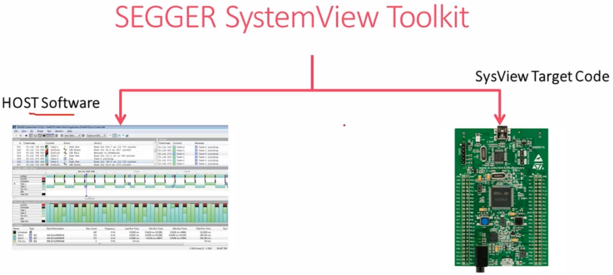
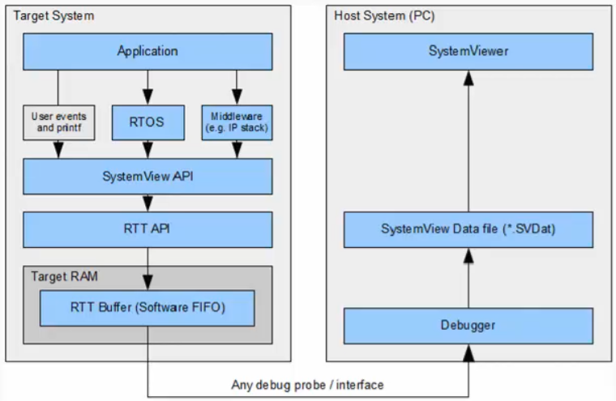
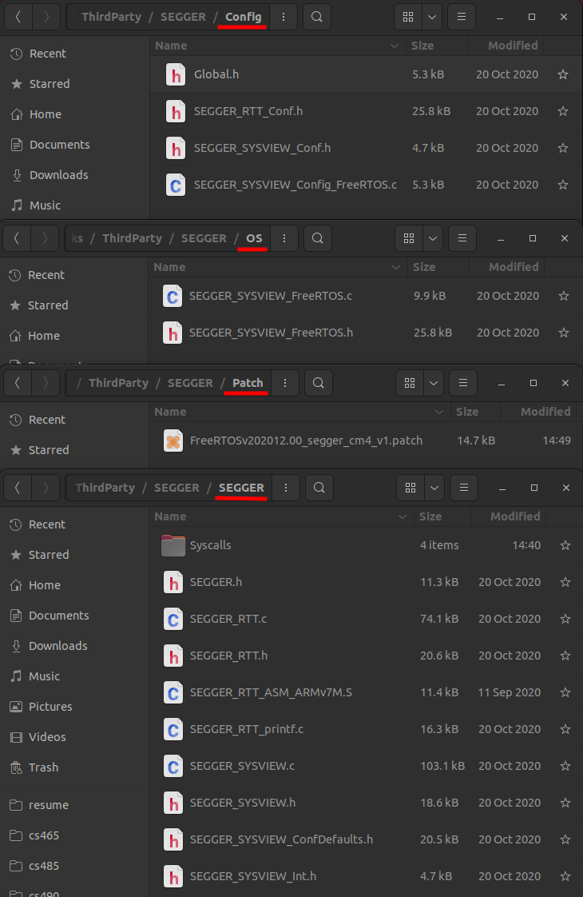
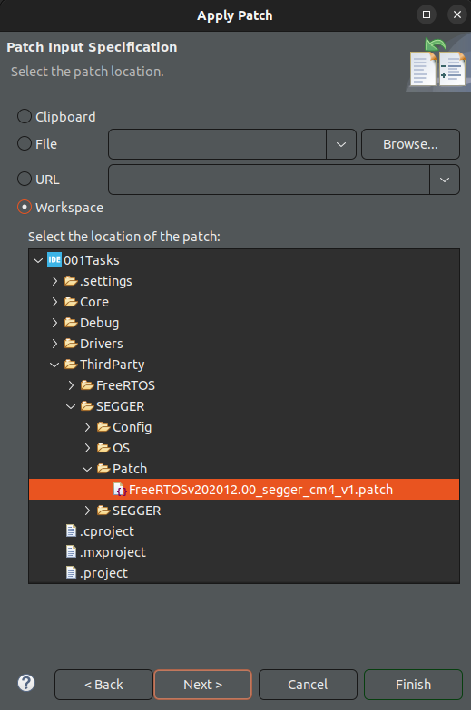
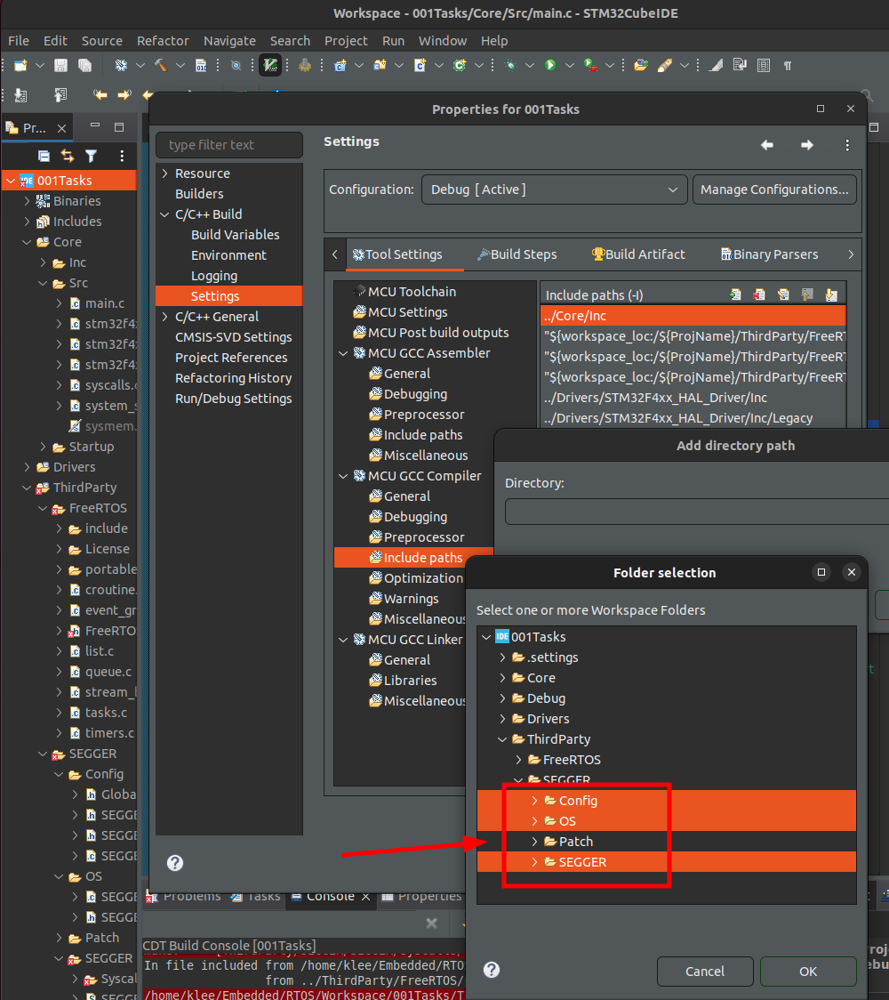
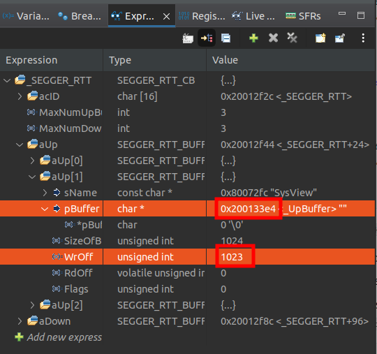
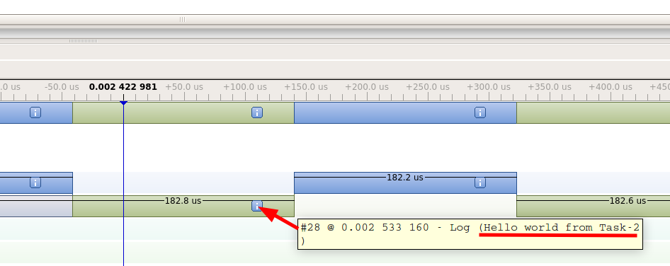

[Home](../../) | [Projects](../../projects) | [Notes](../) > <a href="./">Real-Time Operating Systems (RTOS)</a> > SEGGER SystemView (Trace Tool) Integration

# SEGGER SystemView (Trace Tool) Integration


## SEGGER SystemView Download

Download the following tools from [https://www.segger.com/](https://www.segger.com/)

1. SEGGER SystemView Software (host software) - V3.20
2. SEGGER SystemView target source files (need to be integrated into our project and flashed to target) - V3.20
3. SEGGER ST-Link Reflash untility (NOT used at this point)
4. SEGGER J-Link software package V5.12b or later (NOT used at this point)
   * This is required to be able to use (3).
5. SystemView user manual


## SEGGER SystemView

* SystemView is a software toolkit which is used to analyze the embedded software behavior running on your target. These pieces of embedded software include embedded OS or RTOS or it could be non-OS based application.

* SystemView can be used to analyze how your embedded code is behaving on the target.

  For example in the case of FreeRTOS application you can analyze

  * how many tasks are running and how much duration they consume on the CPU
  * ISR entry and exit timings and the duration of execution on the CPU
  * other behavior of tasks such as blocking, unblocking, notifying, yielding, etc.
  * CPU idle time so that you can use it to send the CPU to sleep mode
  * total runtime behavior of the application

* SystemView sheds light on what exactly happened in which order, which interrupt has triggered which task switch, which interrupt and task has called which API function of the underlying RTOS, etc.

* SystemView should be used to verify that the embedded system behaves as expected and can be used to find problems and inefficiencies such as superfluous and spurious interrupts, and unexpected task changes.

* SystemView Toolkit comes in 2 parts:

  * PC visualization software - SystemView host software (Windows/Linux/Mac)
  * SystemView target codes - used to collect the target events and sending back to PC visualization software





### SystemView Visualization Modes

1. **Real-time recording (Continuous recording)**

   With a SEGGER J-Link and its Real-Time Transfer (RTT) technology SystemView can continuously record data and transfer them to the host so that we can analyze and visualize them in real-time.

   Real-time mode can be achieved via ST-Link instead of J-Link. To do that J-Link firmware has to be flashed on ST-Link circuitry of STM32 boards. More on this later.

   Application (`main.c`), RTOS (FreeRTOS), we need to include SystemView API and RTT API, RTT Buffer is an array that the events to be transferred get stored.

   

   

   

2. **Single-shot recording**

   No J-Link or ST-Link debugger is required. When no J-Link is used, SEGGER SystemView can be used to record data until its target buffer is filled.

   In Single-shot mode the recording is started manually in the application, which allows recording only specific parts of our interest. The events will fill up the RTT Buffer in RAM, and at some point we can stop recording and dump the contents of the buffer to a file (.SVDat) to analyze them on the host PC.

   

   

   

### SystemView Window

* You can select each event and analyze it in the timeline, with the CPU load, etc.

  


## SystemView Integration

1. **Add SEGGER SystemView target sources to the project.**

   * Download SystemView target sources and extract it.

   * Create `Project/ThirdParty/SEGGER` folder and add to it `Config/`, `OS/`, `Patch/`, and `SEGGER/` folders and import the following files from the downloaded target source folder. Make sure that `Project/ThirdParty/SEGGER` is not excluded from the build.
     * `SEGGER_SYSVIEW_Config_FreeRTOS.c` is located in the `<Repository>/Downloads/SystemView_Src_V320/Sample/FreeRTOSV10/Config/Cortex-M/` directory.
     * `SEGGER_SYSVIEW_FreeRTOS.c` is located in the `<Repository>/Downloads/SystemView_Src_V320/Sample/FreeRTOSV10/` directory.
     * `FreeRTOSv202012.00_segger_cm4_v1.patch` is provided by the lecture.
     * Copy all the contents inside the `/Download/SystemView_Src_V320/SEGGER/` directory into `Project/ThirdParty/SEGGER/SEGGER/` directory.

   * Inside the `SEGGER/Syscalls/` directory, delete everything but GCC related file (`SEGGER_RTT_Syscalls_GCC.c`).

   

   

   

   * Update the "Include paths" so that the IDE can locate SEGGER include files.

2. **Patch FreeRTOS files**

   * The patch file `FreeRTOSv202012.00_segger_cm4_v1.patch` contains the SEGGER trace tool related patches to the FreeRTOS source files. Now, we have to apply this patch to the FreeRTOS source files.

     `ThirdParty` $\to$ Right click $\to$ Team $\to$ Apply patch $\to$ Workspace $\to$ Select the patch file $\to$ Next ... Finish

     

     

     

3. **FreeRTOSConfig.h settings**

   * `SEGGER_SYSVIEW_FreeRTOS.h` header must be included at the end of `FreeRTOSConfig.h` file, or above every include of `FreeRTOS.h`. It defines the trace macros to create SYSTEMVIEW events.

   * In `FreeRTOSConfig.h` include the following macros:

     ```c
     #define INCLUDE_xTaskGetIdleTaskHandle	1
     #define INCLUDE_pxTaskGetStackStart		1
     ```

     > Enables code blocks in the real-time kernel to include these functionalities which are required by the SEGGER. If these are set to 0, then the FreeRTOS build will not contain the source code related to these functionalities.

4. **MCU and project specific settings**

   * Specify the processor core your MCU is using in `Project/ThirdParty/SEGGER/SEGGER/SEGGER_SYSVIEW_ConfDefaults.h`.

     ```c
     /* SEGGER_SYSVIEW_ConfDefaults.h */
     ...
     #define SEGGER_SYSVIEW_CORE_OTHER   0
     #define SEGGER_SYSVIEW_CORE_CM0     1 // Cortex-M0/M0+/M1
     #define SEGGER_SYSVIEW_CORE_CM3     2 // Cortex-M3/M4/M7
     #define SEGGER_SYSVIEW_CORE_RX      3 // Renesas RX
     #ifndef SEGGER_SYSVIEW_CORE
       #if (defined __SES_ARM) || (defined __CROSSWORKS_ARM) || (defined __SEGGER_CC__) || (defined __GNUC__) || (defined __clang__)
         #if (defined __ARM_ARCH_6M__) || (defined __ARM_ARCH_8M_BASE__)
           #define SEGGER_SYSVIEW_CORE SEGGER_SYSVIEW_CORE_CM0
         #elif (defined(__ARM_ARCH_7M__) || defined(__ARM_ARCH_7EM__) || defined(__ARM_ARCH_8M_MAIN__))
           #define SEGGER_SYSVIEW_CORE SEGGER_SYSVIEW_CORE_CM3
         #endif
       #elif defined(__ICCARM__)
         #if (defined (__ARM6M__)          && (__CORE__ == __ARM6M__))          \
          || (defined (__ARM8M_BASELINE__) && (__CORE__ == __ARM8M_BASELINE__))
           #define SEGGER_SYSVIEW_CORE SEGGER_SYSVIEW_CORE_CM0
         #elif (defined (__ARM7EM__)         && (__CORE__ == __ARM7EM__))         \
            || (defined (__ARM7M__)          && (__CORE__ == __ARM7M__))          \
            || (defined (__ARM8M_MAINLINE__) && (__CORE__ == __ARM8M_MAINLINE__)) \
            || (defined (__ARM8M_MAINLINE__) && (__CORE__ == __ARM8M_MAINLINE__))
           #define SEGGER_SYSVIEW_CORE SEGGER_SYSVIEW_CORE_CM3
         #endif
       #elif defined(__CC_ARM)
         #if (defined(__TARGET_ARCH_6S_M))
           #define SEGGER_SYSVIEW_CORE SEGGER_SYSVIEW_CORE_CM0
         #elif (defined(__TARGET_ARCH_7_M) || defined(__TARGET_ARCH_7E_M))
           #define SEGGER_SYSVIEW_CORE SEGGER_SYSVIEW_CORE_CM3
         #endif
       #elif defined(__TI_ARM__)
         #ifdef __TI_ARM_V6M0__
           #define SEGGER_SYSVIEW_CORE SEGGER_SYSVIEW_CORE_CM0
         #elif (defined(__TI_ARM_V7M3__) || defined(__TI_ARM_V7M4__))
           #define SEGGER_SYSVIEW_CORE SEGGER_SYSVIEW_CORE_CM3
         #endif
       #elif defined(__ICCRX__)
         #define SEGGER_SYSVIEW_CORE SEGGER_SYSVIEW_CORE_RX
       #elif defined(__RX)
         #define SEGGER_SYSVIEW_CORE SEGGER_SYSVIEW_CORE_RX
       #endif
     
       #ifndef   SEGGER_SYSVIEW_CORE
         #define SEGGER_SYSVIEW_CORE SEGGER_SYSVIEW_CORE_CM3
       #endif
     #endif
     ...
     ```

     > L43: Set `SEGGER_SYSVIEW_CORE` to `SEGGER_SYSVIEW_CORE_CM3`.

   * Do SystemView buffer size configuration in `SEGGER_SYSVIEW_ConfDefaults.h`. (`SEGGER_SYSVIEW_RTT_BUFFER_SIZE`). This is the RTT Buffer in RAM used to collect and keep all the events to transfer to the host software. Set the buffer size according to your application's needs.

     ```c
     /* SEGGER_SYSVIEW_ConfDefaults.h */
     ...
     #ifndef   SEGGER_SYSVIEW_RTT_BUFFER_SIZE
       #define SEGGER_SYSVIEW_RTT_BUFFER_SIZE          1024 * 4	/* 1024 by default */
     #endif
     ...
     ```

     > 1KB by default but, we'll make it 4 KB.

   * Configure the some of the application specific information in `SEGGER_SYSVIEW_Config_FreeRTOS.c` under `/Project/ThirdParty/SEGGER/Config/`.

     ```c
     /* SEGGER_SYSVIEW_Config_FreeRTOS.c */
     ...
     // The application name to be displayed in SystemViewer
     #define SYSVIEW_APP_NAME        "FreeRTOS Hello World Application"
     
     // The target device name
     #define SYSVIEW_DEVICE_NAME     "STM32F407-DISC-1"
     ...
     ```

     > Just modify the values of the already existing macros.

5. **Enable the ARM Cortex-M3/M4 cycle counter**

   * This is required <u>to maintain the time stamp information</u> of the target events in the host application. SystemView will use the cycle counter register value to keep the time stamp information of the events.

   * DWT_CYCCNT register of ARM Cortex-M3/M4 processor stores the number of clock cycles that has passed after the processor's reset. (DWT_CYCCNT gets incremented every clock cycle.)

     * DWT: Data Watchpoint Unit of the processor

   * By default, this register is disabled since not all processors use it.

   * Consult *Cortex-M4 Technical Reference Manual* to see how to enable this register. (Section "DWT Programmer Model")

     To enable DWT_CYCCNT register, you need to set SYCCNTENA (bit[0]; Cycle Counter Enable) of DWT_CTRL register.

     ```c
     /* main.c */
     ...
     /* USER CODE BEGIN PV */
     #define DWT_CTRL (*(volatile uint32_t *)0xE0001000)
     /* USER CODE END PV */
     ...
     int main()
     {
         ...
         /* USER CODE BEGIN 2 */
     	// Enable the cycle counter
     	DWT_CTRL |= (0x1 << 0);	// Set SYCCNTENA bit of DWT_CYCCNT register
         ...
         /* USER CODE END 2 */
         ...
     }
     ```

6. **Start the recording of events**

   * To start the recordings of your FreeRTOS application, call the following SEGGER APIs:

     * `SEGGER_SYSVIEW_Conf();` - configures SEGGER target sources

     * `SEGGER_SYSVIEW_Start();` - starts the recording

       (`SEGGER_SYSVIEW_Stop();` - stops the recording)

     The SEGGER SystemView events recording starts only when `SEGGER_SYSVIEW_Start()` is called. This is called from `main.c` before calling any other FreeRTOS APIs.

     ```c
     /* main.c */
     ...
     int main()
     {
         ...
         /* USER CODE BEGIN 2 */
     	// Enable the cycle counter
     	DWT_CTRL |= (0x1 << 0);	// Set SYCCNTENA bit of DWT_CYCCNT register
         
         // Start the SEGGER SystemView recording of events
     	SEGGER_SYSVIEW_Conf();
     	SEGGER_SYSVIEW_Start();
         ...
         /* USER CODE END 2 */
         ...
     }
     ```

7. **Compile and debug**

   * Make sure that you've updated the Include paths.

     

     

     

     

   * Compile and flash your FreeRTOS + SystemView application.

     Check the following before building your project:

     ```c
     /* FreeRTOSConfig.h */
     #define configUSE_PREEMPTION	1
     ```

     > Set to use preemption.

     ```c
     /* main.c */
     
     static void task1_handler(void *parameters)
     {
     	while (1)
     	{
     		printf("%s\n", (char *)parameters);
     		//taskYIELD();
     	}
     }
     
     static void task2_handler(void *parameters)
     {
     	while (1)
     	{
     		printf("%s\n", (char *)parameters);
     		//taskYIELD();
     	}
     }
     ```

     > Comment out `taskYIELD()`s.

   * Go to debugging mode using your IDE.

   * Hit run and then pause after a couple of seconds.

     At this step, there was a problem related to "Priority grouping". To solve this issue add the following code in the `Project/Core/Src/stm32f4xx_hal_msp.c`:

     ```c
     /* stm32f4xx_hal_msp.c */
     ...
     /* USER CODE BEGIN Includes */
     #include "FreeRTOS.h"
     /* USER CODE END Includes */
     ...
     void HAL_MspInit(void)
     {
     	...
     	/* USER CODE BEGIN MspInit 1 */
     	vInitPrioGroupValue(); // Initializes a variable related to priority grouping!
     	/* USER CODE END MspInit 1 */
     }
     ```

     > Actually initialization of this variable is done in the scheduler (`vTaskStartScheduler()`) function, but in our `main.c` code, `SEGGER_SYSVIEW_Start()` which requires the initialization of this variable comes before the invocation of `vTaskStartScheduler()` and this is why we have to do this modification.

   * From the previous step, we have collected some events in the RTT Buffer.

8. **Collect the recorded data (RTT Buffer)**

   You can do this via continuous recording or single-shot recording.

   * Single-shot recording:

     * Get the SystemView RTT buffer address and the number of bytes used. (Normally `_SEGGER_RTT.aUp[1].pBuffer` and `_SEGGER_RTT.aUp[1].WrOff`). User Expressions window, type in `_SEGGER_RTT` to search these.

       

       

       [!] Note: Copy the `pBuffer` address 0x200133e4, and look it up in the Memory Browser.

       

     * Take the memory dump to a file.

       

       

       

     * Save the file with the `.SVdat` extension and "Raw Binary" format.

     * Use the file to load into SystemView host software to analyze the events.

       

       


## Note

* In our project, there are two `_write()` functions:

  * One defined in `Src/syscalls.c` - Associated with `printf()` call (This is a "weak" function, so if anywhere in the project a function with the same name is defined, that function will get called.)

  * The other defined in `ThirdParty/SEGGER/SEGGER/Syscalls/SEGGER_RTT_Syscalls_GCC.c` - Associated with SEGGER SystemView-flavor `printf()` such as `SEGGER_SYSVIEW_PrintfTarget()`. Using this function, we can print the message to the host software. 

    Note that this function takes only FORMATTED string as an argument. To format the string, use `snprintf()`:

    ```c
    printf("%s\n", (char *)parameters); /* regular printf() function */
    ```

    ```c
    char msg[100];
    snprintf(msg, 100, "%s\n", (char *)parameters); /* formatted string is stored in 'msg' */
    SEGGER_SYSVIEW_PrintfTarget(msg); /* pass the formatted string as an argument */
    ```

    

    

    [!] Note: You can also view these messages (received from the target) from the "Terminal" window.


## References

Nayak, K. (2022). *Mastering RTOS: Hands on FreeRTOS and STM32Fx with Debugging* [Video file]. Retrieved from https://www.udemy.com/course/mastering-rtos-hands-on-with-freertos-arduino-and-stm32fx/
