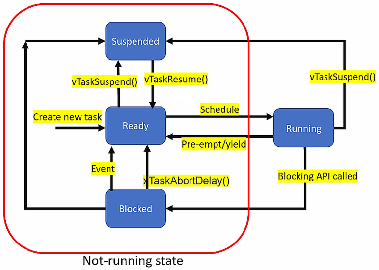

[Home](../../) | [Projects](../../projects) | [Notes](../) > <a href="./">Real-Time Operating Systems (RTOS)</a> > Task States

# Task States

## FreeRTOS Task States

### Ready 

* When a task is ready to be scheduled (or dispatched), it is said to be in the **Ready** state.
* The scheduler may not schedule the Ready state task to run on the CPU if a higher priority task is currently executing on the CPU. On the other hand, if a higher priority task than a task currently running on a CPU is found in the Ready queue, it immediately preempts the lower priority task. (All depends on the scheduling policy in use.)
* In FreeRTOS, whenever a new task is created, it enters the Ready state.

### Running

* When a task is currently executing on the processor, it is said to be in the **Running** state.
* Only one process can run on a single core CPU at any given point in time. (Multiple processes running on multiple cores simultaneously $\to$ Parallel processing)

### Blocked

* A task can leave a CPU from the Running state and chooses not to run on the CPU until an internal or external event is met. This state is the **Blocked** state.

* When a task is in the Blocked state, it won't consume any CPU time. (Blocked processes go to the "Blocked queue" and wait there for the events they are waiting for to complete.)

* In FreeRTOS, there is an API called `vTaskDelay()`. If a task calls this function, then it will enter the Blocked state for the passed number of RTOS ticks (500 RTOS ticks if `vTaskDelay(500)`), after which it unblocks and enters the Ready state (an internal temporal event).

* A task can also block waiting on an external event, like data arrival to the queue, nonavailability of lock in the case of mutex or semaphore, etc.

* Task in a Blocked state has a timeout period; after the timeout period, it unblocks and enters the Ready state even if the event for which it is waiting has not occurred. 

* A task can enter the Blocked state ONLY from the Running state.

* A running task can invoke the `TaskAbortDelay()` API using the task handle of the blocked task to unblock it, even if the event the blocked task is waiting for has not yet occurred.

* Advantages of blocking:

  * Blocking delay can be implemented

    * e.g., A task may enter the Blocked state to wait for 10 milliseconds.

    * Blocking delay APIs - `vTaskDelay()`, `vTaskDelayUntil()`

      Kernel objects (queues, semaphores, mutexes) support APIs which can block a task during operation.

  * Synchronization can be achieved

    * e.g., A task may enter the Blocked state to wait for data to arrive on a queue. When the data arrives at the queue, the data will unblock. Until then, the CPU does not have to spinlock to check the data arrival status.

  FreeRTOS queues, binary semaphores, counting semaphores, recursive semaphores, and mutexes can all be used to implement synchronization, and thus they support blocking of the task.

### Suspended

* A task enters the Suspended state when it or another task calls `vTaskSuspend(task_handle)`.
* A Suspended task will not enter Ready state unless some other running tasks cancel the suspension by calling the API `vTaskResume(task_handle_of_suspended_task)`.
* Unlike a task in the Blocked state, a task in the Suspended state CANNOT transition to the Ready state by an event.
* Unlike a task in the Blocked state, a task in the Suspended state doesn't have a timeout period. The only way a task in the Suspended state can be moved to the Ready state is by a running task calling the API `vTaskResume(task_handle_of_suspended_task)`.
* A task in Ready state can enter Suspended state directly if a Running task calls `vTaskSuspend(task_handle)` using the task handle of the Ready state task.

For more information about the "Task States", see [Process State Models and Control](../operating-systems/process-state-models-and-control).

## References

Nayak, K. (2022). *Mastering RTOS: Hands on FreeRTOS and STM32Fx with Debugging* [Video file]. Retrieved from https://www.udemy.com/course/mastering-rtos-hands-on-with-freertos-arduino-and-stm32fx/

