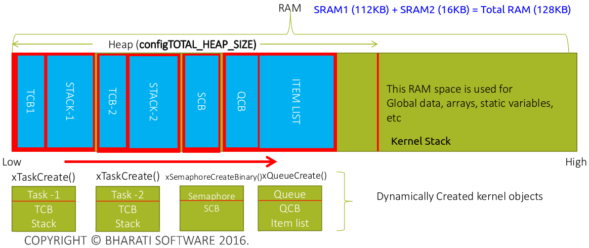
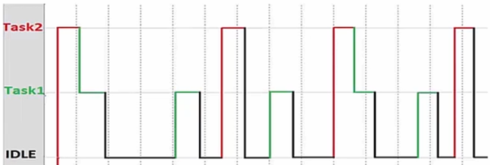

[Home](../../) | [Projects](../../projects) | [Notes](../) > <a href="./">Real-Time Operating Systems (RTOS)</a> > Tasks

# Tasks


## Application and Task

* In a computing world, an application comprises of different tasks. 

  For example, a "Temperature monitoring application" can be implemented by using the following tasks:

  * Task 1 - Sensor data gathering

  * Task 2 - Updating display

  * Task 3 - User input processing

    ...

* A task is essentially **a schedulable piece of code**, which **implements a specific functionality of an application**.


## Different Types of Tasks

1. Continuous task - Runs continuously on the CPU.
2. Periodic task - Runs on the CPU with a fixed execution period. 
3. Aperiodic task - Runs on the CPU when a certain event occurs. (e.g., Keypad interfacing)


## Two Steps of Creating a Task in FreeRTOS

1. **Create a task**

   This step is creating a task in memory, which involves allocating memory for the Task Control Block (TCB).

   ```c
   /* Task creation */
   BaseType_t xTaskCreate(TaskFunction_t pvTaskCode,
                          const char *const pcName,
                          unsigned short usStackDepth,
                          void *pvParameters,
                          UBaseType_t uxPriority,
                          TaskHandle_t *pxCreatedTask
                          );
   ```

2. **Implement the task (i.e., Create task handler)**

   This is a piece of code that will run on the CPU.

   ```c
   /* Task implementation = task handler = task function */
   void vATaskFunction(void *pvParameters)
   {
       /* Variables can be declared just like any regular functions. Each instance of a task created
       using this function will have its own copy of the 'iVariableExample' variable. 
       This would not be true if the variable was declared static - in which case only one copy of 
       the variable would exist and this copy would be shared among all the instances of the task. */
       int iVariableExample = 0;
       
       /* A task will normally be implemented as an infinite loop. */
       for (;;)
       {
           /* Task application code here */
       }
       
       /* Should the task implementation ever break out of the above loop then the task must be
       deleted BEFORE reaching the end of this function. The argument NULL passed to the vTaskDelete()
       function indicates that the task to be deleted is the calling task (i.e., current task) */
       vTaskDelete(NULL);
   }
   ```

   > `iVariableExample` is a local variable, which will be created in the stack space of this task. If this task handler is used by multiple tasks, then `iVariableExample` will be created in each task's own stack.
   >
   > If `iVariableExample` were declared as a `static` variable, it would've been a global (shared) variable among those tasks that use this task handler.

### Notes

* A task handler is generally implemented as an infinite loop.
* A task handler should never return without deleting the associated task.


## FreeRTOS Task Creation API

* The follwoing API creates a new FreeRTOS task dynamically (i.e., using dynamic memory allocation), and adds the newly created task (TCP) to Ready List or Ready Queue of the kernel. 

  It can be used in your application to create a new FreeRTOS task with a couple of parameters.

  ```c
  BaseType_t xTaskCreate(TaskFunction_t pvTaskCode,	// Address of the associated task handler.
                         const char *const pcName,	// A descriptive name to identify this task
                         configSTACK_DEPTH_TYPE usStackDepth,	// Amount of stack memory allocated to this
                         										// task (memory in WORDS not in bytes).
                         void *pvParameters,			// Pointer to the data which needs to be passed
                         								// to the task handler once it gets scheduled.
                         UBaseType_t uxPriority,		// Task priority.
                         TaskHandle_t *pxCreatedTask	// Used to save the task handle (an address
                        								// of the task created). Using task handle
                         								// you can suspend, block, delete or whatever
                         								// you want to do with the task.
                         );
  ```
  
  > In the program's stack memory, each task's stack space will be setup according to the `usStackDepth`. Note that this is not in bytes but in **WORD**s (`push` or `pop` unit). 
  >
  > * If the stack is 16-bit wide and `usStackDepth` is 100, then 200 bytes will be allocated use as the task's stack. Also, the basic unit of push/pop operation will be 16-bit.
  >
  > * If the stack is 32-bit wide and `usStackDepth` is 100, then 400 bytes will be allocated use as the task's stack. Also, the basic unit of push/pop operation will be 32-bit.
  >
  >   e.g., STM32F407 microcontroller
  >
  > [!] Note: **Word** is a maximum size of a data which can be accessed (load/store) by the processor in a single clock cycle using a single instruction. Processor design also offers native support (register width, bus width) to load/store word-sized data. Word size could be 8bit/16bit/32bit or more, depending upon the processor design. 
  >
  > For ARM Cortex-M based microcontrollers, word size is 32-bit.
  >
  > [!] Note: `BaseType_t` is defined to be the most efficient, natural type for the architecture. e.g., On a 32-bit architecture `BaseType_t` will be defined to be a 32-bit type. See [https://freertos.org/FreeRTOS-Coding-Standard-and-Style-Guide.html](https://freertos.org/FreeRTOS-Coding-Standard-and-Style-Guide.html).
  >
  > In earlier versions of FreeRTOS,
  >
  > ```c
  > UBaseType_t usStackDepth	/* for 8bit MCU, 255 was the max possible value for usStackDepth */
  > ```
  >
  > But it turned out to be too restrictive. So, in later versions, `configSTACK_DEPTH_TYPE` was introduced in place of `UBaseType_t`.
  >
  > ```c
  > configSTACK_DEPTH_TYPE usStackDepth
  > ```
  >
  > ```c
  > /* FreeRTOS.h */
  > #define configSTACK_DEPTH_TYPE uint16_t	
  > ```
  >
  > If `uint16` is too restrictive for your application, you can redefine it to a larger data type in `FreeRTOSConfig.h`
  
* Return value of `xTaskCreate()`:

  * `pdPASS` - If the task was created successfully.

  * `errCOULD_NOT_ALLOCATE_REQUIRED_MEMORY` - Otherwise.

    The only possibility of the task creation failure is due to memory allocation failure (i.e., insufficient memory).


* FreeRTOS API Reference - [https://www.freertos.org/a00106.html](https://www.freertos.org/a00106.html)


## Task Priorities

* A priority of a task comes into play when there are 2 or more tasks in the system.
* Priority value helps the scheduler to decide which task should run first on the processor.
* Priority value $\uparrow$ $=$ Priority $\uparrow$ (higher priority)
* Lower the priority value, lower the task priority (urgency).
* In FreeRTOS each task can be assigned a priority value from 0 to `configMAX_PRIORITIES` - 1, where `configMAX_PRIORITIES` may be defined in the `FreeRTOS.h`.
* You must decide `configMAX_PRIORITIES` as per your application requirements. 
  * Using too many task priority values could lead to onverconsumption of RAM. 
  * If many tasks are allowed to execute with varying task priorities, it may decrease the system's overall performance.
* Limit `configMAX_PRIORITIES` to 5, unless you have a valid reason to increase it.


## Exercise

* Write an application that creates 2 tasks, Task1 and Task2, of equal priorities to print the message "hello world from TaskX".

  ```c
  /* main.c */
  
  ...
  /* Private includes ----------------------------------------------------------*/
  /* USER CODE BEGIN Includes */
  #include "FreeRTOS.h"
  #include "task.h"
  /* USER CODE END Includes */
  
  ...
      
  /* Private function prototypes -----------------------------------------------*/
  ...
  /* USER CODE BEGIN PFP */
  static void task1_handler(void *parameters);
  static void task2_handler(void *parameters);
  /* USER CODE END PFP */
  
  ...
  
  /**
    * @brief  The application entry point.
    * @retval int
    */
  int main(void)
  {
  	/* USER CODE BEGIN 1 */
  	TaskHandle_t task1_handle;
  	TaskHandle_t task2_handle;
  
  	BaseType_t status;	// stores return value of xTaskCreate()
   	/* USER CODE END 1 */
      
      ...
          
  	/* USER CODE BEGIN 2 */
  
  	// create task 1
  	status = xTaskCreate(task1_handler,
                           "Task-1",
                           200,
                           "Hello world from Task-1",
                           2,
                           &task1_handle);
  	configASSERT(status == pdPASS); // macro defined in 'FreeRTOSConfig.h'
  
  	// create task 1
  	status = xTaskCreate(task2_handler,
                           "Task-2",
                           200,
                           "Hello world from Task-2",
                           2,
                           &task2_handle);
  	configASSERT(status == pdPASS); // macro defined in 'FreeRTOSConfig.h'
  	
      /* USER CODE END 2 */
      
  	...
  } // end main
  
  ...
      
  /* USER CODE BEGIN 4 */
  
  static void task1_handler(void *parameters)
  {
  
  }
  
  static void task2_handler(void *parameters)
  {
  
  }
  
  /* USER CODE END 4 */
  ```

  > * `configASSERT(x)` is a macro defined in `FrreeRTOSConfig.h`:
  >
  >   ```c
  >   #define configASSERT( x ) if( ( x ) == 0 ) { taskDISABLE_INTERRUPTS(); for( ;; ); }	
  >   ```
  >
  >   > It will trap the code when undesired flow is detected which is helpful for debugging.
  >
  > * `xTaskCreate()` is defined in `task.c` which manages task management of the real-time kernel.
  >
  >   It allocates space for the stack, allocates space for TCB, store the stack location in the TCB, and so on. If, during any of these processes, memory allocation fails (i.e., heap memory allocation failure), `xTaskCreate()` will return `errCOULD_NOT_ALLOCATE_REQUIRED_MEMORY`.
  >
  >   If previous steps were successful, it then adds the its TCB to the Ready list (`prvAddNewTaskToReadyList( pxNewTCB )`). Ready list is a list maintained by the kernel along with Blocked list, Suspended list, etc. This function will lead you to `list.c` which is a source file manages lists of the kernel.
  >
  > * When writing code for task handlers, be aware that they each have limited stack space and declaring a large-sized local array may cause stack overflow. (`static` variables will not be stored in stack, but in RAM. $\to$ Is stack not part of RAM?)

* If you have your tasks created (i.e., created tasks have been inserted into the Ready list of the kernel), now it's the time to invoke the scheduler, schedule and dispatch those tasks according to the defined scheduling policy.


## FreeRTOS Task Creation Behind the Scenes

* Memory usage





* When `xTaskCreate()` is called to create a task following things happen behind the scenes:

  1. Dynamic memory allocation for TCB and the TCB variables (e.g., `pxTopOfStack`) initialization 
  2. Dynamic memory allocation for the task's private stack (Since it is a dynamic allocation, this stack will be created in the HEAP space). This stack memory will be tracked using PSP register of the ARM Cortex-M processor.
  3. `pxTopOfStack` of TCB is set to point to the stack created in (2).
  4. TCB will be added to the Ready List.

  If the task creation fails due to insufficient memory in heap, `xTaskCreate()` will return an error code.

* Remember, things that are dynamically allocated using `malloc()` reside on heap section of RAM. If you need to take a look at or modify the heap size, check the following configuration in the `FreeRTOSConfig.h` file.

  ```c
  #define configTOTAL_HEAP_SIZE			( ( size_t ) ( 75 * 1024 ) )
  ```
  
  > When modifying the heap size, check the MCU reference manual for the valid range of heap size.
  
  Also, heap is nothing but an array defined in `Project/ThirdParty/FreeRTOS/portable/MemMang/heap_x.c`.
  
  ```c
  /* heap_4.c */
  
  /* Allocate the memory for the heap. */
  #if ( configAPPLICATION_ALLOCATED_HEAP == 1 )
  
  /* The application writer has already defined the array used for the RTOS
  * heap - probably so it can be placed in a special segment or address. */
      extern uint8_t ucHeap[ configTOTAL_HEAP_SIZE ];
  #else
      PRIVILEGED_DATA static uint8_t ucHeap[ configTOTAL_HEAP_SIZE ];
  #endif /* configAPPLICATION_ALLOCATED_HEAP */
  ```
  
  > `malloc()` is allocates memory from this array `ucHeap[]`!


## Idle Task





* The Idle task is created automatically when the RTOS scheduler is started to ensure there is <u>always at least one task that is able to run</u>. (Idle task is created by the kernel.)

  It is the scheduler's first job to create an Idle task.

* It is created at the lowest possible priority to ensure it does not use any CPU time if there are higher priority application tasks in the ready state.

* Idle task is responsible for freeing the memory (e.g., TCB, stack) allocated by the RTOS to the tasks that have been completed or deleted. `prvCheckTasksWaitingTermination()` function of the idle task is responsible for it. (Note that it is NOT the non-Idle task itself that cleans up the memory it was allocated. See [Deleting a Task](../deleting-a-task) for more information.) 

  You can also give an application a hook function (or callback function) such as `vApplicationIdleHook()` in the Idle task to <u>send the CPU to low power mode</u> when there are no useful tasks are executing.

  ```c
  /* task.c */
  ...
  // Idle task
  static portTASK_FUNCTION( prvIdleTask, pvParameters )
  {
      /* Stop warnings. */
      ( void ) pvParameters;
  
      /** THIS IS THE RTOS IDLE TASK - WHICH IS CREATED AUTOMATICALLY WHEN THE
       * SCHEDULER IS STARTED. **/
  
      /* In case a task that has a secure context deletes itself, in which case
       * the idle task is responsible for deleting the task's secure context, if
       * any. */
      portALLOCATE_SECURE_CONTEXT( configMINIMAL_SECURE_STACK_SIZE );
  
      for( ; ; )
      {
          /* See if any tasks have deleted themselves - if so then the idle task
           * is responsible for freeing the deleted task's TCB and stack. */
          prvCheckTasksWaitingTermination();
  
  		...
  
          #if ( configUSE_IDLE_HOOK == 1 )
              {
                  extern void vApplicationIdleHook( void );
  
                  /* Call the user defined function from within the idle task.  This
                   * allows the application designer to add background functionality
                   * without the overhead of a separate task.
                   * NOTE: vApplicationIdleHook() MUST NOT, UNDER ANY CIRCUMSTANCES,
                   * CALL A FUNCTION THAT MIGHT BLOCK. */
                  vApplicationIdleHook();
              }
          #endif /* configUSE_IDLE_HOOK */
          ...
      }
      ...
  }
  ```

  > L21: Memory cleanup
  >
  > L27: Application callback (e.g., Send the CPU to sleep, etc.)


## Timer Services Task (`Timer_svc`)

* Also called as "Timer Daemon Task" and it deals with **software timers**.
* Timer Services task gets created by the scheduler if `configUSE_TIMERS = 1` in `FreeRTOSConfig.h`.
* The RTOS uses this daemon just to manage FreeRTOS software timers and nothing else.
* If you don't use software timers in your FreeRTOS application you don't need to use this Timer Services task. If this is the case, configure `configUSE_TIMERS = 0` in `FreeRTOSConfig.h`.
* All software timer callback functions execute in the context of the Timer Services task.


## Review Questions

* If you want to create a task with a stack of size 512 bytes, how many bytes of memory do you need to dynamically allocate for this task?

  $\to$ 512 bytes + sizeof(TCB)

* What is the first member element of the TCB Structure ?

  $\to$ A pointer which holds the top of the task's stack

* In FreeRTOS, a task can be created statically as well. If you create a task statically, both TCB and stack of the task will reside in the global (a.k.a. `.data` section) space of RAM, which is outside the stack and heap space.

* Suppose there is a non zero initialized static variable is declared in  the task function, where exactly memory for that static variable is  allocated?

  ```c
  /* task function */
  void task_function(void *p)
  {
  	static int i=10;
  }
  ```

  $\to$ In the global section of RAM (a.k.a. `.data` section)

* Suppose there is a non static local variable declared in the task  function, where exactly the memory for the non static variable is  allocated during the execution of task function?

  ```c
  void task_function(void *p)
  {
  	int i ; /* non static variable */
  }
  ```

  $\to$ In the task's stack


## References

Nayak, K. (2022). *Mastering RTOS: Hands on FreeRTOS and STM32Fx with Debugging* [Video file]. Retrieved from https://www.udemy.com/course/mastering-rtos-hands-on-with-freertos-arduino-and-stm32fx/

