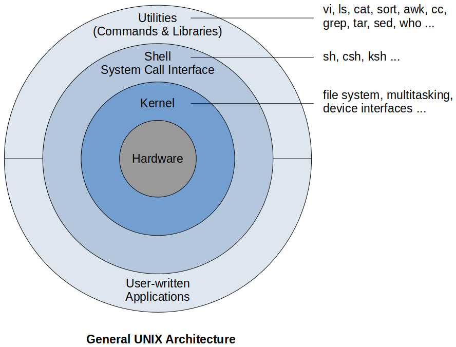

[Home](../../) | [Projects](../../projects) | [Notes](../) > <a href="./">Unix/Linux</a> > The UNIX Architecture

# The UNIX Architecture


## The UNIX Architecture





* **Kernel**

  - The core of the operating system.
    - The system's bootstrap program (a small piece of program code) loads the kernel into memory at startup.
  - Comprises a set of routines mostly written in C that directly communicate with the hardware.
  - User programs or the applications that need to access the hardware communicate with the kernel using a set of functions called *system calls*.
  - Does lots of *resource management*:
    - Manages the system's memory.
    - Schedules processes and decides their prioities.
    - Many more ...
  - Has work to do even if no user program is running.
  - Often called as *the* operating system - a program's gateway to the computer's resources.
  - Represented by the file `/boot/vmlinuz`.

* **Shell**

  - The interface between the *user* and the *kernel*. ("Outer part" of the operating system)

  - Interpreter that translates user commands into action.

  - Several shells could be run on only one kernel running on the system.

    - One for each user who is logged in.

  - Located in `/bin` or `/usr/bin`.

    ```plain
    $ echo $SHELL  
    /bin/bash
    ```

  - Commonly used shells:

    - bash - Bourne again shell (advanced shell that is standard on Linux)
    - sh - Primitive Bourne shell
    - csh - (C shell - still popular today)
    - ksh - Korn shell

* **Files**

  - Containers for storing static information.
  - Everything in UNIX is considered as files even directories and devices. (Simplifying assumption in UNIX)
  - Related to another file by being part of a single hierarchical structure called the *file system*.
  - "Files have *places* and processes have *life*"

* **Process**

  - A program in execution.
  - Also form a hierarchy which is best understood when one process is considered as the child of another.

* **System Calls**

  - Special functions that programs invoke to access kernel services. (e.g., `open`, `close`, `write`, `fprintf`, etc.)
  - POSIX specifies the system calls that all UNIX systems must implement.
    - Once software has been developed on one UNIX system using the calls mandated by POSIX, it can be easily ported to another UNIX machine.
