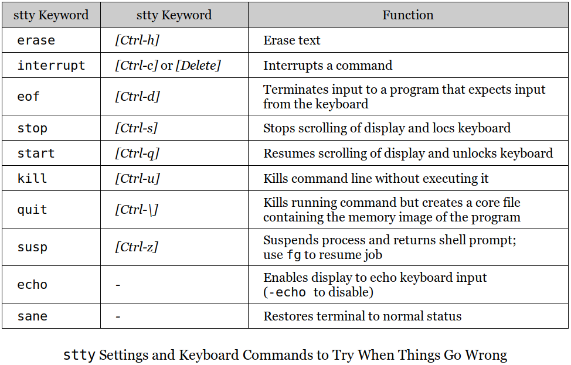

[Home](../../) | [Projects](../../projects) | [Notes](../) > <a href="./">Unix/Linux</a> > UNIX Commands

# UNIX Commands


## Command Basics

* UNIX commands are mainly written in C, but also supports programs written in any language.
* UNIX is case-sensitive to the filenames. (Most commands are in lowercase.)
* UNIX does NOT require an extension for command names, but it can be used either for convenience or for conforming to an application requirement.
    - e.g., `.c` and `.java` extensions are required for C and Java programs, repectively, to be compiled.
    - e.g., shell and Perl scripts don't need the `.sh` or `pl` extensions, but we often provide them for easier identification.
* Unlike other commands, **shell** is invoked the moment you log in and runs until you log out.
* External Commands
  - Commands that exist on disk as separate files.
* Internal Commands
  - Commands that are built into the shell executable.
    - e.g., `cd` command (There's no file in the system named `cd`.)

### `PATH` Variable

* **`PATH`** is a variable that shell maintains in its own environment (thus a.k.a. an *environment variable*).

* `PATH` is set to a list of colon-delimited directories; making it a string as a whole.

  ```plain
  $ echo $PATH
  /bin:/usr/bin:usr/ucb:/usr/spg4/bin:.
  ```

  > There are five directories in this list separated by a delimiter, the colon. (The last one, `.`, represents the current directory.)
  >
  > When a command is entered, the shell looks in each of these directories to locate the file with that name.

  When the `netscape` command is not available in any of these directories:

  ```plain
  $ netscape
  netscape: command not found
  ```

  In case `netscape` exists somewhere else on the system, try:

    - adding that directory to `PATH`
    - using a *pathname* (like `/usr/local/bin/netscape` if the command is located in `/usr/local/bin`).
    - switching to the directory where the executable is located and executing it from there.

* To execute the program in the current directory, invoke it with `./` at front.

  ```plain
  $ ./myprogram
  ```

### Commands to Locate a Command

* **which**

  - `which` command tells you the directory in `PATH` that contains the command:

    ```plain
    $ which grep
    /usr/bin/grep
    ```

    After searching the directories of `PATH` in sequence, `which` abandons its search the moment it locates a file named `grep`.

    **grep (global regular expression printer)** searches for patterns in a file.

  - `which` is not the required by POSIX.

* **whereis**

  - Unlike `which`, `whereis` searches a larger list than `PATH`.

    ```plain
    whereis grep
    grep: /usr/bin/grep /usr/share/man/man1/grep.1.gz /usr/share/info/grep.info.gz
    ```

  - `whereis` command is usable in BSD-based UNIX systems.

  - `whereis` is not the required by POSIX.

* **type**

  - `type` doesn't display *files* but only points to the version that will be executed.

    ```plain
    $ type echo
    echo is a shell builtin
    ```

    > Remember! Not all UNIX commands are *files*; some are built into the shell. `which` and `whereis` do not consider this possibility.

    ```plain
    $ which echo
    /usr/bin/echo
    ```

    This file is not the `echo` that will be executed but it is the built-in `echo` command that will be executed in reality. `type` gives a more authentic information whereas `which` gives only the half true information.


## Command Structure

* UNIX **command line**: *command* + *(space delmited) areguments*
  - Even if a lot of **whitespace** (space, tab, new line, form feed) are provided in the command line, the shell ensures that arguments are separated by a *single space* before the command is run.


* An **option** begins with a hyphen '-', and changes a command's default behavior. 
    - e.g., `ls` shows only the filenames, the `-l` and `-t` options show their attributes as well.
    - Never create a filename that begins with a hyphen as a command might treat it as one of its options.
    - **Linux** offers `--[word]` type options as well as all of the UNIX-type options.
        - e.g., `ls --classify` is equivalent to `ls -F`.
* The **filename** will generally be a command's last argument, after all options. However, this is not always true; some options use filenames as  their own arguments.


## Flexibility of Command Usage

* In UNIX, you can specify multiple commands in one line by using `;`(*a metacharacter*) as the delimiter of commands.
  
  ```plain
  ls ; cat file1
  ```
  
* On the other hand, a command line can be split into multiple physical lines.

  ```plain
  $ echo "This is
  > a three-line
  > text message"
  This is
  a three-line
  text message
  ```

  > The appearance of `>` (or `?`) indictes that the command line is not complete (e.g., the absence of a matching quote or parenthesis). If you can't fix it, just interrupt the command line with `[Ctrl-c]` or `[Ctrl-u]`.
  >
  > In *C shell* command line will look a little different:

  ```plain
  % echo "This is\      (Primary prompt in C shell is '%')
  ? a three-line\       (Secondary prompt is often '?')
  ? text message"
  This is
  a three-line
  text message
  ```
  
* Command output need not always be seen on the terminal.

  ```plain
  who > userlist.txt    (Output saved in 'userlist.txt')
  who | wc -l           ('who' piped to 'wc -l')
  ```


## `man`: On-Line Help

* `man`, short for *manual*, is called the *man documentation* which remains the most complete and authoritative guide to the UNIX system.
  
  ```plain
  $ man ls              (To view the manual page of 'ls')
  ```
  
  The output is sent to a *pager* program, which displays the contents of a file one page (screen) at a time.
  
* `man` is always preconfigured to be used with a specific pager.

  - **`more`**, Berkeley's pager, a superior alternative to the original AT&T `pg` command (now obsolete), which is now available universally.
  - **`less`**, the standard pager used on Linux systems, but also available for UNIX platforms.
  
* On the `man` page, the key you press can be considered to be one of `man`'s (rather, the pager's) **internal commands** which doesn't show up on the screen.
  
    - e.g., To quit the pager, and ultimately `man`, press **`q`**.

* `man` page also includes important *system files* and *system calls* used by the commands.

### Navigation and Search

* The navigation commands may vary across the UNIX implementations.
  - e.g., `f` or `spacebar` advances by one scree, `b` moves back one screen.
* Search
  - e.g., `/filename`*[Enter]* calls up the page containing the word `filename`. (Press `n` to find next.)

### Further Help with `man -k` and `man -f`

* POSIX requires `man` to support only one option `-k`. 

  -  Most UNIX systems also offer the `appropos` command that emulates `man -k`.
  
* `man -k` searches the NAME section of all man pages that contain the keyword.

  ```plain
  $ man -k cron
  anacrontab (5)       - configuration file for anacron
  anacron (8)          - runs commands periodically
  cron (8)             - daemon to execute scheduled commands (Vixie Cron)
  crontab (1)          - maintain crontab files for individual users (Vixie Cron)
  crontab (5)          - tables for driving cron
  ```

  ```plain
  $ man -k chmod
  chmod (1)            - change file mode bits
  chmod (2)            - change permissions of a file
  fchmod (2)           - change permissions of a file
  fchmodat (2)         - change permissions of a file
  ```


## The `man` Documentation

* Generally, `man` documentation includes following eight sections.


* Examples

  ```plain
  man 2 read            (Look up the 'read' system call)
  man -s2 read          (Solaris uses the '-s' option)
  ```

  ```plain
  man passwd            (Look up Section 1 only)
  man 4 passwd          (Look up Section 4)
  man -s4 passwd        (Solaris uses the '-s' option)
  ```

### Understanding a `man` Page

* A `man` page is divided into a number of *compulsory* and *optional* sections.
  - Although not every command has all sections, the first three (**NAME**, **SYNOPSIS** and **DESCRIPTION**) are generally seen in all `man` pages.
* **NAME** provides one-line introduction to the command.
* **SYNOPSIS** shows the syntax used by the command.
  - e.g., `mycmd [ -a | -b | -A ] [ -kj ] [ file ... ]`
    - Bracket ([]) means optional; otherwise, required. So `mycmd` can be used by itself without arguments.   
    - Ellipsis (...) implies that there can be more. So `mycmd` can be used with more than one filename as argument.   
    - Pipe (|) delimited options mean that only one on the either side of the pipe can be used. So, only one of the options `-a`, `-b` and `-A`, can be used.
* **DESCRIPTION** (often the largest section) presents a detailed description.
* OPTIONS lists all options used by the command.
* EXIT STATUS lists possible error conditions and their numeric representation.
  - This is important when writing shell scripts and C programs in order to determine the actual cause of termination of a program.

### Using `man` to Understand `man`

* `man` itself is a UNIX command so it can be viewed in it's own documentation.

  - The variable `PAGER` can be chosen.

    ```plain
    $ PAGER=less ; export PAGER     (Set this shell variable and export it before you run 'man')
    $ man ls
    ```

### `info` and `--help` in Linux

* Linux offers two additional help facilities; `info` command and `--help` option.
  
* **`info`** is GNU's info reader for browsing Texinfo documentation.

  ```plain
  $ info grep           (See the documentation organized in 'nodes')
  ```

  Tips!

    - *[Tab]* to naviate through the nodes.
    - `n` to visit the next node.
    - `p` to visit previous node
    - `u` to return to the previous level where *[Enter]* was pressed.
    - `l` to move to the previously visied note.
    - Within a page, *[PageUp]* and *[PageDown]* (or spacebar) also work.
  
* **--help** option displays a compact listing of all options.

  ```plain
  $ grep --help         (Shows grep's options in a compact manner)
  ```

  This is useful when a command has too many options and you need to view them quickly.


## `echo`: Displaying Messages

* **`echo`** command is often used to,

  - evalute shell variables.

    ```plain
    $ echo $SHELL
    /bin/bash
    ```

  - (when used in shell scripts) to display messages on your terminal.

    ```plain
    $ echo "Filename not entered"     (Shell version of echo used here)
    Filename not entered
    ```

  - (when used in shell scripts) to issue prompts for taking user input.
    e.g., In AT&T version (System V), `echo` command can be used with **escape sequences**, but BSD doesn't recognize them. (`-n` option is an alternative to the `\c` sequence.)
    
    ```plain
    $ echo "Enter filename: \c"   (System V)
    $ echo -n "Enter filename: "  (BSD)
    Enter filename: $ _           (Prompt and cursor in the same line)
    ```
    
    > An escape sequence begins with a `\` and is followed by a single character or a zero-prefixed number. Here, `\c` is an escape sequene.
    >
    > `echo` interprets a number as *octal* when it is preceded by `\0`.


* Different shells will respond differently to escape sequences.

  - For this reason, PSOXI recommands to use `printf` instead of `echo`.
  
* In Linux, where *Bash* is the standard shell, `e` option is required to interpret the escape sequences properly.
  
  ```plain
  $ echo -e "Enter filename: \c"
  Enter filename: $ _
  ```


## `printf`: Alternative to `echo`

* `printf` esixts as an external command, but it's only Bash that has `printf` built in.
  
* If you can, choose **`printf`** over `echo`.

* `printf` recognizes **escape sequences**.

  ```plain
  $ printf "No filename entered\n"      (Unlike echo, '\n` is required in printf to explicitly specify a new line)
  No filename entered
  ```

* `printf` also uses **format specifiers** to format the output. (Like in C.)

  ```plain
    $ printf "My current shell is%s\n" $SHELL
    My current shell is/bin/bash
  ```

  > Unlike in C though, the parentheses and comma between the format specifier and its matching arguments are absent.


## `script`: Recording Your Session

* **`script`** is used to *record* your login session in a file. 

  - It is not included in POSIX but is very useful.
  
* `script` should be followed by the **name of the file** to place the log in, and the **exit** command should be used to stop logging.
  
  ```plain
  $ script mylog
  Script started, file is mylog
  $ echo "This is a test log."          (Another shell; recording begins here) 
  This is a test log.
  $ exit                                (Or use [Ctrl-d])
  exit      
  Script done, file is mylog
  $ _                                   (Back to login shell)
  ```
  
  At the termination of above session recording, `mylog` will be containing:
  
  ```plain
  Script started on 2022-02-11 15:18:56-06:00 [TERM="xterm-256color" TTY="/dev/pts/2" COLUMNS="102" LINES="57"]
  $ echo "This is a test log."
  This is a test log.
  $ exit
  exit
  Script done on 2022-02-11 15:19:42-06:00 [COMMAND_EXIT_CODE="0"]
  ```
  
  > If the filename is not provided, the session record will get recorded in the file named `typescript` by default.
  >
  > `script` overwrites any previous `typescript` that my exist. (Use `-a` option to append.)


## Using Email with `mailx`

* **`mailx`** is the only mail utility that POXIS requires all UNIX systems to support.
* An email message is identified by a sender and a recipient, both of which appear as headers in the message.
* Recieved mail is deposited in a **mailbox**, a text file that may contain binary attachments in encoded form.
    - A viewed message is moved from the mailbox to the **mbox**. (a.k.a. *folders*)

### Sending Mail

* **Interactive Sending Mode**

  - `mailx` command works in the interactive sending mode when invoked with the emil address of the recipient as argument.
    
    ```plain
    klee@t480s:~$ mailx klee          ('klee' is on the same host)
    Cc: klee
    Subject: Interactive Sending Mode Test 1
    This is an interactive sending mode test 1.                       
    klee@t480s:~$ _                   ([Ctrl-d] or dot sends the mail)
    ```
    
    ```plain
    klee@t480s:~$ mailx klee          ('klee' is on the same host)
    Cc: klee
    Subject: Interactive Sending Mode Test 2
    This is an interactive sending mode test 2, without Cc.
    klee@t480s:~$ _                   ([Ctrl-d] or dot sends the mail)
    ```
    
    After sending the above two mails, the file `/var/mail/klee` contains:
    
    ```plain
    From klee@t480s  Fri Feb 11 16:30:39 2022
    Return-Path: <klee@t480s>
    X-Original-To: klee@t480s
    Delivered-To: klee@t480s
    Received: by t480s (Postfix, from userid 1000)
        id 9451B240156; Fri, 11 Feb 2022 16:30:39 -0600 (CST)
    To: <klee@t480s>
    Cc: <klee@t480s>
    Subject: Interactive Sending Mode Test 2
    X-Mailer: mail (GNU Mailutils 3.7)
    Message-Id: <20220211223039.9451B240156@t480s>
    Date: Fri, 11 Feb 2022 16:30:39 -0600 (CST)
    From: klee <klee@t480s>
    
    This is an interactive sending mode test 1.                       
    
    From klee@t480s  Fri Feb 11 16:37:49 2022
    Return-Path: <klee@t480s>
    X-Original-To: klee@t480s
    Delivered-To: klee@t480s
    Received: by t480s (Postfix, from userid 1000)
        id CBD8C240157; Fri, 11 Feb 2022 16:37:49 -0600 (CST)
    To: <klee@t480s>
    Subject: Interactive Sending Mode Test 2
    X-Mailer: mail (GNU Mailutils 3.7)
    Message-Id: <20220211223749.CBD8C240157@t480s>
    Date: Fri, 11 Feb 2022 16:37:49 -0600 (CST)
    From: klee <klee@t480s>
    
    This is an interactive sending mode test 2, without Cc.
    ```
    
  
* **Noninteractive Sending Mode**

  - UNIX specific way to send mails.

    ```plain
    $ mailx -s "Noninteractive Sending Mode Test" klee < message.txt
    ```

    Where *message.txt* contains:

    ```plain
    This is a noninteractive sending mode test.
    ```

    After sending the above mail, the file `/var/mail/klee` contains:

    ```plain
    From klee@t480s  Fri Feb 11 16:53:08 2022
    Return-Path: <klee@t480s>
    X-Original-To: klee@t480s
    Delivered-To: klee@t480s
    Received: by t480s (Postfix, from userid 1000)
        id B52A3240157; Fri, 11 Feb 2022 16:53:08 -0600 (CST)
    Subject: Noninteractive Sending Mode Test
    To: <klee@t480s>
    X-Mailer: mail (GNU Mailutils 3.7)
    Message-Id: <20220211225308.B52A3240157@t480s>
    Date: Fri, 11 Feb 2022 16:53:08 -0600 (CST)
    From: klee <klee@t480s>
    
    This is non-interactive sending mode test.
    ```
    
  - Although it is not required by POSIX, most **mailx** versions support the `-c` (carbon copy) and `-b` (blind carbon copy) options.
    
    ```plain
    mailx -s "Greetings" -c "sunny,yena" -b jaesoo klee < message.txt
    ```
    
    Recipient list of this mail will be:
    
    ```plain
    To: klee@t480s
    Cc: sunny@t480s, yena@t480s
    Bcc: jaesoo@t480s
    ```
    
  - What's remarkable about the **Noninteractive Sending Mode**?

    - Subject and recipients can be obtained from shell variables. 
    - Message body could come from the output of another program.
    - Designing automated mailing lists is possible by using these
      features.

### Receiving Mail

* Incoming mail is appended to the **mailbox**, a text file named after the user-id of the recipient.
  
    - mailbox location: `/var/mail` (`/var/spool/mail` in Linux.)
    
      e.g., `/var/mail/klee`

* When you are prompted with the following message:

  ```plain
  You have new mail in /var/mail/klee
  ```

  run the **mailx** command in the receiving mode (without using an argument) to check the mailbox and the system will display the headers and some credentials of all incoming mail still saved in the mailbox:
  
  ```plain
  $ mailx
  "/var/mail/klee": 3 messages 3 new
  >N   1 klee               Fri Feb 11 16:30  14/393   Interactive Sending Mode Test 1
   N   2 klee               Fri Feb 11 16:37  13/378   Interactive Sending Mode Test 2
   N   3 klee               Fri Feb 11 16:53  13/432   Noninteractive Sending Mode Test
  ? _
  ```
  
  Press the *number* or *[Enter]* to view the message that the *number* or the `>` is positioned on, respectively.

  Press `q` to quit.
  
* Already seen mails will be moved from the *mailbox* to the *mbox* located in the user's home directory.

### `mailx` Internal Commands


* **Replying to mail**

  - `r` (reply) command switches **mailx** to the sending mode and retrieves the sender's detail.
  
* **Saving messages**

  - `w` command saves one or more messages in separate files.

    ```plain
    $ w myfile              (Appends current message to 'myfile')
    $ w 1 2 3 myfile        (Appends first three messages to 'myfile')
    ```

    To view these messages with their headers:

    ```plain
    $ mailx -f myfile
    ```

* **Deleting Mail**

  - `d` (delete) command marks a mail for deletion; the mail gets deleted when quitting **mailx**.


## `passwd`: Changing Your Password

* `passwd` command changes the user's password.

  ```plain
  $ passwd
  Changing password for klee.
  Current password:                         (Asks for old password)
  New password:                             (New password to be entered twice)
  Retype new password:
  passwd: password updated successfully
  ```

  > The new password is encrypted (scrambled) by the system and stored in the file `/etc/shadow` (`/etc/passwd` on older systems). 
  >
  > The system will authenticate with this file everytime the user logs in.
  
* **Nonprivileged user** can change only their own password.

* **Privileged user**, the system administrator, can change any user's password using the same command.


## `uname`: Your Machine's Name and Operating System

* The `uname` command displays certain features of the operating system running on your machine.
  
  ```plain
  $ uname
  Linux                 (Output depends on the system)
  ```
  
  By default, it simply displays the name of the operating system.
  
* **Current release**

  - `-r` option displays the version of your operating system.

    ```plain
    $ uname -r
    5.13.0-28-generic     (In Linux, this means 'Kernel version 5.13')
    ```

* **Machine name**

  - `-n` option displays your *hostname*.

    ```plain
    $ uname -r
    t480s
    ```

    > Every machine has a name (the *hostname*), and if your network is connected to the Internet, this hostname is a component of your machine's *domain name*.


## `who`: Know the Users

* The **`who`** command shows the information of users logged in.

  ```plain
  $ who
  root      console     Feb 12 08:51    (:0)
  hkim      pts/10      Feb 12 08:59    (pc123.sunnykim.com)
  ```

  > 1<sup>st</sup> column: user-ids currently working on the system. (2 users)
  >
  > 2<sup>nd</sup> column: filenames of the devices associated with the respective terminals. (klee's terminal has the name `pts/10` (a file named `10` in the `pts` directory).
  >
  > 3<sup>rd</sup>, 4<sup>th</sup>, 5<sup>th</sup> comumns: date and time of logging in.
  >
  > Last column: hostname from where the user logged in. (`skim` have logged in remotely from the different hostl.)

* To specify who invoked the `who` command, use the argument `am` and `i`.

  ```plain
  $ who am i
  hkim      pts/10      Feb 12 08:59    (pc123.sunnykim.com)
  ```

  > This didn't work on Ubuntu 20.04 (5.13.0-28-generic).


## `date`: Displaying the System Date

* The UNIX internal clock stores the number of seconds elapsed since the **Epoch**: January 1, 1970.
  
* The `date` command shows the date and time to the nearest second:

  ```plain
  $ date
  Fri 11 Feb 2022 10:07:22 PM CST
  ```

* `+`-prefixed format specifiers as arguments can be used:

  ```plain
  $ date +%m            (Print 'month' only)
  02
  ```

  ```plain
  $ date +%h            (Print 'month' name only)
  Feb
  ```

  ```plain
  $ date +"%h %m"       (Print them combined)
  Feb 02
  ```

  > When using multiple format specifiers, enclose them within quotes (single or double) and use `+` symbol as a prefix.
  >
  > `d`: The day of the mont (`1` to `31`)
  >
  > `y`: The last two digits of the year
  >
  > `H`, `M` and `S`: The hour, minute, and second, repectively
  >
  > `D`: The date in the format *mm/dd/yy*
  >
  > `T`: The time in the format *hh:mm:ss*


## `stty`: When Things Go Wrong

* The **`stty`** command changes terminal settings. (Displays them when used with the `-a` option.
  
  ```plain
  $ stty -a
  speed 38400 baud; rows 57; columns 102; line = 0;
  intr = ^C; quit = ^\; erase = ^?; kill = ^U; eof = ^D; eol = <undef>; eol2 = <undef>; swtch = <undef>;
  start = ^Q; stop = ^S; susp = ^Z; rprnt = ^R; werase = ^W; lnext = ^V; discard = ^O; min = 1; time = 0;
  -parenb -parodd -cmspar cs8 -hupcl -cstopb cread -clocal -crtscts
  -ignbrk -brkint -ignpar -parmrk -inpck -istrip -inlcr -igncr icrnl ixon -ixoff -iuclc -ixany -imaxbel
  iutf8
  opost -olcuc -ocrnl onlcr -onocr -onlret -ofill -ofdel nl0 cr0 tab0 bs0 vt0 ff0
  isig icanon iexten echo echoe echok -echonl -noflsh -xcase -tostop -echoprt echoctl echoke -flusho
  -extproc
  ```
  
* Keyword forms:

  - *keyword = value*
  - *Keyword* or *-keyword* (The `-` prefix means that the option is turned off.)
  
* **Changing the settings**

  ```plain
  $ stty intr DEL           (Define [Delete] key as the 'interrupt' key)
  $ stty intr /^c           (Define it back to [Ctrl-c])
  ```

  All keys shown above can be mapped differently the same way.

* **Resetting the settings**

  ```plain
  $ stty sane               (Restore sanity to the terminal)
  $ reset                   (Restore sanity to the terminal)
  ```

* When things go wrong:





## The X Window System

* **X Window System** is the default GUI for UNIX systems. It is a lightweight windowing system that allows for graphical windows to be displayed on a UNIX system.
    - Displays every application in a separate window.
    - Uses mouse to run programs, display menus, select options, cut-copy-paste operations.
    - Because X (i.e., X Windows) uses a bit-mapped display (where every pixel on the screen is handled individually), web browsers like Mozilla and Konqueror MUST run under X.
* Unlike *Microsoft Windows*, the look-and-feel of the X Window system varies across UNIX and Linux systems.
    - e.g., Common Desktop Environment (CDE), GNOME, KDE, etc.

### Terminal Emulator

* X supports **terminal emulator** program that runs a shell in a window.
  - You can use every UNIX command on this window.
  - You can invoke any graphical X program on this window.

### File Manager

* Every X implementation offers a **file management** program that can perform copying, moving and deleting, etc.
