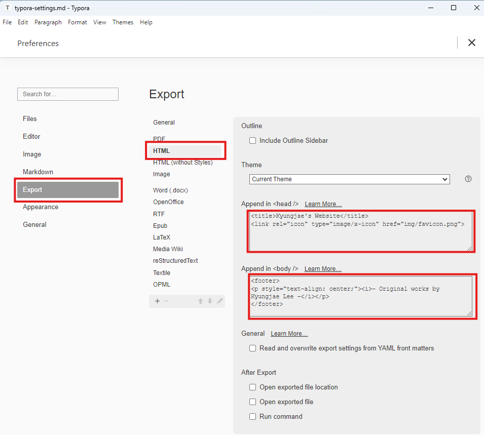
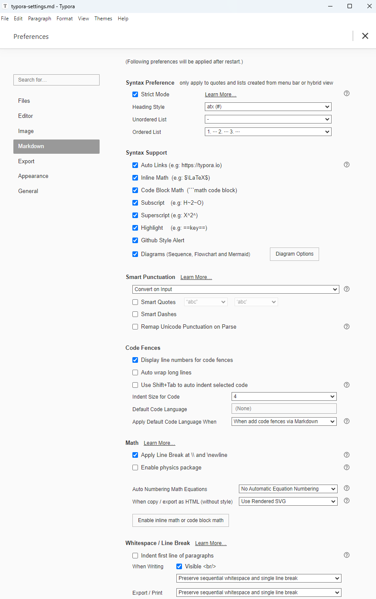

[Home](../../) | [Projects](../../projects) | [Notes](../) > <a href="./">Website</a> > Typora Settings

# Typora Settings


## Export to HTML




* Add the following code to `Append in <head />` section to insert favicon:

  ```html
  <title>Kyungjae's Website</title>
  <link rel="icon" type="image/x-icon" href="img/favicon.png">
  ```

  > The favicon image must be resized to the optimal dimensions for favicon use.

* Add the following code to `Append in <body />` to add footer to each page:

  ```html
  <footer>
  <p style="text-align: center;"><i>- Original works by Kyungjae Lee -</i></p>
  </footer> 
  ```


## Markdown Settings





## Code Block Settings

* Find the `.css` file for your theme and add the following code to make sure your code block looks good on any mobile devices:

  ```css
  /* Code block settings. */
  pre {
      white-space: pre;             /* Keep formatting, no wrapping */
      overflow-x: auto;             /* Enable horizontal scroll */
      font-size: 1em;               /* Base font size, adjustable */
      max-width: 100vw;             /* Ensure it doesn't overflow screen */
      box-sizing: border-box;       /* Include padding in width calculation */
      padding: 1em;                 /* Optional: clean spacing */
  }
  
  /* Optional: Adjust font size slightly for small screens */
  @media (max-width: 768px) {
  pre {
      font-size: 0.9em;           /* Slightly smaller font on tablets and phones */
  }
  }
  
  @media (max-width: 480px) {
  pre {
      font-size: 0.85em;          /* Even smaller font on very small phones */
  }
  }
  ```

  > For me, it was `github.css` file under `Typora/themes/`.
