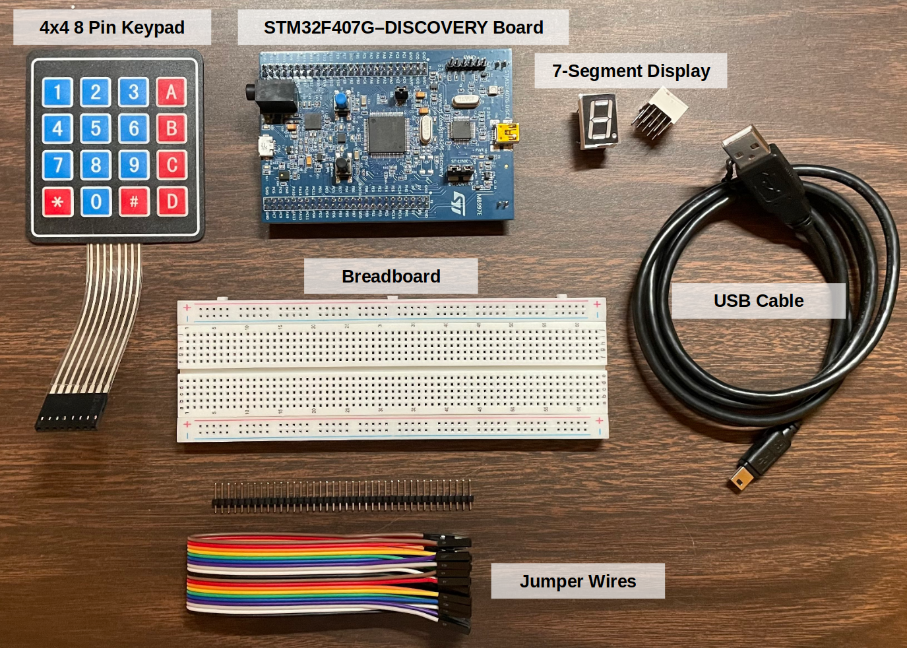

[Home](../../) | [Notes](../../notes) | [Projects](../) > 7-Segment Display Control with Keypad

# 7-Segment Display Control with Keypad 


## Introduction

An embedded C program to control 7-segment display with keypad and STM32F microcontroller board


## Objective

* Be able to read schematics.
* Get familiar with controlling the General Purpose Input/Output (GPIO) of microcontroller (STM32x) by directly accessing and configuring the memory-mapped registers. (Without using Hardware Abstraction Layer (HAL) library)
* Understand how the 4x4 keypad and 7-segment display interfacing works.
* Get familiar with referencing datasheets.


## Demonstration


<iframe width="560" height="315" src="https://www.youtube.com/embed/UrVv22pRPFg" title="YouTube video player" frameborder="0" allow="accelerometer; autoplay; clipboard-write; encrypted-media; gyroscope; picture-in-picture; web-share" allowfullscreen></iframe>

[!] Note: '*' is mapped to 'E' and '#' is mapped to 'F'


## Development Environment

### Hardware Components





### Software 

* **IDE** - STM32 CubeIDE Version 1.10.1 (GCC compiler)
* **Host OS** - Ubuntu 22.04 LTS


## Source Code

```c
//========================================================================================
// Filename     : keypad_svnseg_interface.c
// Description  : Embedded C program to control 7-segment display with keypad and STM32 board
// Author       : Kyungjae Lee
// History      : 02/07/2023 - Created file
//========================================================================================

// 7-Segment Interfacing: PE4-11
//
// 7-segment pins
// 1    2    4    5    6    7    9    10    (3, 8: common cathode)
// PE7  PE8  PE9  PE10 PE11 PE12 PE13 PE14  (all input mode)


// Keypad Interfacing: PD0-3, PD8-11
//
// Keypad Pin
// 8    7    6    5    4    3    2    1
// R1   R2   R3   R4   C1   C2   C3   C4
// -----------------   -----------------
// output	           input
// PD0  PD1  PD2  PD3  PD8  PD9  PD10 PD11
//
// Pull-up resistor is necessary to avoid floating state of an input pin.
// Key not pressed = inputs are High
// Key pressed = inputs are Low
//
// When R1 is Low and all other rows are High, and when C2 is Low,
// we can conclude that the button 2 has been pressed (Intersection of C2 and R1)

#include <stdint.h>

#if !defined(__SOFT_FP__) && defined(__ARM_FP)
  #warning "FPU is not initialized, but the project is compiling for an FPU. Please initialize the FPU before use."
#endif

#define ADDR_RCC_BASE 0x40023800
#define ADDR_RCC_AHB1ENR (ADDR_RCC_BASE + 0x30)

// Port D
#define ADDR_PORTD_BASE 0x40020C00
#define ADDR_PORTD_MODER (ADDR_PORTD_BASE + 0x00)
#define ADDR_PORTD_PUPDR (ADDR_PORTD_BASE + 0x0C)
#define ADDR_PORTD_IDR (ADDR_PORTD_BASE + 0x10)
#define ADDR_PORTD_ODR (ADDR_PORTD_BASE + 0x14)

// Port E
#define ADDR_PORTE_BASE 0x40021000
#define ADDR_PORTE_MODER (ADDR_PORTE_BASE + 0x00)
#define ADDR_PORTE_PUPDR (ADDR_PORTE_BASE + 0x0C)
#define ADDR_PORTE_ODR (ADDR_PORTE_BASE + 0x14)

// Segment to GPIO pin mapping
#define SEG_A (1 << 12) // PE12
#define SEG_B (1 << 11) // PE11
#define SEG_C (1 << 9) // PE9
#define SEG_D (1 << 8) // PE8
#define SEG_E (1 << 7) // PE7
#define SEG_F (1 << 13) // PE13
#define SEG_G (1 << 14) // PE14
#define SEG_DP (1 << 10) // PE10

void init();
void turn_on_svnseg(uint8_t hexval);
void keypad_svnseg_interfacing();
void delay(void);

volatile uint32_t *const pRCC_AHB1ENR = (uint32_t *)ADDR_RCC_AHB1ENR;
volatile uint32_t *const pPORTD_MODER = (uint32_t *)ADDR_PORTD_MODER;
volatile uint32_t *const pPORTD_ODR = (uint32_t *)ADDR_PORTD_ODR;
volatile uint32_t *const pPORTD_IDR = (uint32_t *)ADDR_PORTD_IDR;
volatile uint32_t *const pPORTD_PUPDR = (uint32_t *)ADDR_PORTD_PUPDR;
volatile uint32_t *const pPORTE_MODER = (uint32_t *)ADDR_PORTE_MODER;
volatile uint32_t *const pPORTE_ODR = (uint32_t *)ADDR_PORTE_ODR;
volatile uint32_t *const pPORTE_PUPDR = (uint32_t *)ADDR_PORTE_PUPDR;

int main(void)
{
	// Initialize registers
	init();

	// Keypad & 7-segment display interfacing
	while (1)
	{
		keypad_svnseg_interfacing();
	}
} // end main

// Initializes registers
void init()
{
	// Activate the GPIO peripheral (enable the clock).
	*pRCC_AHB1ENR |= (1 << 3); // for GPIOD, set bit[3]
	*pRCC_AHB1ENR |= (1 << 4); // for GPIOE, set bit[4]

	// Configure the GPIOE pins:
	// Set PE7 - PE14 to OUTPUT mode.
	*pPORTE_MODER &= ~(0xFFFF << 14); // clear
	*pPORTE_MODER |= (0x5555 << 14); // set

	// Configure the GPIOD pins:
	// Set PD0 - PD3 to OUTPUT mode (ROWs).
	*pPORTD_MODER &= ~(0xFF << 0); // clear
	*pPORTD_MODER |= (0x55 << 0); // set
	// Set PD8 - PD11 to INPUT mode (COLs).
	*pPORTD_PUPDR &= ~(0xFF << 16); // clear

	// Enable internal pull-up registers for input pins.
	// Pull-up resistor is necessary to avoid floating state of an input pin.
	*pPORTD_PUPDR &= ~(0xFF << 16); // clear
	*pPORTD_PUPDR |= (0x55 << 16); // set

	*pPORTE_ODR &= ~(0xFF << 7);
} // end init

// Reads keypad input and passes the input value to turn_on_svnseg()
void keypad_svnseg_interfacing()
{
	// Make all row GPIODs HIGH state.
	*pPORTD_ODR |= 0xF;
	// Make R1 (PD0) LOW state.
	*pPORTD_ODR &= ~(1 << 0);

	if (!(*pPORTD_IDR & (1 << 8)))
	{
		delay();
		turn_on_svnseg('1');
	}

	if (!(*pPORTD_IDR & (1 << 9)))
	{
		delay();
		turn_on_svnseg('2');
	}

	if (!(*pPORTD_IDR & (1 << 10)))
	{
		delay();
		turn_on_svnseg('3');
	}

	if (!(*pPORTD_IDR & (1 << 11)))
	{
		delay();
		turn_on_svnseg('A');
	}

	// Make all row GPIOs HIGH state.
	*pPORTD_ODR |= 0xF;	// 1111
	// Make R2 (PD1) LOW state.
	*pPORTD_ODR &= ~(1 << 1);	// 1101

	if (!(*pPORTD_IDR & (1 << 8)))
	{
		delay();
		turn_on_svnseg('4');
	}

	if (!(*pPORTD_IDR & (1 << 9)))
	{
		delay();
		turn_on_svnseg('5');
	}

	if (!(*pPORTD_IDR & (1 << 10)))
	{
		delay();
		turn_on_svnseg('6');
	}

	if (!(*pPORTD_IDR & (1 << 11)))
	{
		delay();
		turn_on_svnseg('B');
	}

	// Make all row GPIOs HIGH state.
	*pPORTD_ODR |= 0xF;	// 1111
	// Make R3 (PD2) LOW state.
	*pPORTD_ODR &= ~(1 << 2);	// 1011

	if (!(*pPORTD_IDR & (1 << 8)))
	{
		delay();
		turn_on_svnseg('7');
	}

	if (!(*pPORTD_IDR & (1 << 9)))
	{
		delay();
		turn_on_svnseg('8');
	}

	if (!(*pPORTD_IDR & (1 << 10)))
	{
		delay();
		turn_on_svnseg('9');
	}

	if (!(*pPORTD_IDR & (1 << 11)))
	{
		delay();
		turn_on_svnseg('C');
	}

	// Make all row GPIOs HIGH state.
	*pPORTD_ODR |= 0xF;	// 1111
	// Make R4 (PD3) LOW state.
	*pPORTD_ODR &= ~(1 << 3);	// 0111

	if (!(*pPORTD_IDR & (1 << 8)))
	{
		delay();
		turn_on_svnseg('*');	// * will be regarded as 'E'
	}

	if (!(*pPORTD_IDR & (1 << 9)))
	{
		delay();
		turn_on_svnseg('0');
	}

	if (!(*pPORTD_IDR & (1 << 10)))
	{
		delay();
		turn_on_svnseg('#'); // # will be regarded as 'F'
	}

	if (!(*pPORTD_IDR & (1 << 11)))
	{
		delay();
		turn_on_svnseg('D');
	}
} // end keypad_svnseg_interfacing

// Turns on 7-segment display corresponding to the passed hex value
void turn_on_svnseg(uint8_t hexval)
{
	*pPORTE_ODR &= ~(0xFF << 7);

	switch (hexval)
	{
	case '0':
		// ABCDEF
		*pPORTE_ODR |= SEG_A;
		*pPORTE_ODR |= SEG_B;
		*pPORTE_ODR |= SEG_C;
		*pPORTE_ODR |= SEG_D;
		*pPORTE_ODR |= SEG_E;
		*pPORTE_ODR |= SEG_F;
		break;
	case '1':
		// BC
		*pPORTE_ODR |= SEG_B;
		*pPORTE_ODR |= SEG_C;
		break;
	case '2':
		// ABDEG
		*pPORTE_ODR |= SEG_A;
		*pPORTE_ODR |= SEG_B;
		*pPORTE_ODR |= SEG_D;
		*pPORTE_ODR |= SEG_E;
		*pPORTE_ODR |= SEG_G;
		break;
	case '3':
		// ABCDG
		*pPORTE_ODR |= SEG_A;
		*pPORTE_ODR |= SEG_B;
		*pPORTE_ODR |= SEG_C;
		*pPORTE_ODR |= SEG_D;
		*pPORTE_ODR |= SEG_G;
		break;
	case '4':
		// BCGF
		*pPORTE_ODR |= SEG_B;
		*pPORTE_ODR |= SEG_C;
		*pPORTE_ODR |= SEG_G;
		*pPORTE_ODR |= SEG_F;
		break;
	case '5':
		// ACDFG
		*pPORTE_ODR |= SEG_A;
		*pPORTE_ODR |= SEG_C;
		*pPORTE_ODR |= SEG_D;
		*pPORTE_ODR |= SEG_F;
		*pPORTE_ODR |= SEG_G;
		break;
	case '6':
		// ACDEFG
		*pPORTE_ODR |= SEG_A;
		*pPORTE_ODR |= SEG_C;
		*pPORTE_ODR |= SEG_D;
		*pPORTE_ODR |= SEG_E;
		*pPORTE_ODR |= SEG_F;
		*pPORTE_ODR |= SEG_G;
		break;
	case '7':
		// ABC
		*pPORTE_ODR |= SEG_A;
		*pPORTE_ODR |= SEG_B;
		*pPORTE_ODR |= SEG_C;
		break;
	case '8':
		// ABCDEFG
		*pPORTE_ODR |= SEG_A;
		*pPORTE_ODR |= SEG_B;
		*pPORTE_ODR |= SEG_C;
		*pPORTE_ODR |= SEG_D;
		*pPORTE_ODR |= SEG_E;
		*pPORTE_ODR |= SEG_F;
		*pPORTE_ODR |= SEG_G;
		break;
	case '9':
		// ABCDFG
		*pPORTE_ODR |= SEG_A;
		*pPORTE_ODR |= SEG_B;
		*pPORTE_ODR |= SEG_C;
		*pPORTE_ODR |= SEG_D;
		*pPORTE_ODR |= SEG_F;
		*pPORTE_ODR |= SEG_G;
		break;
	case 'A':
		// ABCEFG
		*pPORTE_ODR |= SEG_A;
		*pPORTE_ODR |= SEG_B;
		*pPORTE_ODR |= SEG_C;
		*pPORTE_ODR |= SEG_E;
		*pPORTE_ODR |= SEG_F;
		*pPORTE_ODR |= SEG_G;
		break;
	case 'B':
		// CDEFG
		*pPORTE_ODR |= SEG_C;
		*pPORTE_ODR |= SEG_D;
		*pPORTE_ODR |= SEG_E;
		*pPORTE_ODR |= SEG_F;
		*pPORTE_ODR |= SEG_G;
		break;
	case 'C':
		// ADEF
		*pPORTE_ODR |= SEG_A;
		*pPORTE_ODR |= SEG_D;
		*pPORTE_ODR |= SEG_E;
		*pPORTE_ODR |= SEG_F;
		break;
	case 'D':
		// BCDEG
		*pPORTE_ODR |= SEG_B;
		*pPORTE_ODR |= SEG_C;
		*pPORTE_ODR |= SEG_D;
		*pPORTE_ODR |= SEG_E;
		*pPORTE_ODR |= SEG_G;
		break;
	case '*':
		// ADEGF
		*pPORTE_ODR |= SEG_A;
		*pPORTE_ODR |= SEG_D;
		*pPORTE_ODR |= SEG_E;
		*pPORTE_ODR |= SEG_G;
		*pPORTE_ODR |= SEG_F;
		break;
	case '#':
		// AEFG
		*pPORTE_ODR |= SEG_A;
		*pPORTE_ODR |= SEG_E;
		*pPORTE_ODR |= SEG_G;
		*pPORTE_ODR |= SEG_F;
		break;
	default :
		break;
	}
} // end turn_on_svnseg

// Gives delay for keypad input debouncing
void delay(void)
{
	for(uint32_t i = 0; i < 300000; i++);
} // end delay
```
