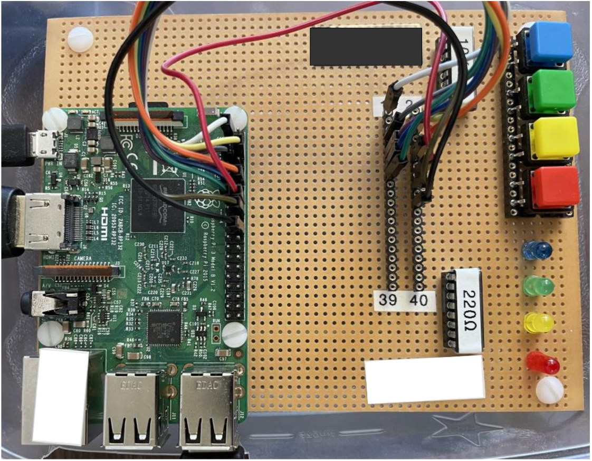

[Home](../../) | [Notes](../../notes) | [Projects](../) > ARM-Assembly Vending Machine

# ARM-Assembly Vending Machine


## Introduction

An ARM assembly program to simulate a soft drink vending machine using Raspberry Pi board, buttons and LEDs


## Objective

* To get familiar with ARMv7 assembly language. (Syntax, addressing modes, etc.)

* To get familiar with generic ARM assembly program structure.

* To get familiar with LED interfacing. (Polling)

  $\to$ Challenge: Make it interrupt driven!

* To get familiar with button interfacing. (Polling)

  $\to$ Challenge: Make it interrupt driven!

* To understand the necessity of "Input debouncing time".


## Development Environment

* Raspberry Pi 3 Model B V1.2
* OS: Raspbian CNU/Linux 11 (bullseye) (Kernel version: 5.15.61-v7+)





## Specification

### Basic Functionality

The machine will dispense, upon receipt of the correct amount of change of 55 cents, a choice of Coke, Sprite, Dr. Pepper, or Coke Zero. Your software will perform the following:

1. Display a welcome message and instructions.
2. Accept money inputs of nickels (N), dimes (D), quarters (Q), and one-dollar bills (B).
3. Reject any invalid money inputs.
4. Set the initial inventory of drinks to two of each kind.
5. Once the money input is 55 cents or greater prompt the user on what soft drink they want.
   (C) Coke, (S) Sprite, (P) Dr. Pepper, or (Z) Coke Zero
6. Verify with the user what drink they selected and allow them to cancel that selection and
   be prompted for another drink selection.
7. Reject any invalid soft drink selections.
8. There should also be an option to cancel the transaction and return any money deposited
   by the user.
9. If the user selects an out of inventory drink prompt them to make another selection.
10. Dispense the selected drink and any change due.
11. Drink machine will shut down when the entire inventory reaches zero.
12. Assume there is no limit on the amount of change the drink machine contains.
13. Make provisions for a secret code that when entered will display the current inventory of drinks. For grading purposes identify the secret code and when it can be entered in the welcome message.

### Usage of LEDs

* **Red LED**

  * Power ON

    This LED will come on for 5 seconds when the program starts running then turn off.

  * Coke being dispensed

    This LED will flash 3 times (1 second on, 1 second off) then stay on for 5 seconds then turn off to signify the drink has been dispensed.

  * Power OFF

    The LED will come on for 5 seconds when the drink inventory is depleted then turn off. The program will then be terminated.

* **Yellow LED**

  * Sprite being dispensed

    This LED will flash 3 times (1 second on, 1 second off) then stay on for 5 seconds then turn off to signify the drink has been dispensed.

* **Green LED**

  * Dr. Pepper being dispensed

    This LED will flash 3 times (1 second on, 1 second off) then stay on for 5 seconds then turn off to signify the drink has been dispensed.

* **Blue LED**

  * Coke Zero being dispensed– This LED will flash 3 times (1 second on, 1 second off) then stay on for 5 seconds then turn off to signify the drink has been dispensed.

### Usage of Buttons

* **Red Button**
  * Dispense a Coke
* **Yellow Button**
  * Dispense a Sprite
* **Green Button**
  * Dispense a Dr. Pepper
* **Blue Button**
  * Dispense a Coke Zero


## Source Code

```c
/*****************************************************************************************
 * File Name     : soft_drink_machine.s
 * Description   : ARM assembly program to simulate a soft drink machine using RaspberryPi
 *                 board, buttons and LEDs
 * Author        : Kyungjae Lee
 * File Created  : 10/24/2022
 *----------------------------------------------------------------------------------------
 *
 * Commands to assemble, link, run program:
 *   as -o <filename.o> <filename.s>
 *   gcc -o <filename> <filename.o> -lwiringPi
 *   sudo ./<filename>
 *
 * Commands to debug program:
 *   as -g -o <filename.o> <filename.s>  @ -g option creates debug symbols
 *   gcc -g -o <filename> <filename.o> -lwiringPi
 *                                       @ -g option creates debug symbols
 *                                       @ (without this option, source code and the line
 *                                       @ number won't be visible on your debug window)
 *   gdb ./<filename>                    @ cannot use debugger with sudo
 *   layout next
 *
 * How to download and build wiringPi?
 *  From the directory of your preference run the following commands:
 *  1. git clone https://github.com/WiringPi/WiringPi.git
 *  2. cd WiringPi/
 *  3. ./build
 *  Then the wiringPi library will be ready to be linked during compilation.
 ****************************************************************************************/
 
.equ READERROR,     0       @ Used to check for scanf read error.
.equ DRINK_COUNTER, 8       @ Total number of soft drinks in the inventory.
.equ OUTPUT,        1       @ Used to set the selected GPIO pins to output only.
.equ DELAYMS_1000,  1000    @ Delay for one second.
.equ DELAYMS_5000,  5000    @ Delay for five seconds.
.equ BLINK_COUNTER, 3       @ Used to count the number of times LED blinks.

@ Define the following from wiringPi.h header
@ Instead of using '.equ', following syntax also works for defining constants

OUTPUT = 1
INPUT  = 0

PUD_UP = 2
PUD_DOWN = 1

LOW = 0
HIGH = 1

@ Register usage:
@
@ - r1  : (button) Used to keep track of the red button press status
@ - r2  : (button) Used to keep track of the yellow button press status
@ - r4  : Used to store the change
@ - r5  : Used to store the address of 'arrInventory'
@         (button) Used to keep track of the green button press status
@ - r6  : Used to store the offset from the address of 'arrInventory'
@ - r7  : Used to store the address of an element of 'arrInventory'
@         (button) Used to keep track of the blue button press status
@ - r8  : Used to store the address of the name of the selected drink
@ - r9  : Used as the drink counter
@ - r10 : Used to store the LED pin number corresponding to the dispensed soft drink.
@         - Coke        (pin2) : Red LED
@         - Sprite      (pin3) : Yellow LED
@         - Dr.Pepper   (pin4) : Green LED
@         - Coke Zero   (pin5) : Blue LED
@ - r11 : Used as the LED blink counter

@ LED mapping
@ 
@ - pin2: blue
@ - pin3: green
@ - pin4: yello
@ - pin5: red

.text

.global main

@-----------------------------------------------------------------------------------------
main:
@-----------------------------------------------------------------------------------------

@ Setup r9 so it counts the number of soft drinks left in the inventory. The program will
@ terminate when the inventory becomes empty (r9 = 0)

    mov r9, #DRINK_COUNTER    

@ Check the setup of the GPIO to make sure it is working right.
@ To use the wiringPiSetup function just call it.
@ Upon return, r0 contains the pass(0)/fail(-1) code.
    
    bl  wiringPiSetup
    mov r1, #-1
    cmp r0, r1
    bne init                @ Everything is OK so continue with code.
    ldr r0, =str14          @ Load wiringPiSetup fail message to r0 for printf call.
    bl  printf
    b   exit                @ There is a problem with the GPIO exit code.

@-----------------------------------------------------------------------------------------
init:
@-----------------------------------------------------------------------------------------

@ Set four GPIO pins to output.

    @ Set the pin2 to output mode
    ldr r0, =pin2
    ldr r0, [r0]
    mov r1, #OUTPUT
    bl  pinMode

    @ Set the pin3 to output mode
    ldr r0, =pin3
    ldr r0, [r0]
    mov r1, #OUTPUT
    bl  pinMode

    @ Set the pin4 to output mode
    ldr r0, =pin4
    ldr r0, [r0]
    mov r1, #OUTPUT
    bl  pinMode

    @ Set the pin5 to output mode
    ldr r0, =pin5
    ldr r0, [r0]
    mov r1, #OUTPUT
    bl  pinMode

    @ Pin2, 3, 4, 5 are now setup for output.

@ Setup four input buttons.

    @ Set the mode to input - Blue button
    ldr r0, =buttonBlue
    ldr r0, [r0]
    mov r1, #INPUT
    bl  pinMode

    @ Set the mode to input - Green button
    ldr r0, =buttonGreen
    ldr r0, [r0]
    mov r1, #INPUT
    bl  pinMode

    @ Set the mode to input - Yellow button
    ldr r0, =buttonYellow
    ldr r0, [r0]
    mov r1, #INPUT
    bl  pinMode

    @ Set the mode to input - Red button
    ldr r0, =buttonRed  
    ldr r0, [r0]
    mov r1, #INPUT
    bl  pinMode

@ Set the buttons for pull-up and it is 0 when pressed.
@ - pullUpDnControl(buttonPin, PUD_UP)
@ - digitalRead(buttonPin) == LOW button pressed

    ldr r0, =buttonBlue
    ldr r0, [r0]
    mov r1, #PUD_UP
    bl  pullUpDnControl

    ldr r0, =buttonGreen
    ldr r0, [r0]
    mov r1, #PUD_UP
    bl  pullUpDnControl

    ldr r0, =buttonYellow
    ldr r0, [r0]
    mov r1, #PUD_UP
    bl  pullUpDnControl

    ldr r0, =buttonRed
    ldr r0, [r0]
    mov r1, #PUD_UP
    bl  pullUpDnControl

@ At power on, turn on red LED for 5 seconds and then turn it off.

    bl ledAtPowerOnOff

@-----------------------------------------------------------------------------------------
inventoryCheck:
@-----------------------------------------------------------------------------------------

@ Display a welcome message and instructions.

    ldr r0, =str0           @ Load welcome message to r0 for printf call.
    bl printf               @ Print it to the screen.

    mov r4, #0              @ Initialize r4 (will be used to keep user input change)

@-----------------------------------------------------------------------------------------
loop:
@-----------------------------------------------------------------------------------------

    cmp r4, #55
    bge drinkSelection

    ldr r0, =str1           @ Load instruction message to r0 for printf call.
    bl printf               @ Print it to the screen.


@ Accept money inputs of nickels (N), dimes (D), quarters (Q), and one-dollar bills (B).

    ldr r0, =strInPattern   @ Load r0 with the addr of char input pattern for scnaf call.
    ldr r1, =charInput      @ Load r1 with the addr of the memory location where the user
                            @ input will be stored.
    bl scanf

@ Check the validity of the user input. Reject any invalid money inputs.

    cmp r0, #READERROR      @ Check for a read error.
    beq invalidInput
    ldr r1, =charInput      @ Reload r1 since it gets wiped out after scanf call.
    ldrb r1, [r1]           @ Load r1 with the user input so it can be used later.

    cmp r1, #'N'
    addeq r4, #5
    moveq r1, r4
    ldreq r0, =str11        @ Load running total change message to r0 for printf call.
    bleq printf             @ Print it to the screen.
    beq loop

    cmp r1, #'D'
    addeq r4, #10
    moveq r1, r4
    ldreq r0, =str11        @ Load running total change message to r0 for printf call.
    bleq printf             @ Print it to the screen.
    beq loop

    cmp r1, #'Q'
    addeq r4, #25
    moveq r1, r4
    ldreq r0, =str11        @ Load running total change message to r0 for printf call.
    bleq printf             @ Print it to the screen.
    beq loop

    cmp r1, #'B'
    addeq r4, #100
    moveq r1, r4
    ldreq r0, =str11        @ Load running total change message to r0 for printf call.
    bleq printf             @ Print it to the screen.
    beq loop

    cmp r1, #'K'            @ Secret code
    beq secretCode

    b invalidInput

@-----------------------------------------------------------------------------------------
drinkSelection:
@-----------------------------------------------------------------------------------------

    ldr r0, =str3           @ Load drink selection message to r0 for printf call.
    bl printf               @ Print it to the screen.

@ Accept drink selection by button press.
@ - Coke (Red), Sprite (Yellow), Dr.Pepper (Green), Coke Zero (Blue)

@ Set the registers to debounce switches and handle buttons held down.

    mov r1, #0xFF
    mov r2, #0xFF
    mov r5, #0xFF
    mov r7, #0xFF

buttonLoop:

@ Delay a few milliseconds to help debounce the switches.

    ldr r0, =delayMs250
    ldr r0, [r0]
    bl  delay

readRED:

@ Read the value of the red button. If it is HIGH (i.e., not pressed) read the next button
@ and set the previous reading value to HIGH. 
@ Otherwise, the current value is LOW (pressed). If it was LOW and its last recorded
@ status was LOW, then do not record this as a new pressing. 
@ If it was HIGH the last time and LOW now, then record the button has been pressed.
    
    ldr     r0, =buttonRed
    ldr     r0, [r0]
    bl      digitalRead
    cmp     r0, #HIGH       @ If the button is HIGH, read next button
    moveq   r1, r0          @ Set last time read value to HIGH
    beq     readYellow

    @ The button value is LOW.
    @ If it was LOW the last time it is still down.
    cmp     r1, #LOW        @ Was the last time it was called also down?
    beq     readYellow      @ Button is still down. Read next button value.

    mov     r1, r0          @ This is a new button press.
    b       selectCoke      @ Branch to handle the red button press.

readYellow:
    
    ldr     r0, =buttonYellow
    ldr     r0, [r0]
    bl      digitalRead
    cmp     r0, #HIGH
    moveq   r2, r0
    beq     readGreen

    cmp     r2, #LOW
    beq     readGreen

    mov     r2, r0
    b       selectSprite

readGreen:
    
    ldr     r0, =buttonGreen
    ldr     r0, [r0]
    bl      digitalRead
    cmp     r0, #HIGH
    moveq   r5, r0
    beq     readBlue

    cmp     r5, #LOW
    beq     readBlue

    mov     r5, r0
    b       selectDrPepper

readBlue:
    
    ldr     r0, =buttonBlue
    ldr     r0, [r0]
    bl      digitalRead
    cmp     r0, #HIGH
    moveq   r7, r0
    beq     buttonLoop

    cmp     r7, #LOW
    beq     buttonLoop

    mov     r7, r0
    b       selectCokeZero

selectCoke:

    mov r6, #0
    ldr r8, =strCoke
    ldr r10, =pin5        @ When 'Coke' is confirmed, get LED5 ready
    b   confirmSelection

selectSprite:

    mov r6, #4
    ldr r8, =strSprite
    ldr r10, =pin4        @ When 'Sprite' is confirmed, get LED4 ready
    b   confirmSelection

selectDrPepper:

    mov r6, #8
    ldr r8, =strDrPepper
    ldr r10, =pin3        @ When 'Dr.Pepper' is confirmed, get LED3 ready
    b   confirmSelection

selectCokeZero:

    mov r6, #12
    ldr r8, =strCokeZero
    ldr r10, =pin2        @ When 'Coke Zero' is confirmed, get LED2 ready
    b   confirmSelection

@-----------------------------------------------------------------------------------------
confirmSelection:
@-----------------------------------------------------------------------------------------

    ldr r5, =arrInventory
    ldr r7, [r5, r6]
    cmp r7, #0
    beq outOfInventory

    mov r1, r8              @ Load r8 with the address of the selected drink name.
    ldr r0, =str8           @ Load confirmation message to r0 for printf call.
    bl printf               @ Print it to the screen.

@ Accept user confirmation input (Y or N)

    ldr r0, =strInPattern   @ Load r0 with the addr of char input pattern for scnaf call.
    ldr r1, =charInput      @ Load r1 with the addr of the memory location where the user
                            @ input will be stored.
    bl scanf

@ Check the validity of the user input. Reject any invalid money inputs.

    cmp r0, #READERROR      @ Check for a read error.
    beq invalidInput
    ldr r1, =charInput      @ Reload r1 since it gets wiped out after scanf call.
    ldrb r1, [r1]           @ Load r1 with the user input so it can be used later.

    cmp r1, #'Y'
    bne drinkSelection
    sub r7, r7, #1
    str r7, [r5, r6]        @ Store the updated inventory value back to the array.

    sub r4, r4, #55

    mov r1, r8              @ Load r8 with the address of the selected drink name.
    mov r2, r4              @ Load r2 with the net change.
    ldr r0, =str9           @ Load out of confirmation message to r0 for printf call.
    bl printf               @ Print it to the screen.

    bl ledAtDispense        @ Corresponding led signify the confirmed dispense
                            
    sub r9, r9, #1          @ Decrement the total number of soft drinks in the inventory.
    cmp r9, #0              @ Check if inventory is empty
    bne inventoryCheck

    b exit

@-----------------------------------------------------------------------------------------
outOfInventory:
@-----------------------------------------------------------------------------------------

    mov r1, r8
    ldr r0, =str7           @ Load out of inventory message to r0 for printf call.
    bl printf               @ Print it to the screen.
    
    b drinkSelection
    
@-----------------------------------------------------------------------------------------
secretCode:
@-----------------------------------------------------------------------------------------

    ldr r5, =arrInventory

    ldr r1, =strCoke
    ldr r2, [r5]
    ldr r0, =str13          @ Load inventory status for Coke to r0 for printf call.
    bl printf               @ Print it to the screen.

    ldr r1, =strSprite
    ldr r2, [r5, #4]
    ldr r0, =str13          @ Load inventory status for Coke to r0 for printf call.
    bl printf               @ Print it to the screen.

    ldr r1, =strDrPepper
    ldr r2, [r5, #8]
    ldr r0, =str13          @ Load inventory status for Coke to r0 for printf call.
    bl printf               @ Print it to the screen.
    
    ldr r1, =strCokeZero
    ldr r2, [r5, #12]
    ldr r0, =str13          @ Load inventory status for Coke to r0 for printf call.
    bl printf               @ Print it to the screen.

    b inventoryCheck

@-----------------------------------------------------------------------------------------
invalidInput:
@-----------------------------------------------------------------------------------------

    ldr r0, =readlinePattern
    ldr r1, =invalidDump    @ Load r1 with the memory buffer's address.
    bl scanf                @ Make the scanf call.

    ldr r0, =str6           @ Load r0 with the error message.
    bl printf               @ Print the error message to the screen.

    b loop                  @ Branch back to loop so that user can re-enter the values.

@-----------------------------------------------------------------------------------------
ledAtPowerOnOff:
@-----------------------------------------------------------------------------------------

@ At power on/off, red LED turns on for 5 seconds and then turns off.

    push {lr}               @ Store the address where this subroutine was called.

    @ Write a logic one to turn pin5 to on.
    ldr r0, =pin5
    ldr r0, [r0]
    mov r1, #1
    bl  digitalWrite

    @ Run the delay (otherwise it blinks so fast that you will never see it!)
    @ To use the 'delay' function, r0 must contain the number of miliseconds to delay.
    ldr r0, =delayMs5000
    ldr r0, [r0]
    @ mov r0, #DELAYMS_5000
    bl delay

@ Turn off the LED

    @ Write a logic one to turn the corresponding pin (stored in r10) to off.
    ldr r0, =pin5
    ldr r0, [r0]
    mov r1, #0
    bl  digitalWrite

    pop {pc}                @ Force return back to where this subroutine was called.

@-----------------------------------------------------------------------------------------
ledAtDispense:
@-----------------------------------------------------------------------------------------

@ At dispense, red LED blinks for 3 seconds (1 sec on / 1 sec off) and then stays on for 5
@ seconds then turns off to signify the drink has been dispensed.

    push {lr}               @ Store the address where this subroutine was called.

    mov r11, #BLINK_COUNTER @ Setup the blink counter (set to 3)

loopBlink:

    cmp r11, #0
    beq endLoopBlink

@ Turn on LED for 1 second

    @ Write a logic one to turn the corresponding pin (stored in r10) to on.
    ldr r0, [r10]
    mov r1, #1
    bl  digitalWrite

    @ Run the delay (otherwise it blinks so fast that you will never see it!)
    @ To use the 'delay' function, r0 must contain the number of miliseconds to delay.
    mov r0, #DELAYMS_1000
    bl delay

@ Turn off LED for 1 second

    @ Write a logic one to turn the corresponding pin (stored in r10) to off.
    ldr r0, [r10]
    mov r1, #0
    bl  digitalWrite

    mov r0, #DELAYMS_1000
    bl delay

    sub r11, #1
    b   loopBlink

endLoopBlink:

@ Turn on LED for 5 second

    @ Write a logic one to turn the corresponding pin (stored in r10) to on.
    ldr r0, [r10]
    mov r1, #1
    bl  digitalWrite

    @mov r0, #DELAYMS_5000
    ldr r0, =delayMs5000
    ldr r0, [r0]
    bl delay
        
@ Turn off LED 

    @ Write a logic one to turn the corresponding pin (stored in r10) to off.
    ldr r0, [r10]
    mov r1, #0
    bl  digitalWrite

    pop {pc}                @ Force return back to where this subroutine was called.

@-----------------------------------------------------------------------------------------
exit:
@-----------------------------------------------------------------------------------------

    ldr r0, =str12          @ Load r0 with the terminating message.
    bl printf               @ Print the error message to the screen.

    bl ledAtPowerOnOff

@ Force the exit and return control to OS.

    mov r7, #1              @ SVC call to exit
    svc 0                   @ Make the system call


.data

@ Strings

.balign 4   @ Force a word boundary
str0: .asciz "\nWelcome to Mr. Lee's soft drink vending machine.\nCost of Coke, Sprite, Dr. Pepper, and Coke Zero is 55 cents. (Secret code: K)\n\n"

.balign 4   @ Force a word boundary
str1: .asciz "Enter money nickel(N), dime(D), quarter(Q), and one dollar bill(B).\n"

.balign 4   @ Force a word boundary
str2: .asciz "Total is %d cents.\n\n"

.balign 4   @ Force a word boundary
str3: .asciz "Make selection:\n(Red) Coke, (Yellow) Sprite, (Green) Dr. Pepper, or (Blue) Coke Zero.\n"

.balign 4   @ Force a word boundary
str4: .asciz "Selection is %s. Is this OK? (Y or N)."

.balign 4   @ Force a word boundary
str5: .asciz "A %s has been dispensed with 0 cents change."

.balign 4   @ Force a word boundary
str6: .asciz "ERROR: Invalid input. Please try again!\n\n"

.balign 4   @ Force a word boundary
str7: .asciz "%s is out of inventory. Try different one!\n\n"

.balign 4   @ Force a word boundary
str8: .asciz "Selection is %s. Is this OK? (Y or N)\n"

.balign 4   @ Force a word boundary
str9: .asciz "A %s has been dispensed with %d cents change.\n\n"

.balign 4   @ Force a word boundary
str10: .asciz "Transaction cancelled. Returning %d cents change.\n\n"

.balign 4   @ Force a word boundary
str11: .asciz "Total is %d cents.\n\n"

.balign 4   @ Force a word boundary
str12: .asciz "The entire inventory reached zero. Terminating the program!\n"

.balign 4   @ Force a word boundary
str13: .asciz "%s: %d\n"

.balign 4   @ Force a word boundary
str14: .asciz "Error: wiringPiSetup failed! Terminating the program.\n"

.balign 4   @ Force a word boundary
strCoke: .asciz "Coke"

.balign 4   @ Force a word boundary
strSprite: .asciz "Sprite"

.balign 4   @ Force a word boundary
strDrPepper: .asciz "Dr.Pepper"

.balign 4   @ Force a word boundary
strCokeZero: .asciz "Coke Zero"

@ Input/Output patterns for printf/scanf call

.balign 4   @ Force a word boundary
strInPattern: .asciz "%s"           @ Character input pattern.
                                    @ %s is used instead of %c to keep from reading the CR
                                    @ from the previous input.

.balign 4   @ Force a word boundary
readlinePattern: .asciz "%[^\n]"    @ Used to clear the input buffer for invalid input.

@ Other

.balign 4   @ Force a word boundary
charInput: .word 0  @ Memory location to store user input (character)

.balign 4       @ Force a word boundary
invalidDump: .skip 100*4 @ Use to clear the input buffer for invalid input

.balign 4   @ Force a word boundary
arrInventory: .word 2, 2, 2, 2  @ Array that holds number of each soft drinks
                                @ Order: Coke, Sprite, Dr.Pepper, Coke Zero

@ Values for the GPIO pins

.balign 4
pin2: .word 2
pin3: .word 3
pin4: .word 4
pin5: .word 5

.balign 4
buttonBlue:     .word 7 @ Blue button
buttonGreen:    .word 0 @ Green button
buttonYellow:   .word 6 @ Yellow button
buttonRed:      .word 1 @ Red button

.balign 4
delayMs5000: .word 5000
delayMs1000: .word 1000
delayMs250:  .word 250

@ Followings are defined in wiringPi.h

.extern wiringPiSetup
.extern delay
.extern digitalWrite
.extern pinMode


.global printf
@ printf("This is printf function, %d %d %d", r1, r2, r3)
@         ----------r0-----------
@ r0-r3 are used as arguments to printf function. When you invoke printf function these
@ register values are likely to be changed. It is a good practice to use other registers
@ than these for the manipulation purposes.

.global scanf

.end    @ End of code and end of file. Leave a blank line after this.
```

