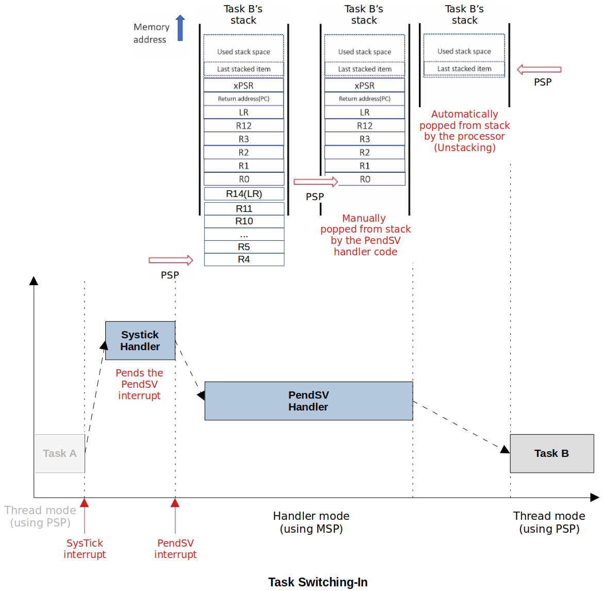

[Home](../../) | [Notes](../../notes) | [Projects](../) > Bare‑Metal RTOS

# Bare‑Metal RTOS 

Source code: [https://github.com/kyungjae-lee/bare-metal-rtos](https://github.com/kyungjae-lee/bare-metal-rtos).

## Introduction

Developed a real‐time operating system on the bare‐metal STM32F407‐Discovery board without using libraries

This project is designed to be completed in the following 3 steps:

1. Implement an RTOS **using a full-fledged IDE** (STM32 Cube IDE).
2. Compile and debug the program implemented in Step 1 **without using an IDE**. 
3. Implement an RTOS **from scratch** without an IDE (i.e., Bare-metal development).

## Objective

- Understand and be able to implement a scheduler, one of the core part of the OS,  from scratch.
- Be able to set up incremental build system using Make utility.
- Be able to choose, install and use appropriate Cross-Compiler Toolchain.
- Be able to compile a C program for an embedded target without using an IDE.
- Be able to write a microcontroller startup file for STM32F MCU.
- Understand the different sections of the relocatable object file (i.e., `.o` files).
- Be able to write a linker script file from scratch.
- Be able to load the final executable on the target using OpenOCD and GDB client.

## Demonstration

Following is the demonstration of the test application for the 'Bare-Metal RTOS' project in action. 

<iframe width="560" height="315" src="https://www.youtube.com/embed/MYxrrz4UWkc" title="YouTube video player" frameborder="0" allow="accelerometer; autoplay; clipboard-write; encrypted-media; gyroscope; picture-in-picture; web-share" allowfullscreen></iframe>

- Scheduling Algorithm: Round-Robin (Time quantum: 500 ms)
- 4 tasks blinking each LED at a defined frequency:
  - Green: 1000 ms 
  - Orange: 500 ms 
  - Blue: 250 ms
  - Red: 125 ms

## Development Environment

* OS - Ubuntu 22.04.1 LTS (Kernel version: 5.15.0-52-generic)
* Tool Chain - GNU Arm Embedded Toolchain
* Debugger - OpenOCD, GDB client

## Important Concepts

### Scheduling

* An algorithm which makes the decision of preempting a running task from the CPU and makes the decision about which task to dispatch (i.e., allocate CPU) next
* The decision could be based on many factors such as system load, the priority of tasks, share resource access, or a simple Round-Robin method.

### Context (Status) of a Task

* The following diagram shows the core registers of the ARM Cortex-M4 processor.
* Context (Status) of a Task = [General purpose registers] + [Some special purpose registers] + [Status register]
  * These are the important information that need to be stored and retrieved during the "context switching".

### Context Switching

* The procedure of switching out the currently running task from the CPU after saving the task's execution context or state and switching in the next task's to run on the CPU by retrieving the past execution context or state of the task.

